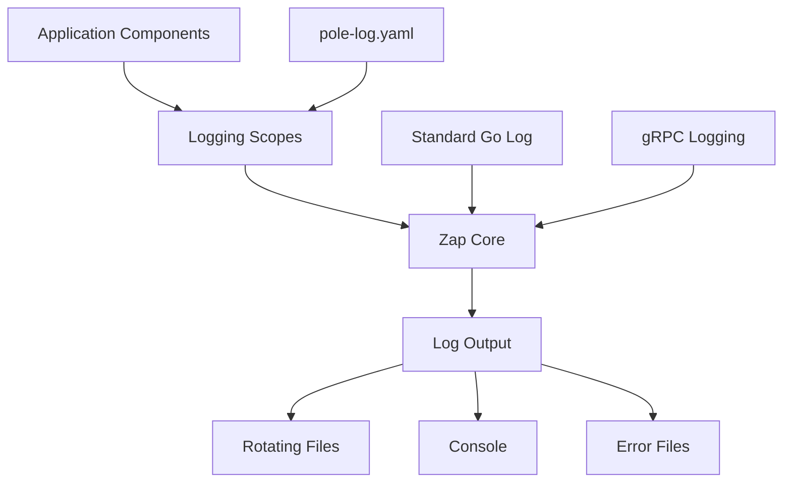
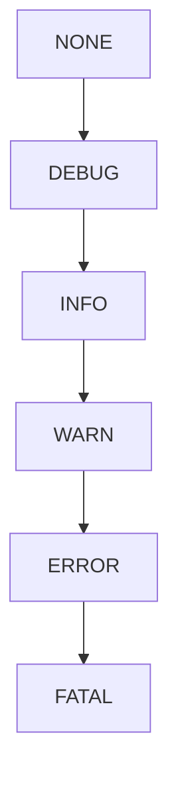
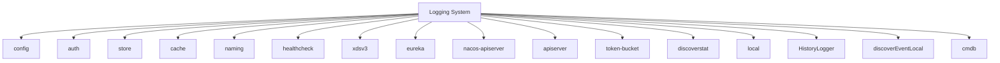
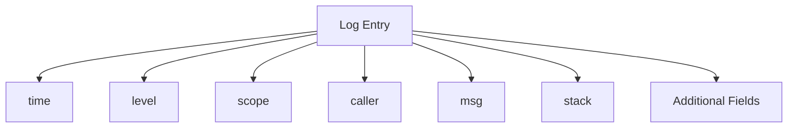

# Logging

<cite>
**Referenced Files in This Document**   
- [pole-log.yaml](file://deploy/conf/pole-log.yaml)
- [config.go](file://pkg/common/log/config.go)
- [scope.go](file://pkg/common/log/scope.go)
- [options.go](file://pkg/common/log/options.go)
- [default.go](file://pkg/common/log/default.go)
</cite>

## Table of Contents
1. [Introduction](#introduction)
2. [Logging Architecture](#logging-architecture)
3. [Log Levels and Output](#log-levels-and-output)
4. [Component-Based Log Scoping](#component-based-log-scoping)
5. [Structured Logging and Field Conventions](#structured-logging-and-field-conventions)
6. [Configuration via pole-log.yaml](#configuration-via-pole-logyaml)
7. [Log Rotation and Retention Policies](#log-rotation-and-retention-policies)
8. [Log Output Formats](#log-output-formats)
9. [Example Log Entries](#example-log-entries)
10. [Integration with Centralized Logging Systems](#integration-with-centralized-logging-systems)
11. [Log Analysis for Troubleshooting](#log-analysis-for-troubleshooting)
12. [Performance Diagnosis Using Logs](#performance-diagnosis-using-logs)
13. [Log Security and PII Handling](#log-security-and-pii-handling)
14. [Conclusion](#conclusion)

## Introduction
The logging subsystem in the pole-server application provides a comprehensive, structured logging solution built on the Zap logging library. This system enables granular control over log output through component-based scoping, leveled logging, and flexible configuration. The logging framework captures application events across various subsystems including configuration management, authentication, storage, service discovery, and health checking. This documentation details the implementation, configuration, and usage patterns for the logging system, providing guidance for effective monitoring, troubleshooting, and performance analysis.

## Logging Architecture
The logging architecture is built around a centralized logging system that intercepts and standardizes log output from various components of the application. The system uses Uber's Zap library as its foundation, providing high-performance structured logging capabilities. The architecture implements a scope-based approach where each major component of the system has its own logging scope, allowing for independent configuration of log levels, output destinations, and formatting.

The logging system is initialized at application startup through the `Configure` function in the log package, which processes the configuration from the pole-log.yaml file. During initialization, the system registers multiple logging scopes corresponding to different components of the application. Each scope maintains its own configuration for output level, rotation policies, and destination paths.

The architecture includes mechanisms for capturing log output from external sources, including the standard Go "log" package and gRPC logging, ensuring all log output is funneled through the centralized system. This provides a unified logging experience across the entire application, regardless of which logging mechanism individual components might use.



**Diagram sources**
- [config.go](file://pkg/common/log/config.go#L294-L342)
- [scope.go](file://pkg/common/log/scope.go#L0-L49)

**Section sources**
- [config.go](file://pkg/common/log/config.go#L0-L423)
- [scope.go](file://pkg/common/log/scope.go#L0-L357)

## Log Levels and Output
The logging system implements a hierarchical level system with five distinct levels: DEBUG, INFO, WARN, ERROR, and FATAL. Each level serves a specific purpose in the logging hierarchy:

- **DEBUG**: Detailed information for debugging purposes, typically only enabled in development or troubleshooting scenarios
- **INFO**: General operational information about application flow and significant events
- **WARN**: Indication of potential issues that do not prevent normal operation
- **ERROR**: Errors that occurred during operation, indicating a failure in a specific operation
- **FATAL**: Critical errors that cause the application to terminate

The system also includes a NONE level to disable logging output entirely. Each logging scope can be configured with independent output and stack trace levels, allowing fine-grained control over what information is captured. The output level determines which log messages are written, while the stack trace level controls when stack traces are included in log entries.

The logging implementation provides multiple methods for each log level, including direct message output, formatted output using fmt.Sprintf semantics, and variadic output using fmt.Sprint semantics. This flexibility allows developers to choose the most appropriate method for their logging needs.



**Diagram sources**
- [options.go](file://pkg/common/log/options.go#L52-L80)
- [scope.go](file://pkg/common/log/scope.go#L115-L156)

**Section sources**
- [options.go](file://pkg/common/log/options.go#L0-L188)
- [default.go](file://pkg/common/log/default.go#L41-L80)

## Component-Based Log Scoping
The logging system implements a comprehensive scoping mechanism that allows different components of the application to have independent logging configurations. Each major subsystem is assigned its own logging scope, enabling targeted log level adjustments and output destination configuration. The following scopes are defined in the system:

- **config**: Configuration center related logs
- **auth**: Resource authentication and user management logs
- **store**: Storage layer logs
- **cache**: Server cache logs
- **naming**: Service discovery and governance rules logs
- **healthcheck**: Service health check logs
- **xdsv3**: XDS protocol layer plugin logs
- **eureka**: Eureka protocol layer plugin logs
- **nacos-apiserver**: Nacos protocol layer plugin logs
- **apiserver**: API server common logs
- **token-bucket**: Rate limiting plugin logs
- **discoverstat**: Discovery statistics logs
- **local**: Local statistics logs
- **HistoryLogger**: Operation history logs
- **discoverEventLocal**: Discovery event logs
- **cmdb**: CMDB logs

Each scope can be configured independently in the pole-log.yaml file, allowing administrators to adjust log verbosity and output destinations for specific components without affecting others. This is particularly useful for troubleshooting issues in specific subsystems without overwhelming the logs with information from other components.



**Diagram sources**
- [pole-log.yaml](file://deploy/conf/pole-log.yaml#L1-L159)
- [scope.go](file://pkg/common/log/scope.go#L0-L49)

**Section sources**
- [pole-log.yaml](file://deploy/conf/pole-log.yaml#L1-L159)
- [scope.go](file://pkg/common/log/scope.go#L0-L357)

## Structured Logging and Field Conventions
The logging system implements structured logging using the Zap library, which outputs log entries with consistent, machine-readable fields. Each log entry includes several standard fields that provide context and facilitate analysis:

- **time**: Timestamp of the log entry in ISO 8601 format
- **level**: Log level (debug, info, warn, error, fatal)
- **scope**: The component scope that generated the log entry
- **caller**: Source code location (file and line number)
- **msg**: The main log message
- **stack**: Stack trace (when enabled)

The structured format enables efficient parsing and analysis by log management systems. The system uses a consistent field naming convention across all components, ensuring uniformity in log output. When additional context is needed, developers can include structured fields in log entries using Zap's field system, which allows for typed data to be included alongside the main message.

The logging implementation automatically includes the caller information in log entries by default, providing immediate context about where in the codebase the log was generated. This is particularly valuable for debugging and tracing the flow of execution through the application.



**Diagram sources**
- [config.go](file://pkg/common/log/config.go#L40-L79)
- [scope.go](file://pkg/common/log/scope.go#L115-L156)

**Section sources**
- [config.go](file://pkg/common/log/config.go#L40-L79)
- [scope.go](file://pkg/common/log/scope.go#L115-L156)

## Configuration via pole-log.yaml
The logging system is configured through the pole-log.yaml file, which provides a comprehensive set of options for customizing log behavior across different components. The configuration file defines settings for each logging scope, allowing granular control over log output.

Key configuration parameters include:

- **rotateOutputPath**: Path for the rotating log file
- **errorRotateOutputPath**: Path for the rotating error log file
- **rotationMaxSize**: Maximum size of a single log file in MB
- **rotationMaxBackups**: Number of log files to retain
- **rotationMaxAge**: Maximum retention period for log files in days
- **outputLevel**: Minimum log level to output (debug, info, warn, error)
- **compress**: Whether to compress rotated log files

The configuration file supports component-specific settings, allowing different subsystems to have different log levels and output destinations. For example, the auth component can be configured to output DEBUG level logs while the store component outputs only INFO and higher levels.

The default configuration sets the output level to INFO for all components, with a rotation maximum size of 100MB, retention of 30 backup files, and a maximum age of 7 days. Error logs are directed to separate files with the "-error" suffix, making it easier to monitor for critical issues.

**Section sources**
- [pole-log.yaml](file://deploy/conf/pole-log.yaml#L1-L159)
- [config.go](file://pkg/common/log/config.go#L294-L342)

## Log Rotation and Retention Policies
The logging system implements comprehensive log rotation and retention policies to manage disk space usage and ensure log files remain manageable in size. The rotation mechanism is based on file size, with logs automatically rotated when they reach the configured maximum size (default: 100MB).

The retention policy is controlled by three parameters:
- **rotationMaxSize**: Maximum size of a single log file in MB
- **rotationMaxBackups**: Number of rotated log files to retain
- **rotationMaxAge**: Maximum age of log files in days

By default, the system retains up to 30 rotated log files for 7 days. When the maximum number of backups is reached, the oldest log file is deleted to make room for new ones. This ensures that disk space usage remains bounded while preserving a reasonable history of log data for troubleshooting.

Error logs are handled separately with their own rotation configuration, allowing critical error information to be preserved even if general log retention is more aggressive. The compression option can be enabled to reduce disk space usage by compressing rotated log files.

The system uses the lumberjack library to handle log rotation, which provides reliable atomic operations for file rotation even in high-concurrency scenarios. This ensures that log entries are not lost during the rotation process.

**Section sources**
- [pole-log.yaml](file://deploy/conf/pole-log.yaml#L1-L159)
- [config.go](file://pkg/common/log/config.go#L81-L128)

## Log Output Formats
The logging system supports multiple output formats to accommodate different use cases and environments. By default, logs are output in a console-friendly format that is human-readable and suitable for development and debugging. The console format includes color coding for different log levels and a compact representation of log entries.

For production environments and integration with log management systems, the system can be configured to output logs in JSON format. The JSON format provides a structured, machine-readable output that is ideal for parsing by centralized logging systems like ELK or Splunk. Each log entry is output as a JSON object with fields for timestamp, level, scope, caller, message, and any additional structured data.

The output format can be configured independently for each logging scope, allowing different components to use different formats based on their needs. For example, audit logs might use JSON format for easy parsing, while debug logs use console format for human readability.

The system also supports the "onlyContent" option, which outputs only the log message without timestamps, levels, or other metadata. This is useful for specific use cases like statistics logging where only the raw data is needed.

**Section sources**
- [config.go](file://pkg/common/log/config.go#L81-L128)
- [options.go](file://pkg/common/log/options.go#L108-L135)

## Example Log Entries
The logging system generates structured log entries that follow a consistent format across all components. Here are examples of log entries at different levels:

**INFO level entry:**
```
{"time":"2023-12-07T10:30:45.123Z","level":"info","scope":"config","caller":"config/config.go:123","msg":"Configuration loaded successfully","component":"config-server","version":"1.2.3"}
```

**ERROR level entry:**
```
{"time":"2023-12-07T10:31:22.456Z","level":"error","scope":"auth","caller":"auth/auth.go:89","msg":"Failed to authenticate user","user_id":"user123","error":"invalid credentials","attempts":3}
```

**DEBUG level entry:**
```
{"time":"2023-12-07T10:32:15.789Z","level":"debug","scope":"cache","caller":"cache/service.go:201","msg":"Cache lookup performed","key":"service-config-456","hit":true,"duration_ms":2}
```

**WARN level entry:**
```
{"time":"2023-12-07T10:33:10.234Z","level":"warn","scope":"naming","caller":"naming/registry.go:345","msg":"Service instance registration delayed","service":"payment-service","delay_ms":1500,"threshold_ms":1000}
```

These examples demonstrate the structured nature of the log entries, with consistent fields and the ability to include additional context-specific information as structured fields.

**Section sources**
- [config.go](file://pkg/common/log/config.go#L40-L79)
- [default.go](file://pkg/common/log/default.go#L117-L152)

## Integration with Centralized Logging Systems
The logging system is designed to integrate seamlessly with centralized logging systems such as ELK (Elasticsearch, Logstash, Kibana) and Splunk. The structured JSON output format is particularly well-suited for ingestion by these systems, allowing for efficient parsing, indexing, and querying of log data.

To integrate with ELK, the JSON-formatted logs can be collected by Filebeat or Logstash, which parse the structured fields and forward them to Elasticsearch. The consistent field naming across all components ensures that logs from different subsystems can be correlated and analyzed together. Kibana can then be used to create dashboards and visualizations for monitoring system health and performance.

For Splunk integration, the logs can be forwarded using the Splunk Universal Forwarder, which automatically parses the JSON structure and makes the fields available for searching and reporting. The structured format enables powerful Splunk queries that can correlate events across different components and identify patterns in system behavior.

The system's support for separate error log files facilitates monitoring for critical issues, as these can be prioritized in the log collection pipeline. Additionally, the component-based scoping allows for targeted log collection, where only specific components' logs are forwarded to the centralized system based on their importance or verbosity.

**Section sources**
- [config.go](file://pkg/common/log/config.go#L81-L128)
- [options.go](file://pkg/common/log/options.go#L108-L135)

## Log Analysis for Troubleshooting
The structured logging system provides powerful capabilities for troubleshooting application issues. The consistent format and rich context in log entries enable efficient diagnosis of problems through several approaches:

1. **Temporal analysis**: By examining the sequence of log entries, developers can trace the flow of execution through the system and identify where operations deviate from expected behavior.

2. **Component correlation**: The scope field allows logs from different components to be correlated, helping to identify interactions between subsystems that may be contributing to an issue.

3. **Error pattern recognition**: The structured format makes it easy to search for specific error messages or patterns across large volumes of log data, facilitating the identification of recurring issues.

4. **Performance bottleneck identification**: By analyzing the timing and frequency of log entries, performance bottlenecks can be identified, such as slow database queries or high-latency network calls.

5. **User behavior analysis**: Logs that include user identifiers can be used to trace the actions of specific users through the system, which is valuable for reproducing and diagnosing user-reported issues.

The inclusion of caller information in each log entry provides immediate context about where in the codebase an issue occurred, significantly reducing the time needed to locate and fix bugs. When combined with stack traces (enabled at appropriate levels), this information provides a complete picture of the execution path leading to an error.

**Section sources**
- [scope.go](file://pkg/common/log/scope.go#L115-L156)
- [config.go](file://pkg/common/log/config.go#L174-L218)

## Performance Diagnosis Using Logs
The logging system serves as a valuable tool for performance diagnosis, providing insights into the runtime behavior of the application. By strategically placing log entries at key points in the code, developers can measure the duration of operations and identify performance bottlenecks.

The system supports the inclusion of timing information in log entries, either as explicit fields or through the use of structured logging patterns. For example, a service call might log both the start and completion of an operation, allowing the duration to be calculated. Alternatively, the duration can be measured and included directly in the log entry.

Performance-related logs can be filtered and analyzed to identify slow operations, high-frequency calls, or resource-intensive processes. This information can be used to prioritize optimization efforts and measure the impact of performance improvements.

The component-based scoping allows performance analysis to be focused on specific subsystems. For example, database performance can be analyzed by examining logs from the store component, while API performance can be assessed through logs from the apiserver component.

The logging system's low overhead, thanks to the high-performance Zap library, ensures that performance logging can be enabled in production environments without significantly impacting application performance.

**Section sources**
- [config.go](file://pkg/common/log/config.go#L130-L172)
- [scope.go](file://pkg/common/log/scope.go#L232-L271)

## Log Security and PII Handling
The logging system includes considerations for security and the handling of personally identifiable information (PII). While the current implementation does not include built-in PII filtering, the structured nature of the logs enables the implementation of external filtering and masking mechanisms.

Best practices for log security include:

1. **Access control**: Log files should be protected with appropriate file system permissions to prevent unauthorized access.

2. **Encryption at rest**: Sensitive log data should be encrypted when stored on disk, particularly in environments where physical security cannot be guaranteed.

3. **Network security**: When forwarding logs to centralized systems, encrypted transport protocols (such as TLS) should be used to protect data in transit.

4. **PII minimization**: Applications should avoid logging sensitive information such as passwords, authentication tokens, or personal data. When such information must be logged for debugging purposes, it should be masked or hashed.

5. **Audit logging**: Critical security-related events should be logged to dedicated audit logs with appropriate retention policies.

The separation of error logs into dedicated files helps ensure that security-critical error information is preserved and can be monitored separately from general application logs.

Organizations should establish clear policies for log retention and disposal, particularly for logs that may contain sensitive information. These policies should comply with relevant data protection regulations such as GDPR, CCPA, or HIPAA.

**Section sources**
- [config.go](file://pkg/common/log/config.go#L81-L128)
- [options.go](file://pkg/common/log/options.go#L108-L135)

## Conclusion
The logging subsystem in the pole-server application provides a robust, flexible foundation for monitoring, troubleshooting, and performance analysis. Built on the high-performance Zap library, the system offers structured logging with component-based scoping, allowing for granular control over log output across different subsystems.

Key strengths of the logging implementation include its comprehensive configuration options, support for multiple output formats, and integration capabilities with centralized logging systems. The hierarchical log levels and independent stack trace configuration enable precise control over the verbosity and detail of log output.

The system's architecture, with its clear separation of concerns and consistent field conventions, facilitates effective log analysis and troubleshooting. By following the patterns and best practices outlined in this documentation, developers and operators can maximize the value of the logging system for maintaining application health and performance.

Future enhancements could include built-in PII filtering, more sophisticated sampling mechanisms for high-volume logs, and enhanced integration with distributed tracing systems to provide a more complete observability solution.