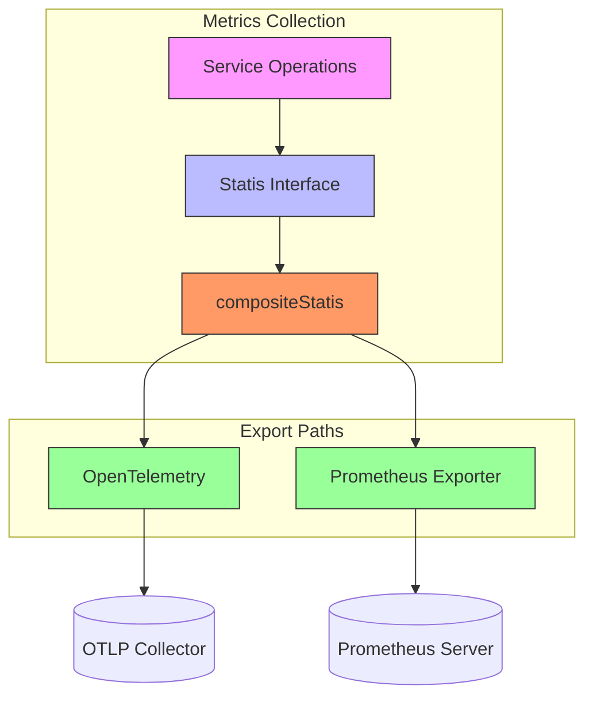
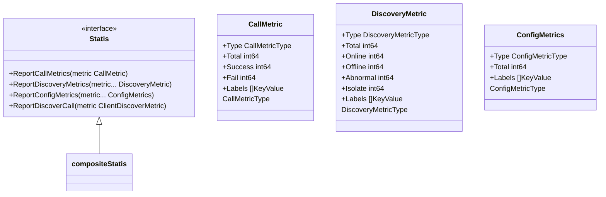
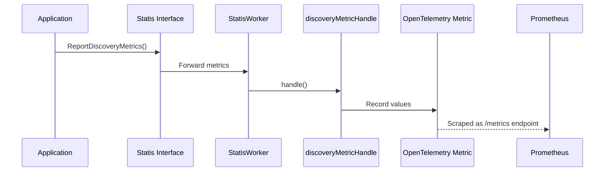
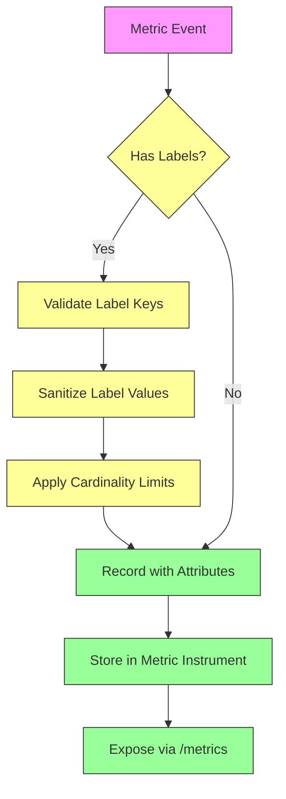
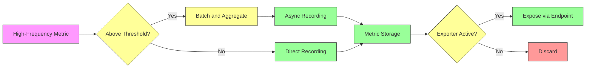

# Metrics Collection

<cite>
**Referenced Files in This Document**   
- [statis.go](file://apis/observability/statis/statis.go)
- [client_metrics.go](file://pkg/common/otel/metrics/client_metrics.go)
- [sys_metrics.go](file://pkg/common/otel/metrics/sys_metrics.go)
- [types.go](file://pkg/common/otel/metrics/types.go)
- [statis.go](file://plugin/observability/statis/prometheus/statis.go)
- [discovery_handle.go](file://plugin/observability/statis/prometheus/discovery_handle.go)
- [config_handle.go](file://plugin/observability/statis/prometheus/config_handle.go)
</cite>

## Table of Contents
1. [Introduction](#introduction)
2. [Dual-Path Metrics Architecture](#dual-path-metrics-architecture)
3. [Core Metric Categories](#core-metric-categories)
4. [Prometheus Exporter Implementation](#prometheus-exporter-implementation)
5. [Configuration and Exporter Setup](#configuration-and-exporter-setup)
6. [Grafana Dashboard and Alerting](#grafana-dashboard-and-alerting)
7. [Metric Labeling and Cardinality Management](#metric-labeling-and-cardinality-management)
8. [Performance and Overhead Mitigation](#performance-and-overhead-mitigation)

## Introduction
The metrics collection subsystem in the Polaris server provides comprehensive observability through a dual-path architecture that combines OpenTelemetry integration for distributed tracing with a Prometheus exporter for pull-based monitoring. This system enables real-time visibility into service discovery, configuration management, and system health metrics. The architecture is designed to support both push-based telemetry (via OpenTelemetry) and pull-based scraping (via Prometheus), ensuring compatibility with modern observability ecosystems. Key metrics include API call volume, cache hit ratios, service instance registration counts, and system resource utilization, providing operators with critical insights for monitoring, troubleshooting, and capacity planning.

## Dual-Path Metrics Architecture
The metrics subsystem implements a dual-path architecture that simultaneously supports OpenTelemetry-based distributed tracing and Prometheus-style pull-based monitoring. This design enables flexible integration with various observability backends while maintaining a unified metrics collection interface. The architecture centers around a composite statistics plugin that routes metrics to multiple registered exporters, allowing both OpenTelemetry and Prometheus handlers to receive the same metric data. This approach ensures that operational metrics are available through both push and pull paradigms, accommodating different monitoring requirements and tooling preferences. The system leverages OpenTelemetry's metric SDK for instrumentation, providing a vendor-neutral foundation for telemetry data, while the Prometheus exporter exposes metrics in the standard text-based format for scraping by Prometheus servers.



**Diagram sources**
- [statis.go](file://apis/observability/statis/statis.go#L30-L50)
- [statis.go](file://plugin/observability/statis/prometheus/statis.go#L15-L25)

**Section sources**
- [statis.go](file://apis/observability/statis/statis.go#L1-L160)
- [statis.go](file://plugin/observability/statis/prometheus/statis.go#L1-L91)

## Core Metric Categories
The metrics subsystem collects and exports several key categories of operational metrics that provide comprehensive visibility into system behavior and performance. These categories include service discovery metrics, configuration management metrics, client connection metrics, and system-level performance metrics. Service discovery metrics track the total number of services and instances, categorized by their operational status (online, offline, abnormal, isolated). Configuration metrics monitor the count of configuration groups, configuration files, and released configuration files. Client connection metrics capture the number of active connections from service discovery clients, configuration clients, and SDK clients. System-level metrics include instance registration task processing time, cache update costs, and batch job completion status, providing insights into internal system performance and resource utilization.



**Diagram sources**
- [statis.go](file://apis/observability/statis/statis.go#L30-L50)
- [types.go](file://apis/pkg/types/metrics/types.go#L1-L50)

**Section sources**
- [statis.go](file://apis/observability/statis/statis.go#L30-L160)
- [sys_metrics.go](file://pkg/common/otel/metrics/sys_metrics.go#L1-L117)
- [client_metrics.go](file://pkg/common/otel/metrics/client_metrics.go#L1-L84)

## Prometheus Exporter Implementation
The Prometheus exporter implementation is built on OpenTelemetry's metric SDK and exposes metrics through a dedicated Prometheus plugin. The exporter is implemented as a `StatisWorker` that registers with the system's plugin framework and handles incoming metrics through specialized handlers for discovery and configuration data. During initialization, the exporter sets up metric instruments for various gauge types and configures a default scrape interval of 60 seconds. The implementation uses OpenTelemetry's asynchronous gauge instruments to expose current values, which are then converted to Prometheus format when scraped. The exporter organizes metrics into logical groups with consistent naming conventions and descriptive help text, making them easily discoverable and understandable in Prometheus. The system supports metric labeling through OpenTelemetry attributes, allowing dimensional analysis of metrics across various dimensions such as namespace, service, and environment.



**Diagram sources**
- [statis.go](file://plugin/observability/statis/prometheus/statis.go#L15-L91)
- [discovery_handle.go](file://plugin/observability/statis/prometheus/discovery_handle.go#L1-L196)
- [config_handle.go](file://plugin/observability/statis/prometheus/config_handle.go#L1-L100)

**Section sources**
- [statis.go](file://plugin/observability/statis/prometheus/statis.go#L1-L91)
- [discovery_handle.go](file://plugin/observability/statis/prometheus/discovery_handle.go#L1-L196)
- [config_handle.go](file://plugin/observability/statis/prometheus/config_handle.go#L1-L100)

## Configuration and Exporter Setup
The metrics subsystem can be configured through the system's plugin configuration to enable specific exporters and customize their behavior. By default, both the local metrics collector and Prometheus exporter are enabled, but this can be customized based on operational requirements. The Prometheus exporter can be configured with a custom scrape interval through the plugin options, with a default value of 60 seconds if not specified. Configuration is typically done through the system's YAML configuration files, where the statis plugin entries can be defined. Custom metrics can be added by implementing additional metric handlers that register their instruments during initialization and process incoming metric data. The system supports dynamic registration of metric plugins, allowing new exporters to be added without modifying the core metrics collection logic.

Example configuration to enable Prometheus exporter with custom interval:
```yaml
plugin:
  statis:
    entries:
      - name: "prometheus"
        option:
          interval: 30
      - name: "local"
```

To disable the default configuration and use only Prometheus:
```yaml
plugin:
  statis:
    name: "prometheus"
    option:
      interval: 45
```

Custom metric registration can be achieved by creating a new plugin that implements the `Statis` interface and registering it with the system. The plugin should initialize its metric instruments in the `Initialize` method and handle incoming metrics in the appropriate reporting methods. Metric names should follow the naming convention of using snake_case with descriptive prefixes that indicate the metric category (e.g., "service_count", "instance_regis_cost_time").

**Section sources**
- [statis.go](file://apis/observability/statis/statis.go#L100-L160)
- [statis.go](file://plugin/observability/statis/prometheus/statis.go#L40-L55)

## Grafana Dashboard and Alerting
The collected metrics can be visualized using Grafana dashboards that provide comprehensive views of system health and performance. Typical dashboards include service topology views showing the number of services and instances by status, configuration management overviews displaying the count of configuration groups and files, and system performance panels monitoring client connections and resource utilization. Key visualizations include time-series graphs of service registration trends, heatmaps of instance health distribution, and gauges showing current connection counts. Alerting rules can be defined in Prometheus to detect anomalous conditions such as sudden drops in service availability, rapid increases in client connections, or prolonged cache update times. These alerts can be integrated with notification systems to provide timely warnings of potential issues.

Example Prometheus alerting rules:
```yaml
groups:
  - name: service-health
    rules:
      - alert: ServiceCountDrop
        expr: delta(service_count[5m]) < -10
        for: 2m
        labels:
          severity: warning
        annotations:
          summary: "Service count dropped significantly"
          description: "The number of services has decreased by more than 10 in the last 5 minutes."
  
      - alert: HighInstanceRegistrationLatency
        expr: histogram_quantile(0.95, rate(instance_regis_cost_time_bucket[5m])) > 1000
        for: 5m
        labels:
          severity: critical
        annotations:
          summary: "High instance registration latency"
          description: "The 95th percentile of instance registration time is above 1 second."
  
      - alert: CacheUpdateSlow
        expr: histogram_quantile(0.99, rate(cache_update_cost_bucket[5m])) > 5000
        for: 10m
        labels:
          severity: warning
        annotations:
          summary: "Slow cache updates"
          description: "The 99th percentile of cache update cost is above 5 seconds."
```

**Section sources**
- [discovery_handle.go](file://plugin/observability/statis/prometheus/discovery_handle.go#L30-L196)
- [sys_metrics.go](file://pkg/common/otel/metrics/sys_metrics.go#L30-L117)

## Metric Labeling and Cardinality Management
The metrics subsystem employs a structured labeling strategy to enable dimensional analysis of collected metrics while carefully managing cardinality to prevent performance issues. Labels are implemented using OpenTelemetry attributes, which are then translated to Prometheus labels during scraping. The system uses a consistent set of label names across different metric types, including dimensions such as namespace, service, and environment. For service discovery metrics, labels are applied to differentiate counts by service type and operational status. Configuration metrics include labels to distinguish between different configuration groups and environments. The system avoids high-cardinality labels such as client IP addresses or request IDs, focusing instead on operational dimensions that provide meaningful grouping without creating excessive time series. Label values are validated and sanitized to prevent injection of malicious content or excessively long values that could impact storage efficiency.



**Diagram sources**
- [discovery_handle.go](file://plugin/observability/statis/prometheus/discovery_handle.go#L60-L100)
- [config_handle.go](file://plugin/observability/statis/prometheus/config_handle.go#L45-L60)

**Section sources**
- [discovery_handle.go](file://plugin/observability/statis/prometheus/discovery_handle.go#L1-L196)
- [config_handle.go](file://plugin/observability/statis/prometheus/config_handle.go#L1-L100)
- [types.go](file://pkg/common/otel/metrics/types.go#L1-L40)

## Performance and Overhead Mitigation
The metrics collection subsystem incorporates several strategies to minimize performance overhead and ensure system stability under high load. The implementation uses atomic operations and lock-free data structures where possible to reduce contention in hot code paths. Metric recording is designed to be non-blocking, with asynchronous updates that do not delay critical service operations. The system includes safeguards against metric registration failures, with panic recovery mechanisms that prevent the entire server from failing due to telemetry issues. For high-frequency metrics, the system employs batching and aggregation to reduce the number of individual recording operations. The OpenTelemetry meter provider is initialized once and reused across the application, minimizing the overhead of metric instrument lookup. The Prometheus exporter caches metric vectors to avoid repeated creation of the same instruments, and includes nil checks before recording values to prevent panics during initialization or shutdown phases.



**Diagram sources**
- [sys_metrics.go](file://pkg/common/otel/metrics/sys_metrics.go#L60-L117)
- [client_metrics.go](file://pkg/common/otel/metrics/client_metrics.go#L50-L84)

**Section sources**
- [sys_metrics.go](file://pkg/common/otel/metrics/sys_metrics.go#L1-L117)
- [client_metrics.go](file://pkg/common/otel/metrics/client_metrics.go#L1-L84)
- [types.go](file://pkg/common/otel/metrics/types.go#L1-L40)