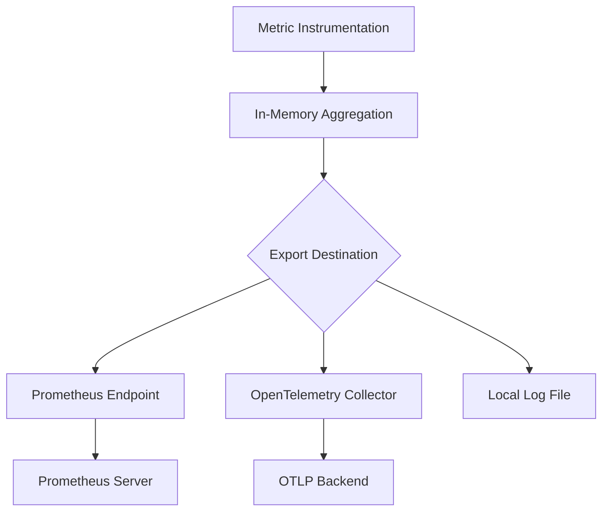

# Observability

<cite>
**Referenced Files in This Document**   
- [discoverevent.go](file://apis/observability/event/discoverevent.go)
- [event_local.go](file://plugin/observability/discoverevent/logger/event_local.go)
- [event_db.go](file://plugin/observability/discoverevent/rds/event_db.go)
- [history.go](file://apis/observability/history/history.go)
- [history_logger.go](file://plugin/observability/history/logger/history_logger.go)
- [history_db.go](file://plugin/observability/history/rds/history_db.go)
- [statis.go](file://apis/observability/statis/statis.go)
- [base_worker.go](file://plugin/observability/statis/base/base_worker.go)
- [apicall.go](file://plugin/observability/statis/base/apicall.go)
- [cachecall.go](file://plugin/observability/statis/base/cachecall.go)
- [config.go](file://pkg/common/otel/config.go)
- [otel.go](file://pkg/common/otel/otel.go)
- [client_metrics.go](file://pkg/common/otel/metrics/client_metrics.go)
- [sys_metrics.go](file://pkg/common/otel/metrics/sys_metrics.go)
- [logger.go](file://pkg/common/log/logger.go)
- [config.go](file://pkg/common/log/config.go)
- [pole-server.yaml](file://deploy/conf/pole-server.yaml)
- [pole-log.yaml](file://deploy/conf/pole-log.yaml)
</cite>

## Table of Contents
1. [Introduction](#introduction)
2. [Event System](#event-system)
3. [Metrics Collection](#metrics-collection)
4. [Structured Logging](#structured-logging)
5. [Operational History Tracking](#operational-history-tracking)
6. [Configuration of Exporters and Sampling](#configuration-of-exporters-and-sampling)
7. [Monitoring Dashboards and Alerting Rules](#monitoring-dashboards-and-alerting-rules)
8. [Performance Impact and Data Retention](#performance-impact-and-data-retention)

## Introduction
The observability framework in the Pole-IO server provides comprehensive monitoring, logging, and tracing capabilities essential for maintaining system reliability and performance. This document details the implementation of event publishing, metrics collection via OpenTelemetry and Prometheus, structured logging with Zap, operational history tracking, and configuration of telemetry exporters. The system supports both local and database storage options for events and audit logs, enabling flexible deployment scenarios while ensuring traceability and operational transparency.

## Event System
The event system enables publishing of operational events such as service up/down states, configuration changes, instance isolation, and health status transitions. Events are published through a pluggable `DiscoverChannel` interface that supports multiple backends including local file logging and database persistence.

Events implement the `DiscoverEvent` interface which includes metadata such as event ID, type, resource identifier, and timestamp. The composite event channel allows simultaneous publishing to multiple destinations configured via plugin entries in the server configuration. Supported event types include instance online/offline, health status changes, and isolation events.

Storage backends are configurable through the plugin system:
- **Local logging**: Events are buffered and written to log files with configurable rotation and retention
- **Database storage**: Events can be persisted in MySQL via the RDS backend for long-term retention and querying

Event processing uses a non-blocking channel with bounded queue size to prevent system overload during high event volume.

**Section sources**
- [discoverevent.go](file://apis/observability/event/discoverevent.go#L1-L130)
- [event_local.go](file://plugin/observability/discoverevent/logger/event_local.go#L1-L230)
- [event_db.go](file://plugin/observability/discoverevent/rds/event_db.go)

## Metrics Collection
Metrics collection is implemented using OpenTelemetry standards with Prometheus as the primary exposition format. The system collects key operational metrics across several dimensions:

### Core Metrics
- **API Calls**: Total number of API requests served, broken down by endpoint and response code
- **Cache Hits/Misses**: Cache access patterns for service discovery and configuration data
- **Instance Count**: Number of registered service instances, grouped by service and namespace
- **System Metrics**: CPU, memory, goroutine count, and GC statistics

The metrics subsystem uses a worker-based architecture where counters are aggregated in memory and periodically flushed. Multiple exporters can be enabled simultaneously through plugin configuration.

Prometheus metrics are exposed via a dedicated HTTP endpoint and follow standard naming conventions. The system also supports custom metric instrumentation for business logic monitoring.



**Diagram sources**
- [statis.go](file://apis/observability/statis/statis.go)
- [base_worker.go](file://plugin/observability/statis/base/base_worker.go)
- [apicall.go](file://plugin/observability/statis/base/apicall.go)
- [cachecall.go](file://plugin/observability/statis/base/cachecall.go)

**Section sources**
- [statis.go](file://apis/observability/statis/statis.go)
- [base_worker.go](file://plugin/observability/statis/base/base_worker.go)
- [client_metrics.go](file://pkg/common/otel/metrics/client_metrics.go)
- [sys_metrics.go](file://pkg/common/otel/metrics/sys_metrics.go)

## Structured Logging
The system uses Uber's Zap logger for structured, high-performance logging. Logs are organized by scope, allowing granular control over log levels and output destinations for different subsystems.

Each log entry includes structured fields such as:
- `"level"`: Log severity (debug, info, warn, error)
- `"timestamp"`: ISO 8601 formatted time
- `"caller"`: Source file and line number
- `"msg"`: Human-readable message
- Additional structured context (e.g., `"service"`, `"instance"`, `"error"`)

Log configuration is defined in `pole-log.yaml` and includes:
- Separate log files for different components (auth, config, store, etc.)
- Configurable rotation policies based on size and time
- Error-specific log files for easier troubleshooting
- Compression of archived logs to save disk space

The logging system supports dynamic reconfiguration without restart and can be adjusted to different verbosity levels in production environments.

**Section sources**
- [logger.go](file://pkg/common/log/logger.go)
- [config.go](file://pkg/common/log/config.go)
- [pole-log.yaml](file://deploy/conf/pole-log.yaml)

## Operational History Tracking
Operational history tracking provides an audit trail for all configuration changes, service modifications, and administrative actions. This feature is critical for compliance, security analysis, and change management.

History records include:
- Timestamp of the operation
- User or system identity that performed the action
- Type of operation (create, update, delete)
- Target resource and its identifier
- Previous and new values (for updates)
- Request context and client information

Two storage backends are supported:
- **Local logging**: History entries are written to dedicated log files with high retention settings
- **Database storage**: Full history is persisted in MySQL tables for querying and reporting

The system includes a background job (`CleanDeletedResources`) that manages data retention according to configured policies, automatically purging records older than the specified timeout period.

**Section sources**
- [history.go](file://apis/observability/history/history.go)
- [history_logger.go](file://plugin/observability/history/logger/history_logger.go)
- [history_db.go](file://plugin/observability/history/rds/history_db.go)

## Configuration of Exporters and Sampling
Telemetry exporters and sampling strategies are configured through the server's YAML configuration files. The `pole-server.yaml` file defines which plugins are enabled and their operational parameters.

### Exporter Configuration
```yaml
plugin:
  statis:
    entries:
      - name: local
        option:
          interval: 60
      - name: prometheus
```

The `local` exporter writes aggregated statistics to log files at the specified interval (in seconds). The `prometheus` exporter exposes metrics via HTTP for scraping.

### OpenTelemetry Configuration
OpenTelemetry settings are managed through the `otel` package and can be configured to:
- Set sampling rates for traces
- Configure batch sizes and export intervals
- Define resource attributes for telemetry data
- Specify OTLP endpoint for trace and metric export

Sampling strategies can be configured to reduce overhead in high-throughput environments, with options for head-based and tail-based sampling depending on the use case.

**Section sources**
- [config.go](file://pkg/common/otel/config.go)
- [otel.go](file://pkg/common/otel/otel.go)
- [pole-server.yaml](file://deploy/conf/pole-server.yaml)

## Monitoring Dashboards and Alerting Rules
The observability system is designed to integrate with standard monitoring tools. Key metrics are exposed in Prometheus format, enabling visualization in Grafana dashboards.

### Recommended Dashboard Panels
- **Service Health Overview**: Instance count, health status distribution, and isolation rates
- **API Performance**: Request rates, error rates, and latency percentiles by endpoint
- **Configuration Activity**: Configuration change frequency and rollback rates
- **System Resource Usage**: Memory, CPU, and goroutine count trends

### Alerting Rules
Critical alerts should be configured for:
- High error rates in API endpoints (>5% of requests)
- Sudden drops in instance count (potential service disruption)
- Cache miss ratio exceeding threshold (performance degradation)
- Health check failure spikes (infrastructure issues)
- Audit log gaps (potential security incidents)

Alerts can be routed through standard notification channels (email, Slack, PagerDuty) using Prometheus Alertmanager or equivalent systems.

## Performance Impact and Data Retention
Telemetry collection is designed to minimize performance impact through several optimization strategies:

### Performance Optimizations
- **Asynchronous processing**: Metrics aggregation and log writing occur in background goroutines
- **Bounded buffers**: Channels and queues have fixed sizes to prevent memory exhaustion
- **Batched writes**: Data is written in batches to reduce I/O operations
- **Configurable sampling**: High-volume events can be sampled to reduce overhead

### Data Retention Policies
Retention is configured differently for each data type:
- **Event logs**: 7 days retention with 100MB rotation size
- **Audit history**: 7 days retention with hourly rotation
- **Metrics**: Short-term retention in memory (60 seconds), long-term in Prometheus
- **Error logs**: Extended retention in separate files for troubleshooting

The system includes maintenance jobs that automatically clean up expired data according to these policies, preventing unbounded storage growth while maintaining sufficient history for operational needs.

**Section sources**
- [pole-server.yaml](file://deploy/conf/pole-server.yaml)
- [pole-log.yaml](file://deploy/conf/pole-log.yaml)
- [base_worker.go](file://plugin/observability/statis/base/base_worker.go)
- [job.go](file://pkg/admin/job/job.go)