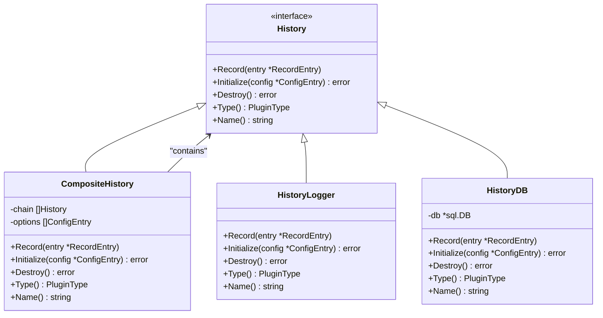
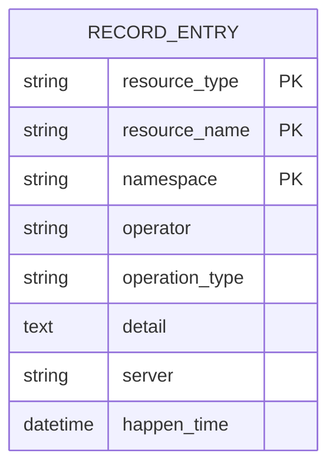
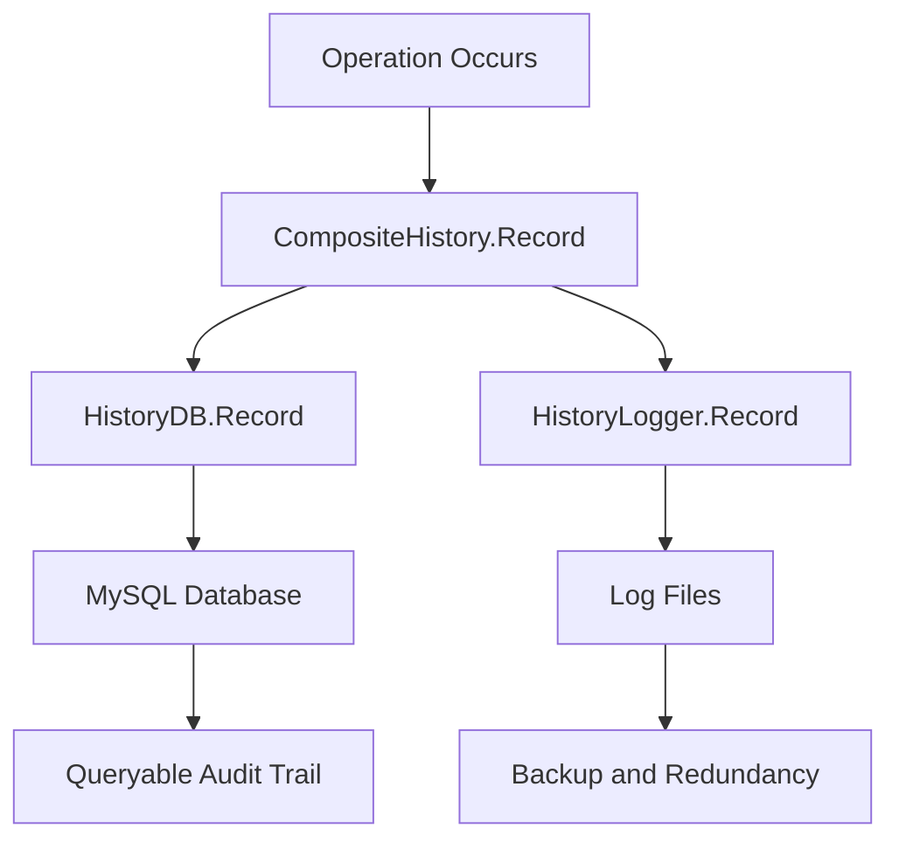
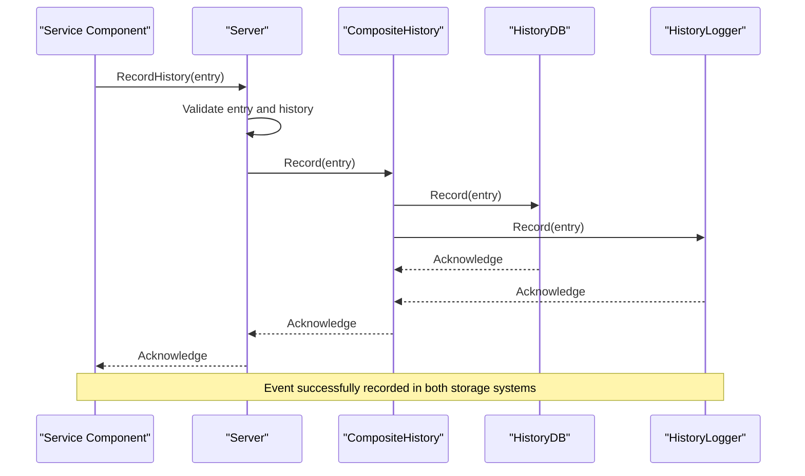

# Operational History

<cite>
**Referenced Files in This Document**   
- [history.go](file://apis/observability/history/history.go)
- [history_db.go](file://plugin/observability/history/rds/history_db.go)
- [history_logger.go](file://plugin/observability/history/logger/history_logger.go)
- [pole-server.yaml](file://deploy/conf/pole-server.yaml)
- [operation.go](file://apis/pkg/types/operation.go)
</cite>

## Table of Contents
1. [Introduction](#introduction)
2. [Core Components](#core-components)
3. [Data Model](#data-model)
4. [Dual-Storage Architecture](#dual-storage-architecture)
5. [Event Capture and Propagation](#event-capture-and-propagation)
6. [Configuration Options](#configuration-options)
7. [Compliance and Integration](#compliance-and-integration)
8. [Conclusion](#conclusion)

## Introduction
The Operational History system provides comprehensive audit logging and change tracking for critical operations within the pole-server platform. It captures service modifications, configuration updates, and user actions, ensuring full traceability and accountability. The system is designed to support compliance requirements and integrates with security monitoring infrastructure through a dual-storage approach that combines database persistence for queryable audit trails with file-based logging for backup and redundancy.

**Section sources**
- [history.go](file://apis/observability/history/history.go#L1-L108)

## Core Components

The Operational History system is built around a plugin-based architecture that enables flexible and extensible audit logging. At its core is the `History` interface, which defines the contract for recording operational events. The `CompositeHistory` implementation allows multiple history plugins to be chained together, ensuring that events are recorded across all configured storage backends simultaneously.

The system follows a composite pattern where the main `GetHistory()` function returns a `CompositeHistory` instance that routes `Record()` calls to all registered plugins. This design enables the dual-storage approach by allowing both database and file-based loggers to receive the same event data concurrently.

**Diagram sources**
- [history.go](file://apis/observability/history/history.go#L25-L107)
- [history_logger.go](file://plugin/observability/history/logger/history_logger.go#L35-L66)
- [history_db.go](file://plugin/observability/history/rds/history_db.go#L40-L83)

**Section sources**
- [history.go](file://apis/observability/history/history.go#L25-L107)
- [history_logger.go](file://plugin/observability/history/logger/history_logger.go#L35-L66)
- [history_db.go](file://plugin/observability/history/rds/history_db.go#L40-L83)

## Data Model

The Operational History system uses a standardized data model for recording audit events, defined by the `RecordEntry` struct. This model captures essential information about each operation, enabling comprehensive analysis and reporting.

| Field | Type | Description |
|-------|------|-------------|
| ResourceType | Resource | Type of resource being operated on (e.g., service, configuration) |
| ResourceName | string | Name of the target resource |
| Namespace | string | Namespace containing the resource |
| Operator | string | Identity of the user or system performing the operation |
| OperationType | OperationType | Type of operation performed (create, update, delete, etc.) |
| Detail | string | Additional details about the operation |
| Server | string | Server name that generated the record |
| HappenTime | time.Time | Timestamp when the operation occurred |

**Diagram sources**
- [operation.go](file://apis/pkg/types/operation.go#L76-L85)

**Section sources**
- [operation.go](file://apis/pkg/types/operation.go#L76-L85)

## Dual-Storage Architecture

The Operational History system implements a dual-storage approach to ensure both accessibility and durability of audit records. This architecture combines database persistence for queryable audit trails with file-based logging for backup and disaster recovery.

### Database Storage
The `HistoryDB` plugin stores audit records in a MySQL database using a partitioned table structure. The `operation_history` table is partitioned by month based on the `happen_time` field, which optimizes query performance and enables efficient data retention management. The system automatically maintains monthly partitions, adding new partitions as needed to prevent write failures.

### File-Based Logging
The `HistoryLogger` plugin writes audit records to log files using the system's standard logging infrastructure. Each record is formatted as a structured log entry and written to the configured log output. This provides a durable backup of all audit events that can be used for offline analysis or when database access is unavailable.

**Diagram sources**
- [history_db.go](file://plugin/observability/history/rds/history_db.go#L49-L83)
- [history_logger.go](file://plugin/observability/history/logger/history_logger.go#L48-L66)

**Section sources**
- [history_db.go](file://plugin/observability/history/rds/history_db.go#L49-L83)
- [history_logger.go](file://plugin/observability/history/logger/history_logger.go#L48-L66)

## Event Capture and Propagation

Operational events are captured through a well-defined propagation chain that begins with service components calling the `RecordHistory` method on the server instance. This method serves as the primary entry point for audit logging across the system.

When an operation occurs, the relevant service component creates a `RecordEntry` object populated with details about the operation and passes it to `RecordHistory`. This method checks whether the history system has been initialized and, if so, obtains the global `History` instance via `GetHistory()` and calls its `Record` method.

The `CompositeHistory` implementation then iterates through all registered history plugins, calling `Record` on each one. This ensures that both the database and file-based loggers receive the event simultaneously, maintaining consistency across storage backends.

**Diagram sources**
- [history.go](file://apis/observability/history/history.go#L52-L107)
- [server.go](file://pkg/namespace/server.go#L48-L61)

**Section sources**
- [history.go](file://apis/observability/history/history.go#L52-L107)
- [server.go](file://pkg/namespace/server.go#L48-L61)

## Configuration Options

The Operational History system is configured through the `pole-server.yaml` configuration file, which specifies the history plugins to be loaded and their respective settings. The configuration supports flexible deployment scenarios and can be adjusted to meet specific operational requirements.

### Plugin Configuration
The history system supports multiple plugins that can be enabled or disabled as needed. By default, only the `HistoryLogger` plugin is enabled, providing file-based audit logging. The `HistoryDB` plugin can be added to enable database persistence.

### Database Configuration
When using the `HistoryDB` plugin, the database connection is configured through the plugin's options, including the DSN (Data Source Name) for connecting to the MySQL database. The system automatically manages database connections, including connection pooling parameters such as maximum open connections and connection lifetime.

### Retention and Maintenance
The system includes automatic partition management for the database storage, creating monthly partitions in the `operation_history` table. While explicit retention periods are not configurable in the current implementation, the partitioned table structure facilitates manual or automated data archiving and cleanup operations.

**Section sources**
- [pole-server.yaml](file://deploy/conf/pole-server.yaml#L150-L172)

## Compliance and Integration

The Operational History system is designed to support compliance requirements and integrate with security monitoring infrastructure. The dual-storage approach ensures that audit records are both immediately queryable and durably preserved, meeting the requirements for accountability and non-repudiation.

### Security Information and Event Management (SIEM) Integration
The file-based logging provided by the `HistoryLogger` plugin enables seamless integration with SIEM systems. Log files can be collected by standard log forwarding agents and ingested into SIEM platforms for centralized monitoring, correlation, and alerting. The structured log format ensures that audit events can be properly parsed and indexed by SIEM systems.

### Audit Trail Integrity
By storing audit records in both a relational database and log files, the system provides redundancy that protects against data loss. The database storage enables complex queries and reporting, while the file-based logs serve as an immutable backup that can be used to verify the integrity of the database records.

### Access Controls
Access to audit data is controlled through the system's authentication and authorization mechanisms. Only authorized users and systems can query the database for audit records, while file system permissions control access to the log files. This layered approach to access control ensures that audit data is protected from unauthorized access or modification.

**Section sources**
- [history.go](file://apis/observability/history/history.go#L1-L108)
- [history_db.go](file://plugin/observability/history/rds/history_db.go#L1-L224)
- [history_logger.go](file://plugin/observability/history/logger/history_logger.go#L1-L67)

## Conclusion
The Operational History system provides a robust foundation for audit logging and change tracking in the pole-server platform. Its plugin-based architecture and dual-storage approach ensure that critical operations are reliably recorded and preserved. The system effectively balances the need for immediate queryability with long-term durability, making it suitable for both operational troubleshooting and compliance auditing. By capturing detailed information about service modifications, configuration updates, and user actions, the system enhances transparency and accountability across the platform.