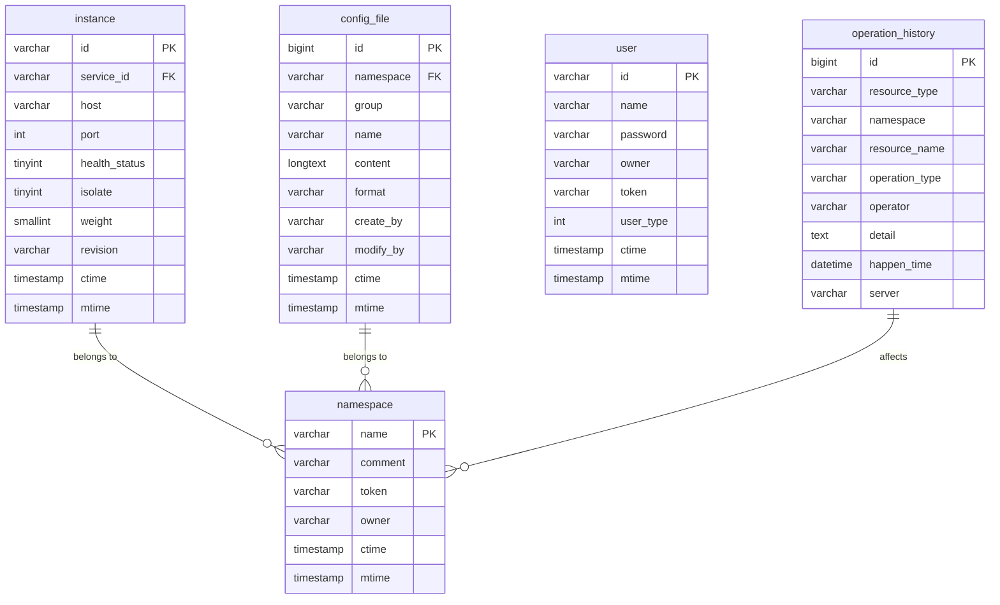
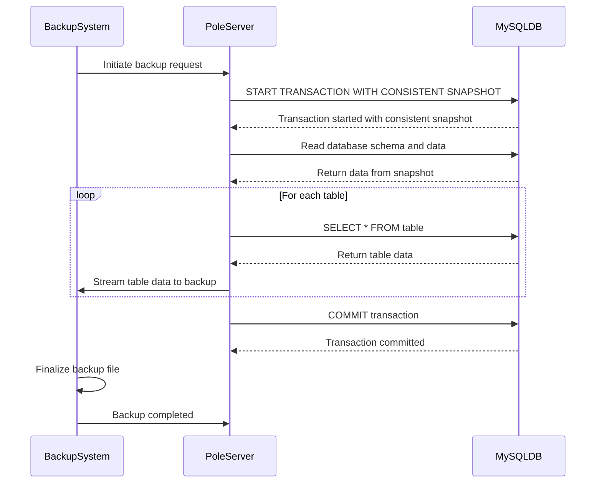
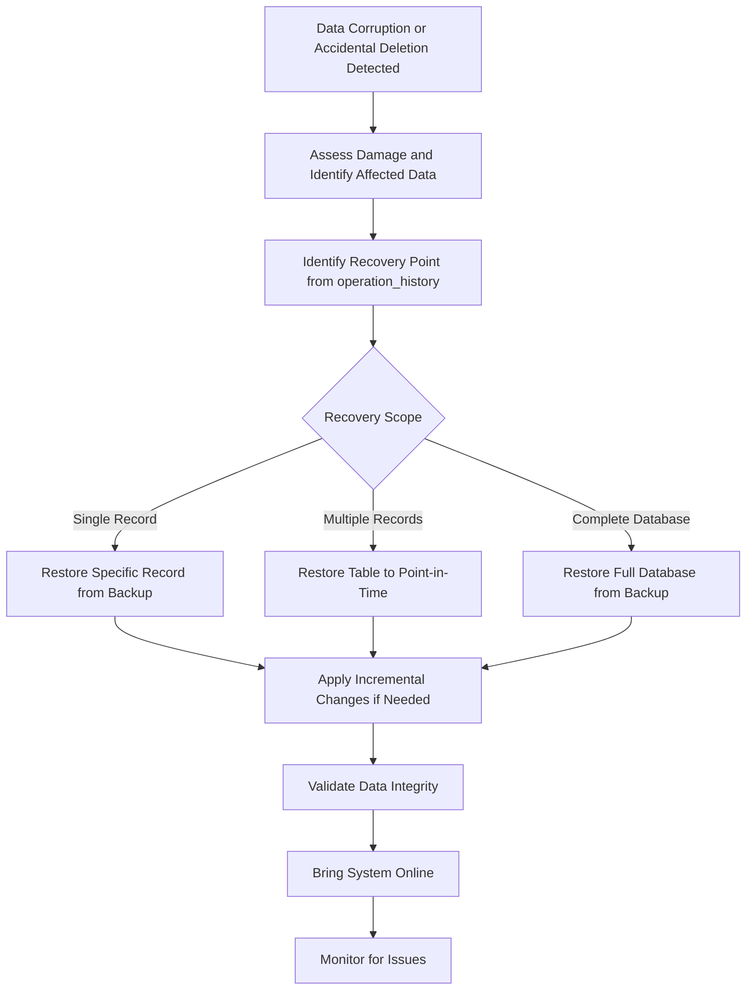
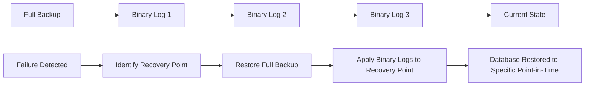

# Backup & Recovery

<cite>
**Referenced Files in This Document**   
- [pole_server.sql](file://plugin/store/mysql/scripts/pole_server.sql)
- [default.go](file://plugin/store/mysql/default.go)
- [tx.go](file://plugin/store/mysql/tx.go)
- [base_db.go](file://plugin/store/mysql/base_db.go)
- [history_db.go](file://plugin/observability/history/rds/history_db.go)
- [api.go](file://apis/store/api.go)
</cite>

## Table of Contents
1. [Introduction](#introduction)
2. [Database Architecture](#database-architecture)
3. [Backup Strategies](#backup-strategies)
4. [Consistent Backup During Live Operations](#consistent-backup-during-live-operations)
5. [Recovery Workflows](#recovery-workflows)
6. [Version Compatibility Considerations](#version-compatibility-considerations)
7. [Backup Integrity Validation](#backup-integrity-validation)
8. [Point-in-Time Recovery](#point-in-time-recovery)
9. [Testing Recovery Procedures](#testing-recovery-procedures)
10. [Conclusion](#conclusion)

## Introduction
This document provides comprehensive backup and recovery procedures for the pole-server system, focusing on its MySQL backend database. The procedures cover full and incremental backup strategies, consistent backup techniques during live operations, recovery workflows for data corruption scenarios, version compatibility considerations, backup integrity validation, and point-in-time recovery using transaction logs. The pole-server system is a service governance platform that manages service discovery, configuration, and traffic management, with its state persisted in a MySQL database.

**Section sources**
- [pole_server.sql](file://plugin/store/mysql/scripts/pole_server.sql#L1-L908)

## Database Architecture
The pole-server system utilizes a MySQL database to store its operational data, with a schema designed for service governance and configuration management. The database contains multiple tables for different aspects of the system, including service instances, namespaces, configuration files, authentication policies, and operational history. The system supports master-slave database configurations, allowing for read-write separation and improved availability.

The database schema includes tables such as `instance` for service instances, `namespace` for namespaces, `config_file` for configuration files, `user` and `user_group` for authentication, and various governance rule tables like `router_rule`, `ratelimit_rule`, and `circuitbreaker_rule`. Additionally, the system maintains an `operation_history` table with monthly partitioning to track changes and support audit requirements.

**Diagram sources**
- [pole_server.sql](file://plugin/store/mysql/scripts/pole_server.sql#L1-L908)

**Section sources**
- [pole_server.sql](file://plugin/store/mysql/scripts/pole_server.sql#L1-L908)
- [default.go](file://plugin/store/mysql/default.go#L118-L164)

## Backup Strategies
The pole-server system requires both full and incremental backup strategies to ensure data protection and minimize recovery time objectives. Full backups should capture the complete database state, including all tables, indexes, and stored procedures, while incremental backups should capture changes since the last backup.

For full backups, the recommended approach is to use MySQL's built-in tools such as mysqldump or mysqlpump, which can create logical backups of the database. These tools can generate SQL scripts that recreate the database schema and data. For large databases, physical backup tools like Percona XtraBackup can be used to create binary backups with minimal impact on database performance.

Incremental backups can be implemented using MySQL's binary logging feature, which records all changes to the database. By enabling binary logging and regularly archiving the binary log files, the system can capture all transactions between full backups. This approach allows for point-in-time recovery and minimizes data loss in case of failure.

The backup strategy should also consider the partitioned `operation_history` table, which requires special handling to ensure all partitions are properly backed up. Automated backup scripts should be implemented to perform regular backups according to a defined schedule, with appropriate retention policies for backup files.

**Section sources**
- [pole_server.sql](file://plugin/store/mysql/scripts/pole_server.sql#L1-L908)
- [history_db.go](file://plugin/observability/history/rds/history_db.go#L85-L123)

## Consistent Backup During Live Operations
To perform consistent backups during live operations, the pole-server system leverages MySQL's transaction isolation features to ensure data consistency without requiring database downtime. The system uses the `START TRANSACTION WITH CONSISTENT SNAPSHOT` command to create a consistent read view of the database at a specific point in time.

The `CreateReadView` method in the transaction implementation ([tx.go](file://plugin/store/mysql/tx.go)) executes this command, allowing backup operations to read data from a consistent snapshot while other transactions continue to modify the database. This approach ensures that the backup reflects a consistent state of the database, even if data is being modified during the backup process.

For applications requiring higher isolation levels, the system can use repeatable read isolation when starting read transactions, as implemented in the `StartReadTx` method ([default.go](file://plugin/store/mysql/default.go)). This ensures that all reads within the transaction see the same snapshot of the data, preventing phenomena like non-repeatable reads and phantom reads.

Backup operations should be scheduled during periods of lower activity to minimize impact on system performance. Additionally, backup processes should be monitored for duration and resource usage to ensure they complete within the allocated time window and do not adversely affect production operations.

**Diagram sources**
- [tx.go](file://plugin/store/mysql/tx.go#L40-L47)
- [default.go](file://plugin/store/mysql/default.go#L220-L228)

**Section sources**
- [tx.go](file://plugin/store/mysql/tx.go#L40-L47)
- [default.go](file://plugin/store/mysql/default.go#L220-L228)
- [api.go](file://apis/store/api.go#L110-L117)

## Recovery Workflows
Recovery workflows for the pole-server system must address various scenarios, including data corruption, accidental deletion, and complete system failure. The recovery process should be well-documented and regularly tested to ensure reliability.

For data corruption or accidental deletion, the recovery workflow involves identifying the affected data, determining the recovery point, and restoring the data from backups. The process begins with assessing the extent of the damage and identifying the last known good state of the data. This may involve reviewing the `operation_history` table to understand the sequence of changes that led to the current state.

The recovery process then involves restoring the database to a point in time before the corruption or deletion occurred. This can be accomplished by restoring from the most recent full backup and applying incremental backups or binary logs up to the desired recovery point. After restoration, the database should be validated to ensure data integrity before bringing the system back online.

In cases of complete system failure, the recovery workflow includes provisioning new infrastructure, restoring the database from backups, and reconfiguring the pole-server application. The recovery process should also include validation steps to ensure all components are functioning correctly and that data consistency is maintained.

**Diagram sources**
- [history_db.go](file://plugin/observability/history/rds/history_db.go#L49-L83)
- [pole_server.sql](file://plugin/store/mysql/scripts/pole_server.sql#L1-L908)

**Section sources**
- [history_db.go](file://plugin/observability/history/rds/history_db.go#L49-L83)
- [pole_server.sql](file://plugin/store/mysql/scripts/pole_server.sql#L1-L908)

## Version Compatibility Considerations
When restoring backups, version compatibility between the backup source and restore target must be carefully considered. The pole-server system's database schema may evolve over time with new releases, potentially introducing changes that affect backward compatibility.

Before performing a restore operation, it is essential to verify that the database schema version in the backup is compatible with the current pole-server application version. This includes checking for table structure changes, column additions or removals, index modifications, and data type changes. The system should maintain a schema version table or use metadata to track the database schema version.

When restoring to a different environment (such as from production to staging), special attention should be paid to configuration differences, particularly in tables like `namespace`, `user`, and `config_file` that may contain environment-specific values. Data masking or transformation may be necessary to ensure sensitive information is not exposed in non-production environments.

Additionally, the MySQL server version should be considered, as there may be compatibility issues between different MySQL versions. Major version upgrades may require special migration procedures and thorough testing before deployment. The restore process should include validation steps to confirm that all data has been correctly restored and that the application functions as expected.

**Section sources**
- [pole_server.sql](file://plugin/store/mysql/scripts/pole_server.sql#L1-L908)
- [default.go](file://plugin/store/mysql/default.go#L166-L228)

## Backup Integrity Validation
Validating backup integrity is critical to ensure that backups can be successfully restored when needed. The pole-server system should implement automated validation procedures as part of the backup process.

Backup validation should include checksum verification of backup files to detect corruption during transfer or storage. Additionally, periodic test restores should be performed in a non-production environment to verify that backups can be successfully restored and that data integrity is maintained. These test restores should include validation of critical data elements and relationships between tables.

The system should also implement monitoring and alerting for backup operations, with notifications for failed or incomplete backups. Backup logs should be reviewed regularly to identify potential issues before they become critical. Automated scripts can be used to verify the presence and completeness of backup files according to the retention policy.

For the partitioned `operation_history` table, special validation procedures should ensure that all partitions are properly backed up and that the partitioning scheme is preserved during restoration. This is particularly important for maintaining query performance and ensuring that historical data remains accessible.

**Section sources**
- [pole_server.sql](file://plugin/store/mysql/scripts/pole_server.sql#L1-L908)
- [history_db.go](file://plugin/observability/history/rds/history_db.go#L125-L180)

## Point-in-Time Recovery
Point-in-time recovery (PITR) allows the pole-server system to restore the database to a specific moment in time, minimizing data loss in case of failure. This capability is enabled by MySQL's binary logging feature, which records all data modifications in a sequential log.

To implement PITR, binary logging must be enabled on the MySQL server, and binary log files should be regularly archived as part of the backup strategy. The binary logs contain all transactions in the order they were executed, allowing the system to replay transactions up to a specific point in time.

The recovery process involves restoring the most recent full backup and then applying binary logs up to the desired recovery point. This can be accomplished using MySQL's `mysqlbinlog` tool to extract and apply transactions from the binary log files. The recovery point can be specified by timestamp or by transaction position, depending on the precision required.

For the pole-server system, PITR is particularly valuable for recovering from accidental data modifications or deletions. By reviewing the `operation_history` table, administrators can identify the exact time when unwanted changes occurred and restore the database to a state just before those changes.

**Diagram sources**
- [history_db.go](file://plugin/observability/history/rds/history_db.go#L125-L180)
- [pole_server.sql](file://plugin/store/mysql/scripts/pole_server.sql#L1-L908)

**Section sources**
- [history_db.go](file://plugin/observability/history/rds/history_db.go#L125-L180)
- [pole_server.sql](file://plugin/store/mysql/scripts/pole_server.sql#L1-L908)

## Testing Recovery Procedures
Regular testing of recovery procedures is essential to ensure that the pole-server system can be successfully restored in case of failure. Testing should be conducted in a staging environment that closely mirrors the production environment to validate the entire recovery workflow.

Recovery tests should include full disaster recovery scenarios, such as restoring from complete backup sets, as well as partial recovery scenarios for specific data corruption or deletion events. Tests should verify not only that data can be restored but also that the pole-server application functions correctly with the restored data.

Automated test scripts can be developed to validate key aspects of the restored system, including:
- Database connectivity and authentication
- Service instance registration and discovery
- Configuration file retrieval
- Authentication and authorization functionality
- Governance rule application

Recovery tests should be documented, with results recorded and reviewed to identify areas for improvement in the backup and recovery procedures. Testing frequency should be determined based on the criticality of the system and the rate of data change, with more frequent testing for systems with high data volatility.

**Section sources**
- [pole_server.sql](file://plugin/store/mysql/scripts/pole_server.sql#L1-L908)
- [history_db.go](file://plugin/observability/history/rds/history_db.go#L49-L83)

## Conclusion
The backup and recovery procedures for the pole-server system provide a comprehensive framework for protecting data and ensuring business continuity. By implementing full and incremental backup strategies, leveraging transaction isolation for consistent backups during live operations, and establishing well-defined recovery workflows, the system can effectively mitigate the risk of data loss.

Key components of the backup strategy include the use of consistent snapshots for online backups, binary logging for point-in-time recovery, and regular validation of backup integrity. The system's architecture, with its partitioned operational history table and support for master-slave database configurations, provides a solid foundation for reliable backup and recovery operations.

Regular testing of recovery procedures in staging environments is critical to ensure that the documented procedures work as expected and that personnel are familiar with the recovery process. By following these procedures and continuously improving the backup and recovery strategy based on testing results and operational experience, the pole-server system can maintain high availability and data integrity.