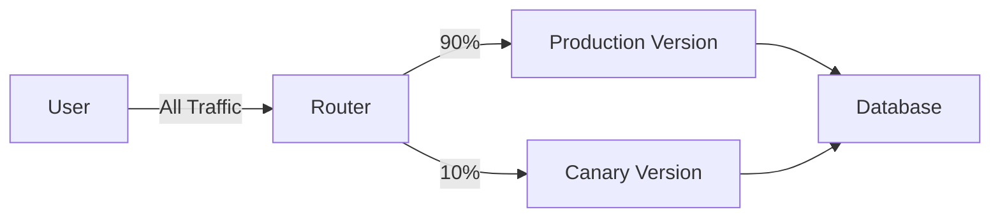

# Deployment Strategies

<cite>
**Referenced Files in This Document**   
- [Dockerfile](file://deploy/Dockerfile)
- [pole-server.yaml](file://deploy/conf/pole-server.yaml)
- [pole-apiserver.yaml](file://deploy/conf/pole-apiserver.yaml)
- [pole-log.yaml](file://deploy/conf/pole-log.yaml)
- [rule.yaml](file://deploy/conf/plugin/ratelimit/rule.yaml)
</cite>

## Table of Contents
1. [Introduction](#introduction)
2. [Containerized Deployment with Docker](#containerized-deployment-with-docker)
3. [Kubernetes Pod Configuration](#kubernetes-pod-configuration)
4. [Liveness and Readiness Probes](#liveness-and-readiness-probes)
5. [Resource Management and Limits](#resource-management-and-limits)
6. [Rolling Update Procedures](#rolling-update-procedures)
7. [Blue-Green and Canary Deployments](#blue-green-and-canary-deployments)
8. [Configuration Management](#configuration-management)
9. [Zero-Downtime Restarts and Graceful Shutdown](#zero-downtime-restarts-and-graceful-shutdown)
10. [Hot Reload for Configuration Changes](#hot-reload-for-configuration-changes)

## Introduction
This document outlines best practices for deploying the pole-server in production environments. It covers containerization using Docker, orchestration with Kubernetes, and advanced deployment patterns such as rolling updates, blue-green, and canary deployments. The guide also details configuration management, zero-downtime restarts, graceful shutdown handling, and hot reload capabilities to ensure high availability and minimal service disruption during upgrades or configuration changes.

## Containerized Deployment with Docker
The pole-server is designed for containerized deployment using Docker, enabling consistent runtime environments across development, testing, and production. The provided Dockerfile in the `deploy/` directory specifies a minimal Alpine Linux base image, ensuring small image size and reduced attack surface.

Key aspects of the Docker setup include:
- Use of multi-architecture support via `TARGETARCH` argument
- Inclusion of essential debugging tools (tcpdump, curl, bash)
- Timezone configuration set to Asia/Shanghai
- Copying of binary and configuration files into `/root/`
- Default command execution to start the server

```mermaid
flowchart TD
A["FROM alpine:3.13.6"] --> B["Install Dependencies<br/>tcpdump, tzdata, curl, bash"]
B --> C["Set Timezone to Asia/Shanghai"]
C --> D["COPY pole-server-${TARGETARCH} /root/pole-server"]
D --> E["COPY ./release/conf /root/conf"]
E --> F["CMD [\"/root/pole-server\", \"start\"]"]
```

**Diagram sources**
- [Dockerfile](file://deploy/Dockerfile)

**Section sources**
- [Dockerfile](file://deploy/Dockerfile)

## Kubernetes Pod Configuration
When deploying pole-server on Kubernetes, proper pod configuration ensures stability and scalability. The application exposes multiple endpoints through different protocols (HTTP, gRPC, Nacos, Eureka, etc.), which should be exposed via appropriate services.

Essential configuration considerations:
- Mount configuration files (`pole-server.yaml`, `pole-apiserver.yaml`) as ConfigMaps
- Inject database credentials and connection strings via environment variables
- Use persistent volumes if needed for log retention beyond pod lifecycle
- Define proper labels and selectors for service discovery within the cluster

The main configuration file `pole-server.yaml` defines core settings including logging, storage, health check, and plugin configurations that must be synchronized across instances.

**Section sources**
- [pole-server.yaml](file://deploy/conf/pole-server.yaml)
- [pole-apiserver.yaml](file://deploy/conf/pole-apiserver.yaml)

## Liveness and Readiness Probes
Proper health probing is critical for maintaining system reliability in Kubernetes. While specific probe endpoints are not explicitly defined in the codebase, the presence of health checking logic indicates built-in support.

Based on the configuration and implementation:
- **Readiness Probe**: Should verify that the server has completed initialization and is ready to accept traffic. This includes successful connection to MySQL backend and cache initialization.
- **Liveness Probe**: Should detect if the process is unresponsive and requires restart. The health check module tracks instance heartbeat status and can serve as a basis for liveness detection.

Health check intervals are configurable in `pole-server.yaml` under the `healthcheck` section:
- `minCheckInterval`: Minimum interval between checks (default 1s)
- `maxCheckInterval`: Maximum interval (default 30s)
- `clientReportInterval`: How often clients report heartbeats (default 120s)

These values should inform probe frequency settings in Kubernetes manifests.

**Section sources**
- [pole-server.yaml](file://deploy/conf/pole-server.yaml#L105-L115)
- [healthcheck/server.go](file://pkg/service/healthcheck/server.go#L217-L254)

## Resource Management and Limits
Effective resource management prevents resource exhaustion and ensures fair sharing in multi-tenant clusters.

From configuration analysis:
- Database connections are limited via `maxOpenConns: 300` and `maxIdleConns: 50`
- Connection limits per IP and total connections are configurable per API server
- Batch processing settings control memory usage for heartbeat reporting

Recommended Kubernetes resource limits:
```yaml
resources:
  requests:
    memory: "512Mi"
    cpu: "500m"
  limits:
    memory: "2Gi"
    cpu: "2000m"
```

Tuning these values based on observed load and performance metrics is advised. Monitoring tools should track database connection pool utilization, goroutine count, and memory allocation patterns.

**Section sources**
- [pole-server.yaml](file://deploy/conf/pole-server.yaml#L168-L172)
- [pole-apiserver.yaml](file://deploy/conf/pole-apiserver.yaml#L10-L15)

## Rolling Update Procedures
Rolling updates allow gradual replacement of old pod instances with new ones, minimizing downtime.

Key considerations for pole-server:
- Ensure at least one replica remains available during update
- Configure appropriate `maxUnavailable` and `maxSurge` values
- Leverage readiness probes to prevent traffic routing to initializing instances
- Coordinate with service mesh for connection draining

The server supports dynamic configuration reload, allowing some changes without full restart. However, binary updates require pod recreation.

Example deployment strategy:
```yaml
strategy:
  type: RollingUpdate
  rollingUpdate:
    maxUnavailable: 1
    maxSurge: 1
```

This ensures smooth transition while maintaining service availability.

**Section sources**
- [pole-server.yaml](file://deploy/conf/pole-server.yaml)
- [pole-apiserver.yaml](file://deploy/conf/pole-apiserver.yaml)

## Blue-Green and Canary Deployments
The pole-server architecture supports advanced deployment patterns through its service mesh capabilities and plugin system.

### Blue-Green Deployment
Utilize the `xds-v3` plugin listening on port 15010 to manage traffic switching between two identical environments (blue and green). Traffic can be instantly redirected using service mesh rules.

### Canary Deployment
Leverage governance rules such as `router_rule`, `ratelimit_rule`, and `circuitbreaker_rule` to gradually shift traffic to new versions based on:
- Percentage-based routing
- Header-based matching
- Geographic or user segment targeting

Configuration example in `rule.yaml` enables rate limiting policies that can be used to control traffic distribution:


Monitoring metrics from `prometheus` plugin should be used to evaluate canary performance before full rollout.

**Diagram sources**
- [rule.yaml](file://deploy/conf/plugin/ratelimit/rule.yaml)

**Section sources**
- [goverrule/router_rule.go](file://pkg/goverrule/router_rule.go)
- [plugin/ratelimit/token/limiter.go](file://plugin/ratelimit/token/limiter.go)

## Configuration Management
Environment-specific settings are managed through YAML configuration files mounted into the container.

Primary configuration files:
- `pole-server.yaml`: Core server settings, database, cache, plugins
- `pole-apiserver.yaml`: API endpoint configurations and protocol settings
- `pole-log.yaml`: Logging levels and rotation policies

Best practices:
- Store configurations in ConfigMaps
- Use Helm or Kustomize for environment-specific overrides
- Externalize secrets using Secret objects
- Enable configuration validation at startup

The system supports hot reloading of certain configuration changes without requiring restart, particularly for routing and rate limiting rules.

**Section sources**
- [pole-server.yaml](file://deploy/conf/pole-server.yaml)
- [pole-apiserver.yaml](file://deploy/conf/pole-apiserver.yaml)
- [pole-log.yaml](file://deploy/conf/pole-log.yaml)

## Zero-Downtime Restarts and Graceful Shutdown
The pole-server implements graceful shutdown handling to ensure zero-downtime restarts.

Key mechanisms:
- On receiving termination signal (SIGTERM), the server stops accepting new connections
- Existing connections are allowed to complete within a grace period
- Health check status is updated to reflect draining state
- Final cleanup operations are performed before process exit

The event system publishes `EventInstanceOffline` when instances deregister, allowing dependent systems to react appropriately.

To maximize effectiveness:
- Set appropriate `terminationGracePeriodSeconds` in Kubernetes (e.g., 30-60 seconds)
- Configure preStop hooks to delay shutdown until connections drain
- Monitor for any long-lived connections that might delay shutdown

**Section sources**
- [instance.go](file://apis/pkg/types/service/instance.go#L412-L443)
- [check.go](file://pkg/service/healthcheck/check.go#L103-L138)

## Hot Reload for Configuration Changes
The system supports dynamic configuration updates for certain components without requiring service restart.

Supported hot reload scenarios:
- Rate limiting rules (`rule.yaml`)
- Routing rules
- Circuit breaker configurations
- Namespace and service metadata

The configuration watcher system detects file changes and propagates updates to in-memory caches. This allows operators to modify traffic management policies in real-time.

To implement:
1. Update configuration file mounted as ConfigMap
2. Kubernetes will propagate changes to pods
3. Internal watchers detect modification and reload
4. New rules take effect immediately

This capability enables agile operations and rapid response to production issues without service interruption.

**Section sources**
- [config/watcher.go](file://pkg/config/watcher.go)
- [rule.yaml](file://deploy/conf/plugin/ratelimit/rule.yaml)