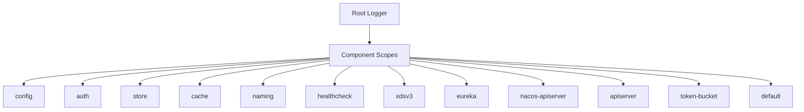
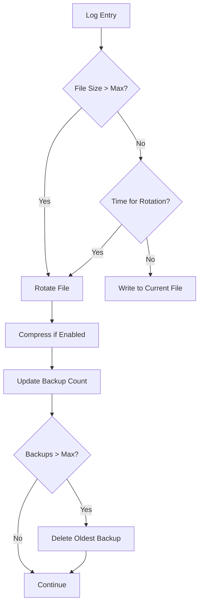

# Logging Configuration & Management

<cite>
**Referenced Files in This Document**   
- [pole-log.yaml](file://deploy/conf/pole-log.yaml)
- [config.go](file://pkg/common/log/config.go)
- [options.go](file://pkg/common/log/options.go)
- [scope.go](file://pkg/common/log/scope.go)
- [logger.go](file://pkg/common/log/logger.go)
</cite>

## Table of Contents
1. [Introduction](#introduction)
2. [Hierarchical Logging System](#hierarchical-logging-system)
3. [Configurable Parameters](#configurable-parameters)
4. [Log Output Format](#log-output-format)
5. [Log Rotation and Retention](#log-rotation-and-retention)
6. [Log Level Management](#log-level-management)
7. [Structured Logging and Fields](#structured-logging-and-fields)
8. [Log Examples](#log-examples)
9. [Debug Logging for Specific Modules](#debug-logging-for-specific-modules)
10. [Log Aggregation with ELK/Splunk](#log-aggregation-with-elksplunk)
11. [Security Considerations](#security-considerations)
12. [Conclusion](#conclusion)

## Introduction
The pole-server implements a comprehensive hierarchical logging system designed to provide detailed visibility into system operations while maintaining performance and security. The logging framework is built on Zap with custom extensions for scoped logging, allowing different components to have independent logging configurations. This documentation details the logging architecture, configuration options, and best practices for monitoring and troubleshooting the system.

**Section sources**
- [config.go](file://pkg/common/log/config.go#L1-L50)
- [options.go](file://pkg/common/log/options.go#L1-L30)

## Hierarchical Logging System
The logging system in pole-server is organized around the concept of scoped loggers, where each major component has its own dedicated logger instance. This hierarchical approach enables granular control over logging behavior across different subsystems.

The system implements a registry of logging scopes, each identified by a unique name that cannot contain colons, commas, or periods. When a scope is registered via `RegisterScope`, it is initialized with default settings including Info-level output and no stack tracing. The scope registry is thread-safe, using read-write mutex protection for concurrent access.

Each component in the system has its own logging scope, including:
- **config**: Configuration center operations
- **auth**: Authentication and user management
- **store**: Storage layer operations
- **cache**: Server cache operations
- **naming**: Service discovery and governance rules
- **healthcheck**: Service health checking
- **xdsv3**: XDS protocol layer
- **eureka**: Eureka protocol compatibility
- **nacos-apiserver**: Nacos protocol compatibility
- **apiserver**: API server request/response logging
- **token-bucket**: Rate limiting operations

This scoping mechanism allows administrators to adjust logging verbosity and behavior for specific components without affecting the entire system. The default logger serves as a fallback for any unregistered scopes.



**Diagram sources**
- [scope.go](file://pkg/common/log/scope.go#L46-L113)
- [options.go](file://pkg/common/log/options.go#L137-L187)

**Section sources**
- [scope.go](file://pkg/common/log/scope.go#L1-L150)
- [config.go](file://pkg/common/log/config.go#L294-L342)

## Configurable Parameters
The logging system exposes a comprehensive set of configurable parameters through the YAML configuration file, allowing administrators to fine-tune logging behavior according to operational requirements.

### Core Configuration Parameters
The following parameters are available for each logging scope:

**Log File Configuration**
- `rotateOutputPath`: Primary log file path for normal log output
- `errorRotateOutputPath`: Separate log file path for ERROR-level messages
- `outputPaths`: Alternative output paths (can include stdout/stderr)
- `errorOutputPaths`: Alternative error output paths

**Rotation Parameters**
- `rotationMaxSize`: Maximum size in MB before log rotation (default: 100MB)
- `rotationMaxAge`: Maximum retention period in days for rotated logs (default: 7 days)
- `rotationMaxBackups`: Maximum number of rotated log files to retain
- `rotationMaxDurationForHour`: Hourly rotation interval for specific loggers

**Behavior Parameters**
- `outputLevel`: Minimum log level to output (debug, info, warn, error, fatal)
- `stackTraceLevel`: Minimum level at which to include stack traces
- `compress`: Whether to compress rotated log files
- `jsonEncoding`: Whether to output logs in JSON format
- `disableLogCaller`: Whether to omit caller information from logs
- `onlyContent`: Whether to output only log content without timestamps and metadata

These parameters can be configured independently for each logging scope, enabling precise control over the logging behavior of different system components.

**Section sources**
- [options.go](file://pkg/common/log/options.go#L82-L135)
- [pole-log.yaml](file://deploy/conf/pole-log.yaml#L1-L160)

## Log Output Format
The logging system supports multiple output formats to accommodate different operational requirements and log processing pipelines.

### Text Format
By default, logs are output in a human-readable text format with the following structure:
```
YYYY-MM-DDTHH:MM:SS.MICROSZ [LEVEL] scope=SCOPE caller=FILE:LINE msg="MESSAGE" [FIELDS]
```

The text format includes timestamp, log level, scope identifier, caller location, message, and any structured fields. This format is ideal for console output and manual log inspection.

### JSON Format
When `jsonEncoding` is set to true, logs are output in structured JSON format:
```json
{
  "time": "YYYY-MM-DDTHH:MM:SS.MICROSZ",
  "level": "LEVEL",
  "scope": "SCOPE",
  "caller": "FILE:LINE",
  "msg": "MESSAGE",
  "FIELD1": "VALUE1",
  "FIELD2": "VALUE2"
}
```

The JSON format is particularly useful for log aggregation systems like ELK or Splunk, as it enables easy parsing and structured querying of log data.

### Content-Only Format
For certain specialized loggers (such as `HistoryLogger` and `discoverEventLocal`), the `onlyContent` parameter can be set to true. This outputs only the log message content without timestamps, levels, or other metadata, which is useful for event streams or audit trails where minimal formatting is desired.

The encoder configuration is handled by Zap's encoder system, with custom time formatting that uses local time rather than UTC and includes microsecond precision.

**Section sources**
- [config.go](file://pkg/common/log/config.go#L40-L79)
- [config.go](file://pkg/common/log/config.go#L174-L218)
- [pole-log.yaml](file://deploy/conf/pole-log.yaml#L120-L158)

## Log Rotation and Retention
The logging system implements a robust log rotation and retention policy to prevent unbounded log growth while preserving historical data for troubleshooting and auditing.

### Rotation Policies
Log rotation is configured through several parameters that control when and how logs are rotated:

**Size-Based Rotation**
- Controlled by `rotationMaxSize` parameter
- Default: 100MB
- When a log file reaches this size, it is rotated to a backup file with a timestamp suffix
- New log entries continue to the original file path

**Time-Based Rotation**
- Controlled by `rotationMaxAge` parameter
- Default: 7 days
- Rotated log files older than this period are automatically deleted
- Complements size-based rotation by ensuring logs don't persist indefinitely

**Backup Management**
- Controlled by `rotationMaxBackups` parameter
- Default: 30 backups
- Limits the number of rotated log files retained
- When the limit is reached, the oldest backup is deleted to make room for new ones

### Specialized Rotation
Certain loggers have specialized rotation requirements:
- `HistoryLogger` uses `rotationMaxDurationForHour` to rotate logs hourly (set to 24 for daily rotation)
- Error logs are written to separate files specified by `errorRotateOutputPath`
- Compressed rotation is enabled by default with the `compress` parameter

The rotation mechanism uses the lumberjack library to handle file rotation, ensuring atomic operations and preventing data loss during rotation events.



**Diagram sources**
- [config.go](file://pkg/common/log/config.go#L82-L106)
- [options.go](file://pkg/common/log/options.go#L108-L135)

**Section sources**
- [config.go](file://pkg/common/log/config.go#L174-L218)
- [pole-log.yaml](file://deploy/conf/pole-log.yaml#L1-L160)

## Log Level Management
The logging system implements a hierarchical log level management system that allows for granular control over verbosity across different components.

### Supported Log Levels
The system supports five log levels in descending order of severity:
- **fatal**: Critical errors that cause the system to terminate
- **error**: Errors that prevent specific operations from completing
- **warn**: Warning messages for potential issues
- **info**: General operational information
- **debug**: Detailed debugging information

Each logging scope can have its output level independently configured, allowing administrators to increase verbosity for specific components during troubleshooting while maintaining normal verbosity for the rest of the system.

### Dynamic Level Adjustment
The system provides runtime APIs to adjust log levels without restarting the server:
- `SetOutputLevel(level string) error`: Sets the minimum output level for a scope
- `SetStackTraceLevel(level string) error`: Sets the minimum level for stack trace inclusion
- `SetDisableLogCaller(logCallers bool)`: Controls whether caller information is included

These methods validate input against the `stringToLevel` map and return errors for invalid level specifications. The changes take effect immediately, allowing for real-time adjustment of logging verbosity during incident response.

### Default Configuration
By default, all scopes are configured with:
- Output level: info
- Stack trace level: none
- Caller information: disabled

This conservative default ensures that production systems don't generate excessive log volume while still capturing important operational information.

**Section sources**
- [options.go](file://pkg/common/log/options.go#L52-L80)
- [scope.go](file://pkg/common/log/scope.go#L273-L327)
- [logger.go](file://pkg/common/log/logger.go#L43-L70)

## Structured Logging and Fields
The logging system emphasizes structured logging to facilitate automated log processing and analysis.

### Standard Field Structure
All log entries include the following standard fields:
- **time**: Timestamp in ISO 8601 format with microsecond precision
- **level**: Log severity level (debug, info, warn, error, fatal)
- **scope**: Component identifier for the logging scope
- **caller**: Source file and line number where the log was generated
- **msg**: Main log message
- **stack**: Stack trace (when enabled for the log level)

### Custom Fields
In addition to standard fields, log entries can include custom structured fields that provide context-specific information. These fields appear as key-value pairs in the log output and can be used for filtering and analysis.

For example, service discovery operations might include fields like:
- `service`: Service name
- `namespace`: Namespace identifier
- `instance`: Instance ID
- `operation`: Operation type (register, deregister, heartbeat)

The structured approach enables powerful querying capabilities in log aggregation systems, allowing operators to filter logs by specific services, operations, or other contextual attributes.

### Field Benefits
Structured logging provides several advantages:
- Enables automated parsing and indexing
- Facilitates correlation of related log entries
- Supports complex filtering and querying
- Improves machine readability while maintaining human readability
- Enables creation of dashboards and alerts based on specific field values

**Section sources**
- [config.go](file://pkg/common/log/config.go#L40-L79)
- [scope.go](file://pkg/common/log/scope.go#L273-L327)

## Log Examples
The following examples illustrate typical log entries for common operations and error conditions.

### Service Registration
```text
2023-12-01T10:30:45.123456Z [INFO] scope=naming caller=service/instance.go:156 msg="Service instance registered" service=payment-service namespace=default instance=10.0.0.1:8080
```

### Configuration Update
```text
2023-12-01T10:31:22.789012Z [INFO] scope=config caller=config_file.go:203 msg="Configuration file updated" file=application.yaml namespace=production version=2.1.0
```

### Authentication Failure
```text
2023-12-01T10:32:15.456789Z [ERROR] scope=auth caller=auth.go:89 msg="Authentication failed" user=admin reason="invalid credentials" client_ip=192.168.1.100
```

### Database Connection Error
```text
2023-12-01T10:33:05.234567Z [ERROR] scope=store caller=database.go:144 msg="Database connection failed" host=primary-db:5432 attempt=3 retry_delay=30s
```

### Health Check Failure
```text
2023-12-01T10:34:20.890123Z [WARN] scope=healthcheck caller=healthchecker.go:201 msg="Instance health check failed" service=user-service instance=10.0.0.2:8080 consecutive_failures=5 threshold=3
```

### Rate Limiting
```text
2023-12-01T10:35:10.345678Z [INFO] scope=token-bucket caller=limiter.go:177 msg="Request rate limited" client_id=api-client limit=1000/min observed=1200/min blocked=200
```

### JSON Format Example
```json
{
  "time": "2023-12-01T10:36:45.678901Z",
  "level": "ERROR",
  "scope": "naming",
  "caller": "router_rule.go:321",
  "msg": "Invalid routing rule detected",
  "rule_id": "route-789",
  "service": "order-service",
  "error": "circuit breaker threshold out of range",
  "value": 1.5,
  "min": 0.0,
  "max": 1.0
}
```

These examples demonstrate the consistent structure and rich contextual information available in the logging system, enabling effective monitoring and troubleshooting.

**Section sources**
- [pole-log.yaml](file://deploy/conf/pole-log.yaml#L1-L160)
- [config.go](file://pkg/common/log/config.go#L40-L79)

## Debug Logging for Specific Modules
The hierarchical logging system enables targeted debugging of specific modules without affecting overall system performance.

### Dynamic Debug Enablement
To enable debug logging for a specific module, update the `outputLevel` parameter for that module's scope in the configuration:

```yaml
naming:
  outputLevel: debug
  # other parameters remain unchanged
```

This change increases verbosity only for the naming module while keeping other components at their normal log levels. The configuration can be reloaded at runtime without restarting the server.

### Temporary Debug Sessions
For temporary debugging sessions, the system supports runtime API calls to adjust log levels:

```go
// Set debug level for naming module
err := SetLogOutputLevel("naming", "debug")
if err != nil {
    // handle error
}

// After troubleshooting, restore normal level
err = SetLogOutputLevel("naming", "info")
```

This approach allows for precise control over debugging duration and scope.

### Performance Considerations
When enabling debug logging:

**Best Practices**
- Limit debug logging to specific modules rather than enabling system-wide
- Use short durations for debug sessions
- Monitor disk I/O and storage usage during debug logging
- Consider reducing `rotationMaxBackups` for debug sessions to limit disk usage
- Use JSON format for easier post-processing of verbose logs

**Performance Impact Mitigation**
- The logging system uses buffered I/O to minimize performance impact
- Asynchronous logging ensures that log operations don't block critical paths
- Independent rotation policies prevent debug logs from affecting other log files
- Compression reduces disk space usage for verbose logging sessions

### Targeted Debugging Scenarios
Common scenarios for module-specific debug logging:

**Service Discovery Issues**
```yaml
naming:
  outputLevel: debug
  rotationMaxSize: 200  # Increase size limit for verbose output
```

**Authentication Problems**
```yaml
auth:
  outputLevel: debug
  errorRotateOutputPath: logs/debug/auth-debug-error.log
```

**Configuration Processing**
```yaml
config:
  outputLevel: debug
  jsonEncoding: true  # Facilitate analysis of complex configuration data
```

This targeted approach enables effective troubleshooting while minimizing the performance and storage impact of verbose logging.

**Section sources**
- [options.go](file://pkg/common/log/options.go#L137-L187)
- [logger.go](file://pkg/common/log/logger.go#L43-L70)
- [scope.go](file://pkg/common/log/scope.go#L273-L327)

## Log Aggregation with ELK/Splunk
The logging system is designed to integrate seamlessly with popular log aggregation platforms like ELK (Elasticsearch, Logstash, Kibana) and Splunk.

### ELK Integration
For ELK stack integration, configure the logging system with JSON output:

```yaml
default:
  jsonEncoding: true
  outputLevel: info

naming:
  jsonEncoding: true
  outputLevel: info

config:
  jsonEncoding: true
  outputLevel: info
```

**Logstash Configuration Example**
```
input {
  file {
    path => "/path/to/pole-server/logs/runtime/*.log"
    codec => "json"
    sincedb_path => "/dev/null"
  }
}

filter {
  mutate {
    add_field => { "service" => "pole-server" }
  }
}

output {
  elasticsearch {
    hosts => ["http://elasticsearch:9200"]
    index => "pole-server-%{+YYYY.MM.dd}"
  }
}
```

**Kibana Dashboard Recommendations**
- Create visualizations for error rates by component
- Build service dependency maps from discovery logs
- Monitor configuration change frequency
- Track authentication success/failure ratios
- Visualize rate limiting patterns

### Splunk Integration
For Splunk integration, use either JSON or text format depending on parsing requirements:

```yaml
default:
  jsonEncoding: true
  outputPaths: 
    - /var/log/splunk/pole-server.log
```

**Splunk Universal Forwarder Configuration**
```
[monitor:///var/log/splunk/pole-server.log]
sourcetype = json
index = pole-server
```

**Splunk Search Examples**
```
# Error rates by component
index=pole-server level=error | stats count by scope

# Authentication failures by user
index=pole-server scope=auth "Authentication failed" 
| stats count by user, client_ip

# Configuration changes over time
index=pole-server scope=config "Configuration file updated" 
| timechart count by file
```

### Best Practices for Log Aggregation
**Data Volume Management**
- Use appropriate log levels in production (typically info or warn)
- Implement log sampling for high-volume debug data
- Use field filtering to exclude sensitive or unnecessary data
- Configure appropriate retention policies in the aggregation system

**Indexing Strategy**
- Index high-cardinality fields carefully (e.g., user IDs, instance IDs)
- Create custom indexes for frequently queried fields
- Use field aliases for consistent querying across log sources
- Implement data tiering (hot/warm/cold storage)

**Security and Compliance**
- Encrypt log data in transit and at rest
- Implement role-based access control for log data
- Mask sensitive fields before transmission
- Ensure compliance with data retention regulations

The structured logging approach, particularly with JSON output, enables powerful analysis capabilities in both ELK and Splunk environments, transforming raw log data into actionable operational insights.

**Section sources**
- [config.go](file://pkg/common/log/config.go#L40-L79)
- [pole-log.yaml](file://deploy/conf/pole-log.yaml#L1-L160)

## Security Considerations
The logging system incorporates several security considerations to protect sensitive data and maintain system integrity.

### Sensitive Data Protection
The system must prevent logging of sensitive information such as:
- Authentication credentials (passwords, tokens)
- Personal identifiable information (PII)
- Financial data
- Security keys and certificates

**Data Masking Strategies**
- Implement field filtering to exclude sensitive data from logs
- Use regular expressions to mask sensitive patterns
- Configure log redaction for specific fields
- Avoid logging complete request/response bodies that may contain sensitive data

### Access Control
Log files should be protected with appropriate file system permissions:
- Restrict read access to authorized personnel only
- Use separate log directories with different permission levels
- Implement audit logging for log file access
- Consider encrypting log files containing sensitive information

### Log Integrity
Ensure the integrity of log data:
- Use append-only file permissions where possible
- Implement log signing or hashing for critical audit logs
- Store logs on separate storage from application data
- Use centralized log aggregation to prevent tampering

### Denial of Service Protection
Prevent logging from being used as a vector for denial of service:
- Limit log message size to prevent resource exhaustion
- Implement rate limiting for high-volume log sources
- Use asynchronous logging to prevent blocking
- Monitor log generation rates for anomalies

### Configuration Security
Secure the logging configuration itself:
- Protect configuration files with appropriate permissions
- Validate configuration changes through change management processes
- Use configuration management tools to ensure consistency
- Regularly audit logging configurations for compliance

### Operational Security
Additional security considerations:
- Regularly rotate and archive log files
- Implement secure log retention and disposal policies
- Monitor for unauthorized access to log data
- Include security-relevant events in audit logs
- Ensure logging does not introduce performance bottlenecks that could be exploited

By addressing these security considerations, the logging system can provide valuable operational insights while maintaining the confidentiality, integrity, and availability of both the log data and the system as a whole.

**Section sources**
- [config.go](file://pkg/common/log/config.go#L1-L50)
- [options.go](file://pkg/common/log/options.go#L1-L30)
- [pole-log.yaml](file://deploy/conf/pole-log.yaml#L1-L160)

## Conclusion
The pole-server logging system provides a comprehensive, hierarchical approach to logging that balances detailed operational visibility with performance and security considerations. The scoped logging architecture enables granular control over logging behavior across different components, allowing administrators to tailor verbosity to specific operational needs.

Key features of the logging system include:
- Hierarchical scoped loggers for component-specific configuration
- Flexible output formats including structured JSON for log aggregation
- Comprehensive rotation and retention policies to manage log volume
- Dynamic log level adjustment for targeted debugging
- Integration capabilities with major log aggregation platforms
- Security considerations for protecting sensitive data

The system's design emphasizes structured logging with consistent field naming and rich contextual information, enabling effective monitoring, troubleshooting, and analysis. By following the configuration guidelines and best practices outlined in this documentation, operators can maximize the value of the logging system while minimizing its operational overhead and security risks.

For optimal results, implement a logging strategy that balances the need for detailed operational insights with performance requirements and security constraints, using the granular control features to adjust logging behavior according to specific operational scenarios.