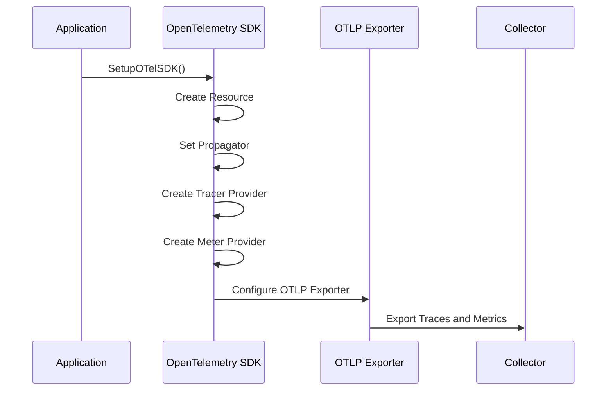
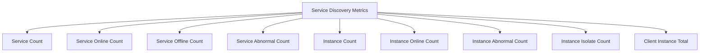
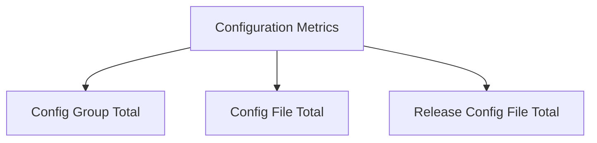
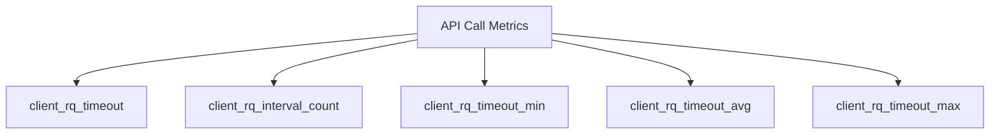
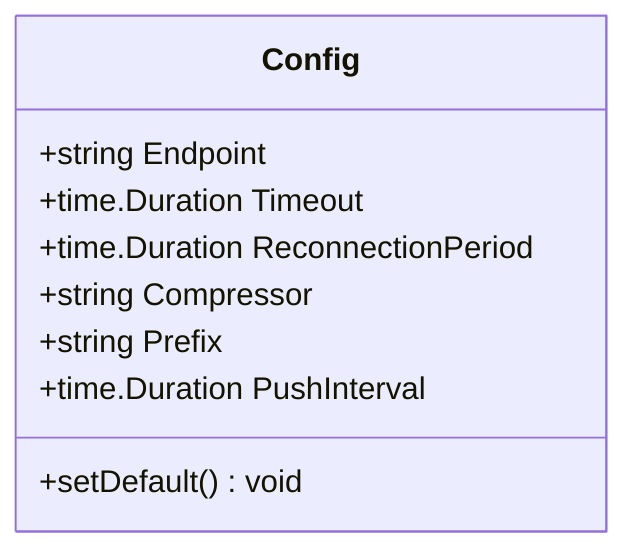
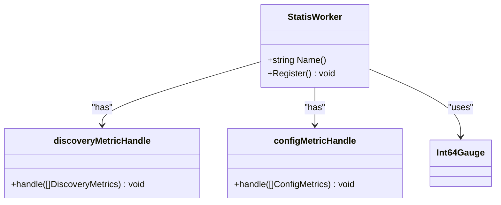
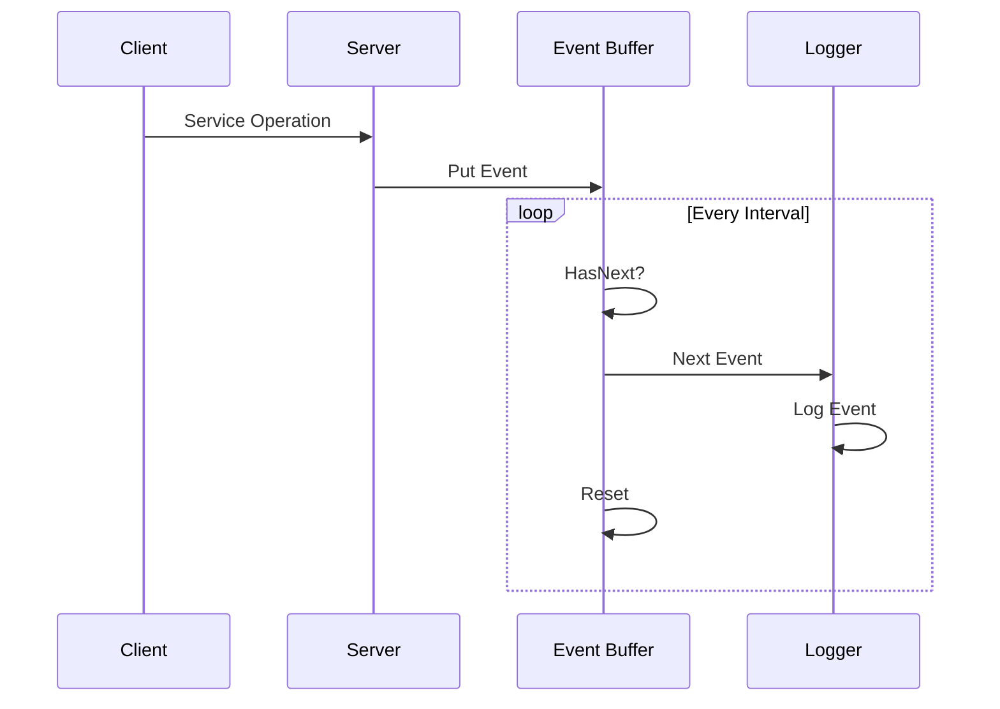
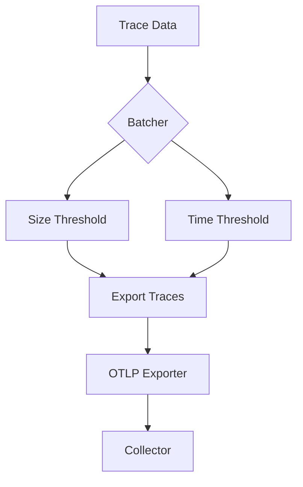
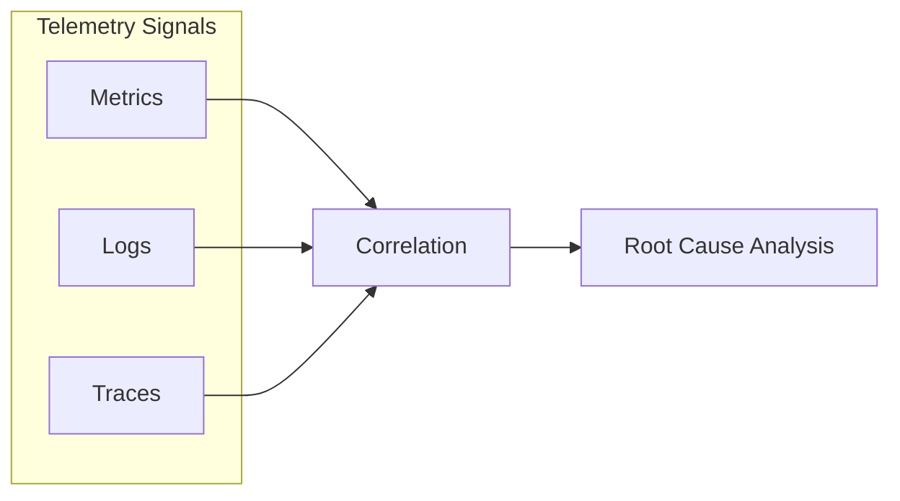

# Monitoring & Observability

<cite>
**Referenced Files in This Document**   
- [otel.go](file://pkg/common/otel/otel.go)
- [config.go](file://pkg/common/otel/config.go)
- [statis.go](file://plugin/observability/statis/prometheus/statis.go)
- [discovery_handle.go](file://plugin/observability/statis/prometheus/discovery_handle.go)
- [config_handle.go](file://plugin/observability/statis/prometheus/config_handle.go)
- [base_worker.go](file://plugin/observability/statis/base/base_worker.go)
- [apicall.go](file://plugin/observability/statis/base/apicall.go)
- [cachecall.go](file://plugin/observability/statis/base/cachecall.go)
- [types.go](file://apis/pkg/types/metrics/types.go)
- [event_local.go](file://plugin/observability/discoverevent/logger/event_local.go)
</cite>

## Table of Contents
1. [Introduction](#introduction)
2. [OpenTelemetry Integration](#opentelemetry-integration)
3. [Available Metrics](#available-metrics)
4. [Metric Configuration](#metric-configuration)
5. [Prometheus Integration](#prometheus-integration)
6. [Event Logging Structure](#event-logging-structure)
7. [Trace Propagation](#trace-propagation)
8. [Alerting Configuration](#alerting-configuration)
9. [Correlation of Metrics, Logs, and Traces](#correlation-of-metrics-logs-and-traces)
10. [Conclusion](#conclusion)

## Introduction
The pole-server implements comprehensive monitoring and observability capabilities through integration with OpenTelemetry and Prometheus. The system collects both system-level metrics (CPU, memory, goroutines) and service-level metrics (API calls, cache hits, request latency) to provide full visibility into the health and performance of the service mesh control plane. This documentation details the implementation, configuration, and usage of these observability features.

## OpenTelemetry Integration

The pole-server integrates with OpenTelemetry through the `otel` package in `pkg/common/otel`, which bootstraps the OpenTelemetry pipeline for both metrics and tracing. The `SetupOTelSDK` function initializes the OpenTelemetry SDK with configurable parameters for exporting telemetry data.



**Diagram sources**
- [otel.go](file://pkg/common/otel/otel.go#L47-L102)

**Section sources**
- [otel.go](file://pkg/common/otel/otel.go#L0-L127)

## Available Metrics

The pole-server exposes a comprehensive set of metrics categorized into system-level and service-level metrics.

### System-Level Metrics
The system-level metrics are automatically collected through the OpenTelemetry runtime instrumentation, which captures CPU, memory, and goroutine information from the Go runtime.

### Service-Level Metrics
The service-level metrics are categorized into several domains:

#### Service Discovery Metrics
These metrics track the state of services and instances in the registry:



**Diagram sources**
- [discovery_handle.go](file://plugin/observability/statis/prometheus/discovery_handle.go#L87-L124)

#### Configuration Management Metrics
These metrics track configuration resources:



**Diagram sources**
- [config_handle.go](file://plugin/observability/statis/prometheus/config_handle.go#L36-L81)

#### API Call Metrics
The system tracks API call performance with detailed metrics:



**Diagram sources**
- [base_worker.go](file://plugin/observability/statis/base/base_worker.go#L44-L102)

**Section sources**
- [types.go](file://apis/pkg/types/metrics/types.go#L42-L89)
- [apicall.go](file://plugin/observability/statis/base/apicall.go#L41-L98)

## Metric Configuration

The metrics collection system is configured through the OpenTelemetry configuration structure, which allows customization of export parameters.

### OpenTelemetry Configuration
The `Config` struct in `pkg/common/otel/config.go` defines the configuration options for the OpenTelemetry exporter:

```go
type Config struct {
    Endpoint           string        `yaml:"endpoint"`
    Timeout            time.Duration `yaml:"timeout"`
    ReconnectionPeriod time.Duration `yaml:"reconnectionPeriod"`
    Compressor         string        `yaml:"compressor"`
    Prefix             string        `yaml:"prefix"`
    PushInterval       time.Duration `yaml:"pushInterval"`
}
```

The configuration has sensible defaults:
- **Timeout**: 5 seconds
- **ReconnectionPeriod**: 10 seconds
- **Compressor**: gzip
- **Prefix**: wns_
- **PushInterval**: 5 seconds



**Diagram sources**
- [config.go](file://pkg/common/otel/config.go#L0-L30)

**Section sources**
- [config.go](file://pkg/common/otel/config.go#L0-L30)

## Prometheus Integration

The pole-server integrates with Prometheus through the `prometheus` plugin in the observability module. The integration is implemented as a plugin that registers metrics handlers for different metric types.

### Prometheus Plugin Architecture
The Prometheus plugin follows a plugin architecture where different metric handlers are registered for specific metric types:



**Diagram sources**
- [statis.go](file://plugin/observability/statis/prometheus/statis.go#L0-L45)
- [discovery_handle.go](file://plugin/observability/statis/prometheus/discovery_handle.go#L0-L174)
- [config_handle.go](file://plugin/observability/statis/prometheus/config_handle.go#L0-L99)

### Sample Prometheus Configuration
To scrape metrics from pole-server, configure Prometheus with the following job:

```yaml
scrape_configs:
  - job_name: 'pole-server'
    scrape_interval: 15s
    scrape_timeout: 10s
    static_configs:
      - targets: ['localhost:9090']
    metric_relabel_configs:
      - source_labels: [__name__]
        regex: 'wns_.*'
        action: keep
```

The metrics endpoint is automatically exposed by the OpenTelemetry collector, and the `PushInterval` configuration controls how frequently metrics are pushed to the collector.

## Event Logging Structure

The pole-server implements a structured event logging system that captures operational events for audit and debugging purposes.

### Event Logger Implementation
The event logging system is implemented as a plugin that buffers events and processes them asynchronously:



**Diagram sources**
- [event_local.go](file://plugin/observability/discoverevent/logger/event_local.go#L0-L51)

The event buffer holds events temporarily before they are processed by the logger. This design ensures that event logging does not block the main service operations.

**Section sources**
- [event_local.go](file://plugin/observability/discoverevent/logger/event_local.go#L0-L51)

## Trace Propagation

The pole-server implements distributed tracing using OpenTelemetry's trace propagation mechanism.

### Trace Context Propagation
The system uses composite text map propagators to propagate trace context across service boundaries:

```go
func newPropagator() propagation.TextMapPropagator {
    return propagation.NewCompositeTextMapPropagator(
        propagation.TraceContext{},
        propagation.Baggage{},
    )
}
```

This configuration enables both W3C Trace Context and Baggage propagation, allowing trace identifiers and additional metadata to be passed between services.

The trace provider is configured to batch traces and export them to the configured endpoint:



**Section sources**
- [otel.go](file://pkg/common/otel/otel.go#L47-L102)

## Alerting Configuration

The monitoring system supports alerting on critical thresholds through integration with Prometheus Alertmanager.

### Alert Rules
The following alert rules are recommended for monitoring pole-server health:

#### High Error Rate Alert
Alert when API error rates exceed thresholds:

```yaml
groups:
  - name: pole-server-errors
    rules:
      - alert: HighAPIErrorRate
        expr: sum(rate(client_rq_interval_count{err_code!="0"}[5m])) / sum(rate(client_rq_interval_count[5m])) > 0.05
        for: 10m
        labels:
          severity: critical
        annotations:
          summary: "High API error rate ({{ $value }}%)"
          description: "The pole-server is experiencing a high error rate for API calls."
```

#### Slow Response Alert
Alert when response latencies exceed acceptable thresholds:

```yaml
      - alert: SlowAPIResponse
        expr: client_rq_timeout_avg > 1000
        for: 5m
        labels:
          severity: warning
        annotations:
          summary: "Slow API response ({{ $value }}ms)"
          description: "The average API response time has exceeded 1 second."
```

#### Resource Exhaustion Alert
Monitor system resources for signs of exhaustion:

```yaml
      - alert: HighGoroutineCount
        expr: go_goroutines > 1000
        for: 15m
        labels:
          severity: warning
        annotations:
          summary: "High goroutine count ({{ $value }})"
          description: "The pole-server has a high number of goroutines, which may indicate a resource leak."
```

## Correlation of Metrics, Logs, and Traces

The pole-server implements correlation between metrics, logs, and traces to enable effective root cause analysis.

### Correlation Mechanism
The system uses trace IDs and span IDs to correlate different telemetry signals:



When an error occurs, the system captures:
1. Metrics showing the increased error rate
2. Logs containing the error details with trace context
3. Traces showing the complete request flow

This allows operators to start with a metric alert, examine the correlated logs for error details, and then analyze the full trace to understand the root cause.

The `CallMetric` structure includes fields that enable correlation:

```go
type CallMetric struct {
    Type             CallMetricType
    API              string
    Protocol         string
    Code             int
    Times            int
    Success          bool
    Duration         time.Duration
    Labels           map[string]string
    TrafficDirection TrafficDirection
}
```

The labels include API, protocol, and error code, which can be used to filter and correlate across different telemetry sources.

**Section sources**
- [types.go](file://apis/pkg/types/metrics/types.go#L42-L89)
- [base_worker.go](file://plugin/observability/statis/base/base_worker.go#L44-L102)

## Conclusion
The pole-server provides comprehensive monitoring and observability capabilities through its integration with OpenTelemetry and Prometheus. The system collects detailed metrics at both the system and service levels, implements structured event logging, and supports distributed tracing with proper context propagation. The configuration options allow customization of metric collection and export parameters, while the alerting rules provide early warning of potential issues. By correlating metrics, logs, and traces, operators can effectively perform root cause analysis and maintain the health of the service mesh control plane.