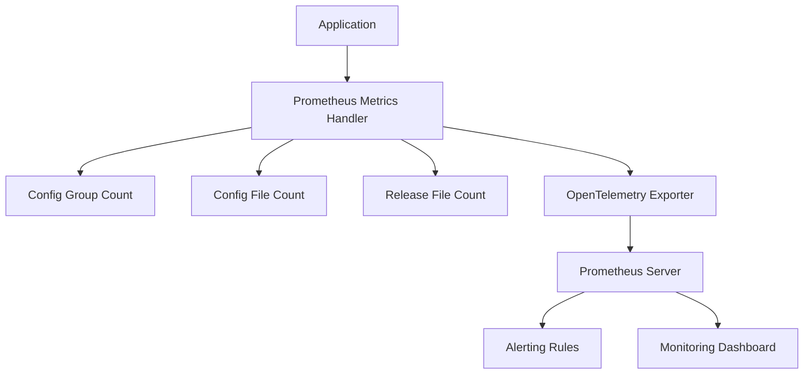
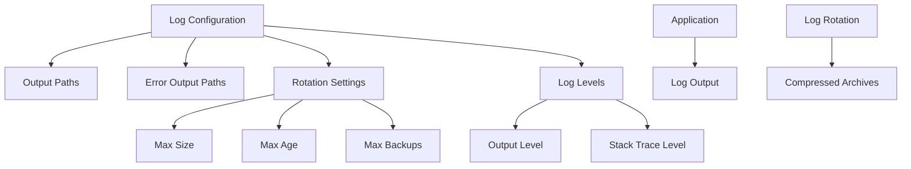
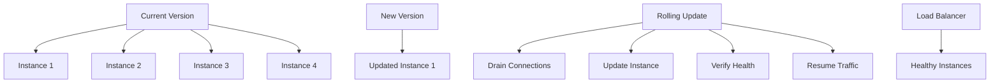
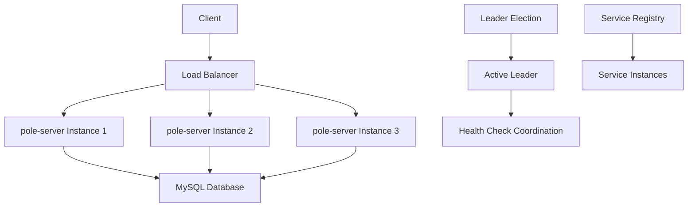
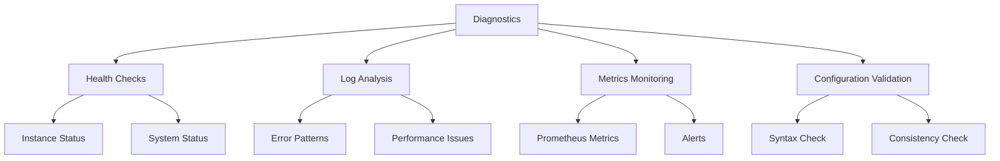

# Operations Guide

<cite>
**Referenced Files in This Document**   
- [config_handle.go](file://plugin/observability/statis/prometheus/config_handle.go)
- [statis.go](file://plugin/observability/statis/prometheus/statis.go)
- [otel.go](file://pkg/common/otel/otel.go)
- [config.go](file://pkg/common/log/config.go)
- [options.go](file://pkg/common/log/options.go)
- [logger.go](file://pkg/common/log/logger.go)
- [default.go](file://pkg/cache/default.go)
- [base_db.go](file://plugin/store/mysql/base_db.go)
- [default.go](file://plugin/store/mysql/default.go)
- [leader.go](file://pkg/service/healthcheck/leader.go)
- [server.go](file://pkg/service/healthcheck/server.go)
- [report.go](file://pkg/service/healthcheck/report.go)
- [healthchecker.go](file://apis/service/healthcheck/healthchecker.go)
- [common_test.go](file://pkg/config/common_test.go)
- [pole-server.yaml](file://deploy/conf/pole-server.yaml)
- [pole-log.yaml](file://deploy/conf/pole-log.yaml)
</cite>

## Table of Contents
1. [Monitoring Setup](#monitoring-setup)
2. [Logging Configuration](#logging-configuration)
3. [Troubleshooting Common Issues](#troubleshooting-common-issues)
4. [Performance Tuning](#performance-tuning)
5. [Backup and Recovery](#backup-and-recovery)
6. [Upgrade Processes](#upgrade-processes)
7. [Rolling Deployment Strategies](#rolling-deployment-strategies)
8. [Disaster Recovery Planning](#disaster-recovery-planning)
9. [High Availability Configurations](#high-availability-configurations)
10. [Diagnostic Tools and Commands](#diagnostic-tools-and-commands)

## Monitoring Setup

The pole-server implements comprehensive monitoring through Prometheus metrics collection. The observability plugin system provides built-in support for Prometheus integration, exposing key operational metrics for system monitoring and alerting.

The Prometheus metrics system is implemented in the `plugin/observability/statis/prometheus` package, which registers various metric handlers for different system components. The system exposes metrics for configuration management, service discovery, and health checking operations.

Key metrics include:
- `config_group_count`: Total number of configuration groups
- `config_file_count`: Total number of configuration files per configuration group
- `config_release_file_count`: Total number of released configuration files per configuration group

These metrics are registered during system initialization and updated dynamically as configuration changes occur. The metrics system uses OpenTelemetry for metric collection and export, providing a standardized interface for monitoring data.

**Diagram sources**
- [config_handle.go](file://plugin/observability/statis/prometheus/config_handle.go)
- [statis.go](file://plugin/observability/statis/prometheus/statis.go)

**Section sources**
- [config_handle.go](file://plugin/observability/statis/prometheus/config_handle.go#L0-L81)
- [statis.go](file://plugin/observability/statis/prometheus/statis.go#L0-L45)

## Logging Configuration

The pole-server uses a structured logging system with configurable log levels, output paths, and rotation policies. The logging system is configured through the `pkg/common/log` package, which provides a flexible interface for log management.

Log configuration is controlled through the `Options` structure, which defines:
- `OutputPaths`: File system paths for log output (default: stdout)
- `ErrorOutputPaths`: File system paths for error output (default: stderr)
- `RotationMaxSize`: Maximum size of log files before rotation (default: 100MB)
- `RotationMaxAge`: Maximum age of log files before rotation (default: 7 days)
- `RotationMaxBackups`: Maximum number of rotated log files to retain (default: 10)
- `OutputLevel`: Minimum log output level (debug, info, warn, error, fatal, none)
- `StackTraceLevel`: Minimum level for stack trace inclusion

The logging system supports automatic log rotation based on size and time criteria. When configured, logs are rotated when they reach the specified maximum size or age, with older logs compressed and retained according to the backup policy.

Log levels can be dynamically adjusted at runtime using the `SetLogOutputLevel` function, allowing for temporary increases in verbosity for troubleshooting without requiring service restarts.

**Diagram sources**
- [config.go](file://pkg/common/log/config.go)
- [options.go](file://pkg/common/log/options.go)

**Section sources**
- [config.go](file://pkg/common/log/config.go#L294-L342)
- [options.go](file://pkg/common/log/options.go#L52-L80)
- [logger.go](file://pkg/common/log/logger.go#L43-L70)

## Troubleshooting Common Issues

### High Latency

High latency issues can be caused by several factors including database performance, network connectivity, or resource constraints. The system provides several diagnostic tools to identify the root cause:

1. Monitor database query performance using the built-in metrics
2. Check network connectivity between service instances
3. Verify system resource utilization (CPU, memory, disk I/O)
4. Review log files for error patterns or warnings

### Memory Leaks

Memory leaks can occur due to improper resource management or caching issues. To diagnose memory leaks:

1. Monitor memory usage over time using system monitoring tools
2. Check cache configuration and eviction policies
3. Review garbage collection statistics
4. Analyze heap dumps if available

The cache system in `pkg/cache` manages memory usage through configurable limits and eviction policies. Ensure cache sizes are appropriate for your deployment规模 and workload patterns.

### Database Connection Pool Exhaustion

Database connection pool exhaustion occurs when the number of concurrent database connections exceeds the configured limits. This can be addressed by:

1. Increasing the maximum open connections (`maxOpenConns`)
2. Adjusting the maximum idle connections (`maxIdleConns`)
3. Modifying the connection maximum lifetime (`connMaxLifetime`)

The MySQL store implementation in `plugin/store/mysql` provides configurable connection pool settings that can be tuned based on your database capacity and workload requirements.

**Section sources**
- [base_db.go](file://plugin/store/mysql/base_db.go#L0-L98)
- [default.go](file://plugin/store/mysql/default.go#L0-L48)

## Performance Tuning

### Cache Sizing

The cache system is a critical component for performance optimization. Cache sizing should be based on:
- Expected number of services and instances
- Configuration data volume
- Available system memory
- Access patterns and hit rates

The cache manager in `pkg/cache/default.go` initializes and manages multiple cache instances for different data types. Proper sizing ensures optimal performance while avoiding memory pressure.

### Goroutine Limits

The system uses goroutines extensively for concurrent operations. While there are no explicit goroutine limits configured, the system relies on Go's runtime scheduler and resource constraints to manage concurrency. Monitor goroutine count and adjust system resources as needed to maintain optimal performance.

### Database Optimization

Database performance can be optimized through several configuration options:

1. Connection pool tuning:
   - `maxOpenConns`: Maximum number of open connections to the database
   - `maxIdleConns`: Maximum number of idle connections in the pool
   - `connMaxLifetime`: Maximum amount of time a connection may be reused

2. Query optimization:
   - Ensure proper indexing on frequently queried columns
   - Monitor slow queries and optimize as needed
   - Use connection pooling to reduce connection overhead

The MySQL store implementation provides these configuration options through the database configuration, allowing for fine-tuning based on database server capacity and workload characteristics.

**Section sources**
- [base_db.go](file://plugin/store/mysql/base_db.go#L49-L98)
- [default.go](file://plugin/store/mysql/default.go#L166-L228)

## Backup and Recovery

The pole-server relies on external database backups for data protection. Since configuration and service data are stored in the MySQL database, regular database backups are essential for disaster recovery.

Backup procedures should include:
1. Regular database dumps using standard MySQL backup tools
2. Verification of backup integrity
3. Secure storage of backup files
4. Regular recovery testing

The system does not provide built-in backup functionality, as this is typically handled by database administration tools and processes. Ensure that your database backup strategy aligns with your recovery point objective (RPO) and recovery time objective (RTO).

For configuration files, consider version control integration to track changes and enable rollback capabilities.

**Section sources**
- [default.go](file://plugin/store/mysql/default.go#L257-L281)

## Upgrade Processes

System upgrades should follow a structured process to minimize downtime and risk:

1. Review release notes for breaking changes and migration requirements
2. Backup current configuration and database
3. Deploy new version to staging environment for testing
4. Plan maintenance window for production upgrade
5. Perform upgrade during maintenance window
6. Verify system functionality after upgrade
7. Monitor system stability and performance

The system supports rolling upgrades when deployed in a cluster configuration. This allows for zero-downtime upgrades by updating nodes sequentially while maintaining service availability.

Configuration changes between versions should be carefully reviewed, as some updates may require manual intervention or data migration.

**Section sources**
- [common_test.go](file://pkg/config/common_test.go#L0-L41)

## Rolling Deployment Strategies

Rolling deployments are supported through the system's cluster capabilities. The deployment strategy involves:

1. Maintaining multiple instances of the pole-server in a cluster
2. Updating instances one at a time or in batches
3. Verifying each updated instance before proceeding
4. Completing the rollout across all instances

The Eureka server implementation in `plugin/apiserver/eurekaserver` provides service discovery and health checking capabilities that support rolling deployments. During a rolling update, the system continues to route traffic to healthy instances while new instances are brought online.

Key considerations for rolling deployments:
- Ensure sufficient capacity to handle traffic during the rollout
- Monitor health checks and metrics during the update process
- Have a rollback plan in case of issues
- Coordinate with dependent services

**Diagram sources**
- [server.go](file://plugin/apiserver/eurekaserver/server.go#L110-L156)

**Section sources**
- [server.go](file://plugin/apiserver/eurekaserver/server.go#L636-L654)

## Disaster Recovery Planning

Disaster recovery planning should address both data loss and service outage scenarios. Key components include:

1. Regular database backups with off-site storage
2. Documented recovery procedures
3. Regular recovery testing
4. Alternative infrastructure for failover

The system's reliance on external MySQL storage means that database disaster recovery is paramount. Ensure that your database backup and recovery strategy meets your business continuity requirements.

For service outage recovery, maintain a known-good configuration and deployment procedure that can be quickly executed in an emergency.

**Section sources**
- [default.go](file://plugin/store/mysql/default.go#L257-L281)

## High Availability Configurations

High availability is achieved through cluster deployment with multiple pole-server instances. The system supports active-active clustering with automatic failover and load balancing.

Key high availability features:
- Multiple instances serving requests simultaneously
- Automatic leader election for coordinated operations
- Health checking to detect and isolate failed instances
- Data replication between instances

The health checking system in `pkg/service/healthcheck` provides leader election capabilities through the `LeaderChangeEventHandler`, which coordinates health check operations among cluster members. When an instance becomes the leader, it initiates health checks for service instances; when it loses leadership, it stops these checks.

Database connectivity is also critical for high availability. Configure database connection settings to handle transient failures and implement retry logic for database operations.

**Diagram sources**
- [leader.go](file://pkg/service/healthcheck/leader.go#L39-L73)
- [server.go](file://pkg/service/healthcheck/server.go#L40-L92)

**Section sources**
- [leader.go](file://pkg/service/healthcheck/leader.go#L75-L114)
- [server.go](file://pkg/service/healthcheck/server.go#L256-L267)

## Diagnostic Tools and Commands

The system provides several diagnostic tools and commands for system inspection and health verification:

1. Health check endpoints for monitoring system status
2. Log analysis tools for troubleshooting
3. Configuration validation utilities
4. Performance monitoring metrics

The health checking system exposes endpoints for reporting and querying instance health status. The `HealthChecker` interface in `apis/service/healthcheck/healthchecker.go` defines the contract for health check plugins, allowing for extensible health checking capabilities.

System health can be verified through:
- Monitoring Prometheus metrics for anomalies
- Checking log files for error messages
- Using the built-in health check reporting functionality
- Verifying database connectivity and performance

The system also provides debug handlers through the `DebugHandlers` method on health checker plugins, enabling detailed diagnostic information when needed.

**Diagram sources**
- [healthchecker.go](file://apis/service/healthcheck/healthchecker.go#L101-L142)
- [report.go](file://pkg/service/healthcheck/report.go#L69-L108)

**Section sources**
- [healthchecker.go](file://apis/service/healthcheck/healthchecker.go#L101-L142)
- [report.go](file://pkg/service/healthcheck/report.go#L69-L108)