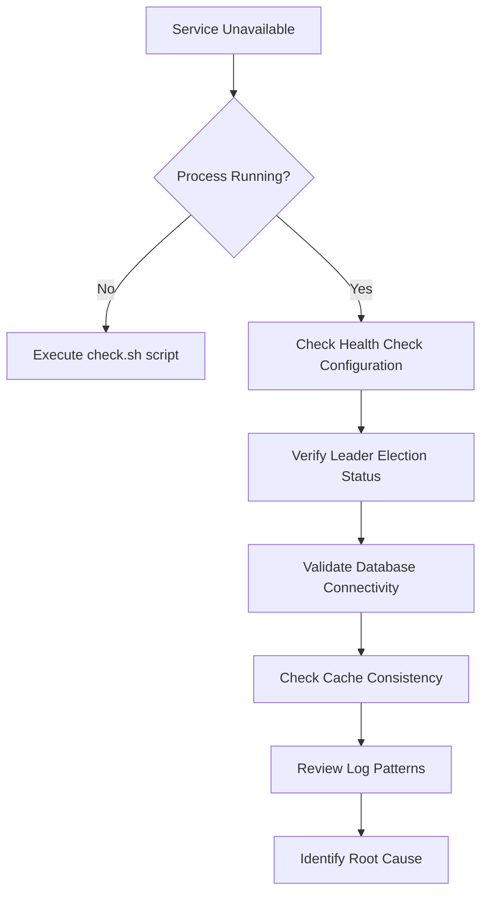
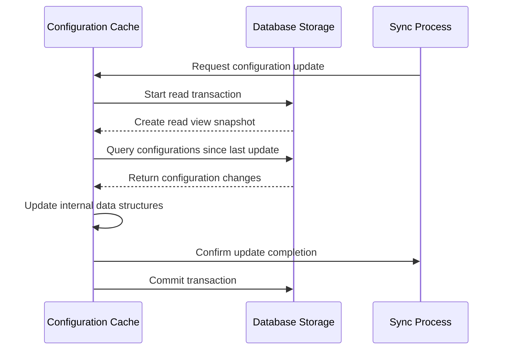
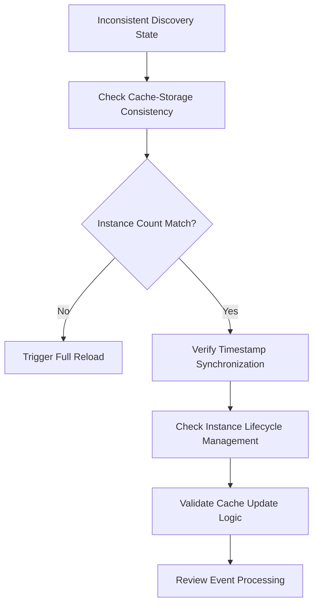
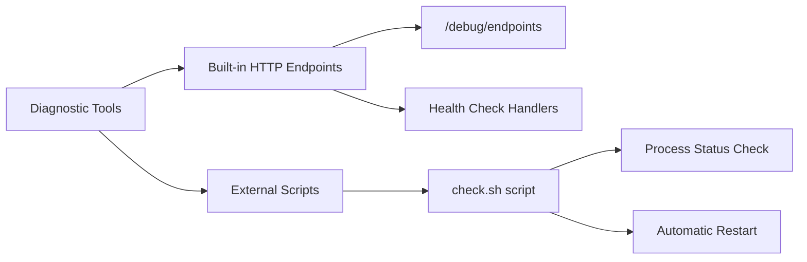
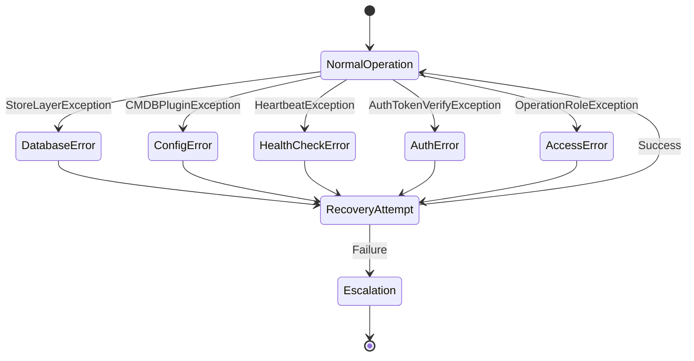
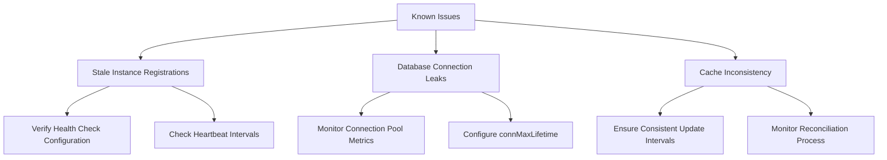
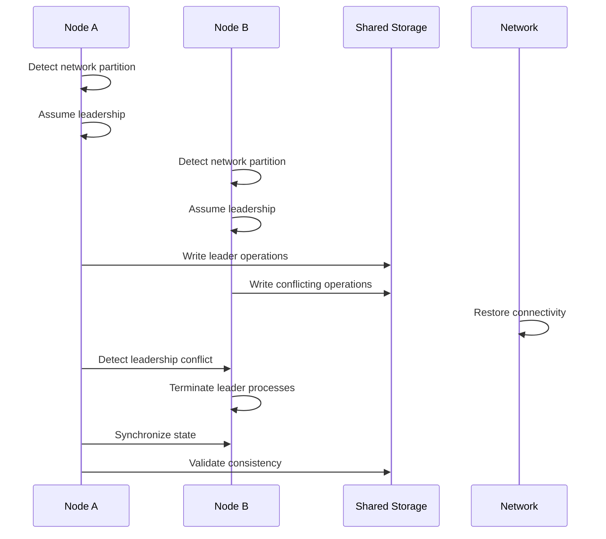
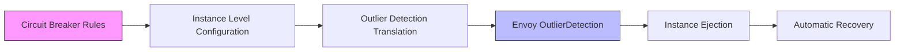

# Troubleshooting Guide

<cite>
**Referenced Files in This Document**   
- [check.sh](file://deploy/tools/check.sh)
- [config.go](file://pkg/service/healthcheck/config.go)
- [server.go](file://plugin/apiserver/httpserver/server.go)
- [leader.go](file://pkg/service/healthcheck/leader.go)
- [instance.go](file://pkg/cache/service/instance.go)
- [base_db.go](file://plugin/store/mysql/base_db.go)
- [default.go](file://plugin/store/mysql/default.go)
- [cache.go](file://pkg/service/healthcheck/cache.go)
- [dispatch.go](file://pkg/service/healthcheck/dispatch.go)
- [cds.go](file://plugin/apiserver/xdsserverv3/cds.go)
- [help.go](file://plugin/apiserver/xdsserverv3/resource/help.go)
</cite>

## Table of Contents
1. [Introduction](#introduction)
2. [Service Unavailability Diagnosis](#service-unavailability-diagnosis)
3. [Configuration Sync Failures](#configuration-sync-failures)
4. [Inconsistent Service Discovery States](#inconsistent-service-discovery-states)
5. [Health Check Endpoints and Diagnostic Scripts](#health-check-endpoints-and-diagnostic-scripts)
6. [Error Code and Log Pattern Interpretation](#error-code-and-log-pattern-interpretation)
7. [Known Issues and Solutions](#known-issues-and-solutions)
8. [Split-Brain Recovery Procedures](#split-brain-recovery-procedures)
9. [Outlier Detection Configuration](#outlier-detection-configuration)
10. [Appendices](#appendices)

## Introduction
This troubleshooting guide provides comprehensive procedures for diagnosing and resolving common production issues in pole-server. The document covers service unavailability, configuration synchronization problems, and inconsistent service discovery states. It details the use of built-in health check mechanisms, diagnostic scripts, and recovery procedures for clustered deployments. The guide is designed for system administrators and operations engineers responsible for maintaining pole-server in production environments.

## Service Unavailability Diagnosis

When pole-server becomes unavailable, follow this systematic diagnostic approach:

1. **Verify process status** using the `check.sh` script located in `deploy/tools/`. This script checks if the pole-server process is running and can restart it if necessary.

2. **Check health check configuration** in the healthcheck module. The health check system is configured through the `Config` struct which defines parameters such as minimum and maximum check intervals, client check intervals, and TTL values.

3. **Examine leader election status** for health checking. The system designates a leader node responsible for checking the health of self-service instances. If no leader is active, health checks will not be performed.

4. **Validate database connectivity** as service availability depends on stable database connections. Check for connection pool exhaustion and connection lifetime settings.

**Diagram sources**
- [check.sh](file://deploy/tools/check.sh)
- [config.go](file://pkg/service/healthcheck/config.go)
- [leader.go](file://pkg/service/healthcheck/leader.go)

**Section sources**
- [check.sh](file://deploy/tools/check.sh)
- [config.go](file://pkg/service/healthcheck/config.go)
- [leader.go](file://pkg/service/healthcheck/leader.go)

## Configuration Sync Failures

Configuration synchronization failures can occur due to various factors including network issues, database problems, or cache inconsistencies. The pole-server uses a multi-layered approach to configuration management with built-in mechanisms to detect and resolve sync issues.

1. **Check configuration cache update mechanism**. The system uses a timestamp-based approach to track the last update time of configurations. When inconsistencies are detected between the cache and storage layer, the system triggers a full reload.

2. **Verify database transaction isolation**. The MySQL storage implementation uses `READ COMMITTED` isolation level to ensure consistent reads during configuration synchronization.

3. **Monitor connection pool settings** including maximum open connections, maximum idle connections, and connection maximum lifetime, which can impact configuration sync performance.

**Diagram sources**
- [instance.go](file://pkg/cache/service/instance.go)
- [base_db.go](file://plugin/store/mysql/base_db.go)
- [default.go](file://plugin/store/mysql/default.go)

**Section sources**
- [instance.go](file://pkg/cache/service/instance.go)
- [base_db.go](file://plugin/store/mysql/base_db.go)
- [default.go](file://plugin/store/mysql/default.go)

## Inconsistent Service Discovery States

Inconsistent service discovery states typically manifest as discrepancies between what clients observe and the actual state of service instances. The pole-server implements several mechanisms to detect and resolve these inconsistencies.

1. **Check cache reconciliation process**. The system performs periodic reconciliation between the in-memory cache and the persistent storage to ensure consistency. This process is triggered when the instance count in cache doesn't match the count in storage.

2. **Verify timestamp synchronization**. The cache uses timestamps to track the last modification time of instances. Inconsistent system clocks across cluster nodes can lead to discovery state inconsistencies.

3. **Examine instance lifecycle management**. Instances are properly removed from the cache when they are deleted from storage, with special handling for soft-deleted instances.

**Diagram sources**
- [instance.go](file://pkg/cache/service/instance.go)
- [instance_test.go](file://pkg/cache/service/instance_test.go)

**Section sources**
- [instance.go](file://pkg/cache/service/instance.go)
- [instance_test.go](file://pkg/cache/service/instance_test.go)

## Health Check Endpoints and Diagnostic Scripts

The pole-server provides several built-in health check endpoints and diagnostic scripts to facilitate troubleshooting and monitoring.

### Built-in Health Check Endpoints

The HTTP server exposes debug endpoints that provide information about health check handlers:

- `/debug/endpoints` - Lists all available debug endpoints with their paths and descriptions
- Various health check specific endpoints registered through the `DebugHandlers()` method

These endpoints are automatically registered when the server starts and provide visibility into the health checking subsystem.

### Diagnostic Scripts

The `check.sh` script in the `deploy/tools/` directory serves as a basic diagnostic and recovery tool:

1. Determines the script's location regardless of execution context
2. Checks for running pole-server processes using the command line pattern
3. Automatically starts the service if no processes are found

The script uses standard Unix tools like `ps`, `grep`, and `awk` to identify running instances and can be extended to perform additional health checks.

**Diagram sources**
- [server.go](file://plugin/apiserver/httpserver/server.go)
- [check.sh](file://deploy/tools/check.sh)

**Section sources**
- [server.go](file://plugin/apiserver/httpserver/server.go)
- [check.sh](file://deploy/tools/check.sh)

## Error Code and Log Pattern Interpretation

Understanding error codes and log patterns is essential for efficient troubleshooting of pole-server issues.

### Error Code Categories

The system uses a structured error code system that categorizes exceptions by their source:

- **StoreLayerException**: Database or storage layer issues
- **CMDBPluginException**: Configuration management database plugin errors
- **HeartbeatException**: Instance heartbeat and health check failures
- **AuthTokenVerifyException**: Authentication and authorization problems
- **OperationRoleException**: Role-based access control violations

### Log Pattern Analysis

Key log patterns to monitor:

- `[Cache][Instance] instance count not match`: Indicates cache-storage inconsistency requiring full reload
- `[Store][database] database ping err`: Database connectivity issues
- `[Health Check][Check] selfService instance not enable healthcheck`: Health check disabled for specific instances
- `create storage snapshot read view`: Cache update and reconciliation events

Log entries include structured fields using zap logging that can be parsed for automated monitoring and alerting.

**Diagram sources**
- [messages.genearate.go](file://plugin/apiserver/httpserver/i18n/messages.genearate.go)
- [instance.go](file://pkg/cache/service/instance.go)

**Section sources**
- [messages.genearate.go](file://plugin/apiserver/httpserver/i18n/messages.genearate.go)
- [instance.go](file://pkg/cache/service/instance.go)

## Known Issues and Solutions

### Stale Instance Registrations

Stale instance registrations occur when instances remain in the service registry after they have been terminated. This issue can be resolved by:

1. Ensuring proper deregistration during instance shutdown
2. Configuring appropriate heartbeat intervals and TTL values
3. Verifying that the health check system is functioning correctly

The health check configuration includes `ClientCheckTtl` which determines how long a client's registration remains valid after the last heartbeat.

### Database Connection Leaks

Database connection leaks can lead to service degradation and eventual unavailability. Prevention and resolution steps:

1. Monitor connection pool metrics including active, idle, and maximum connections
2. Configure appropriate `connMaxLifetime` to prevent stale connections
3. Ensure transactions are properly committed or rolled back

The MySQL implementation sets connection limits and lifetimes through configuration parameters that should be tuned based on workload.

### Cache Inconsistency

Cache inconsistency between nodes in a cluster can cause uneven load distribution and service discovery issues. Mitigation strategies:

1. Ensure consistent cache update intervals across all nodes
2. Monitor the reconciliation process between cache and storage
3. Verify network connectivity between cluster nodes

The system uses a segmented map structure for cache storage which provides thread-safe operations and helps prevent race conditions.

**Diagram sources**
- [config.go](file://pkg/service/healthcheck/config.go)
- [base_db.go](file://plugin/store/mysql/base_db.go)
- [cache.go](file://pkg/service/healthcheck/cache.go)

**Section sources**
- [config.go](file://pkg/service/healthcheck/config.go)
- [base_db.go](file://plugin/store/mysql/base_db.go)
- [cache.go](file://pkg/service/healthcheck/cache.go)

## Split-Brain Recovery Procedures

Split-brain scenarios in clustered deployments occur when network partitions cause multiple nodes to believe they are the leader, potentially leading to data inconsistency. The pole-server implements leader election mechanisms to prevent this condition.

### Detection

1. Monitor leader change events through the `LeaderChangeEventHandler`
2. Check for multiple nodes performing leader-specific tasks like health checking self-service instances
3. Verify that only one node is updating shared resources

### Recovery Steps

1. **Identify the current leader** by checking which node is actively performing leader responsibilities
2. **Terminate leader processes on non-primary nodes** to prevent conflicting operations
3. **Synchronize state** from the primary leader to other nodes
4. **Restore network connectivity** between cluster nodes
5. **Validate consistency** by comparing cache and storage states

The leader election system uses context cancellation to stop leader-specific operations when a node loses leadership, preventing continued operation in split-brain conditions.

**Diagram sources**
- [leader.go](file://pkg/service/healthcheck/leader.go)
- [dispatch.go](file://pkg/service/healthcheck/dispatch.go)

**Section sources**
- [leader.go](file://pkg/service/healthcheck/leader.go)
- [dispatch.go](file://pkg/service/healthcheck/dispatch.go)

## Outlier Detection Configuration

Outlier detection is a circuit-breaking mechanism that identifies and isolates unhealthy instances from the load balancing pool. The pole-server integrates outlier detection with its service mesh capabilities.

### Configuration

Outlier detection is configured through circuit breaker rules at the instance level. The configuration includes:

- **Consecutive 5xx failures**: Number of consecutive server errors before ejecting an instance
- **Failure percentage threshold**: Percentage of failed requests that triggers ejection
- **Minimum request volume**: Minimum number of requests required to calculate failure percentage
- **Base ejection time**: Duration for which an instance remains ejected
- **Interval**: Time between outlier detection sweeps

### Implementation

The outlier detection configuration is translated from Polaris circuit breaker rules to Envoy-compatible OutlierDetection structures. This enables seamless integration with service mesh data planes.

When a service has circuit breaker rules configured at the instance level, the system automatically generates the corresponding outlier detection configuration for use by sidecar proxies.

**Diagram sources**
- [cds.go](file://plugin/apiserver/xdsserverv3/cds.go)
- [help.go](file://plugin/apiserver/xdsserverv3/resource/help.go)

**Section sources**
- [cds.go](file://plugin/apiserver/xdsserverv3/cds.go)
- [help.go](file://plugin/apiserver/xdsserverv3/resource/help.go)

## Appendices

### Appendix A: Health Check Configuration Parameters

| Parameter | Default Value | Description |
|---------|-------------|-------------|
| Open | true | Enables or disables health checking |
| MinCheckInterval | 1 second | Minimum interval between health checks |
| MaxCheckInterval | 30 seconds | Maximum interval between health checks |
| ClientCheckInterval | 120 seconds | Interval at which clients must report health |
| ClientCheckTtl | 120 seconds | Time-to-live for client health reports |
| SlotNum | 30 | Number of hash slots for instance distribution |

### Appendix B: Database Connection Settings

| Setting | Default | Purpose |
|-------|-------|---------|
| maxOpenConns | No limit | Maximum number of open connections to the database |
| maxIdleConns | No limit | Maximum number of idle connections in the pool |
| connMaxLifetime | 0 (unlimited) | Maximum amount of time a connection may be reused |

These settings should be adjusted based on the database server capacity and application workload characteristics.