# API Server Plugins

<cite>
**Referenced Files in This Document**   
- [plugin.go](file://plugin.go)
- [apis/apiserver/apiserver.go](file://apis/apiserver/apiserver.go)
- [plugin/apiserver/xdsserverv3/server.go](file://plugin/apiserver/xdsserverv3/server.go)
- [plugin/apiserver/eurekaserver/server.go](file://plugin/apiserver/eurekaserver/server.go)
- [plugin/apiserver/httpserver/server.go](file://plugin/apiserver/httpserver/server.go)
- [plugin/apiserver/nacosserver/server.go](file://plugin/apiserver/nacosserver/server.go)
- [plugin/apiserver/apolloserver/server.go](file://plugin/apiserver/apolloserver/server.go)
- [test/integrate/grpc/client.go](file://test/integrate/grpc/client.go)
- [test/integrate/http/client.go](file://test/integrate/http/client.go)
</cite>

## Table of Contents
1. [Introduction](#introduction)
2. [Server Interface Contract and Lifecycle](#server-interface-contract-and-lifecycle)
3. [Implementation Patterns for Protocols](#implementation-patterns-for-protocols)
4. [Request Routing and Connection Management](#request-routing-and-connection-management)
5. [Protocol-Specific Error Handling](#protocol-specific-error-handling)
6. [Request Interception and Authentication](#request-interception-and-authentication)
7. [Response Formatting and Performance](#response-formatting-and-performance)
8. [Plugin Registration and Configuration](#plugin-registration-and-configuration)
9. [Testing Strategies](#testing-strategies)
10. [Conclusion](#conclusion)

## Introduction
This document provides comprehensive guidance on extending pole-server with custom API server plugins to support various protocols including HTTP, gRPC, and custom binary protocols. It covers the core interface contract, lifecycle management, implementation patterns, and integration techniques used by existing implementations such as Eureka, Nacos, and XDS v3 servers. The documentation includes detailed information on request routing, connection management, error handling, authentication integration, and performance optimization for high-concurrency scenarios.

## Server Interface Contract and Lifecycle

The Apiserver interface defines the contract that all API server plugins must implement to integrate with pole-server. This interface provides a standardized way to manage the lifecycle of API servers and configure their behavior.

```mermaid
classDiagram
class Apiserver {
+GetProtocol() string
+GetPort() uint32
+Initialize(ctx context.Context, option map[string]interface{}, api map[string]APIConfig) error
+Run(errCh chan error)
+Stop()
+Restart(option map[string]interface{}, api map[string]APIConfig, errCh chan error) error
}
class EnrichApiserver {
+DebugHandlers() []types.DebugHandler
}
class APIConfig {
+Enable bool
+Include []string
}
Apiserver <|-- EnrichApiserver : extends
```

**Diagram sources**
- [apis/apiserver/apiserver.go](file://apis/apiserver/apiserver.go#L37-L81)

**Section sources**
- [apis/apiserver/apiserver.go](file://apis/apiserver/apiserver.go#L37-L81)

The lifecycle methods provide complete control over the API server's operation:
- **Initialize**: Sets up the server with configuration options and API settings
- **Run**: Starts the main event loop and begins accepting connections
- **Stop**: Gracefully shuts down the server and closes all connections
- **Restart**: Reconfigures and restarts the server with new parameters
- **GetProtocol/GetPort**: Provides identification and addressing information

## Implementation Patterns for Protocols

Different protocol implementations follow specific patterns based on their communication model and requirements. The framework supports HTTP, gRPC, and custom binary protocols through specialized server implementations.

### HTTP Protocol Implementation

HTTP servers use the go-restful framework to handle RESTful APIs with comprehensive middleware support for authentication, rate limiting, and request processing.

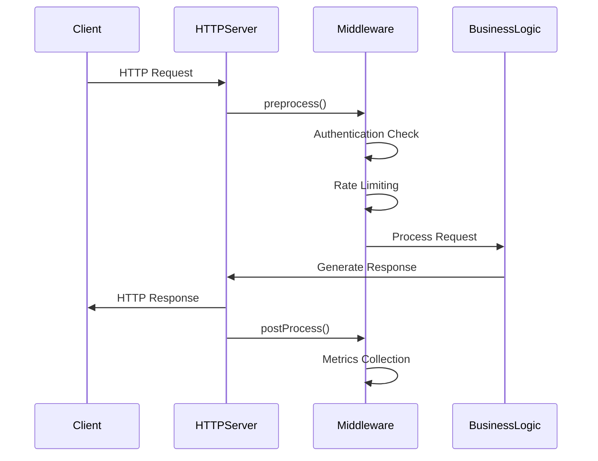

**Diagram sources**
- [plugin/apiserver/httpserver/server.go](file://plugin/apiserver/httpserver/server.go#L150-L674)

### gRPC Protocol Implementation

gRPC servers leverage the Envoy control plane libraries for XDS v3 protocol support, providing efficient binary communication with streaming capabilities.

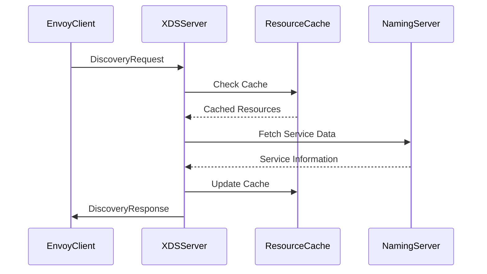

**Diagram sources**
- [plugin/apiserver/xdsserverv3/server.go](file://plugin/apiserver/xdsserverv3/server.go#L150-L483)

### Custom Binary Protocols

Custom binary protocols like Eureka and Nacos implement their own serialization formats and message handling logic while adhering to the same interface contract.

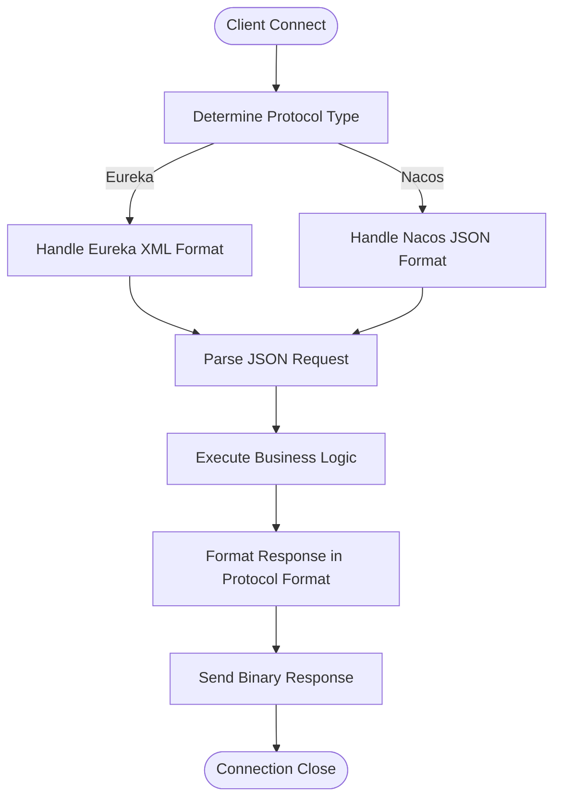

**Diagram sources**
- [plugin/apiserver/eurekaserver/server.go](file://plugin/apiserver/eurekaserver/server.go#L150-L655)
- [plugin/apiserver/nacosserver/server.go](file://plugin/apiserver/nacosserver/server.go)

## Request Routing and Connection Management

Effective request routing and connection management are critical for high-performance API servers. The framework provides built-in mechanisms for handling these concerns across different protocols.

### Connection Management Strategies

The system implements sophisticated connection management with keep-alive support and connection limiting capabilities.

```mermaid
classDiagram
class ConnectionManager {
+NewTcpKeepAliveListener(keepAlivePeriod time.Duration, ln *net.TCPListener) net.Listener
+ParseConnLimitConfig(raw map[interface{}]interface{}) (*Config, error)
+NewListener(ln net.Listener, protocol string, config *Config) (net.Listener, error)
+RemoveLimitListener(protocol string)
}
class ConnLimitConfig {
+OpenConnLimit bool
+MaxConnLimit int
+MaxConnPerHost int
}
ConnectionManager --> ConnLimitConfig : uses
```

**Diagram sources**
- [pkg/common/conn/keepalive/keepalive.go](file://pkg/common/conn/keepalive/keepalive.go)
- [pkg/common/conn/limit/config.go](file://pkg/common/conn/limit/config.go)

Key connection management features include:
- TCP keep-alive with configurable periods
- Connection limiting per host and globally
- Graceful shutdown with timeout handling
- Listener wrapping for enhanced functionality

### Request Routing Mechanisms

Request routing is implemented through a combination of path-based routing and protocol-specific dispatching mechanisms.

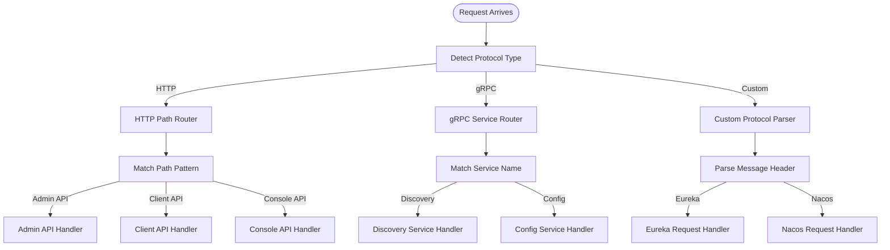

**Section sources**
- [plugin/apiserver/httpserver/server.go](file://plugin/apiserver/httpserver/server.go#L500-L550)
- [plugin/apiserver/xdsserverv3/server.go](file://plugin/apiserver/xdsserverv3/server.go#L200-L250)

## Protocol-Specific Error Handling

Each protocol implementation has specialized error handling mechanisms tailored to its communication patterns and client expectations.

### HTTP Error Handling

HTTP servers use standardized status codes and response formats that align with REST principles.

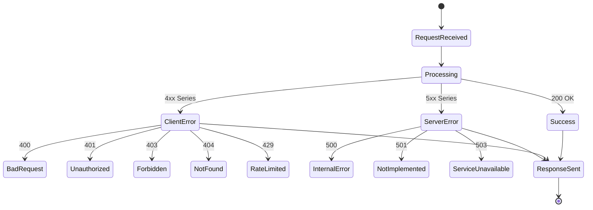

**Diagram sources**
- [plugin/apiserver/httpserver/server.go](file://plugin/apiserver/httpserver/server.go#L600-L650)

### gRPC/XDS Error Handling

gRPC and XDS implementations use protocol-specific error codes and structured error responses.

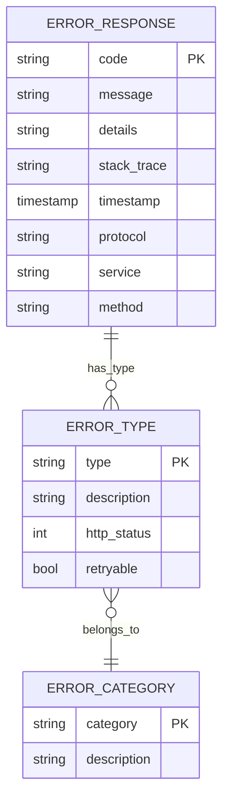

**Diagram sources**
- [plugin/apiserver/xdsserverv3/server.go](file://plugin/apiserver/xdsserverv3/server.go#L300-L350)

## Request Interception and Authentication

The framework provides comprehensive support for request interception and authentication integration across all protocol implementations.

### Interception Pipeline

A standardized interception pipeline is applied to all incoming requests before they reach business logic.


**Section sources**
- [plugin/apiserver/httpserver/server.go](file://plugin/apiserver/httpserver/server.go#L550-L600)
- [plugin/apiserver/eurekaserver/server.go](file://plugin/apiserver/eurekaserver/server.go#L400-L450)

### Authentication Integration

Authentication is implemented through pluggable modules that can be enabled or disabled based on configuration.

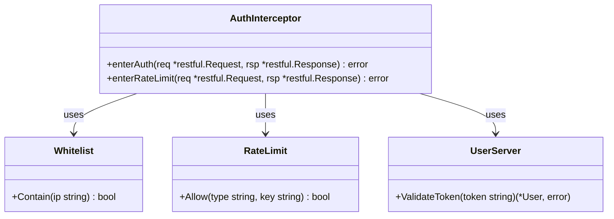

**Diagram sources**
- [plugin/apiserver/httpserver/server.go](file://plugin/apiserver/httpserver/server.go#L550-L600)
- [apis/access_control/auth/api.go](file://apis/access_control/auth/api.go)

## Response Formatting and Performance

Efficient response formatting and performance optimization are critical for high-concurrency scenarios.

### Response Caching

The system implements sophisticated caching mechanisms to reduce latency and improve throughput.

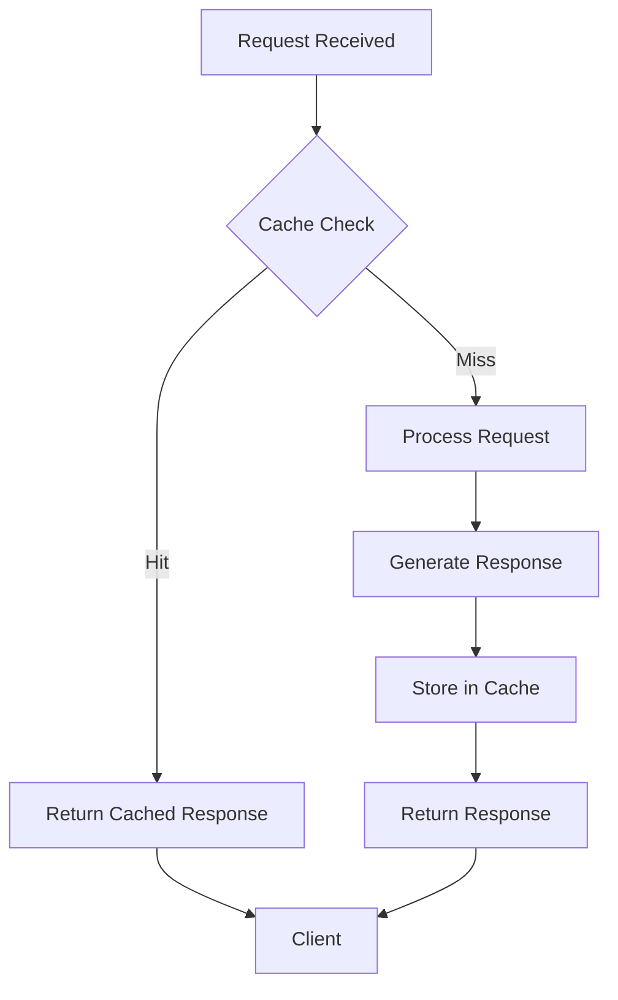

**Section sources**
- [plugin/apiserver/httpserver/server.go](file://plugin/apiserver/httpserver/server.go#L100-L150)
- [plugin/apiserver/xdsserverv3/cache](file://plugin/apiserver/xdsserverv3/cache)

### High-Concurrency Performance

Performance optimizations include connection pooling, request batching, and efficient data structures.

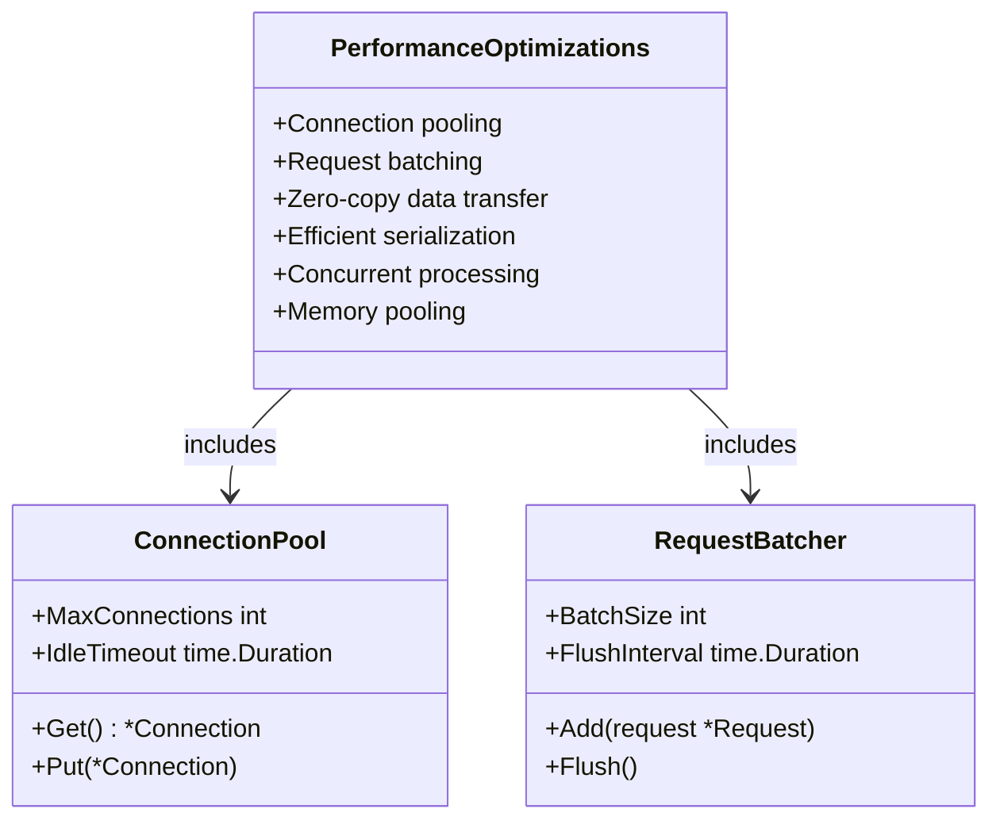

**Diagram sources**
- [pkg/common/conn/limit](file://pkg/common/conn/limit)
- [pkg/service/batch](file://pkg/service/batch)

## Plugin Registration and Configuration

API server plugins are registered and configured through a standardized mechanism that allows for flexible deployment and management.

### Plugin Registration

Plugins are registered in the main plugin.go file using Go's init-time registration pattern.

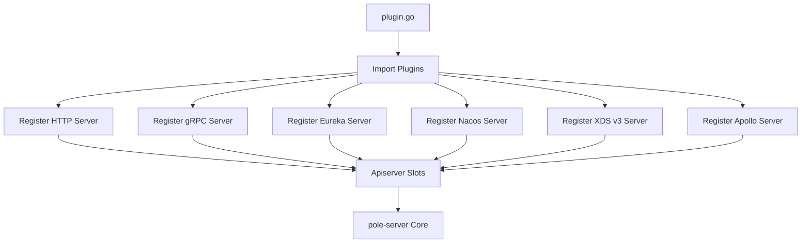

**Diagram sources**
- [plugin.go](file://plugin.go)
- [apis/apiserver/apiserver.go](file://apis/apiserver/apiserver.go)

### Configuration via YAML

Plugins are configured through YAML files that specify protocol-specific options and API endpoints.

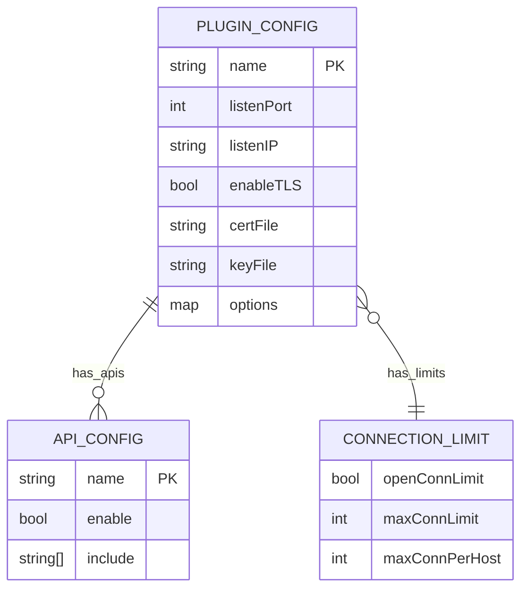

**Section sources**
- [deploy/conf/pole-apiserver.yaml](file://deploy/conf/pole-apiserver.yaml)
- [plugin.go](file://plugin.go)

## Testing Strategies

Comprehensive testing strategies ensure the reliability and performance of API server plugins.

### Integration Testing

Integration tests verify the end-to-end functionality of API servers using mock clients.

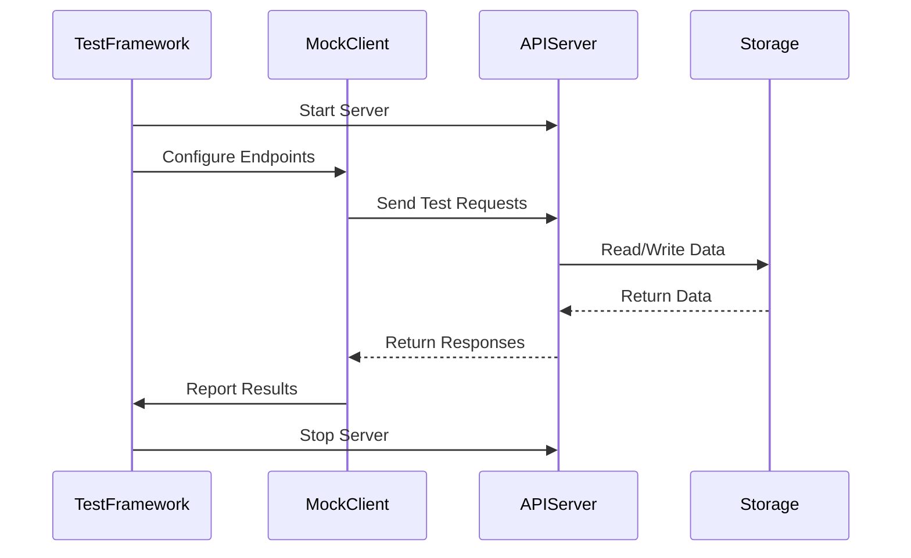

**Diagram sources**
- [test/integrate/http/client.go](file://test/integrate/http/client.go)
- [test/integrate/grpc/client.go](file://test/integrate/grpc/client.go)

### Test Patterns

The testing framework includes patterns for various scenarios including:
- Happy path testing
- Error condition testing
- Performance benchmarking
- Concurrency testing
- Failure recovery testing

**Section sources**
- [test/integrate](file://test/integrate)
- [test/benchmark](file://test/benchmark)

## Conclusion

The API server plugin system in pole-server provides a robust and extensible framework for supporting multiple protocols. By implementing the Apiserver interface contract, developers can create custom protocol handlers that integrate seamlessly with the core system. The architecture supports high-performance scenarios through efficient connection management, request routing, and response caching. Authentication, rate limiting, and other cross-cutting concerns are handled through pluggable modules, ensuring consistent behavior across different protocols. The comprehensive testing framework ensures reliability and performance, making it possible to extend pole-server with custom protocol support while maintaining enterprise-grade quality standards.