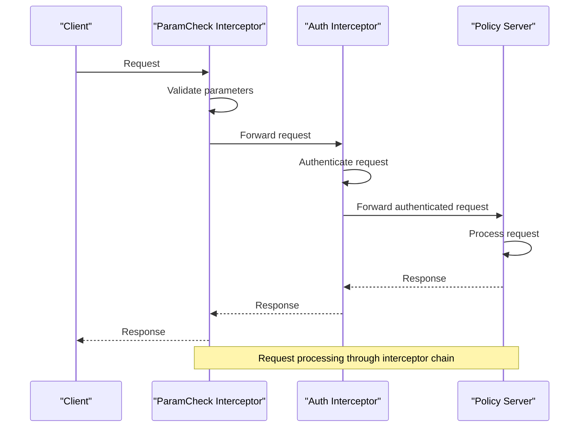
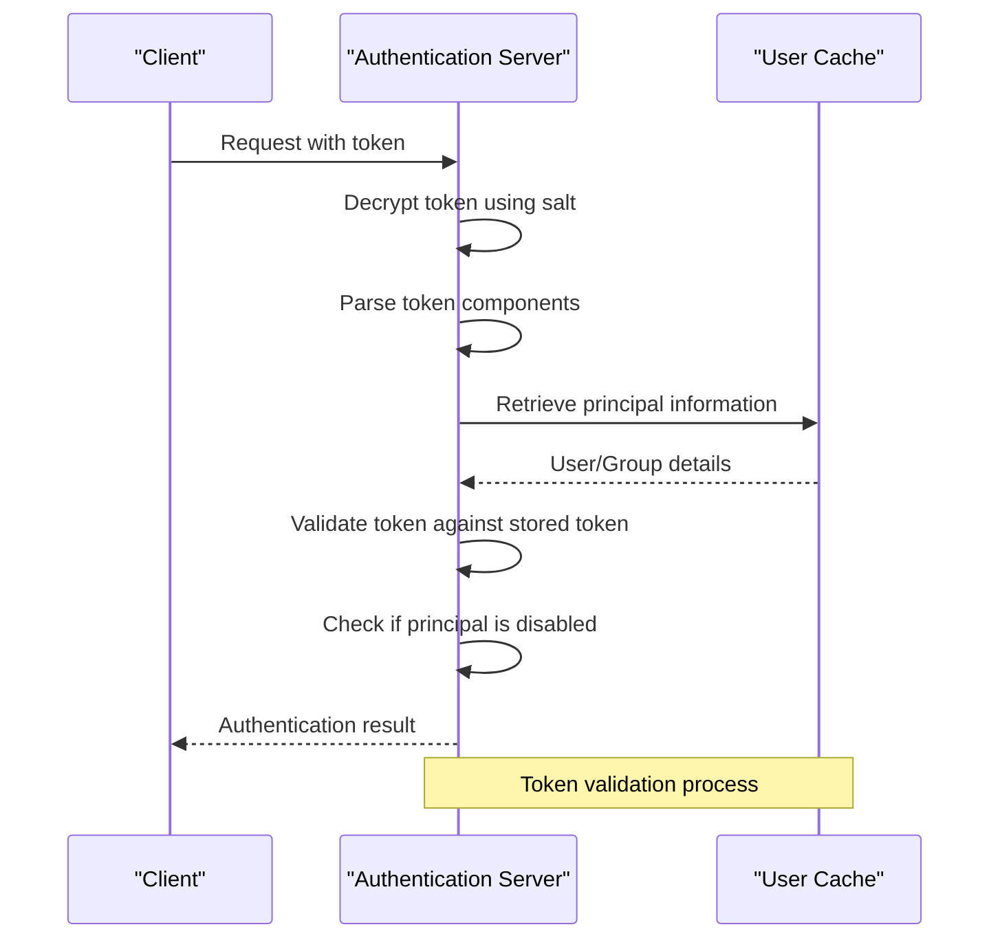
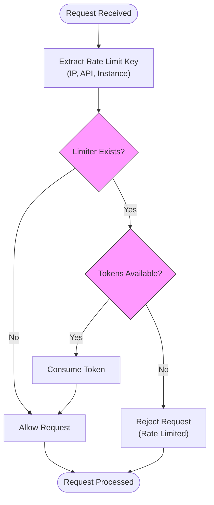
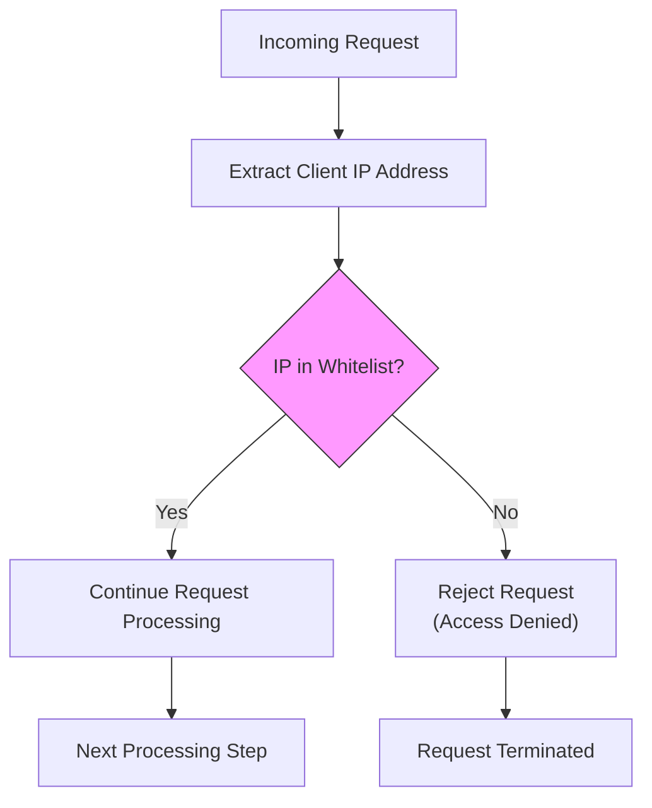
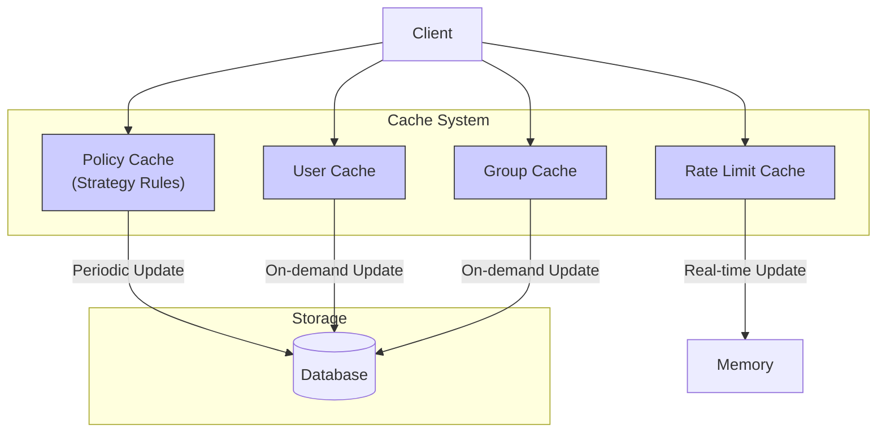

# Access Control Plugins

<cite>
**Referenced Files in This Document**   
- [auth.go](file://apis/access_control/auth/auth.go)
- [ratelimit.go](file://apis/access_control/ratelimit/ratelimit.go)
- [whitelist.go](file://apis/access_control/whitelist/whitelist.go)
- [ip_whitelist.go](file://plugin/access_control/whitelist/ip/ip_whitelist.go)
- [policy.go](file://plugin/access_control/auth/policy/policy.go)
- [server.go](file://plugin/access_control/auth/policy/server.go)
- [token.go](file://plugin/access_control/auth/user/token.go)
- [invoke.go](file://plugin/access_control/ratelimit/token/invoke.go)
- [implement.go](file://plugin/access_control/ratelimit/token/implement.go)
- [container.go](file://pkg/cache/auth/container.go)
- [policy.go](file://pkg/cache/auth/policy.go)
- [default.go](file://pkg/cache/auth/default.go)
- [httpserver/server.go](file://plugin/apiserver/httpserver/server.go)
</cite>

## Table of Contents
1. [Introduction](#introduction)
2. [Authentication and Authorization](#authentication-and-authorization)
3. [Interceptor Pattern in Auth Plugins](#interceptor-pattern-in-auth-plugins)
4. [Token-Based Authentication System](#token-based-authentication-system)
5. [Role-Based Access Control](#role-based-access-control)
6. [Rate Limiting Implementation](#rate-limiting-implementation)
7. [IP Whitelisting and Network-Level Access Control](#ip-whitelisting-and-network-level-access-control)
8. [Combining Multiple Access Control Plugins](#combining-multiple-access-control-plugins)
9. [Performance Implications and Caching Strategies](#performance-implications-and-caching-strategies)
10. [Secure Credential Storage and Rotation](#secure-credential-storage-and-rotation)

## Introduction
This document provides comprehensive coverage of the access control plugins in the Polaris server, focusing on authentication, authorization, rate limiting, and IP whitelisting extensions. The system implements a robust security framework through various plugins that work together to protect resources and ensure proper access control. The architecture follows a plugin-based design where different access control mechanisms can be enabled and configured independently. The core components include authentication plugins for verifying identities, authorization plugins for enforcing access policies, rate limiting plugins for controlling request frequency, and IP whitelisting plugins for network-level access control. These plugins integrate with the main server through well-defined interfaces and are orchestrated through an interceptor pattern that allows for flexible security chain composition.

**Section sources**
- [auth.go](file://apis/access_control/auth/auth.go)
- [ratelimit.go](file://apis/access_control/ratelimit/ratelimit.go)
- [whitelist.go](file://apis/access_control/whitelist/whitelist.go)

## Authentication and Authorization
The authentication and authorization system in Polaris implements a comprehensive security model that verifies identities and enforces access policies. The system distinguishes between authentication (verifying who a user is) and authorization (determining what actions they can perform). Authentication is primarily token-based, where users and groups are issued cryptographic tokens that serve as credentials. These tokens are validated upon each request to ensure the identity of the requester. Authorization is implemented through policy-based access control, where policies define the permissions granted to principals (users or groups) on specific resources. The system supports both allow and deny policies, with deny policies taking precedence over allow policies. Policies can be associated with users, groups, or roles, and can include conditions based on resource metadata. The authorization process evaluates these policies to determine whether a requested operation should be permitted. The system also supports default policies that automatically grant certain permissions to creators of resources, ensuring that users can manage resources they create.

**Section sources**
- [policy.go](file://plugin/access_control/auth/policy/policy.go)
- [server.go](file://plugin/access_control/auth/policy/server.go)
- [auth.go](file://apis/access_control/auth/auth.go)

## Interceptor Pattern in Auth Plugins
The interceptor pattern in auth plugins provides a flexible mechanism for extending and modifying the request processing pipeline. This pattern allows multiple authentication and authorization checks to be chained together, with each interceptor performing a specific security check before passing control to the next interceptor in the chain. The implementation uses a proxy factory pattern where each interceptor wraps the original server implementation and adds its own logic. The chain is constructed during initialization by registering interceptor factories that create the appropriate proxy servers. When a request arrives, it passes through each interceptor in sequence, allowing for layered security checks. For example, a typical chain might include a parameter validation interceptor followed by an authentication interceptor and then an authorization interceptor. Each interceptor can either allow the request to proceed by calling the next interceptor in the chain or terminate the request by returning an error response. This pattern enables modular security implementation where new checks can be added or existing ones modified without changing the core server logic. The order of interceptors is configurable, allowing administrators to define the sequence in which security checks are performed.

**Diagram sources**
- [default.go](file://plugin/access_control/auth/policy/default.go)
- [server.go](file://plugin/access_control/auth/policy/server.go)

**Section sources**
- [default.go](file://plugin/access_control/auth/policy/default.go)
- [server.go](file://plugin/access_control/auth/policy/server.go)

## Token-Based Authentication System
The token-based authentication system in Polaris provides secure identity verification through cryptographically signed tokens. Tokens are created for both individual users and user groups, allowing for flexible identity management. Each token contains encoded information about the principal type (user or group) and the principal ID, which is encrypted using AES encryption with a server-defined salt. The token format follows the pattern "random_string::[uid/user_id | groupid/group_id]", where the random string provides uniqueness and the second part identifies the principal. When a token is presented in a request, the system decrypts it and validates its contents to extract the principal information. The system also verifies that the token is still valid by checking against the current token stored in the cache. If the token has been revoked or the principal has been disabled, the authentication fails. The token system supports both user tokens and group tokens, enabling scenarios where permissions can be granted to entire groups rather than individual users. Token creation and validation are handled by dedicated functions that ensure the cryptographic integrity of the tokens and prevent tampering.

**Diagram sources**
- [token.go](file://plugin/access_control/auth/user/token.go)
- [server.go](file://plugin/access_control/auth/policy/server.go)

**Section sources**
- [token.go](file://plugin/access_control/auth/user/token.go)
- [server.go](file://plugin/access_control/auth/policy/server.go)

## Role-Based Access Control
The role-based access control (RBAC) system in Polaris implements a sophisticated permission model that extends beyond simple user/group permissions. Roles serve as templates for permissions that can be assigned to users or groups, allowing for consistent permission management across multiple principals. The system supports both direct role assignment and role inheritance, enabling complex permission hierarchies. Each role contains a set of permissions that define what operations can be performed on specific resource types. When a user is assigned to a role, they inherit all the permissions associated with that role. The system also supports role conditions, which allow permissions to be granted only when certain criteria are met, such as specific resource metadata or time-based constraints. Role evaluation is integrated with the policy cache, which maintains an optimized representation of role assignments and their associated permissions. This allows for efficient permission checks during request processing. The RBAC system is designed to be extensible, allowing custom role types and evaluation logic to be implemented through the plugin interface.

**Section sources**
- [policy.go](file://plugin/access_control/auth/policy/policy.go)
- [policy.go](file://pkg/cache/auth/policy.go)

## Rate Limiting Implementation
The rate limiting implementation in Polaris uses the token bucket algorithm to control request frequency and prevent abuse. The system supports multiple rate limiting strategies, including IP-based limiting, API endpoint limiting, and instance-level limiting. Each rate limiter maintains a bucket of tokens that are replenished at a configured rate. When a request arrives, the system checks if there are sufficient tokens in the appropriate bucket. If tokens are available, one is consumed and the request is allowed to proceed. If no tokens are available, the request is rejected. The configuration allows for global rate limits as well as per-resource limits, providing fine-grained control over request rates. The system can be configured through both static configuration files and dynamic configuration from a configuration center. The implementation is designed to be efficient, using concurrent data structures to handle high request volumes without significant performance overhead. The rate limiting system is integrated with the main server through a plugin interface, allowing it to be enabled or disabled as needed.

**Diagram sources**
- [invoke.go](file://plugin/access_control/ratelimit/token/invoke.go)
- [implement.go](file://plugin/access_control/ratelimit/token/implement.go)

**Section sources**
- [ratelimit.go](file://apis/access_control/ratelimit/ratelimit.go)
- [invoke.go](file://plugin/access_control/ratelimit/token/invoke.go)
- [implement.go](file://plugin/access_control/ratelimit/token/implement.go)

## IP Whitelisting and Network-Level Access Control
The IP whitelisting system provides network-level access control by restricting access to specific IP addresses or ranges. The implementation is straightforward but effective, maintaining a map of allowed IP addresses that is checked for each incoming request. When a request arrives, the system extracts the client IP address from the connection and checks if it exists in the whitelist. If the IP is not present, the request is immediately rejected with an access denied response. The whitelist can be configured through the plugin configuration, allowing administrators to specify which IP addresses are permitted to access the system. This provides an additional layer of security beyond application-level authentication and authorization, helping to prevent unauthorized access from unknown networks. The system is designed to be efficient, using a simple map lookup to check IP addresses, minimizing the performance impact on request processing. The IP whitelisting plugin can be combined with other access control plugins to create a comprehensive security strategy.

**Diagram sources**
- [ip_whitelist.go](file://plugin/access_control/whitelist/ip/ip_whitelist.go)
- [server.go](file://plugin/apiserver/httpserver/server.go)

**Section sources**
- [whitelist.go](file://apis/access_control/whitelist/whitelist.go)
- [ip_whitelist.go](file://plugin/access_control/whitelist/ip/ip_whitelist.go)

## Combining Multiple Access Control Plugins
The system supports combining multiple access control plugins into a security chain, allowing for layered security enforcement. This approach enables administrators to implement defense in depth by applying multiple security checks to each request. The plugins are executed in a specific order, with each plugin performing its check and either allowing the request to proceed or terminating it with an error response. A typical security chain might include IP whitelisting as the first line of defense, followed by rate limiting to prevent abuse, then authentication to verify identity, and finally authorization to enforce access policies. The order of plugins can be configured based on security requirements, with network-level controls typically applied before application-level controls. The plugin system is designed to be flexible, allowing plugins to be enabled or disabled independently and their configuration modified without affecting other plugins. This modular approach makes it easy to adapt the security configuration to different deployment scenarios and compliance requirements.

**Section sources**
- [server.go](file://plugin/apiserver/httpserver/server.go)
- [auth.go](file://apis/access_control/auth/auth.go)
- [ratelimit.go](file://apis/access_control/ratelimit/ratelimit.go)

## Performance Implications and Caching Strategies
The access control system is designed with performance in mind, using caching strategies to minimize the impact on request processing. The policy cache maintains an in-memory representation of authentication policies, reducing the need for database queries during authorization checks. The cache is updated periodically or when policies change, ensuring that the in-memory representation stays current. The system uses concurrent data structures to allow multiple goroutines to access the cache simultaneously without blocking. For frequently accessed data, such as user and group information, the system maintains dedicated caches that are updated on demand when data is not found. The rate limiting system also uses in-memory data structures to track token buckets, avoiding the overhead of persistent storage for rate limit state. The caching strategy is configurable, allowing administrators to adjust cache sizes and update frequencies based on their performance requirements and resource constraints. These caching mechanisms ensure that access control checks can be performed efficiently even under high request volumes.

**Diagram sources**
- [policy.go](file://pkg/cache/auth/policy.go)
- [container.go](file://pkg/cache/auth/container.go)
- [default.go](file://pkg/cache/auth/default.go)

**Section sources**
- [policy.go](file://pkg/cache/auth/policy.go)
- [container.go](file://pkg/cache/auth/container.go)
- [default.go](file://pkg/cache/auth/default.go)

## Secure Credential Storage and Rotation
The system implements secure credential storage and rotation practices to protect sensitive authentication data. Tokens are stored in an encrypted format using AES encryption with a server-defined salt, preventing unauthorized access to credential information. The token format includes a random component to prevent predictability and replay attacks. The system supports token rotation through a mechanism that allows old tokens to be invalidated and new ones issued. When a user's credentials are updated, the system generates a new token and invalidates the old one, ensuring that compromised credentials can be quickly revoked. The user and group caches maintain the current valid token for each principal, allowing the system to verify that presented tokens match the current valid token. This prevents the use of old or revoked tokens. The system also supports disabling users and groups, which immediately invalidates their tokens and prevents further access. These security measures ensure that credentials are protected both at rest and in transit, and that compromised credentials can be quickly mitigated.

**Section sources**
- [token.go](file://plugin/access_control/auth/user/token.go)
- [server.go](file://plugin/access_control/auth/policy/server.go)
- [user.go](file://pkg/cache/auth/user.go)