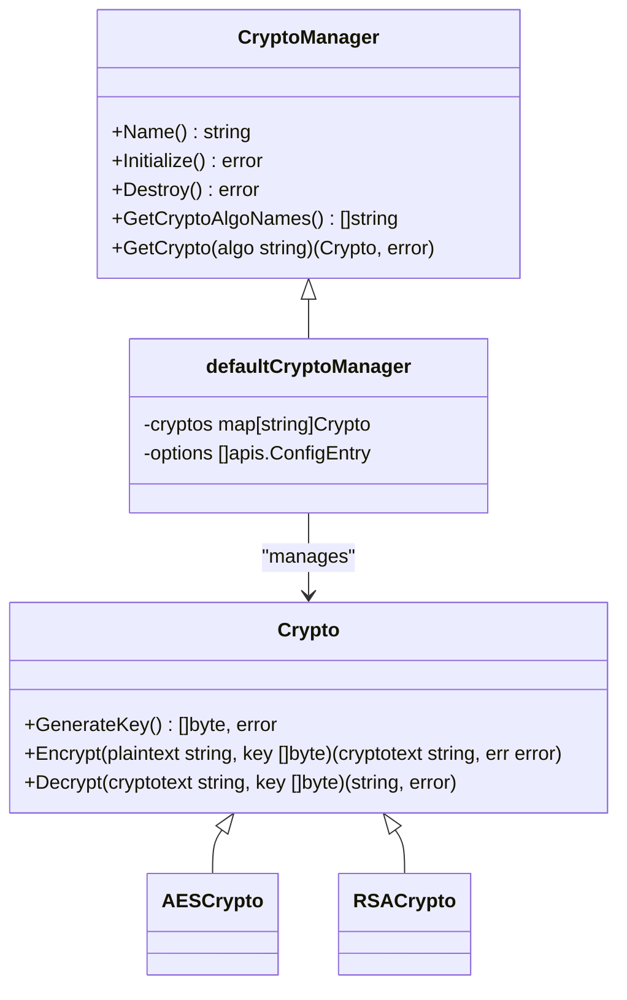
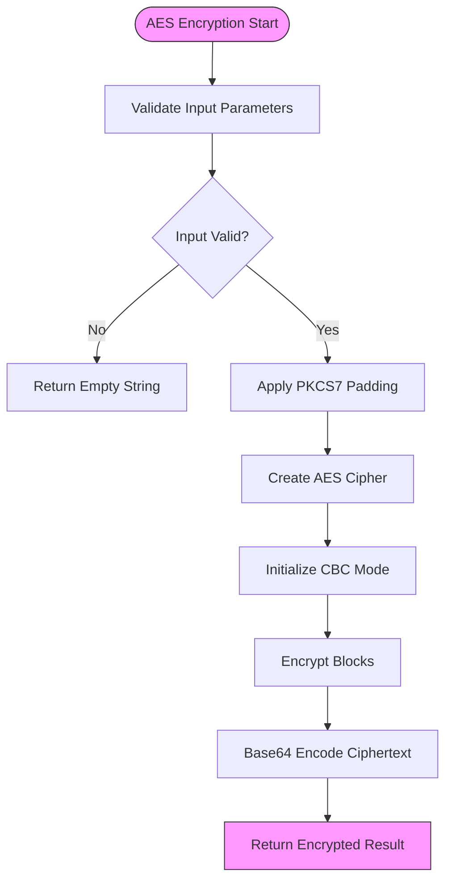
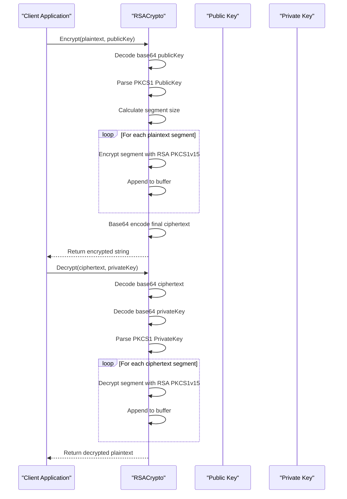
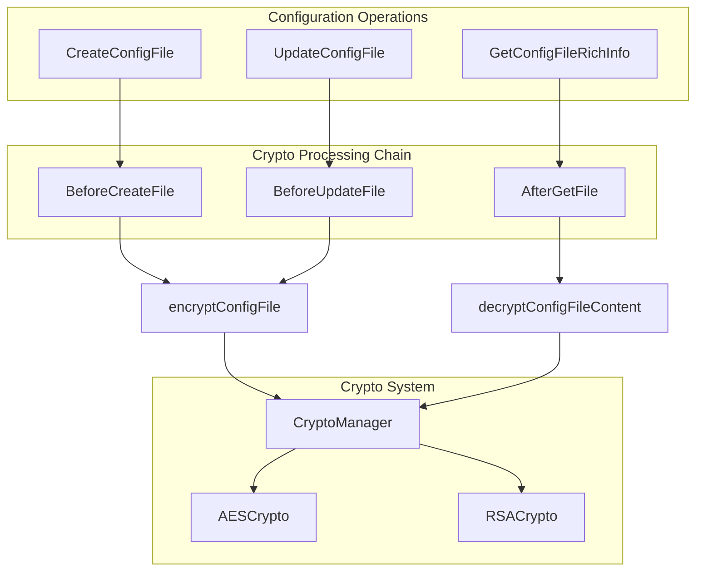

# Crypto Plugins

<cite>
**Referenced Files in This Document**   
- [crypto.go](file://apis/crypto/crypto.go)
- [aes.go](file://plugin/crypto/aes/aes.go)
- [rsa.go](file://plugin/crypto/rsa/rsa.go)
- [config_chain.go](file://pkg/config/config_chain.go)
- [config_file.go](file://pkg/config/config_file.go)
- [server.go](file://pkg/config/server.go)
</cite>

## Table of Contents
1. [Introduction](#introduction)
2. [Cryptographic Interfaces](#cryptographic-interfaces)
3. [Symmetric Encryption with AES](#symmetric-encryption-with-aes)
4. [Asymmetric Encryption with RSA](#asymmetric-encryption-with-rsa)
5. [Key Management Practices](#key-management-practices)
6. [Integration with Configuration Management](#integration-with-configuration-management)
7. [Performance Considerations](#performance-considerations)
8. [Secure Random Number Generation](#secure-random-number-generation)
9. [Extending with Additional Algorithms](#extending-with-additional-algorithms)
10. [Conclusion](#conclusion)

## Introduction
The Crypto Plugins system provides secure data handling capabilities through encryption and decryption extensions. This documentation details the cryptographic interfaces and implementations within the Polaris server architecture, focusing on symmetric encryption using AES for configuration data protection and asymmetric encryption using RSA for secure key exchange. The system is designed to integrate seamlessly with configuration management and authentication systems, ensuring sensitive data remains protected throughout its lifecycle.

**Section sources**
- [crypto.go](file://apis/crypto/crypto.go#L1-L20)

## Cryptographic Interfaces
The cryptographic functionality is defined through a plugin-based interface system that allows for flexible algorithm implementation. The core `Crypto` interface extends the base `Plugin` interface and defines essential cryptographic operations including key generation, encryption, and decryption. This interface is managed by the `CryptoManager`, which handles plugin initialization, lifecycle management, and algorithm registration.

The `CryptoManager` interface provides methods for retrieving available algorithms, obtaining specific cryptographic implementations, and managing the plugin lifecycle. The default implementation `defaultCryptoManager` maintains a registry of available cryptographic algorithms and ensures proper initialization based on configuration entries. Plugins are registered through the `apis.RegisterPlugin` mechanism, allowing dynamic discovery and loading of cryptographic implementations.

**Diagram sources**
- [crypto.go](file://apis/crypto/crypto.go#L25-L124)

**Section sources**
- [crypto.go](file://apis/crypto/crypto.go#L25-L124)

## Symmetric Encryption with AES
The AES implementation provides symmetric encryption capabilities for protecting configuration data. The `AESCrypto` struct implements the `Crypto` interface using AES encryption in CBC mode with PKCS7 padding. Each encryption operation generates a ciphertext that is base64-encoded for safe transmission and storage.

The implementation follows a standard AES-CBC workflow: the plaintext is padded using PKCS7 padding to align with the block size, then encrypted using a cipher block chaining mode with the provided key. The first 16 bytes of the key are used as the initialization vector (IV). During decryption, the process is reversed: the base64-encoded ciphertext is decoded, decrypted using the CBC decrypter, and unpadded to recover the original plaintext.

Key operations include:
- **GenerateKey**: Creates a 16-byte random key using cryptographically secure random number generation
- **Encrypt**: Performs AES-CBC encryption with PKCS7 padding and base64 encoding
- **Decrypt**: Handles base64 decoding, AES-CBC decryption, and PKCS7 unpadding

**Diagram sources**
- [aes.go](file://plugin/crypto/aes/aes.go#L57-L147)

**Section sources**
- [aes.go](file://plugin/crypto/aes/aes.go#L1-L149)

## Asymmetric Encryption with RSA
The RSA implementation provides asymmetric encryption capabilities primarily for secure key exchange scenarios. The `RSACrypto` struct implements the `Crypto` interface using RSA PKCS1v15 padding for both encryption and decryption operations. Unlike the AES implementation, the RSA plugin is designed to work with RSA key pairs where the public key encrypts data and the private key decrypts it.

The implementation handles large plaintexts by segmenting them into chunks that fit within the RSA modulus size (key size minus 11 bytes for PKCS1v15 padding). Each segment is encrypted separately and concatenated into a single ciphertext, which is then base64-encoded. During decryption, the process is reversed: the ciphertext is decoded, segmented according to the key size, and each segment is decrypted individually before being combined into the final plaintext.

Key operations include:
- **GenerateKey**: Creates a 16-byte random key (note: this appears to be a placeholder as true RSA key generation is provided separately)
- **Encrypt**: Segments plaintext, applies RSA PKCS1v15 encryption to each segment, and base64-encodes the result
- **Decrypt**: Base64-decodes ciphertext, segments by key size, applies RSA PKCS1v15 decryption, and combines results
- **GenerateRSAKey**: Generates a complete RSA key pair with 1024-bit keys, returning both public and private keys in base64-encoded PKCS1 format

**Diagram sources**
- [rsa.go](file://plugin/crypto/rsa/rsa.go#L57-L156)

**Section sources**
- [rsa.go](file://plugin/crypto/rsa/rsa.go#L1-L158)

## Key Management Practices
The system implements comprehensive key management practices to ensure cryptographic security. Key generation is performed using cryptographically secure random number generators from Go's `crypto/rand` package, ensuring high entropy for generated keys. For AES, 16-byte keys are generated, while RSA uses 1024-bit key pairs generated through the `rsa.GenerateKey` function.

Keys are managed through metadata attached to configuration entities. When a configuration file is encrypted, the encryption algorithm and base64-encoded data key are stored in the metadata map using predefined constants:
- `MetaKeyConfigFileDataKey`: Stores the base64-encoded encryption key
- `MetaKeyConfigFileEncryptAlgo`: Specifies the encryption algorithm used
- `MetaKeyConfigFileUseEncrypted`: Flags that the content is encrypted

The key lifecycle is managed through the `CryptoConfigFileChain` which handles encryption before configuration creation/update and decryption after retrieval. When a configuration is updated with a different encryption algorithm, a new data key is generated. The system also provides mechanisms to clean encryption metadata when encryption is disabled for a configuration.

**Section sources**
- [config_chain.go](file://pkg/config/config_chain.go#L50-L150)
- [server.go](file://pkg/config/server.go#L150-L180)

## Integration with Configuration Management
The cryptographic system is tightly integrated with the configuration management subsystem through the `CryptoConfigFileChain` implementation. This chain is part of the configuration processing pipeline and automatically handles encryption and decryption of configuration content during CRUD operations.

When a configuration file is created or updated with encryption enabled, the `BeforeCreateFile` and `BeforeUpdateFile` methods automatically encrypt the content using the specified algorithm and store the encryption key in metadata. Conversely, when configuration data is retrieved through `AfterGetFile`, `AfterGetFileRelease`, or `AfterGetFileHistory` methods, the content is automatically decrypted if encryption metadata is present.

The integration is configured during server initialization in the `initialize` method of the `Server` struct, where the `CryptoManager` is retrieved and the `CryptoConfigFileChain` is added to the processing chains. Configuration endpoints like `CreateConfigFile`, `UpdateConfigFile`, and `GetConfigFileRichInfo` transparently handle encrypted data through this chain-based architecture.

**Diagram sources**
- [config_chain.go](file://pkg/config/config_chain.go#L50-L150)
- [config_file.go](file://pkg/config/config_file.go#L500-L550)

**Section sources**
- [config_chain.go](file://pkg/config/config_chain.go#L1-L328)
- [config_file.go](file://pkg/config/config_file.go#L1-L565)
- [server.go](file://pkg/config/server.go#L1-L327)

## Performance Considerations
The cryptographic implementations are designed with performance at scale in mind. The AES implementation uses efficient block cipher operations with minimal memory allocation, while the RSA implementation handles large payloads through segmentation to avoid memory overhead.

For high-throughput scenarios, the system architecture allows for algorithm selection based on performance requirements:
- **AES**: Preferred for bulk data encryption due to its speed and efficiency
- **RSA**: Used for key exchange and small payload encryption due to its asymmetric nature

The plugin-based architecture enables easy replacement or addition of cryptographic algorithms without modifying the core system. The `CryptoManager` maintains a registry of algorithms, allowing runtime selection based on configuration. This design supports performance optimization by enabling the use of hardware-accelerated cryptographic implementations when available.

The system also minimizes cryptographic operations through intelligent caching. Configuration data is decrypted only when retrieved and can be cached in decrypted form when appropriate, reducing the computational overhead of repeated decryption operations.

**Section sources**
- [crypto.go](file://apis/crypto/crypto.go#L1-L124)
- [aes.go](file://plugin/crypto/aes/aes.go#L1-L149)
- [rsa.go](file://plugin/crypto/rsa/rsa.go#L1-L158)

## Secure Random Number Generation
The system relies on Go's `crypto/rand` package for cryptographically secure random number generation, which interfaces with the operating system's entropy source. This ensures that generated keys have sufficient entropy and are resistant to prediction attacks.

Both the AES and RSA implementations use `crypto/rand.Read` to generate random bytes for key material. The AES implementation generates 16-byte keys directly from the secure random source, while the RSA implementation uses `crypto/rand.Reader` as the source for key generation.

The secure random number generator is also used in other parts of the system, such as in the `scalable_rand` package which provides a thread-safe random number generator for non-cryptographic purposes. However, for cryptographic operations, the system exclusively uses the `crypto/rand` package to ensure security.

**Section sources**
- [aes.go](file://plugin/crypto/aes/aes.go#L75-L80)
- [rsa.go](file://plugin/crypto/rsa/rsa.go#L140-L145)
- [scalable_rand.go](file://pkg/common/syncs/srand/scalable_rand.go#L1-L56)

## Extending with Additional Algorithms
The plugin architecture allows for easy extension with additional cryptographic algorithms such as ChaCha20 or ECDSA. New algorithms can be implemented by creating a struct that satisfies the `Crypto` interface and registering it with the plugin system.

To implement a new algorithm:
1. Create a struct that implements the `Crypto` interface methods
2. Register the implementation using `apis.RegisterPlugin` with a unique name
3. Configure the plugin in the system configuration to make it available

For example, implementing ChaCha20 would follow the same pattern as AES but using the `crypto/chacha20` package, while ECDSA would follow the RSA pattern but using elliptic curve cryptography from `crypto/ecdsa`. The plugin system automatically handles initialization, lifecycle management, and integration with the configuration management system.

The extensibility is demonstrated by the existing AES and RSA implementations, both of which follow the same plugin registration pattern while providing different cryptographic capabilities.

**Section sources**
- [crypto.go](file://apis/crypto/crypto.go#L25-L124)
- [aes.go](file://plugin/crypto/aes/aes.go#L1-L149)
- [rsa.go](file://plugin/crypto/rsa/rsa.go#L1-L158)

## Conclusion
The Crypto Plugins system provides a robust, extensible framework for secure data handling in the Polaris server. By implementing a plugin-based architecture with well-defined interfaces, the system supports both symmetric and asymmetric encryption algorithms while allowing for future expansion. The integration with configuration management ensures that sensitive data is protected throughout its lifecycle, from creation to retrieval. The design prioritizes security through the use of established cryptographic standards and secure random number generation, while maintaining performance through efficient implementations and intelligent caching strategies.