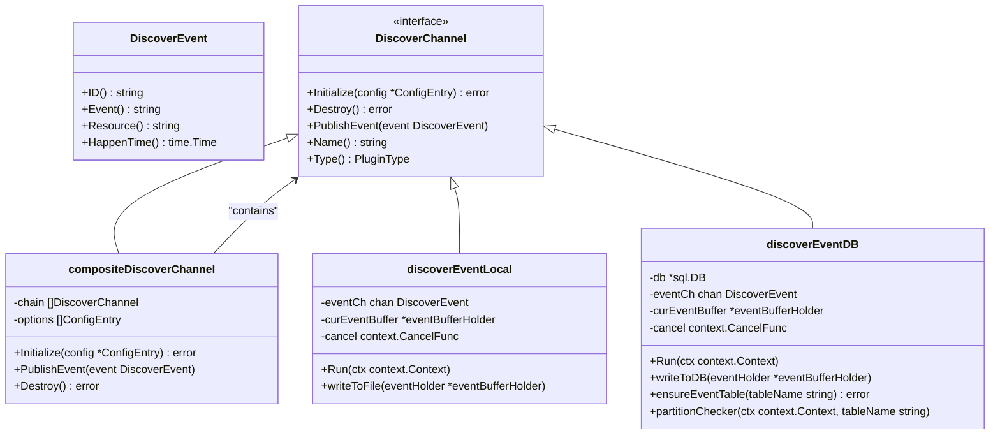
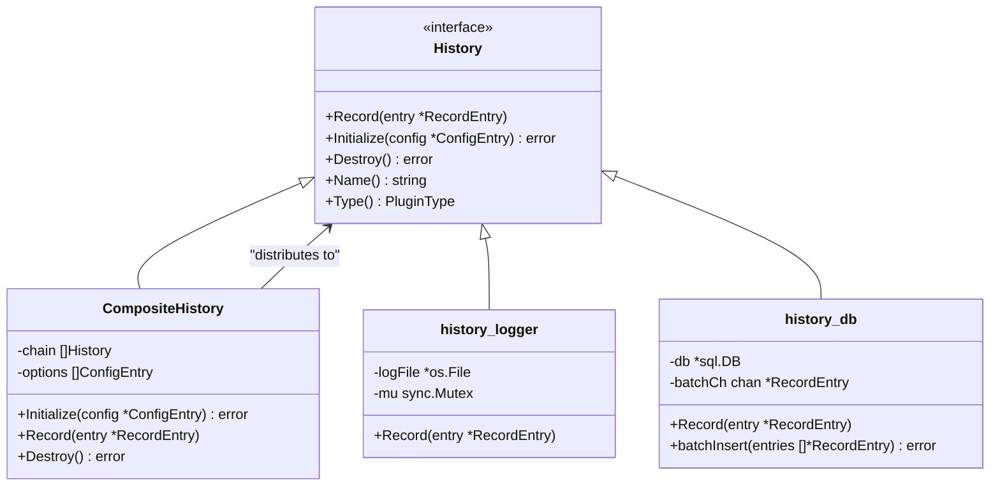
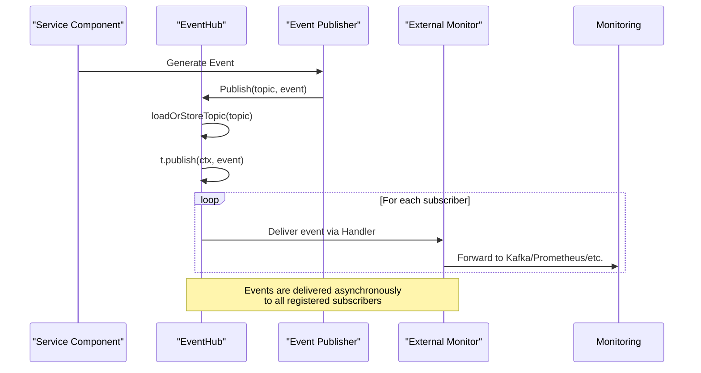
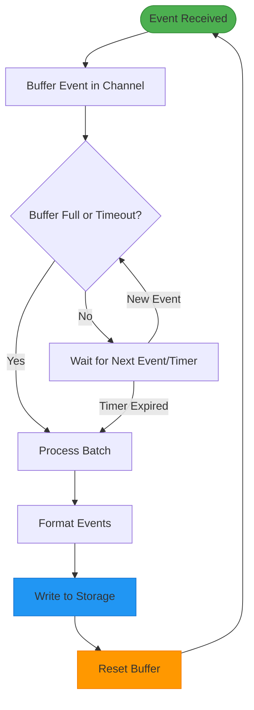
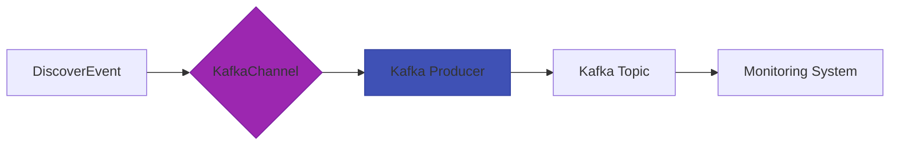
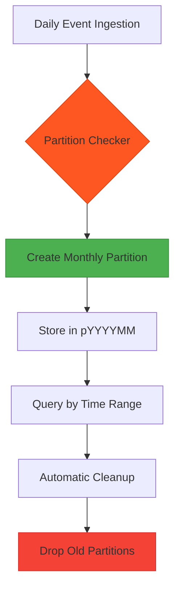

# Observability Plugins

<cite>
**Referenced Files in This Document**   
- [discoverevent.go](file://apis/observability/event/discoverevent.go)
- [history.go](file://apis/observability/history/history.go)
- [statis.go](file://apis/observability/statis/statis.go)
- [eventhub.go](file://pkg/common/eventhub/eventhub.go)
- [types.go](file://pkg/common/eventhub/types.go)
- [event_local.go](file://plugin/observability/discoverevent/logger/event_local.go)
- [event_db.go](file://plugin/observability/discoverevent/rds/event_db.go)
- [history_logger.go](file://plugin/observability/history/logger/history_logger.go)
- [history_db.go](file://plugin/observability/history/rds/history_db.go)
- [statis.go](file://plugin/observability/statis/prometheus/statis.go)
- [base_worker.go](file://plugin/observability/statis/base/base_worker.go)
</cite>

## Table of Contents
1. [Introduction](#introduction)
2. [Event Publishing with DiscoverEvent Plugins](#event-publishing-with-discoverevent-plugins)
3. [Metrics Collection Framework](#metrics-collection-framework)
4. [Operational History Extensions](#operational-history-extensions)
5. [Integration with External Monitoring Systems](#integration-with-external-monitoring-systems)
6. [Performance Considerations](#performance-considerations)
7. [Plugin Implementation Examples](#plugin-implementation-examples)
8. [Data Retention and Partitioning](#data-retention-and-partitioning)
9. [Conclusion](#conclusion)

## Introduction
The Observability Plugins system in the Polaris server provides a modular framework for event publishing, metrics collection, and operational history tracking. This document details the architecture and implementation of observability components, focusing on extensibility, integration capabilities, and performance optimization. The system leverages a plugin-based design to support multiple backends for event storage, metrics export, and audit logging, enabling seamless integration with external monitoring ecosystems.

## Event Publishing with DiscoverEvent Plugins

The DiscoverEvent system enables service discovery event publishing through pluggable channels. It uses a composite pattern to route events to multiple subscribers simultaneously, supporting both local logging and database persistence.



**Diagram sources**
- [discoverevent.go](file://apis/observability/event/discoverevent.go#L30-L130)
- [event_local.go](file://plugin/observability/discoverevent/logger/event_local.go#L40-L230)
- [event_db.go](file://plugin/observability/discoverevent/rds/event_db.go#L40-L358)

**Section sources**
- [discoverevent.go](file://apis/observability/event/discoverevent.go#L1-L130)
- [event_local.go](file://plugin/observability/discoverevent/logger/event_local.go#L1-L230)
- [event_db.go](file://plugin/observability/discoverevent/rds/event_db.go#L1-L358)

## Metrics Collection Framework

The metrics collection system provides a unified interface for reporting service call metrics, discovery metrics, and configuration center metrics. It supports multiple exporters through a composite pattern, with built-in support for Prometheus and local metrics.

```mermaid
classDiagram
class Statis {
<<interface>>
+ReportCallMetrics(metric CallMetric)
+ReportDiscoveryMetrics(metric ...DiscoveryMetric)
+ReportConfigMetrics(metric ...ConfigMetrics)
+ReportDiscoverCall(metric ClientDiscoverMetric)
+Initialize(config *ConfigEntry) error
+Destroy() error
+Name() string
+Type() PluginType
}
class compositeStatis {
-chain []Statis
-options []ConfigEntry
+Initialize(config *ConfigEntry) error
+ReportCallMetrics(metric CallMetric)
+ReportDiscoveryMetrics(metric ...DiscoveryMetric)
+ReportConfigMetrics(metric ...ConfigMetrics)
+ReportDiscoverCall(metric ClientDiscoverMetric)
+Destroy() error
}
class PrometheusStatis {
-registry *prometheus.Registry
-callCounter prometheus.Counter
-discoveryGauge prometheus.Gauge
+Initialize(config *ConfigEntry) error
+ReportCallMetrics(metric CallMetric)
+ReportDiscoveryMetrics(metric ...DiscoveryMetric)
}
class LocalStatis {
-metricsStore map[string]interface{}
-mu sync.RWMutex
+ReportCallMetrics(metric CallMetric)
+ReportDiscoveryMetrics(metric ...DiscoveryMetric)
}
Statis <|-- compositeStatis
Statis <|-- PrometheusStatis
Statis <|-- LocalStatis
compositeStatis --> Statis : "delegates to"
```

**Diagram sources**
- [statis.go](file://apis/observability/statis/statis.go#L30-L160)
- [statis.go](file://plugin/observability/statis/prometheus/statis.go#L1-L100)
- [base_worker.go](file://plugin/observability/statis/base/base_worker.go#L1-L50)

**Section sources**
- [statis.go](file://apis/observability/statis/statis.go#L1-L160)

## Operational History Extensions

The history logging system provides audit trail capabilities through pluggable history recorders. It supports multiple storage backends and uses a composite pattern to distribute records to all configured plugins.



**Diagram sources**
- [history.go](file://apis/observability/history/history.go#L30-L108)
- [history_logger.go](file://plugin/observability/history/logger/history_logger.go#L1-L80)
- [history_db.go](file://plugin/observability/history/rds/history_db.go#L1-L120)

**Section sources**
- [history.go](file://apis/observability/history/history.go#L1-L108)

## Integration with External Monitoring Systems

The observability system integrates with external monitoring through the eventhub subsystem, which provides publish-subscribe capabilities for various event types. This enables real-time event forwarding to message queues and external monitoring services.



**Diagram sources**
- [eventhub.go](file://pkg/common/eventhub/eventhub.go#L50-L153)
- [types.go](file://pkg/common/eventhub/types.go#L10-L77)

**Section sources**
- [eventhub.go](file://pkg/common/eventhub/eventhub.go#L1-L153)
- [types.go](file://pkg/common/eventhub/types.go#L1-L77)

## Performance Considerations

The observability system implements several performance optimizations for handling high-volume event streams, including buffered writes, batch processing, and concurrent event handling.



Key performance features:
- **Buffered Channels**: Events are written to buffered channels to prevent blocking producers
- **Batch Processing**: Events are processed in batches to reduce I/O operations
- **Concurrent Handlers**: Multiple goroutines handle event processing
- **Memory Pooling**: Buffer holders are pooled to reduce GC pressure
- **Asynchronous Delivery**: Event delivery does not block the publisher

**Section sources**
- [event_local.go](file://plugin/observability/discoverevent/logger/event_local.go#L100-L230)
- [event_db.go](file://plugin/observability/discoverevent/rds/event_db.go#L150-L358)

## Plugin Implementation Examples

### Custom Event Channel for Kafka
To implement a custom event channel that forwards discover events to Kafka:

1. Implement the `DiscoverChannel` interface
2. Configure Kafka producer in `Initialize`
3. Serialize events and send to Kafka in `PublishEvent`
4. Handle connection lifecycle in `Destroy`



### Prometheus Metrics Exporter
The built-in Prometheus exporter automatically exposes metrics endpoints and registers collectors for various metric types, enabling seamless integration with Prometheus monitoring stacks.

**Section sources**
- [eventhub.go](file://pkg/common/eventhub/eventhub.go#L1-L153)
- [statis.go](file://apis/observability/statis/statis.go#L1-L160)

## Data Retention and Partitioning

The database-backed observability plugins implement automated data retention and partitioning strategies to manage storage growth and query performance.



The `discoverEventDB` plugin automatically:
- Creates table partitions by month
- Schedules daily partition creation for future months
- Uses `RANGE COLUMNS` partitioning on `happen_time`
- Implements `INSERT IGNORE` to prevent duplicates
- Supports configurable retention policies

**Section sources**
- [event_db.go](file://plugin/observability/discoverevent/rds/event_db.go#L250-L358)

## Conclusion
The Observability Plugins system provides a comprehensive framework for monitoring, metrics collection, and audit logging in the Polaris server. By leveraging a plugin architecture with composite patterns, it enables flexible integration with various external systems while maintaining high performance through buffered processing and batch operations. The integration with the eventhub system allows for real-time event distribution, making it suitable for large-scale deployments with demanding observability requirements.