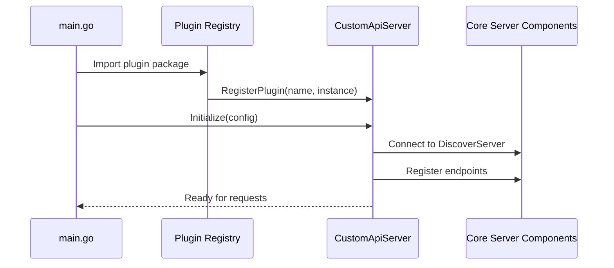
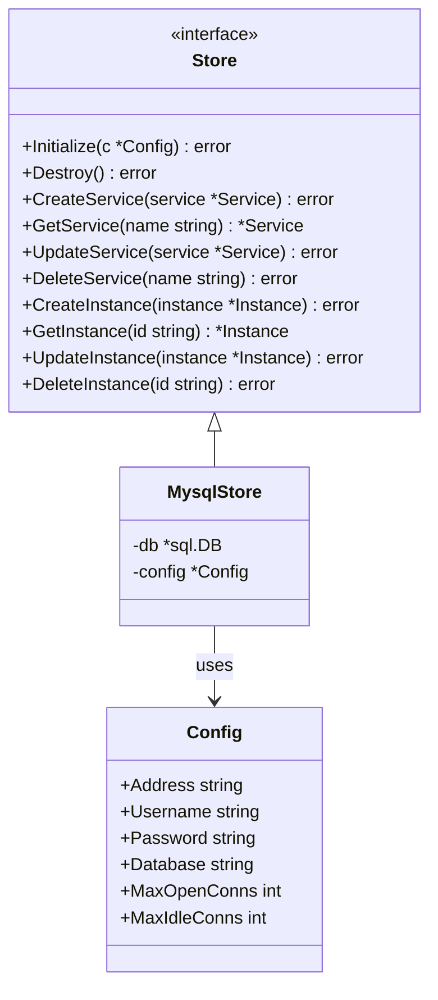
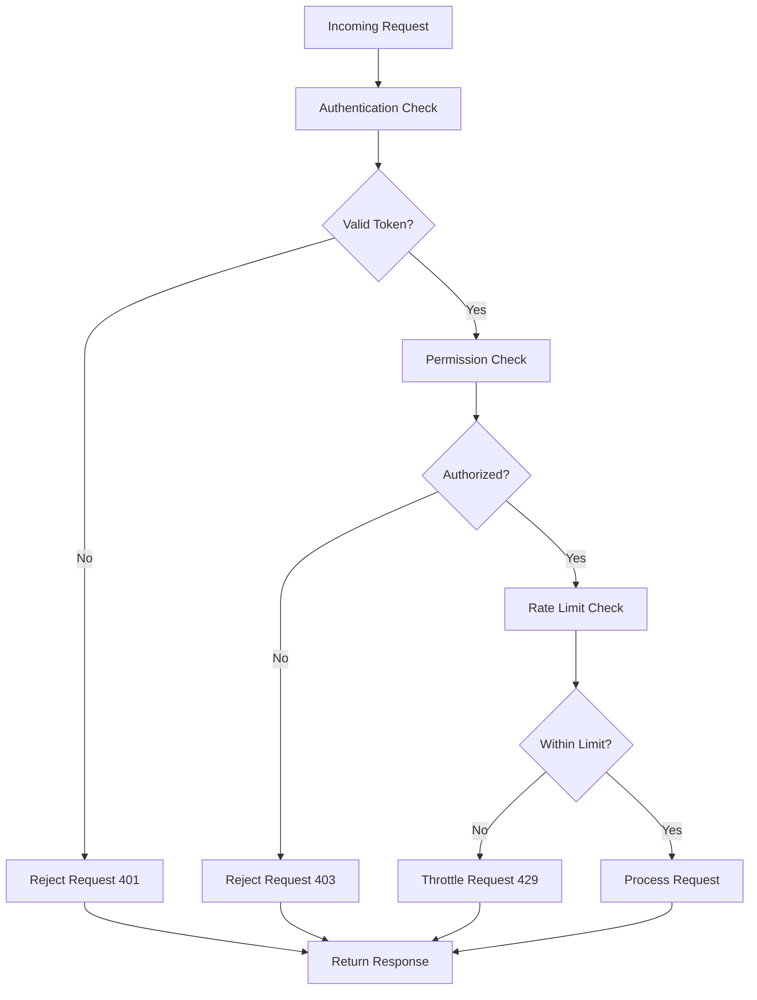

# Plugin Development

<cite>
**Referenced Files in This Document**   
- [plugin.go](file://plugin.go)
- [apis/plugin.go](file://apis/plugin.go)
- [apis/apiserver/apiserver.go](file://apis/apiserver/apiserver.go)
- [apis/access_control/auth/api.go](file://apis/access_control/auth/api.go)
- [apis/store/api.go](file://apis/store/api.go)
- [pkg/admin/server.go](file://pkg/admin/server.go)
- [pkg/config/server.go](file://pkg/config/server.go)
- [pkg/service/server.go](file://pkg/service/server.go)
- [pkg/goverrule/server.go](file://pkg/goverrule/server.go)
- [pkg/namespace/server.go](file://pkg/namespace/server.go)
- [test/suit/plugin.go](file://test/suit/plugin.go)
</cite>

## Table of Contents
1. [Plugin Architecture and Lifecycle Management](#plugin-architecture-and-lifecycle-management)
2. [Implementing Custom API Servers](#implementing-custom-api-servers)
3. [Creating Storage Plugins](#creating-storage-plugins)
4. [Developing Access Control Plugins](#developing-access-control-plugins)
5. [Example: Implementing a Simple Plugin](#example-implementing-a-simple-plugin)
6. [Build, Loading, and Configuration](#build-loading-and-configuration)
7. [Testing Strategies](#testing-strategies)
8. [Plugin Isolation and Error Handling](#plugin-isolation-and-error-handling)
9. [Performance Considerations](#performance-considerations)
10. [Debugging Tips and Best Practices](#debugging-tips-and-best-practices)

## Plugin Architecture and Lifecycle Management

The pole-server plugin system is designed around a modular interface-based architecture that enables extensibility across multiple functional domains. Plugins are registered through a global plugin registry that categorizes them by type and manages their lifecycle. Each plugin must implement the `Plugin` interface defined in `apis/plugin.go`, which includes three core methods: `Initialize`, `Destroy`, and `Type`.

Plugins are registered at startup via import-side effects in the main `plugin.go` file, where blank imports trigger initialization of plugin packages. The plugin system supports several types including `PluginTypeApiServer`, `PluginTypeStore`, `PluginTypeRateLimit`, `PluginTypeResourceAuth`, `PluginTypeCMDB`, `PluginTypeCrypto`, and observability-related plugins such as `PluginTypeStatis` and `PluginTypeHistory`.

The lifecycle begins with configuration parsing from YAML files (e.g., `pole-server.yaml`), followed by `Initialize` calls that receive configuration entries containing name and option parameters. During shutdown, the `Destroy` method is invoked to release resources. Plugin instances are stored in a global `pluginSet` map indexed by plugin type and name, ensuring singleton behavior within each category.

```mermaid
classDiagram
class Plugin {
<<interface>>
+Name() string
+Initialize(c *ConfigEntry) error
+Destroy() error
+Type() PluginType
}
class ConfigEntry {
+Name string
+Option map[string]interface{}
}
class Config {
+CMDB ConfigEntry
+RateLimit ConfigEntry
+History PluginChanConfig
+Statis PluginChanConfig
+DiscoverEvent PluginChanConfig
+Crypto PluginChanConfig
}
class PluginChanConfig {
+Name string
+Option map[string]interface{}
+Entries []ConfigEntry
}
Plugin <|-- ApiServerPlugin
Plugin <|-- StoragePlugin
Plugin <|-- RateLimitPlugin
Plugin <|-- AuthPlugin
ConfigEntry --> PluginChanConfig : contains
```

**Diagram sources**
- [apis/plugin.go](file://apis/plugin.go#L46-L48)
- [apis/plugin.go](file://apis/plugin.go#L80-L113)

**Section sources**
- [apis/plugin.go](file://apis/plugin.go#L0-L113)
- [plugin.go](file://plugin.go#L0-L54)

## Implementing Custom API Servers

To implement custom API servers supporting new protocols, developers must create plugins that conform to the `PluginTypeApiServer` type and implement the server logic by integrating with the existing API framework. The entry point is defined in `apis/apiserver/apiserver.go`, where the `API` field in the configuration maps endpoint names to their respective configurations.

Custom API servers should implement protocol-specific handlers (e.g., gRPC, HTTP, WebSocket) while leveraging the core service discovery and governance features. For example, the `grpcserver`, `httpserver`, `eurekaserver`, `nacosserver`, and `xdsserverv3` plugins demonstrate how different protocols can be supported through separate implementations under the same plugin architecture.

The `Initialize` method receives context and configuration options, allowing the server to bind to specific addresses, configure middleware, and register route handlers. These servers typically interact with core services such as `DiscoverServer`, `ConfigServer`, and `HealthCheckServer` through dependency injection during initialization.



**Diagram sources**
- [apis/apiserver/apiserver.go](file://apis/apiserver/apiserver.go#L37)
- [plugin.go](file://plugin.go#L30-L35)

**Section sources**
- [apis/apiserver/apiserver.go](file://apis/apiserver/apiserver.go#L0-L100)
- [plugin.go](file://plugin.go#L30-L35)

## Creating Storage Plugins

Storage plugins enable integration with alternative databases by implementing the `PluginTypeStore` interface. The storage layer abstraction allows pole-server to support multiple persistence backends while maintaining consistent data access patterns across components.

Plugins must implement the `store.Store` interface defined in `apis/store/api.go`, which includes methods for CRUD operations on various entity types such as services, instances, configurations, and namespaces. The `Initialize` method receives a `*Config` parameter containing database connection details and options, while `Destroy` handles graceful disconnection.

The MySQL storage plugin (`plugin/store/mysql`) serves as a reference implementation, demonstrating how to map domain entities to relational tables, manage transactions, and optimize queries. Key considerations include connection pooling, query optimization, indexing strategies, and handling schema migrations.



**Diagram sources**
- [apis/store/api.go](file://apis/store/api.go#L32-L34)
- [plugin/store/mysql](file://plugin/store/mysql)

**Section sources**
- [apis/store/api.go](file://apis/store/api.go#L0-L50)
- [plugin/store/mysql](file://plugin/store/mysql)

## Developing Custom Access Control Plugins

Access control plugins provide authentication, authorization, and rate limiting capabilities through two main plugin types: `PluginTypeResourceAuth` for authentication/authorization and `PluginTypeRateLimit` for rate limiting.

Authentication plugins (e.g., `plugin/access_control/auth/user`) implement user management, token validation, and role-based access control. They integrate with the core `UserServer` and `StrategyServer` interfaces, providing methods to validate credentials and check permissions. The `Initialize` method typically sets up connections to identity providers or credential stores.

Rate limiting plugins (e.g., `plugin/access_control/ratelimit/token`) implement token bucket or sliding window algorithms to control request rates. These plugins receive configuration specifying limits per service, namespace, or API endpoint. They integrate with request processing chains to intercept and evaluate incoming requests before they reach business logic.



**Diagram sources**
- [apis/access_control/auth/api.go](file://apis/access_control/auth/api.go#L49-L99)
- [plugin/access_control/ratelimit/token](file://plugin/access_control/ratelimit/token)

**Section sources**
- [apis/access_control/auth/api.go](file://apis/access_control/auth/api.go#L0-L100)
- [plugin/access_control/ratelimit/token](file://plugin/access_control/ratelimit/token)

## Example: Implementing a Simple Plugin

To implement a simple plugin, follow these steps:

1. Create a new package under the `plugin/` directory (e.g., `plugin/example`)
2. Define a struct that implements the `Plugin` interface
3. Implement `Name()`, `Type()`, `Initialize()`, and `Destroy()` methods
4. Register the plugin in an `init()` function
5. Add a blank import in `plugin.go` to trigger registration

For example, a basic logging plugin would implement `PluginTypeStatis` to capture API call metrics. The `Initialize` method would set up output destinations, while `Destroy` would flush pending logs. Configuration would be passed through the `ConfigEntry.Option` map.

The registration mechanism relies on Go's package initialization order, where importing a package (even blank import) executes its `init()` functions. This design enables plugin discovery without requiring external configuration beyond the YAML file.

**Section sources**
- [apis/plugin.go](file://apis/plugin.go#L20-L35)
- [plugin.go](file://plugin.go#L10-L50)
- [test/suit/plugin.go](file://test/suit/plugin.go#L0-L20)

## Build, Loading, and Configuration

Plugins are loaded through Go's package import mechanism, where each plugin package is imported as a blank import in `plugin.go`. This triggers the plugin's `init()` function, which calls `RegisterPlugin()` to add itself to the global registry.

Build procedures require no special tooling beyond standard Go commands (`go build`, `go install`). However, conditional compilation tags may be used to include/exclude plugins based on target environment. Configuration is managed through YAML files located in `deploy/conf/pole-server.yaml`, where each plugin type has a dedicated section with name and option parameters.

The configuration loading sequence is:
1. Parse `pole-server.yaml` into `Config` struct
2. Call `SetPluginConfig()` to distribute configuration
3. Iterate through plugin types and call `Initialize()` on each registered plugin
4. Validate successful initialization of required plugins

Plugin loading supports dependency ordering through configuration chains, where certain plugins (like storage) must initialize before others (like services) that depend on them.

**Section sources**
- [plugin.go](file://plugin.go#L0-L54)
- [apis/plugin.go](file://apis/plugin.go#L60-L70)
- [deploy/conf/pole-server.yaml](file://deploy/conf/pole-server.yaml)

## Testing Strategies

Testing plugins requires both unit and integration approaches. Unit tests should validate individual plugin functionality in isolation, mocking dependencies like storage or network clients. Integration tests verify proper interaction with the core system and other plugins.

The `test/suit` package provides a testing framework for plugin validation, including setup/teardown utilities and test fixtures. Plugins should implement comprehensive test coverage for:
- Configuration parsing and validation
- Error handling during initialization
- Normal operation under expected conditions
- Graceful shutdown behavior
- Edge cases and failure modes

Benchmark tests are recommended for performance-critical plugins like rate limiting or authentication. The `test/benchmark` directory contains performance testing examples that can be adapted for custom plugins.

**Section sources**
- [test/suit/plugin.go](file://test/suit/plugin.go)
- [test/benchmark](file://test/benchmark)

## Plugin Isolation and Error Handling

Plugin isolation is achieved through interface-based design and strict dependency management. Each plugin operates within its own package boundary, communicating with the core system only through well-defined APIs. This prevents tight coupling and enables independent development and deployment.

Error handling follows Go idioms with explicit error returns from all plugin methods. The `Initialize()` method should validate configuration and external dependencies, returning descriptive errors for troubleshooting. The system handles plugin failures by:
- Logging initialization errors with context
- Continuing startup if the plugin is not critical
- Preventing startup if required plugins fail
- Isolating failed plugins from affecting others

Plugins should implement defensive programming practices, including input validation, resource cleanup in `Destroy()`, and recovery from transient failures. Panic recovery mechanisms are recommended for long-running goroutines within plugins.

**Section sources**
- [apis/plugin.go](file://apis/plugin.go#L46-L47)
- [pkg/admin/server.go](file://pkg/admin/server.go#L31-L39)

## Performance Considerations

Performance optimization for plugins involves several key areas:

1. **Initialization Efficiency**: Minimize work in `Initialize()` to reduce startup time
2. **Resource Management**: Use connection pooling for databases and external services
3. **Caching**: Leverage the built-in cache system (`cachetypes.CacheManager`) to avoid repeated expensive operations
4. **Concurrency**: Design for concurrent access using appropriate synchronization primitives
5. **Memory Usage**: Avoid memory leaks by properly cleaning up resources in `Destroy()`

Critical paths like authentication and rate limiting should have sub-millisecond latency. Profiling tools should be used to identify bottlenecks, with optimizations focused on hot paths. The observability plugins (`statis`, `history`) can be leveraged to monitor plugin performance in production.

**Section sources**
- [pkg/cache/cache.go](file://pkg/cache/cache.go#L53)
- [pkg/service/server.go](file://pkg/service/server.go#L40-L61)

## Debugging Tips and Best Practices

For production-ready plugins, follow these best practices:

1. **Comprehensive Logging**: Use structured logging with appropriate log levels
2. **Configuration Validation**: Validate all configuration parameters during initialization
3. **Graceful Degradation**: Handle dependency failures without crashing
4. **Metrics Exposure**: Integrate with the statistics system to expose key metrics
5. **Documentation**: Provide clear configuration examples and operational guidance

Debugging tips:
- Use `go build -gcflags="all=-N -l"` to disable optimization for debugging
- Enable verbose logging during development
- Utilize the built-in health check endpoints to monitor plugin status
- Test configuration changes in staging before production
- Monitor plugin-specific metrics and logs for anomalies

Always ensure plugins are thread-safe and handle concurrent access appropriately, especially when maintaining internal state.

**Section sources**
- [pkg/admin/server.go](file://pkg/admin/server.go)
- [pkg/config/server.go](file://pkg/config/server.go)
- [pkg/goverrule/server.go](file://pkg/goverrule/server.go)
- [pkg/namespace/server.go](file://pkg/namespace/server.go)