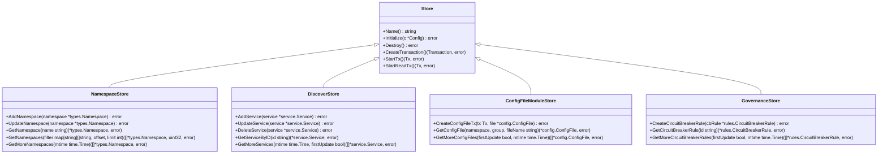
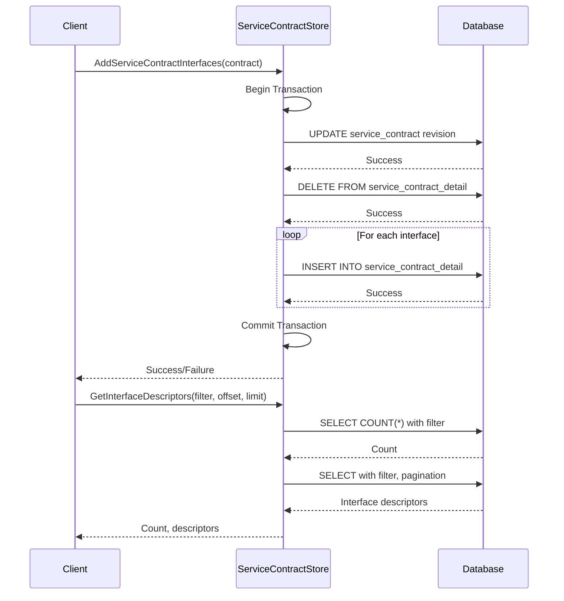
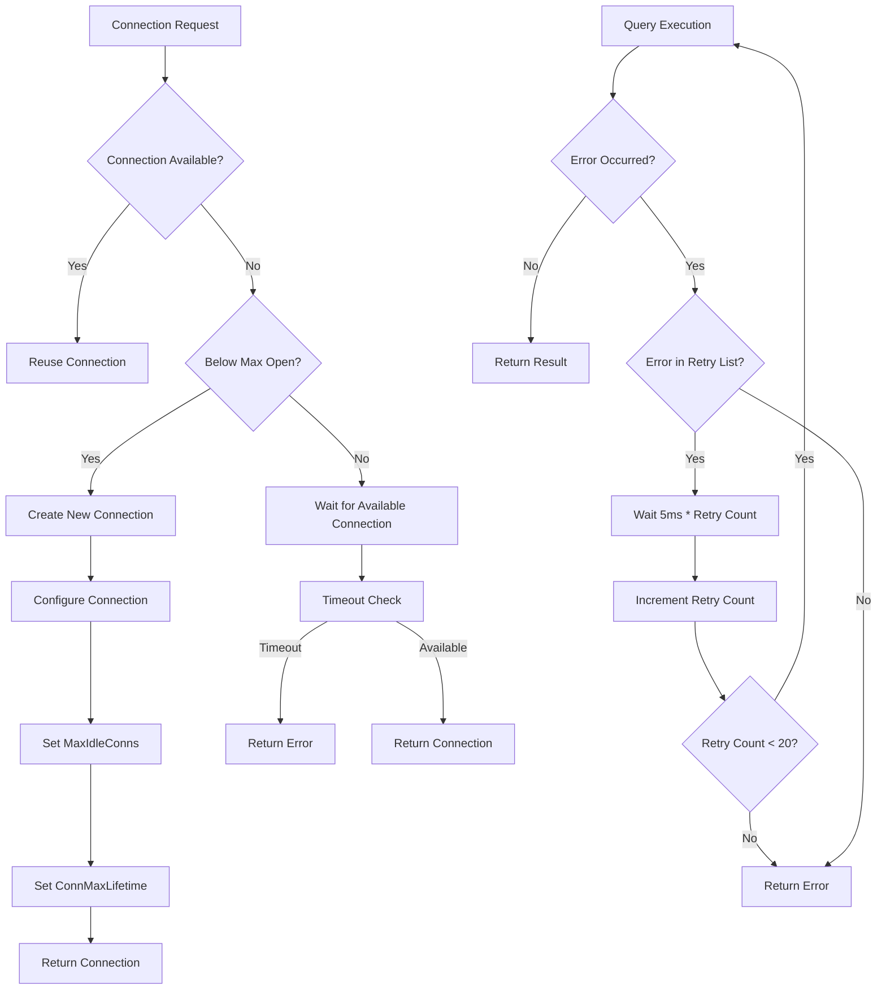
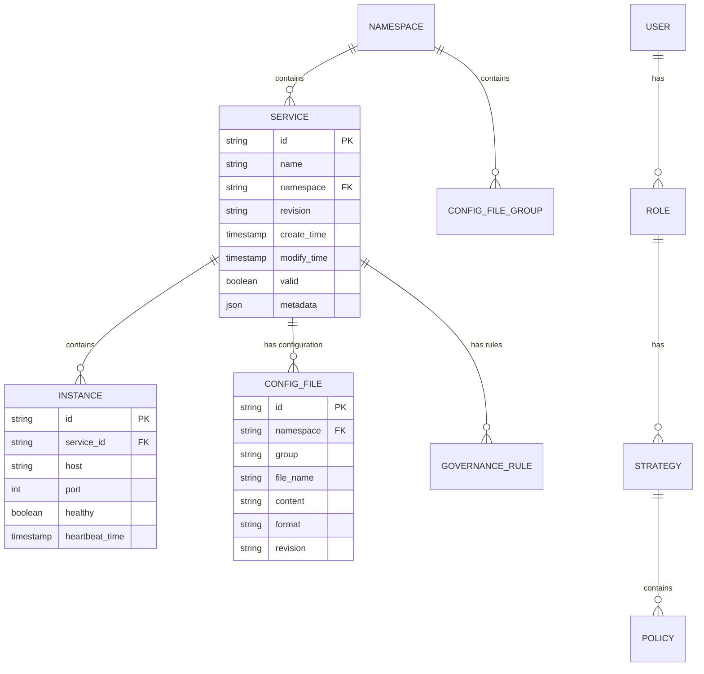
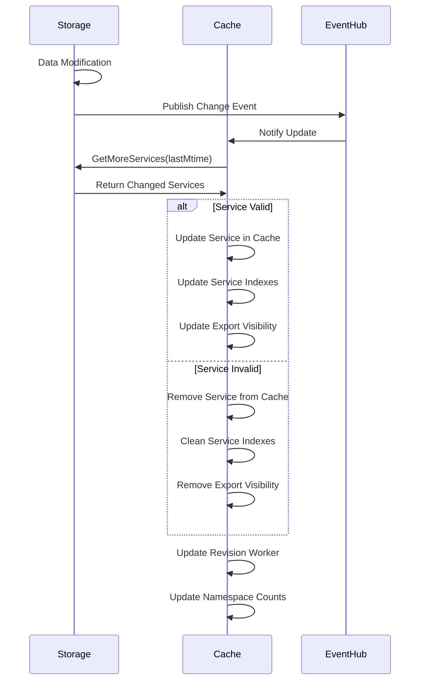
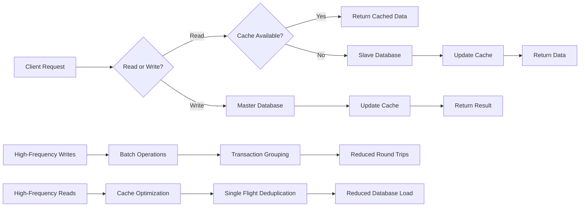

# Storage Plugins

<cite>
**Referenced Files in This Document**   
- [apis/store/api.go](file://apis/store/api.go)
- [plugin/store/mysql/service_contract.go](file://plugin/store/mysql/service_contract.go)
- [plugin/store/mysql/base_db.go](file://plugin/store/mysql/base_db.go)
- [plugin/store/mysql/transaction.go](file://plugin/store/mysql/transaction.go)
- [plugin/store/mysql/tx.go](file://plugin/store/mysql/tx.go)
- [pkg/cache/service/service.go](file://pkg/cache/service/service.go)
- [plugin/store/mock/api_mock.go](file://plugin/store/mock/api_mock.go)
</cite>

## Table of Contents
1. [Introduction](#introduction)
2. [Storage Interface Contract](#storage-interface-contract)
3. [CRUD Operations Implementation](#crud-operations-implementation)
4. [Transaction Handling](#transaction-handling)
5. [Connection Pooling and Retry Strategies](#connection-pooling-and-retry-strategies)
6. [Mock Storage for Testing](#mock-storage-for-testing)
7. [Schema Design Considerations](#schema-design-considerations)
8. [Data Consistency and Caching](#data-consistency-and-caching)
9. [Performance Optimization](#performance-optimization)
10. [File-Based Storage Example](#file-based-storage-example)

## Introduction
Storage plugins in pole-server provide a pluggable architecture for implementing custom data persistence layers. The system is designed to support various database backends while maintaining a consistent interface for service discovery, configuration management, and governance rules. This document details the contract defined in `apis/store/api.go` and demonstrates how the MySQL plugin serves as a reference implementation. The storage layer supports CRUD operations for services, configurations, and governance rules with comprehensive transaction handling, connection pooling, and error retry mechanisms.

## Storage Interface Contract

The core storage contract is defined in `apis/store/api.go`, which establishes a comprehensive interface for data persistence operations. The `Store` interface acts as the foundation, aggregating multiple sub-interfaces for different functional domains including service discovery, configuration management, governance rules, and authentication.



**Diagram sources**
- [apis/store/api.go](file://apis/store/api.go#L27-L118)

**Section sources**
- [apis/store/api.go](file://apis/store/api.go#L27-L118)

## CRUD Operations Implementation

The MySQL plugin implementation demonstrates how to implement CRUD operations for various entities. For service contract interfaces, the implementation provides methods for adding, appending, and deleting interfaces with proper transaction handling and revision management.



**Diagram sources**
- [plugin/store/mysql/service_contract.go](file://plugin/store/mysql/service_contract.go#L172-L215)
- [plugin/store/mysql/service_contract.go](file://plugin/store/mysql/service_contract.go#L400-L443)

**Section sources**
- [plugin/store/mysql/service_contract.go](file://plugin/store/mysql/service_contract.go#L172-L289)
- [plugin/store/mysql/service_contract.go](file://plugin/store/mysql/service_contract.go#L400-L488)

## Transaction Handling

Transaction management in pole-server follows a structured approach with proper isolation levels and error handling. The `BaseDB` class wraps the standard `sql.DB` to provide enhanced transaction capabilities including retry logic for transient failures.

```mermaid
classDiagram
class BaseDB {
+DB *sql.DB
+cfg *dbConfig
+isolationLevel sql.IsolationLevel
+Exec(query string, args... interface{}) (sql.Result, error)
+Query(query string, args... interface{}) (*sql.Rows, error)
+Begin() (*BaseTx, error)
+processWithTransaction(label string, handle func(*BaseTx) error) error
}
class BaseTx {
+Tx *sql.Tx
+Commit() error
+Rollback() error
}
class transaction {
+tx *BaseTx
+failed bool
+commit bool
+Commit() error
+LockBootstrap(key string, server string) error
+LockNamespace(name string) (*types.Namespace, error)
+DeleteNamespace(name string) error
}
class Tx {
+delegateTx *BaseTx
+Commit() error
+Rollback() error
+GetDelegateTx() interface{}
+CreateReadView() error
}
BaseDB --> BaseTx
BaseTx --> transaction
BaseTx --> Tx
```

**Diagram sources**
- [plugin/store/mysql/base_db.go](file://plugin/store/mysql/base_db.go#L50-L275)
- [plugin/store/mysql/transaction.go](file://plugin/store/mysql/transaction.go#L15-L256)
- [plugin/store/mysql/tx.go](file://plugin/store/mysql/tx.go#L15-L48)

**Section sources**
- [plugin/store/mysql/base_db.go](file://plugin/store/mysql/base_db.go#L50-L275)
- [plugin/store/mysql/transaction.go](file://plugin/store/mysql/transaction.go#L15-L256)
- [plugin/store/mysql/tx.go](file://plugin/store/mysql/tx.go#L15-L48)

## Connection Pooling and Retry Strategies

The storage layer implements robust connection pooling and retry mechanisms to ensure reliability under various failure conditions. Connection parameters are configurable through the database configuration, allowing optimization for different deployment scenarios.



**Diagram sources**
- [plugin/store/mysql/base_db.go](file://plugin/store/mysql/base_db.go#L100-L150)
- [plugin/store/mysql/base_db.go](file://plugin/store/mysql/base_db.go#L220-L275)

**Section sources**
- [plugin/store/mysql/base_db.go](file://plugin/store/mysql/base_db.go#L100-L150)
- [plugin/store/mysql/base_db.go](file://plugin/store/mysql/base_db.go#L220-L275)

## Mock Storage for Testing

The mock storage implementation provides a comprehensive testing framework that allows unit tests to verify business logic without dependencies on external databases. Generated using GoMock, it implements the full `Store` interface with configurable behavior for testing various scenarios.

```mermaid
classDiagram
class MockStore {
+ctrl *gomock.Controller
+recorder *MockStoreMockRecorder
+AddService(service *service.Service) error
+GetServiceByID(id string) (*service.Service, error)
+CreateTransaction() (Transaction, error)
+EXPECT() *MockStoreMockRecorder
}
class MockStoreMockRecorder {
+mock *MockStore
+AddService(service interface{}) *gomock.Call
+GetServiceByID(id interface{}) *gomock.Call
}
class MockTransaction {
+ctrl *gomock.Controller
+recorder *MockTransactionMockRecorder
+Commit() error
+Rollback() error
}
class MockTx {
+ctrl *gomock.Controller
+recorder *MockTxMockRecorder
+Commit() error
+Rollback() error
+GetDelegateTx() interface{}
}
MockStore --> MockStoreMockRecorder
MockTransaction --> MockTransactionMockRecorder
MockTx --> MockTxMockRecorder
```

**Diagram sources**
- [plugin/store/mock/api_mock.go](file://plugin/store/mock/api_mock.go#L30-L100)

**Section sources**
- [plugin/store/mock/api_mock.go](file://plugin/store/mock/api_mock.go#L30-L100)

## Schema Design Considerations

When implementing alternative database backends such as PostgreSQL or MongoDB, several schema design considerations must be addressed. The relational model used in MySQL can be adapted to other SQL databases with minimal changes, while NoSQL databases require more significant architectural adjustments.

For PostgreSQL, the schema can remain largely unchanged with minor syntax adjustments:
- Use `TIMESTAMP WITH TIME ZONE` instead of `DATETIME`
- Leverage JSONB columns for flexible metadata storage
- Implement row-level security for enhanced access control
- Use native UUID type for identifiers

For MongoDB, a document-oriented approach would be more appropriate:
- Store service and its metadata as a single document
- Embed configuration files within namespace documents
- Use embedded arrays for governance rules
- Leverage MongoDB's native TTL indexes for automatic cleanup



**Diagram sources**
- [plugin/store/mysql/service_contract.go](file://plugin/store/mysql/service_contract.go#L172-L215)
- [plugin/store/mysql/service_contract.go](file://plugin/store/mysql/service_contract.go#L400-L443)

**Section sources**
- [plugin/store/mysql/service_contract.go](file://plugin/store/mysql/service_contract.go#L172-L215)
- [plugin/store/mysql/service_contract.go](file://plugin/store/mysql/service_contract.go#L400-L443)

## Data Consistency and Caching

The system implements a sophisticated caching layer in `pkg/cache/service/service.go` that ensures data consistency between the storage layer and in-memory caches. The cache updates are triggered by changes in the underlying storage, with proper handling of incremental updates and deletion events.



**Diagram sources**
- [pkg/cache/service/service.go](file://pkg/cache/service/service.go#L200-L400)
- [pkg/cache/service/service.go](file://pkg/cache/service/service.go#L500-L700)

**Section sources**
- [pkg/cache/service/service.go](file://pkg/cache/service/service.go#L200-L400)
- [pkg/cache/service/service.go](file://pkg/cache/service/service.go#L500-L700)

## Performance Optimization

Performance optimization for high-frequency reads and writes involves several strategies implemented in the storage layer. The system uses connection pooling, query optimization, and batch operations to maximize throughput while minimizing latency.

Key optimization techniques include:
- **Connection pooling**: Configurable maximum open and idle connections to balance resource usage
- **Query optimization**: Use of prepared statements and proper indexing
- **Batch operations**: Support for batch insertion and deletion of entities
- **Read/write separation**: Use of master/slave configuration for database operations
- **Caching layer**: In-memory caching of frequently accessed data
- **Revision-based updates**: Incremental updates based on modification time



**Diagram sources**
- [plugin/store/mysql/base_db.go](file://plugin/store/mysql/base_db.go#L100-L150)
- [pkg/cache/service/service.go](file://pkg/cache/service/service.go#L150-L200)

**Section sources**
- [plugin/store/mysql/base_db.go](file://plugin/store/mysql/base_db.go#L100-L150)
- [pkg/cache/service/service.go](file://pkg/cache/service/service.go#L150-L200)

## File-Based Storage Example

Implementing a simple file-based storage backend involves creating a new plugin that implements the `Store` interface using file system operations. This approach can be useful for development, testing, or lightweight deployments where a full database is unnecessary.

```mermaid
classDiagram
class FileStore {
+dataPath string
+mutex sync.RWMutex
+services map[string]*service.Service
+configFiles map[string]*config.ConfigFile
+governanceRules map[string]interface{}
+Initialize(c *Config) error
+Destroy() error
+AddService(service *service.Service) error
+GetServiceByID(id string) (*service.Service, error)
+CreateTransaction() (Transaction, error)
}
class FileTransaction {
+store *FileStore
+changes map[string]interface{}
+committed bool
+Commit() error
+Rollback() error
}
class FileCache {
+store *FileStore
+cache map[string]interface{}
+Update() error
+Clear() error
+GetServiceByID(id string) *service.Service
}
FileStore --> FileTransaction
FileStore --> FileCache
```

The file-based implementation would store data in JSON format in a designated directory structure:
```
data/
├── services/
│   ├── service-id-1.json
│   ├── service-id-2.json
├── configurations/
│   ├── namespace/
│   │   ├── group/
│   │   │   ├── file-name.json
├── governance/
│   ├── circuit-breaker/
│   │   ├── rule-id-1.json
```

Each file would contain the serialized representation of the corresponding entity, with atomic file operations ensuring data consistency. The implementation would need to handle concurrency through file locking mechanisms and provide efficient indexing for query operations.

**Section sources**
- [apis/store/api.go](file://apis/store/api.go#L27-L118)
- [plugin/store/mysql/service_contract.go](file://plugin/store/mysql/service_contract.go#L172-L215)