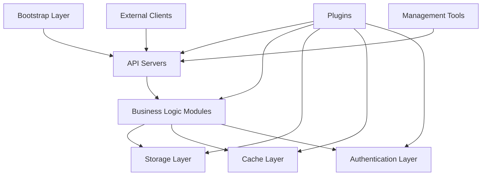
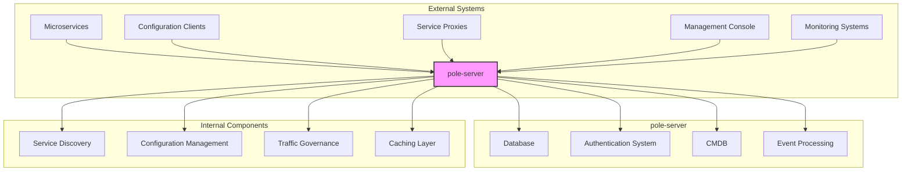

# Project Overview

<cite>
**Referenced Files in This Document**   
- [main.go](file://main.go)
- [bootstrap/server.go](file://bootstrap/server.go)
- [bootstrap/config/config.go](file://bootstrap/config/config.go)
- [cmd/start.go](file://cmd/start.go)
- [deploy/conf/pole-server.yaml](file://deploy/conf/pole-server.yaml)
- [deploy/conf/pole-apiserver.yaml](file://deploy/conf/pole-apiserver.yaml)
- [pkg/goverrule/api.go](file://pkg/goverrule/api.go)
- [pkg/service/api.go](file://pkg/service/api.go)
- [README.md](file://README.md)
</cite>

## Table of Contents
1. [Introduction](#introduction)
2. [Core Purpose and Operational Scope](#core-purpose-and-operational-scope)
3. [High-Level Architecture](#high-level-architecture)
4. [Key Features and Capabilities](#key-features-and-capabilities)
5. [Core Component Relationships](#core-component-relationships)
6. [Deployment Models](#deployment-models)
7. [Integration Scenarios](#integration-scenarios)
8. [System Context and External Interactions](#system-context-and-external-interactions)
9. [Quick Start Example](#quick-start-example)

## Introduction
The pole-server project is a service mesh control plane designed for comprehensive microservices governance in cloud-native environments. As a unified platform, it provides essential capabilities for service discovery, configuration management, and traffic control across heterogeneous service architectures. The system enables organizations to implement consistent governance policies, enhance service reliability, and streamline operational workflows in distributed systems.

**Section sources**
- [README.md](file://README.md#L1-L31)

## Core Purpose and Operational Scope
pole-server serves as a centralized control plane that manages the lifecycle and interactions of microservices within a distributed architecture. Its primary operational scope encompasses service registration and discovery, dynamic configuration management, and intelligent traffic routing. The platform supports governance across multiple protocols and integrates with existing service mesh ecosystems, enabling organizations to maintain consistency in policy enforcement regardless of underlying technology choices.

The system operates by maintaining a real-time registry of service instances, their metadata, and health status, while also managing configuration artifacts and governance rules. It exposes these capabilities through multiple protocol adapters, allowing services implemented in different technologies to participate in the mesh without requiring protocol-specific client libraries.

**Section sources**
- [README.md](file://README.md#L1-L31)
- [bootstrap/server.go](file://bootstrap/server.go#L1-L717)

## High-Level Architecture
The pole-server architecture follows a modular design with clear separation of concerns between components. At its core, the system consists of a bootstrap layer that initializes the server, a set of pluggable API servers that expose functionality through different protocols, and business logic modules that implement core governance capabilities. The architecture emphasizes extensibility through a plugin system that allows for custom implementations of cryptographic operations, configuration storage, observability backends, and rate limiting strategies.

The system employs a layered approach with distinct components for service discovery (naming), configuration management (config), governance rules (goverrule), and administrative operations (admin). These components interact through well-defined interfaces and share common infrastructure for caching, authentication, and storage access. The modular design enables independent evolution of components while maintaining backward compatibility.



**Diagram sources**
- [bootstrap/server.go](file://bootstrap/server.go#L1-L717)
- [bootstrap/config/config.go](file://bootstrap/config/config.go#L1-L127)

## Key Features and Capabilities
pole-server provides a comprehensive set of features for microservices governance, with support for multiple industry-standard protocols and advanced traffic management capabilities. The platform offers compatibility with Eureka, Nacos, Apollo, and XDS protocols, enabling seamless integration with existing service mesh deployments and reducing migration barriers.

Key governance capabilities include rate limiting, circuit breaking, health checking, and role-based access control (RBAC). Rate limiting is implemented through a token bucket algorithm with configurable rules, while circuit breaking follows established patterns to prevent cascading failures in distributed systems. Health checking supports multiple strategies including heartbeat monitoring and active probing, with configurable thresholds and recovery policies.

The platform implements fine-grained RBAC with support for user groups, roles, and policies, allowing organizations to enforce security and compliance requirements at both the console and service-to-service levels. All governance rules support versioning and can be deployed through controlled rollout strategies, including canary and blue-green deployments.

**Section sources**
- [README.md](file://README.md#L1-L31)
- [pkg/goverrule/api.go](file://pkg/goverrule/api.go#L1-L138)
- [pkg/service/api.go](file://pkg/service/api.go#L1-L142)

## Core Component Relationships
The pole-server architecture organizes its functionality through a well-defined component hierarchy. The bootstrap component serves as the entry point, responsible for loading configuration, initializing subsystems, and starting the server. It coordinates the startup sequence to prevent database overload during initialization, particularly in clustered deployments.

The apiserver component provides protocol-specific endpoints, with separate implementations for HTTP, gRPC, Eureka, Nacos, Apollo, and XDS protocols. These servers delegate business logic to specialized modules in the pkg directory, including service (for service discovery), config (for configuration management), and goverrule (for traffic governance). The store component abstracts persistence operations, supporting multiple database backends through a pluggable interface.

The cache component plays a critical role in system performance, maintaining in-memory representations of frequently accessed data to reduce database load and improve response times. Components such as service, config, and goverrule interact with the cache to serve client requests efficiently while ensuring consistency through appropriate invalidation strategies.

```mermaid
classDiagram
class Bootstrap {
+Start(configFilePath string)
+StartComponents(ctx context.Context, cfg *Config)
+StartServers(ctx context.Context, apientries []Config, errCh chan error)
}
class Apiserver {
+Initialize(ctx context.Context, option map[string]interface{}, api Config)
+Run(errCh chan error)
+Stop()
}
class Service {
+Initialize(ctx context.Context, cfg *Config, opts ...InitOption)
+GetServer() (DiscoverServer, error)
}
class Goverrule {
+Initialize(ctx context.Context, cfg *Config, opts ...InitOption)
+GetServer() (GoverRuleServer, error)
}
class Config {
+Initialize(ctx context.Context, cfg *Config, s Store, cacheMgn *CacheManager, namespaceOperator NamespaceOperator)
}
class Store {
+GetStore() (Store, error)
+CreateTransaction() (Transaction, error)
}
class Cache {
+Initialize(ctx context.Context, cfg *Config, s Store)
+Run(cacheMgn *CacheManager, ctx context.Context)
}
Bootstrap --> Apiserver : "starts"
Bootstrap --> Service : "initializes"
Bootstrap --> Goverrule : "initializes"
Bootstrap --> Config : "initializes"
Bootstrap --> Store : "initializes"
Bootstrap --> Cache : "initializes"
Service --> Store : "uses"
Service --> Cache : "uses"
Goverrule --> Store : "uses"
Goverrule --> Cache : "uses"
Config --> Store : "uses"
Config --> Cache : "uses"
```

**Diagram sources**
- [bootstrap/server.go](file://bootstrap/server.go#L1-L717)
- [bootstrap/config/config.go](file://bootstrap/config/config.go#L1-L127)
- [pkg/goverrule/api.go](file://pkg/goverrule/api.go#L1-L138)
- [pkg/service/api.go](file://pkg/service/api.go#L1-L142)

## Deployment Models
pole-server supports multiple deployment models to accommodate different operational requirements and infrastructure constraints. The standalone deployment model runs all components within a single process, making it suitable for development and testing environments. This model uses an embedded configuration that can be customized through YAML files.

For production environments, the system can be deployed using Docker containers, with configuration injected through environment variables or mounted configuration files. The Docker deployment model enables consistent behavior across different environments and simplifies version management and rollback procedures.

In Kubernetes environments, pole-server can be deployed as a set of pods with appropriate resource limits and health checks. The deployment can be scaled horizontally to handle increased load, with multiple instances sharing a common database backend. Kubernetes deployments can leverage ConfigMaps for configuration management and Secrets for sensitive data such as database credentials and cryptographic keys.

The system supports clustered deployments with multiple pole-server instances, where startup coordination prevents database overload through a locking mechanism. This ensures smooth operation during rolling updates and prevents thundering herd problems when multiple instances start simultaneously.

**Section sources**
- [deploy/conf/pole-server.yaml](file://deploy/conf/pole-server.yaml#L1-L173)
- [deploy/conf/pole-apiserver.yaml](file://deploy/conf/pole-apiserver.yaml#L1-L128)

## Integration Scenarios
pole-server integrates with microservices through multiple protocol adapters, enabling heterogeneous service architectures to participate in the same governance framework. Services using Spring Cloud can integrate via the Eureka adapter, while Nacos-based services use the Nacos adapter. The Apollo adapter supports configuration management for Apollo clients, and the XDS adapter enables integration with Istio and other service meshes that support the xDS API.

For services that require direct integration, the gRPC and HTTP APIs provide programmatic access to all governance capabilities. The gRPC interface offers high-performance access to service discovery and configuration management, while the HTTP API provides a RESTful interface suitable for web-based applications and scripting.

The platform also supports integration with observability systems through pluggable exporters for metrics, tracing, and logging. The prometheus plugin enables metrics collection for monitoring and alerting, while the history and discoverEvent plugins support audit logging and event processing workflows.

**Section sources**
- [deploy/conf/pole-apiserver.yaml](file://deploy/conf/pole-apiserver.yaml#L1-L128)
- [plugin/](file://plugin/)

## System Context and External Interactions
The pole-server system interacts with various external components in a typical deployment scenario. Microservices register themselves with the control plane and periodically send heartbeats to indicate their availability. Clients discover services through the control plane, which returns a list of healthy instances that can handle requests.

Configuration clients retrieve configuration artifacts from the control plane, which may be cached locally to reduce latency and improve availability. Governance policies are pushed to service proxies or retrieved by services during startup, enabling consistent enforcement of traffic management rules.

The control plane persists critical data in a relational database, with configuration options for connection pooling and failover. It also integrates with external systems for authentication, CMDB lookups, and event processing, enabling rich integration with existing enterprise infrastructure.



**Diagram sources**
- [bootstrap/server.go](file://bootstrap/server.go#L1-L717)
- [pkg/service/api.go](file://pkg/service/api.go#L1-L142)
- [pkg/goverrule/api.go](file://pkg/goverrule/api.go#L1-L138)

## Quick Start Example
To start the pole-server, execute the following command:

```bash
./pole-server start -c conf/pole-server.yaml
```

This command initializes the server using the configuration file located at `conf/pole-server.yaml`. The server will start multiple API endpoints as defined in the configuration, including HTTP (port 8090), gRPC (port 8091), Eureka (port 8761), Nacos (port 8848), Apollo (port 8080), and XDS (port 15010).

Once the server is running, you can interact with it using the HTTP API. For example, to register a service instance:

```bash
curl -X POST http://localhost:8090/v1/instances \
  -H "Content-Type: application/json" \
  -d '{
    "service": "example-service",
    "namespace": "default",
    "host": "192.168.1.100",
    "port": 8080,
    "healthCheck": {
      "type": "HEARTBEAT",
      "heartbeat": {
        "ttl": 5
      }
    }
  }'
```

To discover instances of a service:

```bash
curl "http://localhost:8090/v1/instances?service=example-service&namespace=default"
```

These API interactions demonstrate the core service discovery capabilities of pole-server, enabling services to register their presence and clients to discover available instances for load balancing and failover.

**Section sources**
- [main.go](file://main.go#L1-L29)
- [cmd/start.go](file://cmd/start.go#L1-L43)
- [bootstrap/server.go](file://bootstrap/server.go#L1-L717)
- [deploy/conf/pole-server.yaml](file://deploy/conf/pole-server.yaml#L1-L173)
- [deploy/conf/pole-apiserver.yaml](file://deploy/conf/pole-apiserver.yaml#L1-L128)