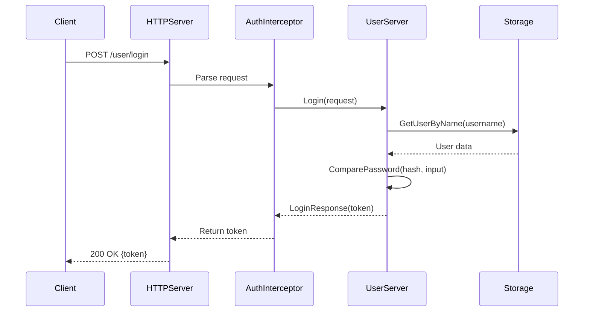
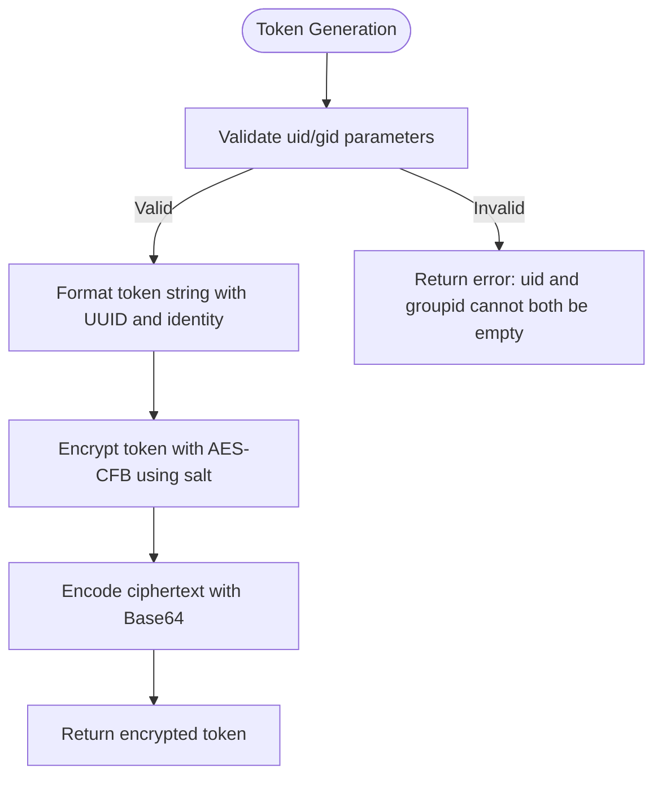
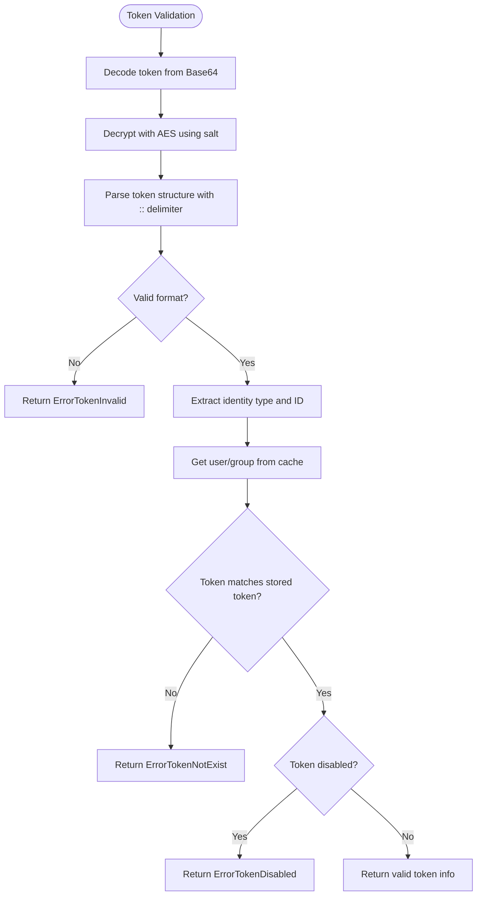
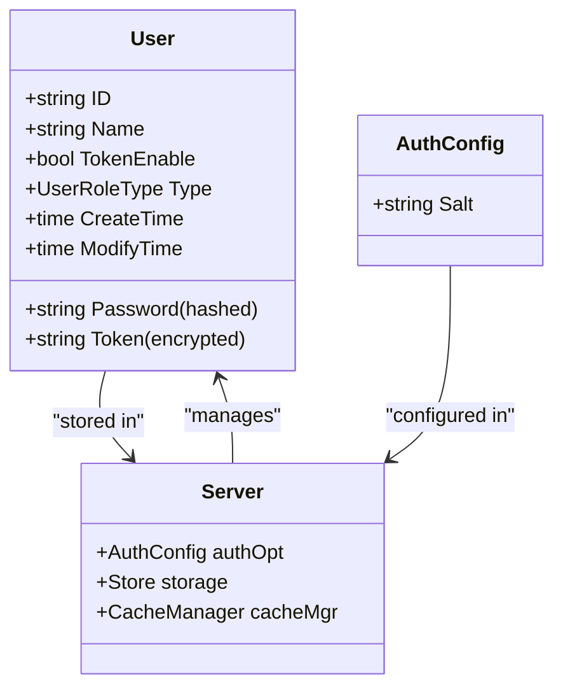
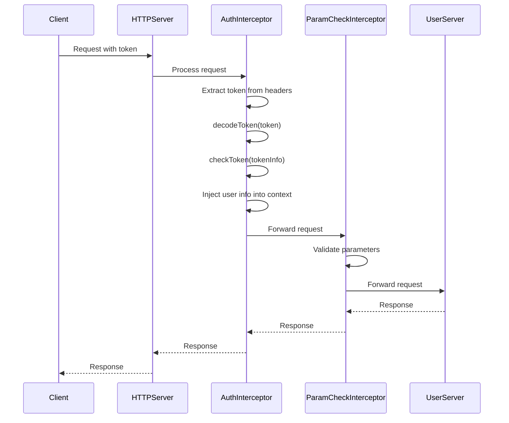
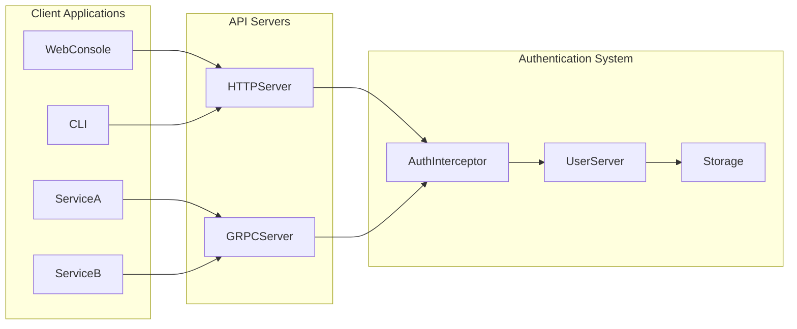
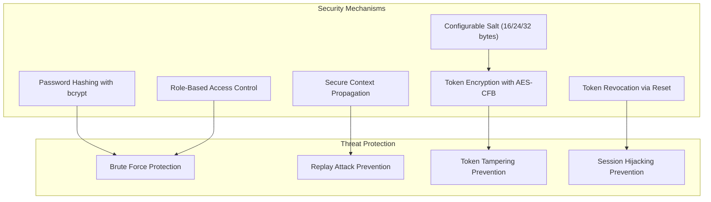

# Authentication

<cite>
**Referenced Files in This Document**   
- [token.go](file://plugin/access_control/auth/user/token.go)
- [user.go](file://plugin/access_control/auth/user/user.go)
- [server.go](file://plugin/access_control/auth/user/server.go)
- [default.go](file://plugin/access_control/auth/user/default.go)
- [auth/server.go](file://plugin/access_control/auth/user/inteceptor/auth/server.go)
- [paramcheck/server.go](file://plugin/access_control/auth/user/inteceptor/paramcheck/server.go)
- [user_access.go](file://plugin/apiserver/httpserver/auth/user_access.go)
</cite>

## Table of Contents
1. [Introduction](#introduction)
2. [Token-Based Authentication Overview](#token-based-authentication-overview)
3. [Token Generation and Structure](#token-generation-and-structure)
4. [Token Validation and Decoding](#token-validation-and-decoding)
5. [User Credential Management](#user-credential-management)
6. [Authentication Interceptors and Request Flow](#authentication-interceptors-and-request-flow)
7. [API Integration and Service Access](#api-integration-and-service-access)
8. [Security Best Practices](#security-best-practices)
9. [Troubleshooting Common Issues](#troubleshooting-common-issues)

## Introduction
The pole-server authentication system implements a token-based, stateless authentication mechanism for secure access control. This system handles user authentication through encrypted tokens, password hashing, and role-based access control. The authentication module integrates with various API servers (HTTP, gRPC) to verify identities at the request level. The system uses interceptors to manage authentication flows and propagate context across components. This document details the implementation of token generation, validation, expiration, and security practices within the pole-server framework.

## Token-Based Authentication Overview
The authentication system in pole-server utilizes a custom token-based scheme for stateless authentication. Tokens are used to verify user identity without maintaining server-side session state. The system supports both user-level and group-level tokens, enabling flexible access control policies. Authentication is enforced through a chain of interceptors that validate credentials before allowing access to protected resources. The token system is integrated with the server's context propagation mechanism, ensuring that identity information is available throughout the request processing pipeline.

**Diagram sources**
- [server.go](file://plugin/access_control/auth/user/server.go#L143-L167)
- [user_access.go](file://plugin/apiserver/httpserver/auth/user_access.go#L52-L68)

**Section sources**
- [server.go](file://plugin/access_control/auth/user/server.go#L143-L167)
- [user_access.go](file://plugin/apiserver/httpserver/auth/user_access.go#L52-L68)

## Token Generation and Structure
Token generation in pole-server follows a structured format that includes both random components and identity information. The token structure consists of a random string followed by identity data, separated by a double colon delimiter. User tokens are generated with the pattern "random::uid/user-id" while group tokens use "random::groupid/group-id". The token generation process uses AES encryption with a server-configured salt value to protect the token contents. The encryption uses CFB mode with a randomly generated initialization vector for each token, ensuring that identical inputs produce different encrypted outputs.

**Diagram sources**
- [token.go](file://plugin/access_control/auth/user/token.go#L133-L169)
- [token.go](file://plugin/access_control/auth/user/token.go#L105-L132)

**Section sources**
- [token.go](file://plugin/access_control/auth/user/token.go#L133-L169)

## Token Validation and Decoding
Token validation in pole-server involves multiple steps to ensure authenticity and integrity. The validation process begins with Base64 decoding of the token, followed by AES decryption using the server's salt. The decrypted token is then parsed to extract the identity information and verify its structure. The system checks that the token contains exactly two parts separated by the delimiter and that the identity portion follows the expected format. During validation, the system also verifies that the token matches the current token stored for the user or group, preventing the use of revoked or outdated tokens. The validation process integrates with the server's caching system to efficiently retrieve user and group information.

**Diagram sources**
- [token.go](file://plugin/access_control/auth/user/token.go#L40-L87)
- [token.go](file://plugin/access_control/auth/user/token.go#L88-L132)

**Section sources**
- [token.go](file://plugin/access_control/auth/user/token.go#L40-L132)

## User Credential Management
User credential management in pole-server follows security best practices for password storage and token handling. User passwords are hashed using bcrypt with the default cost factor, providing strong protection against brute force attacks. Password hashes are stored in the database, while the original passwords are never retained. The system supports token-based authentication where each user has an associated token that can be reset or disabled. User tokens are encrypted and stored in the database, with the encryption key derived from a server-configured salt. The system provides operations to reset user tokens, effectively logging out all active sessions for that user.

**Diagram sources**
- [user.go](file://plugin/access_control/auth/user/user.go#L616-L649)
- [server.go](file://plugin/access_control/auth/user/server.go#L20-L45)

**Section sources**
- [user.go](file://plugin/access_control/auth/user/user.go#L616-L649)
- [server.go](file://plugin/access_control/auth/user/server.go#L20-L45)

## Authentication Interceptors and Request Flow
The authentication system in pole-server employs a chain of interceptors to handle authentication logic. The interceptor chain includes both authentication and parameter checking components that process requests before they reach the core business logic. When a request arrives, the authentication interceptor extracts the token from headers (either "Authorization" or "X-Polaris-Token") and validates it. The validated token information is then injected into the request context, making it available to downstream components. The interceptor also handles anonymous access scenarios, allowing certain operations to proceed without authentication when configured to do so.

**Diagram sources**
- [auth/server.go](file://plugin/access_control/auth/user/inteceptor/auth/server.go#L78-L100)
- [paramcheck/server.go](file://plugin/access_control/auth/user/inteceptor/paramcheck/server.go#L100-L120)
- [default.go](file://plugin/access_control/auth/user/default.go#L70-L85)

**Section sources**
- [auth/server.go](file://plugin/access_control/auth/user/inteceptor/auth/server.go#L78-L100)
- [paramcheck/server.go](file://plugin/access_control/auth/user/inteceptor/paramcheck/server.go#L100-L120)

## API Integration and Service Access
The authentication system integrates with various API servers in pole-server, including HTTP and gRPC endpoints. For HTTP access, the system provides RESTful endpoints for user login, token retrieval, and token management operations. The HTTP server routes authentication requests to the appropriate handlers, which interact with the authentication server to validate credentials and generate responses. Service-to-service calls use the same token-based authentication mechanism, ensuring consistent security policies across internal and external interfaces. Administrative console access is protected by the same authentication system, with role-based permissions determining the level of access granted to different users.

**Diagram sources**
- [user_access.go](file://plugin/apiserver/httpserver/auth/user_access.go#L30-L48)
- [server.go](file://plugin/access_control/auth/user/server.go#L143-L167)

**Section sources**
- [user_access.go](file://plugin/apiserver/httpserver/auth/user_access.go#L30-L48)

## Security Best Practices
The pole-server authentication system implements several security best practices to protect against common vulnerabilities. Passwords are hashed using bcrypt, a strong adaptive hashing algorithm that protects against brute force attacks. Tokens are encrypted using AES with a server-configured salt, preventing unauthorized parties from decoding token contents. The system supports token revocation through the token reset mechanism, allowing administrators to invalidate compromised tokens. The authentication flow includes protection against replay attacks by ensuring that each token is unique and tied to a specific user or group. The system also implements rate limiting and failed login attempt tracking to prevent brute force attacks on user accounts.

**Diagram sources**
- [user.go](file://plugin/access_control/auth/user/user.go#L616-L649)
- [token.go](file://plugin/access_control/auth/user/token.go#L133-L169)
- [server.go](file://plugin/access_control/auth/user/server.go#L50-L65)

**Section sources**
- [user.go](file://plugin/access_control/auth/user/user.go#L616-L649)
- [token.go](file://plugin/access_control/auth/user/token.go#L133-L169)

## Troubleshooting Common Issues
Common issues in the pole-server authentication system typically involve token validation failures, credential errors, and configuration problems. Expired tokens are not explicitly handled in the current implementation, as tokens do not have a built-in expiration mechanism but can be reset or disabled. Invalid credentials result in specific error codes that distinguish between non-existent users and incorrect passwords. Misconfigured authentication chains can occur if the interceptor order is not properly set, with the "auth" interceptor needing to precede the "paramcheck" interceptor. Token-related issues can often be resolved by resetting the user token, which generates a new encrypted token while maintaining the user's access rights.

**Section sources**
- [server.go](file://plugin/access_control/auth/user/server.go#L143-L167)
- [token.go](file://plugin/access_control/auth/user/token.go#L40-L87)
- [paramcheck/server.go](file://plugin/access_control/auth/user/inteceptor/paramcheck/server.go#L200-L220)