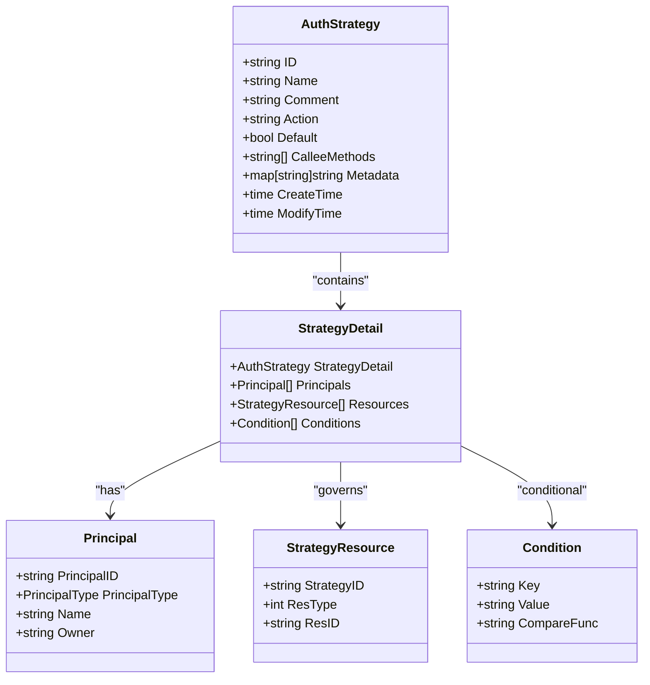
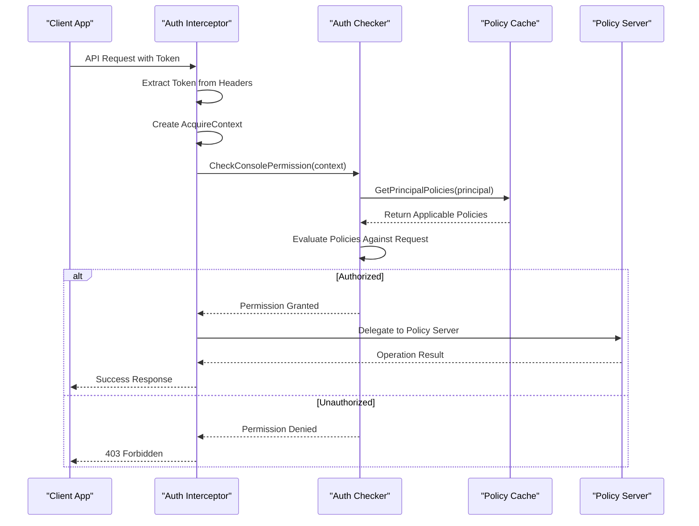
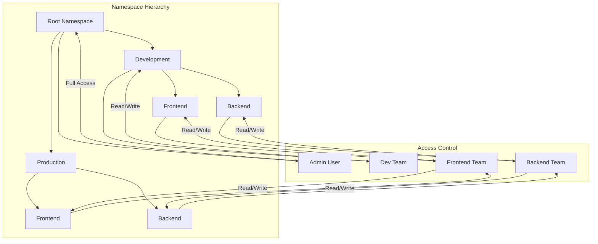
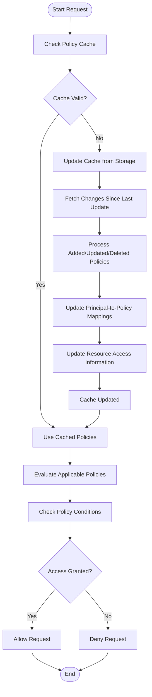

# Authorization & RBAC

<cite>
**Referenced Files in This Document**   
- [policy.go](file://plugin/access_control/auth/policy/policy.go)
- [user.go](file://plugin/access_control/auth/user/user.go)
- [policy.go](file://pkg/cache/auth/policy.go)
- [auth/server.go](file://plugin/access_control/auth/policy/inteceptor/auth/server.go)
- [const.go](file://apis/pkg/types/auth/const.go)
- [group.go](file://plugin/access_control/auth/user/group.go)
- [resource_listener.go](file://pkg/config/interceptor/auth/resource_listener.go)
</cite>

## Table of Contents
1. [Introduction](#introduction)
2. [Policy and Role Definition](#policy-and-role-definition)
3. [User and Group Management](#user-and-group-management)
4. [Policy Enforcement and Interceptor System](#policy-enforcement-and-interceptor-system)
5. [Hierarchical Namespaces and Scoped Access](#hierarchical-namespaces-and-scoped-access)
6. [Performance Considerations and Caching](#performance-considerations-and-caching)
7. [Troubleshooting Guide](#troubleshooting-guide)

## Introduction
The Authorization and Role-Based Access Control (RBAC) system in the pole-server repository provides a comprehensive framework for managing access to resources through policies, roles, users, and groups. This system enables fine-grained control over who can access what resources, under what conditions, and what actions they can perform. The architecture integrates tightly with the interceptor system to enforce access control at runtime across API endpoints and administrative operations. The system supports hierarchical namespaces, scoped access, and complex policy conditions, ensuring secure and flexible access management.

## Policy and Role Definition

The RBAC system defines policies and roles through structured data models and APIs that allow for the creation, modification, and deletion of access rules. Policies are defined as `AuthStrategy` objects that specify actions, resources, and conditions under which access is granted or denied. Roles are collections of permissions that can be assigned to users or groups, simplifying permission management.

Policies are created and managed through the `CreatePolicies`, `UpdatePolicies`, and `DeletePolicies` methods in the `Server` struct. Each policy contains a set of principals (users or groups), resources they can access, and optional conditions that must be met for the policy to apply. The system supports both allow and deny policies, with deny policies taking precedence over allow policies during evaluation.

Roles are defined as collections of server functions grouped by functionality. The system provides predefined function groups such as "Client", "Namespace", "Service", "ConfigFile", and "AuthPolicy", each containing specific operations that can be permitted. Custom roles can be created by combining functions from these groups, allowing for flexible permission modeling.

The policy structure includes:
- **Principals**: Users or groups to which the policy applies
- **Resources**: Specific resources (namespaces, services, config groups) that the policy governs
- **Actions**: Operations permitted (read, write, delete) on the resources
- **Conditions**: Optional metadata-based conditions that must be satisfied
- **Metadata**: Additional information about the policy



**Diagram sources**
- [policy.go](file://plugin/access_control/auth/policy/policy.go#L191-L258)
- [const.go](file://apis/pkg/types/auth/const.go#L200-L500)

**Section sources**
- [policy.go](file://plugin/access_control/auth/policy/policy.go#L191-L258)
- [const.go](file://apis/pkg/types/auth/const.go#L200-L500)

## User and Group Management

The system provides comprehensive user and group management capabilities, allowing administrators to create, update, and delete users and groups, as well as manage their relationships and permissions. Users can be organized into groups, and permissions can be assigned at both the individual user and group levels, enabling efficient permission management at scale.

Users are created through the `CreateUser` method, which generates a unique ID, hashes the password using bcrypt, and creates a token for authentication. Each user has a type (owner or sub-account) that determines their privileges within the system. The system enforces constraints such as preventing users from having the same name as their owner and ensuring that owner accounts cannot delete themselves.

Groups are managed through the `CreateGroup`, `UpdateGroups`, and `DeleteGroups` methods. When a group is created, a default policy is automatically created for it, granting the group appropriate permissions. Users can be added to or removed from groups, and these changes are reflected in the group's policy assignments. The system maintains bidirectional relationships between users and groups, allowing for efficient lookups in both directions.

The user-group relationship is implemented with a many-to-many mapping, where each group maintains a set of user IDs, and each user can belong to multiple groups. This design enables flexible organizational structures and permission delegation. When a user is added to a group, they inherit all permissions assigned to that group, creating a hierarchical permission model.

```mermaid
classDiagram
class User {
+string ID
+string Name
+string Password
+string Source
+UserRoleType Type
+bool TokenEnable
+bool Valid
+string Comment
+time CreateTime
+time ModifyTime
}
class UserGroup {
+string ID
+string Name
+bool TokenEnable
+bool Valid
+string Comment
+time CreateTime
+time ModifyTime
}
class UserGroupDetail {
+UserGroup UserGroup
+map[string]struct{} UserIds
}
User "1" --> "0..*" UserGroup : "belongs to"
UserGroup "1" --> "0..*" User : "contains"
UserGroup --> UserGroupDetail : "detailed"
class Server {
+CreateUser(ctx, req) Response
+UpdateUser(ctx, req) Response
+DeleteUser(ctx, req) Response
+CreateGroup(ctx, req) Response
+UpdateGroups(ctx, req) Response
+DeleteGroups(ctx, req) Response
}
Server --> User : "manages"
Server --> UserGroup : "manages"
```

**Diagram sources**
- [user.go](file://plugin/access_control/auth/user/user.go#L191-L258)
- [group.go](file://plugin/access_control/auth/user/group.go#L32-L125)

**Section sources**
- [user.go](file://plugin/access_control/auth/user/user.go#L191-L258)
- [group.go](file://plugin/access_control/auth/user/group.go#L32-L125)

## Policy Enforcement and Interceptor System

The policy enforcement system is implemented through an interceptor pattern that integrates with the server's request processing pipeline. When an API request is received, the interceptor system evaluates the user's permissions against the requested operation and resource, determining whether access should be granted or denied. This enforcement happens at runtime, ensuring that all operations are subject to the current permission policies.

The interceptor system is implemented in the `auth/server.go` file, where the `Server` struct wraps the underlying policy server and adds authorization checks before delegating to the actual implementation. For each operation (create, update, delete, read), the interceptor creates an `AcquireContext` that contains information about the operation, module, method, and accessed resources. This context is then passed to the `CheckConsolePermission` method of the auth checker, which evaluates whether the current user has sufficient permissions to perform the requested operation.

The enforcement process follows these steps:
1. Extract authentication credentials (token) from the request headers
2. Decode and validate the token to identify the user or group
3. Create an `AcquireContext` with details about the requested operation
4. Check permissions using the auth checker
5. If authorized, delegate to the underlying server implementation
6. If unauthorized, return an appropriate error response

The system supports both user-based and group-based authentication, with tokens that can be associated with either individual users or user groups. When a token is presented, the system determines whether it belongs to a user or group and establishes the appropriate principal context for permission evaluation.



**Diagram sources**
- [auth/server.go](file://plugin/access_control/auth/policy/inteceptor/auth/server.go#L50-L200)
- [policy.go](file://pkg/cache/auth/policy.go#L255-L297)

**Section sources**
- [auth/server.go](file://plugin/access_control/auth/policy/inteceptor/auth/server.go#L50-L200)
- [policy.go](file://pkg/cache/auth/policy.go#L255-L297)

## Hierarchical Namespaces and Scoped Access

The RBAC system supports hierarchical namespaces and scoped access, allowing organizations to structure their resources in a tree-like hierarchy with inherited permissions. This enables fine-grained access control where permissions can be defined at different levels of the namespace hierarchy, with child namespaces inheriting permissions from their parents while also allowing for overrides.

Namespaces are treated as first-class resources in the system, with specific operations like `CreateNamespace`, `DeleteNamespaces`, and `DescribeNamespaces` defined in the `ServerFunctionName` enumeration. The system allows for the creation of nested namespaces, where each namespace can have its own set of policies and permissions that apply to resources within that namespace.

Scoped access is implemented through the resource-based policy model, where policies can be defined to apply to specific resources or sets of resources. The system supports wildcard matching in resource identifiers, allowing policies to apply to multiple resources that match a pattern. For example, a policy can be defined to grant access to all services within a particular namespace by using a wildcard in the service identifier.

The hierarchical nature of namespaces enables delegation of administrative responsibilities, where administrators of parent namespaces can grant permissions to manage child namespaces. This creates a delegation model where higher-level administrators can grant specific permissions to lower-level teams without giving them full administrative control over the entire system.

The system also supports owner-based access control, where resources are associated with an owner, and only the owner or users with appropriate permissions can modify or delete the resource. This ensures that users can only manage resources they own or have been explicitly granted access to, preventing unauthorized modifications.



**Diagram sources**
- [const.go](file://apis/pkg/types/auth/const.go#L100-L150)
- [resource_listener.go](file://pkg/config/interceptor/auth/resource_listener.go#L45-L71)

**Section sources**
- [const.go](file://apis/pkg/types/auth/const.go#L100-L150)
- [resource_listener.go](file://pkg/config/interceptor/auth/resource_listener.go#L45-L71)

## Performance Considerations and Caching

The RBAC system incorporates several performance optimizations and caching strategies to minimize lookup overhead and ensure efficient policy evaluation, even in large-scale deployments with thousands of users, groups, and policies. The primary caching mechanism is implemented in the `policyCache` struct, which maintains in-memory representations of policies, principal-to-policy mappings, and resource access information.

The cache uses a combination of `SyncMap` and `SyncSet` data structures to provide thread-safe access to cached data without requiring explicit locking. This design allows multiple goroutines to concurrently read from the cache while updates are being applied, minimizing contention and maximizing throughput. The cache is updated periodically by fetching changes from the underlying storage system since the last update time, ensuring that the cache remains consistent with the persistent data.

Key caching strategies include:
- **Principal-to-Policy Mapping**: The cache maintains separate mappings for allow and deny policies for each principal type (user and group), allowing for O(1) lookups when determining which policies apply to a given principal.
- **Resource Hinting**: The cache maintains a `PrincipalResourceContainer` for each principal that contains pre-computed information about which resources the principal can access, enabling fast access decisions without evaluating all applicable policies.
- **Single-Flight Updates**: The cache uses the `singleflight` package to ensure that only one update operation is performed at a time, even when multiple goroutines request an update simultaneously, preventing redundant database queries.
- **Conditional Evaluation**: The cache supports conditional policy evaluation by maintaining metadata about resources and principals, allowing for efficient evaluation of policies with conditions.

The system also implements query optimization by supporting filtered searches on policies based on various criteria such as ID, name, resource type, and principal. These filters are applied during the query process to reduce the number of policies that need to be evaluated, improving performance for common lookup patterns.



**Diagram sources**
- [policy.go](file://pkg/cache/auth/policy.go#L194-L215)
- [policy.go](file://pkg/cache/auth/policy.go#L255-L297)

**Section sources**
- [policy.go](file://pkg/cache/auth/policy.go#L194-L215)
- [policy.go](file://pkg/cache/auth/policy.go#L255-L297)

## Troubleshooting Guide

This section provides guidance for troubleshooting common issues related to the RBAC system, including permission denied errors, role assignment problems, and policy inheritance issues. Understanding these common problems and their solutions can help administrators maintain a secure and functional access control system.

### Permission Denied Errors
Permission denied errors (HTTP 403) occur when a user attempts to perform an operation they are not authorized to perform. Common causes include:
- Missing or incorrect policies for the user or group
- Token expiration or invalidation
- Incorrect resource identifiers in policy definitions
- Conflicting deny policies that override allow policies

To troubleshoot permission denied errors:
1. Verify that the user or group has appropriate policies assigned
2. Check that the policy's resource identifiers match the requested resource
3. Ensure that the policy's action (allow/deny) is correctly set
4. Verify that the user's token is valid and not disabled
5. Check for any deny policies that might be overriding allow policies

### Role Assignment Issues
Role assignment issues occur when users or groups do not receive the expected permissions after being assigned to a role. Common causes include:
- Delayed cache updates preventing new assignments from taking effect
- Incorrect principal type specification (user vs. group)
- Transaction failures during assignment operations
- Circular dependencies in role assignments

To troubleshoot role assignment issues:
1. Verify that the assignment operation completed successfully
2. Check the system logs for any errors during the assignment process
3. Confirm that the cache has been updated with the new assignment
4. Verify that the principal type (user or group) matches the assignment
5. Check for any constraints that might prevent the assignment

### Policy Inheritance Problems
Policy inheritance problems occur in hierarchical namespace structures when child namespaces do not inherit expected permissions from parent namespaces. Common causes include:
- Explicit deny policies in child namespaces overriding inherited allow policies
- Missing inheritance configuration in namespace creation
- Cache inconsistencies between parent and child namespace policies
- Time-based conditions that prevent inheritance during certain periods

To troubleshoot policy inheritance problems:
1. Verify that the parent namespace has appropriate policies defined
2. Check for any explicit policies in the child namespace that might override inheritance
3. Confirm that the namespace hierarchy is correctly configured
4. Ensure that the cache is properly synchronized across the hierarchy
5. Verify that time-based conditions are not preventing inheritance

### General Troubleshooting Steps
When encountering RBAC issues, follow these general troubleshooting steps:
1. Check the system logs for error messages related to authentication and authorization
2. Verify the user's token is valid and contains the expected claims
3. Confirm that the requested resource exists and is correctly identified
4. Check the policy definitions for the user, group, and resource
5. Verify that the cache is up-to-date and consistent with the persistent storage
6. Test with a known working user or policy to isolate the issue

**Section sources**
- [policy.go](file://plugin/access_control/auth/policy/policy.go#L191-L258)
- [user.go](file://plugin/access_control/auth/user/user.go#L191-L258)
- [auth/server.go](file://plugin/access_control/auth/policy/inteceptor/auth/server.go#L50-L200)