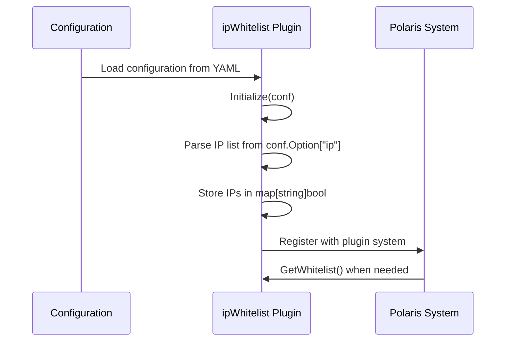
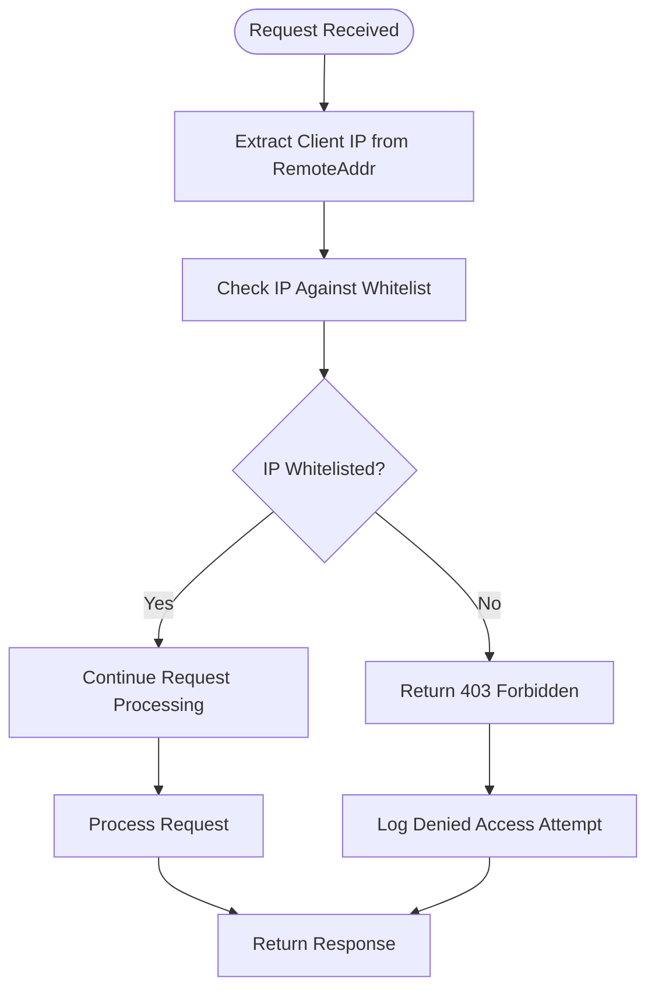

# IP Whitelisting

<cite>
**Referenced Files in This Document**   
- [whitelist.go](file://apis/access_control/whitelist/whitelist.go)
- [ip_whitelist.go](file://plugin/access_control/whitelist/ip/ip_whitelist.go)
- [ip_whitelist_test.go](file://plugin/access_control/whitelist/ip/ip_whitelist_test.go)
- [pole-server.yaml](file://deploy/conf/pole-server.yaml)
- [pole-apiserver.yaml](file://deploy/conf/pole-apiserver.yaml)
- [server.go](file://plugin/apiserver/httpserver/server.go)
- [nacosserver/v1/server.go](file://plugin/apiserver/nacosserver/v1/server.go)
</cite>

## Table of Contents
1. [Introduction](#introduction)
2. [Core Components](#core-components)
3. [Configuration and Management](#configuration-and-management)
4. [Integration with HTTP and gRPC Servers](#integration-with-http-and-grpc-servers)
5. [Use Cases](#use-cases)
6. [IPv4 and IPv6 Support](#ipv4-and-ipv6-support)
7. [Performance Implications](#performance-implications)
8. [Common Issues](#common-issues)
9. [Best Practices](#best-practices)

## Introduction
The IP whitelisting feature in the Polaris server provides network-level access control to restrict API and console access to trusted IP addresses or CIDR ranges. This security mechanism ensures that only authorized clients from predefined IP addresses can interact with critical services, protecting administrative endpoints, configuration APIs, and service registration interfaces. The implementation follows a plugin-based architecture that allows dynamic updates without requiring server restarts, enabling flexible and responsive security policies in production environments.

## Core Components

The IP whitelisting functionality is implemented through a modular plugin architecture with well-defined interfaces and implementations. The core components include the whitelist interface definition and the IP-specific implementation.

```mermaid
classDiagram
class Whitelist {
+Name() string
+Initialize(conf *ConfigEntry) error
+Destroy() error
+Type() PluginType
+Contain(entry interface{}) bool
}
class ipWhitelist {
-ips map[string]bool
+Name() string
+Initialize(conf *ConfigEntry) error
+Destroy() error
+Type() PluginType
+Contain(entry interface{}) bool
}
Whitelist <|-- ipWhitelist : "implements"
```

**Diagram sources**
- [whitelist.go](file://apis/access_control/whitelist/whitelist.go#L15-L25)
- [ip_whitelist.go](file://plugin/access_control/whitelist/ip/ip_whitelist.go#L15-L65)

The `Whitelist` interface extends the base `Plugin` interface and defines the contract for whitelist implementations, with the key method being `Contain(entry interface{}) bool` which determines whether a given entry (in this case, an IP address) is permitted access. The `ipWhitelist` struct implements this interface using a simple map-based storage mechanism where IP addresses are stored as keys with boolean values indicating their presence in the whitelist.

**Section sources**
- [whitelist.go](file://apis/access_control/whitelist/whitelist.go#L15-L40)
- [ip_whitelist.go](file://plugin/access_control/whitelist/ip/ip_whitelist.go#L15-L65)

## Configuration and Management

IP whitelist rules are configured through the server's configuration files, allowing for dynamic updates without requiring service restarts. The configuration is structured to support multiple IP addresses in a list format within the plugin configuration section.

The whitelist plugin is registered during initialization via the `init()` function in `ip_whitelist.go`, which calls `apis.RegisterPlugin(PluginName, &ipWhitelist{})` to make the plugin available to the system. Configuration is provided through the `Initialize(conf *apis.ConfigEntry)` method, which expects a configuration entry with an "ip" option containing a list of IP addresses.



**Diagram sources**
- [ip_whitelist.go](file://plugin/access_control/whitelist/ip/ip_whitelist.go#L27-L45)
- [whitelist.go](file://apis/access_control/whitelist/whitelist.go#L35-L40)

The configuration format requires the IP addresses to be provided as a list under the "ip" key. If the configuration is malformed (e.g., providing a string instead of a list), the initialization will fail with an error, ensuring configuration integrity.

**Section sources**
- [ip_whitelist.go](file://plugin/access_control/whitelist/ip/ip_whitelist.go#L35-L50)
- [ip_whitelist_test.go](file://plugin/access_control/whitelist/ip/ip_whitelist_test.go#L47-L115)

## Integration with HTTP and gRPC Servers

The IP whitelisting system is integrated with both HTTP and gRPC servers to enforce access control before request processing begins. The integration follows a middleware pattern where the whitelist check is performed as part of the request authentication pipeline.

For HTTP servers, the integration occurs in the `enterAuth` method of the `HTTPServer` struct, which extracts the client IP from the request's `RemoteAddr` and checks it against the whitelist. The Nacos V1 server implements similar integration, checking for the presence of a whitelist plugin during initialization.



**Diagram sources**
- [server.go](file://plugin/apiserver/httpserver/server.go#L577-L621)
- [nacosserver/v1/server.go](file://plugin/apiserver/nacosserver/v1/server.go#L120-L165)

The integration is conditional on the presence of a configured whitelist plugin. If no whitelist is configured (`h.whitelist == nil`), the access control check is bypassed, allowing all requests to proceed to the next stage of processing. When a whitelist is active, requests from non-whitelisted IPs are denied with a "403 Forbidden" response and logged for security auditing.

**Section sources**
- [server.go](file://plugin/apiserver/httpserver/server.go#L577-L621)
- [nacosserver/v1/server.go](file://plugin/apiserver/nacosserver/v1/server.go#L120-L165)

## Use Cases

The IP whitelisting feature serves several critical security use cases in the Polaris server deployment:

### Securing Administrative Endpoints
Administrative endpoints can be protected by configuring the whitelist to include only management network IP addresses. This prevents unauthorized access to sensitive operations like service registration, configuration management, and system maintenance.

### Protecting Against Unauthorized Service Registration
By restricting access to service registration APIs, the whitelist prevents rogue services from registering with the discovery system. This is particularly important in multi-tenant environments where service registration needs to be tightly controlled.

### Limiting Access to Configuration APIs
Configuration APIs that allow modification of system settings can be protected by IP whitelisting, ensuring that only trusted configuration management systems or administrative workstations can modify critical settings.

The configuration examples in `pole-apiserver.yaml` demonstrate how whitelisting can be applied to specific server instances, such as the Eureka server and HTTP API server, with the `whiteList: 127.0.0.1` configuration limiting access to localhost only.

**Section sources**
- [pole-apiserver.yaml](file://deploy/conf/pole-apiserver.yaml#L15-L18)
- [pole-apiserver.yaml](file://deploy/conf/pole-apiserver.yaml#L45-L48)

## IPv4 and IPv6 Support

The current implementation of the IP whitelisting system supports IPv4 addresses through string-based comparison. IP addresses are stored and matched as strings in the `ips map[string]bool` data structure, which allows for direct string comparison during the `Contain` operation.

While the code does not explicitly prevent IPv6 addresses from being added to the whitelist, the current implementation treats all IP addresses as simple strings without performing any CIDR range calculations or subnet matching. This means that only exact IP address matches are supported, and there is no built-in support for CIDR notation (e.g., 192.168.0.0/24) in the current implementation.

The system extracts the IP address from the `RemoteAddr` by splitting on the colon character and taking the first segment, which works for both IPv4 and IPv6 addresses in the standard host:port format. However, IPv6 addresses in the standard notation (with colons) may require special handling that is not currently implemented.

**Section sources**
- [ip_whitelist.go](file://plugin/access_control/whitelist/ip/ip_whitelist.go#L60-L65)
- [server.go](file://plugin/apiserver/httpserver/server.go#L585-L590)

## Performance Implications

The IP whitelisting implementation is designed for high-performance access control with minimal overhead. The use of a map data structure for IP storage provides O(1) average-case lookup time complexity, making the `Contain` operation extremely efficient even with large numbers of whitelisted IPs.

The memory footprint is directly proportional to the number of whitelisted IP addresses, with each entry requiring storage for the IP string and a boolean value. Since the map only stores whitelisted IPs (not all possible IPs), the memory usage remains reasonable even with hundreds or thousands of entries.

At scale, the performance impact is negligible as the IP extraction and lookup operations are performed once per request during the authentication phase. The implementation avoids expensive operations like regular expression matching or complex string parsing, relying instead on simple string splitting and map lookup.

The current implementation does not include any caching mechanisms beyond the inherent efficiency of the map data structure, but the O(1) lookup time makes additional caching unnecessary for most use cases.

**Section sources**
- [ip_whitelist.go](file://plugin/access_control/whitelist/ip/ip_whitelist.go#L60-L65)
- [server.go](file://plugin/apiserver/httpserver/server.go#L577-L621)

## Common Issues

Several common issues can arise when configuring and managing IP whitelisting rules:

### Misconfigured CIDR Blocks
The current implementation does not support CIDR notation, so attempting to configure ranges like "192.168.0.0/24" will not work as expected. Each IP address must be specified individually in the configuration list.

### Overlapping Rules
Since the system uses exact string matching rather than subnet calculations, there is no concept of rule precedence or overlapping rules. An IP is either in the whitelist or it is not, with no hierarchical evaluation.

### Bypass Scenarios
The whitelist check can be bypassed if the `RemoteAddr` format does not match the expected host:port pattern. The code splits on the colon character and uses the first segment as the IP, so any deviation from this format could potentially bypass the check.

### Configuration Errors
Providing the IP list in an incorrect format (e.g., as a string rather than a list) will cause the plugin initialization to fail, potentially disabling the whitelist functionality entirely if not properly monitored.

**Section sources**
- [ip_whitelist.go](file://plugin/access_control/whitelist/ip/ip_whitelist.go#L40-L50)
- [ip_whitelist_test.go](file://plugin/access_control/whitelist/ip/ip_whitelist_test.go#L60-L115)

## Best Practices

To maximize the effectiveness and reliability of the IP whitelisting feature, consider the following best practices:

### Combine with Authentication
IP whitelisting should be used as a first line of defense in combination with strong authentication mechanisms. While IP filtering restricts network access, proper authentication ensures that only authorized users can perform operations even from permitted IP addresses.

### Implement Rate Limiting
Combine IP whitelisting with rate limiting to prevent abuse even from whitelisted IPs. This protects against denial-of-service attacks and brute force attempts from trusted networks.

### Monitor and Log Access Attempts
Ensure that denied access attempts are properly logged for security auditing and intrusion detection. The current implementation logs denied access, which should be monitored as part of security operations.

### Use Defense in Depth
Implement IP whitelisting as part of a comprehensive security strategy that includes network segmentation, firewalls, TLS encryption, and regular security assessments.

### Test Configuration Changes
Always test whitelist configuration changes in a staging environment before deploying to production, as incorrect configurations could lock out legitimate users or expose sensitive endpoints.

**Section sources**
- [server.go](file://plugin/apiserver/httpserver/server.go#L577-L621)
- [pole-apiserver.yaml](file://deploy/conf/pole-apiserver.yaml#L15-L18)