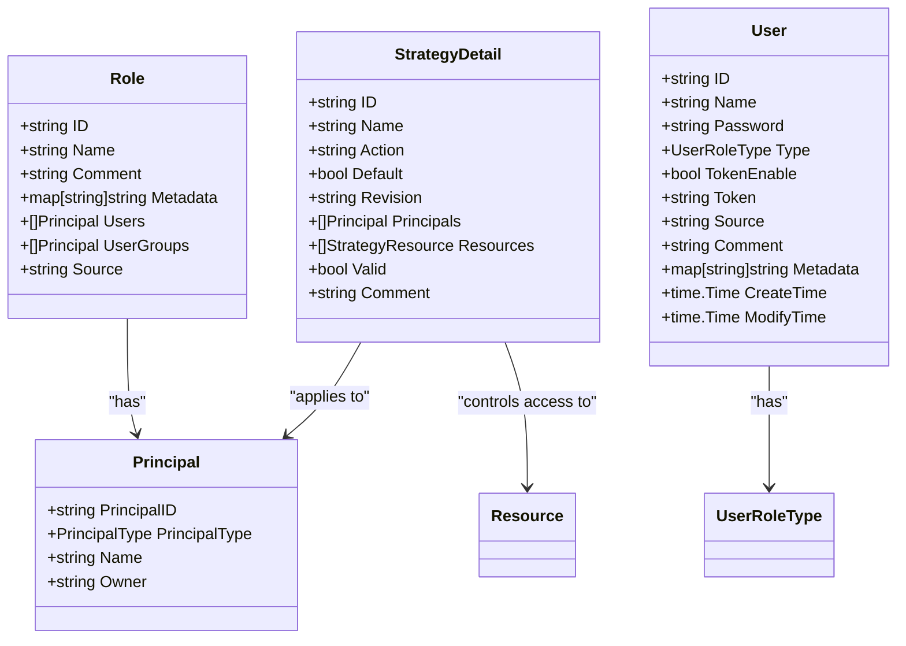
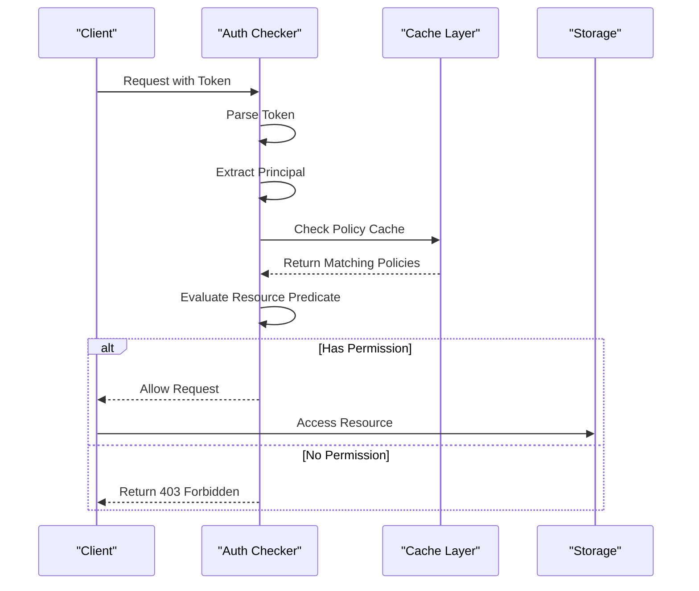
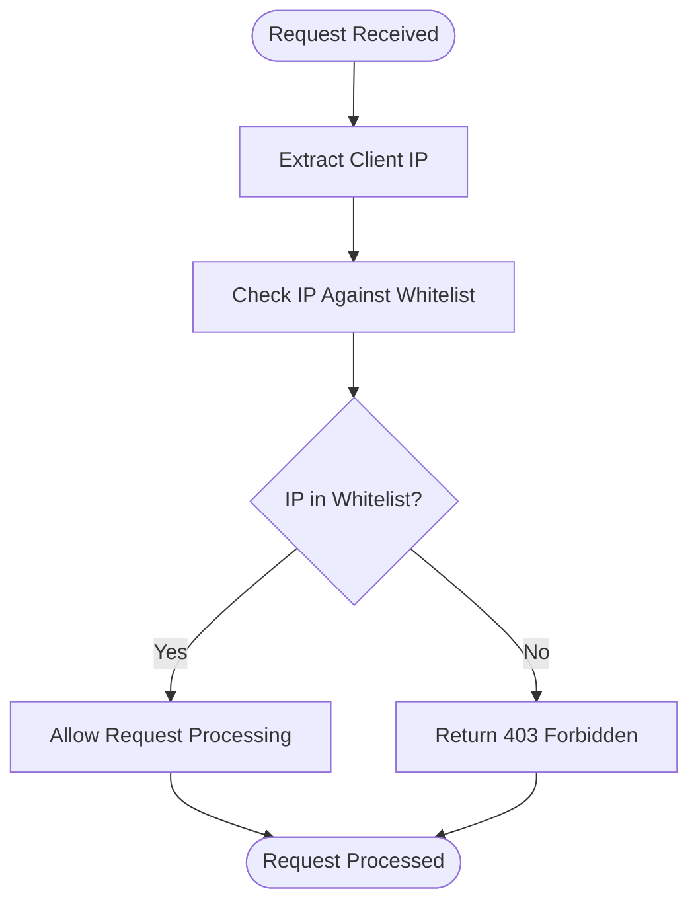
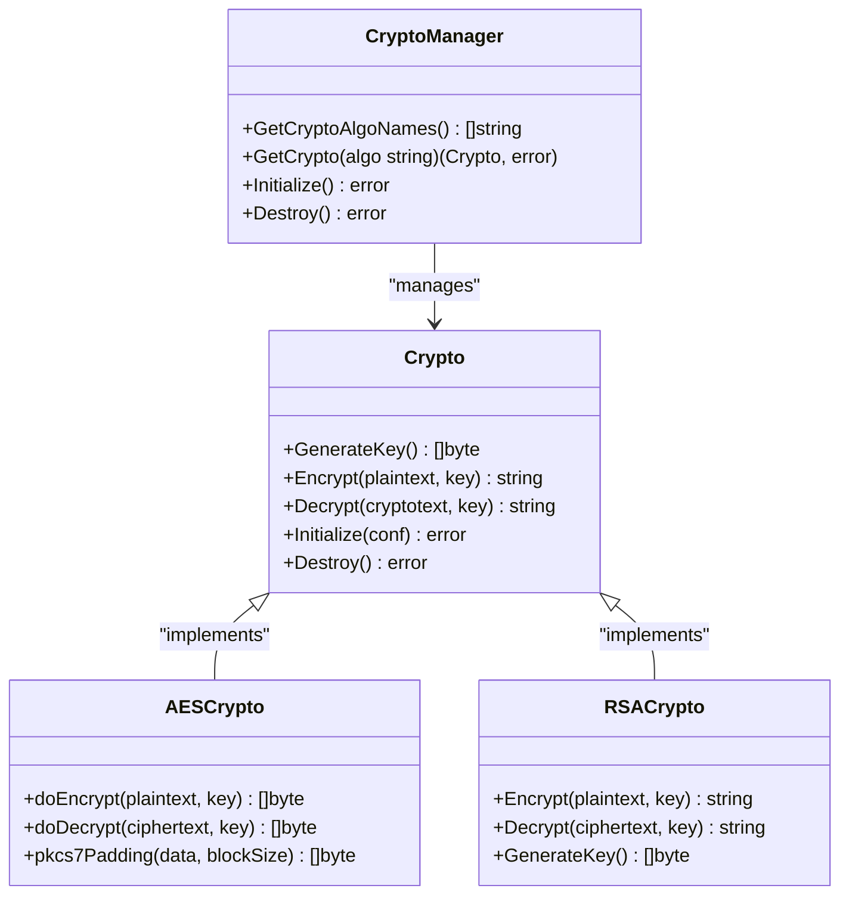

# Security & Access Control

<cite>
**Referenced Files in This Document**   
- [auth.go](file://plugin/access_control/auth/user/server.go)
- [user.go](file://plugin/access_control/auth/user/user.go)
- [token.go](file://plugin/access_control/auth/user/token.go)
- [policy.go](file://plugin/access_control/auth/policy/policy.go)
- [auth_checker.go](file://plugin/access_control/auth/policy/auth_checker.go)
- [role.go](file://plugin/access_control/auth/policy/role.go)
- [ip_whitelist.go](file://plugin/access_control/whitelist/ip/ip_whitelist.go)
- [crypto.go](file://plugin/crypto/aes/aes.go)
- [crypto.go](file://apis/crypto/crypto.go)
- [config_chain.go](file://pkg/config/config_chain.go)
</cite>

## Table of Contents
1. [Authentication System](#authentication-system)
2. [Role-Based Access Control (RBAC)](#role-based-access-control-rbac)
3. [Endpoint-Level Authorization](#endpoint-level-authorization)
4. [IP Whitelisting](#ip-whitelisting)
5. [Credential Storage and Encryption](#credential-storage-and-encryption)
6. [User and Role Management](#user-and-role-management)
7. [Security Best Practices](#security-best-practices)
8. [Troubleshooting Guide](#troubleshooting-guide)

## Authentication System

The authentication system in the pole-server project is built around token-based credentials, primarily using JWT-like tokens and API keys for secure access. The system supports both user and group-based authentication through a robust token mechanism implemented in the `plugin/access_control/auth/user` package.

Authentication is performed via the `CheckCredential` method in the `Server` struct, which verifies the provided token from request headers (either `Authorization` or `X-Polaris-Token`). The token undergoes decryption using AES-CFB mode with a server-defined salt value. Upon successful decryption, the system extracts the operator ID and determines whether the token belongs to a user or user group.

The authentication flow includes several validation steps:
1. Token parsing and decryption
2. Principal verification (user or group existence)
3. Token validity checking
4. Role assignment based on user type
5. Context enrichment with operator information

Tokens are created using the `CreateToken` function, which generates a UUID-based random string combined with user or group identifiers. The token format follows the pattern `{random-string}::{type}/{id}` where type is either "user" or "group".

For password-based authentication, the system uses bcrypt hashing with default cost parameters to securely store and verify passwords. The authentication process compares the provided password with the stored hash using `bcrypt.CompareHashAndPassword`.

**Section sources**
- [server.go](file://plugin/access_control/auth/user/server.go#L143-L167)
- [user.go](file://plugin/access_control/auth/user/user.go#L500-L650)
- [token.go](file://plugin/access_control/auth/user/token.go#L0-L195)

## Role-Based Access Control (RBAC)

The RBAC system implements a comprehensive policy-based access control mechanism that supports users, groups, and roles. The system is centered around the `StrategyDetail` structure which defines authorization policies with principals (users, groups, or roles), actions (READ, WRITE, READ_WRITE), and associated resources.

Policies are managed through the `policy` package and stored in a cache layer for efficient access. Each policy contains:
- A unique ID and revision number
- Name and comment
- Action type (allow/deny)
- List of principals (users, groups, roles)
- List of resources with types and IDs
- Validity status

The system supports default policies for both users and groups. When a new user or group is created, a default read-write policy is automatically generated with appropriate permissions. The `defaultUserGroupPolicy` function creates these default policies with predefined names and actions.

Role management is handled through the `role.go` file, which provides CRUD operations for roles. Roles can be assigned to users and user groups, establishing a many-to-many relationship. The system maintains role metadata and supports filtering and querying roles based on various criteria.

The policy evaluation process follows a deny-over-allow principle. When checking permissions, the system first checks for explicit deny rules before considering allow rules. This ensures that specific denials take precedence over general allowances.

**Diagram sources**
- [role.go](file://plugin/access_control/auth/policy/role.go#L0-L251)
- [policy.go](file://plugin/access_control/auth/policy/policy.go#L575-L609)

**Section sources**
- [policy.go](file://plugin/access_control/auth/policy/policy.go#L575-L609)
- [role.go](file://plugin/access_control/auth/policy/role.go#L0-L251)
- [policy.go](file://pkg/cache/auth/policy.go#L194-L215)

## Endpoint-Level Authorization

Endpoint-level authorization is implemented through a comprehensive permission checking system that operates at both the API and console levels. The authorization system uses the `AcquireContext` to track authentication and authorization state throughout the request processing pipeline.

The `ResourcePredicate` method in the `DefaultAuthChecker` struct performs the core authorization check. It evaluates whether a principal (user or group) has permission to perform an operation on a specific resource. The method considers:
- Request origin (client or console)
- Authentication status
- Principal identity
- Resource type and ID
- Policy rules

For console access, the system requires explicit permission checks through methods like `CheckConsolePermission`. These checks are performed before allowing access to sensitive operations such as creating, updating, or deleting rate limits, configuration files, or service rules.

The authorization system supports fine-grained control through resource-specific predicates. For example, when retrieving rate limits, the system applies a predicate function that filters results based on the authenticated user's permissions:

**Diagram sources**
- [auth_checker.go](file://plugin/access_control/auth/policy/auth_checker.go#L87-L122)
- [ratelimit_rule.go](file://pkg/goverrule/interceptor/auth/ratelimit_rule.go#L136-L171)

**Section sources**
- [auth_checker.go](file://plugin/access_control/auth/policy/auth_checker.go#L87-L122)
- [ratelimit_rule.go](file://pkg/goverrule/interceptor/auth/ratelimit_rule.go#L30-L62)
- [ratelimit_rule.go](file://pkg/goverrule/interceptor/auth/ratelimit_rule.go#L136-L171)

## IP Whitelisting

The IP whitelisting feature provides network-level security by restricting access to the server based on client IP addresses. The implementation is located in `plugin/access_control/whitelist/ip/ip_whitelist.go` and follows a simple yet effective design.

The IP whitelist is initialized from configuration with a list of allowed IP addresses. During initialization, the system validates that the configuration contains a proper array of IP strings and returns an error if the format is incorrect. The whitelist stores IP addresses in a map with boolean values for O(1) lookup performance.

The core functionality is provided by the `Contain` method, which checks if a given IP address is present in the whitelist. The method accepts an interface{} parameter but expects a string representation of an IP address. It performs a direct map lookup to determine membership.

The whitelist can be configured through the server's configuration system by specifying the plugin name "whitelist" and providing an array of IP addresses under the "ip" option. The system supports both IPv4 and IPv6 addresses.

**Diagram sources**
- [ip_whitelist.go](file://plugin/access_control/whitelist/ip/ip_whitelist.go#L0-L66)
- [ip_whitelist_test.go](file://plugin/access_control/whitelist/ip/ip_whitelist_test.go#L47-L115)

**Section sources**
- [ip_whitelist.go](file://plugin/access_control/whitelist/ip/ip_whitelist.go#L0-L66)
- [ip_whitelist_test.go](file://plugin/access_control/whitelist/ip/ip_whitelist_test.go#L0-L45)

## Credential Storage and Encryption

Credential storage and encryption are handled through a dedicated crypto plugin system that supports multiple encryption algorithms. The system is designed to securely store sensitive data such as configuration file contents and user credentials.

The crypto system is implemented in the `plugin/crypto` directory with support for both AES and RSA encryption algorithms. The AES implementation uses CBC mode with PKCS7 padding for encrypting data. The encryption process generates a random initialization vector (IV) for each encryption operation and prepends it to the ciphertext.

For configuration file encryption, the system uses a two-layer approach:
1. Generate a random data key for each configuration file
2. Encrypt the file content with the data key using AES
3. Store the base64-encoded data key in the file's metadata

The encryption process is managed by the `CryptoConfigFileChain` in the configuration system. When creating or updating a configuration file, the system automatically encrypts the content if encryption is enabled. The `encryptConfigFile` method handles the encryption process, including key generation and metadata updates.

The crypto manager provides a unified interface for different encryption algorithms through the `CryptoManager` interface. This allows the system to support multiple algorithms while maintaining a consistent API for encryption and decryption operations.

**Diagram sources**
- [crypto.go](file://apis/crypto/crypto.go#L55-L123)
- [aes.go](file://plugin/crypto/aes/aes.go#L57-L112)
- [config_chain.go](file://pkg/config/config_chain.go#L225-L273)

**Section sources**
- [crypto.go](file://apis/crypto/crypto.go#L0-L53)
- [crypto.go](file://apis/crypto/crypto.go#L55-L123)
- [aes.go](file://plugin/crypto/aes/aes.go#L57-L112)
- [config_chain.go](file://pkg/config/config_chain.go#L225-L273)

## User and Role Management

User and role management is implemented through a comprehensive API that supports creating, updating, deleting, and querying users and roles. The system maintains a clear separation between user accounts and their associated roles and permissions.

User creation is handled by the `CreateUser` method, which performs several validation steps:
1. Check for existing users with the same name
2. Validate owner relationship
3. Hash the password using bcrypt
4. Generate a unique token
5. Store the user in the database
6. Create default policies

The system supports different user roles, including owner, sub-account, and anonymous users. Role information is stored in the user record and used during authentication to determine permissions. The `UserRoleType` enum defines the available role types in the system.

Role management allows administrators to create custom roles with specific permissions. Roles can be assigned to multiple users and user groups, enabling flexible permission management. The system supports batch operations for both users and roles, allowing efficient management of multiple entities.

User tokens can be enabled, disabled, and reset through dedicated API endpoints. The `ResetUserToken` method generates a new token for a user while maintaining their existing permissions and settings. Token status is tracked through the `TokenEnable` field in the user record.

**Section sources**
- [user.go](file://plugin/access_control/auth/user/user.go#L0-L650)
- [role.go](file://plugin/access_control/auth/policy/role.go#L0-L251)
- [user.go](file://pkg/cache/auth/user.go#L0-L50)

## Security Best Practices

The system implements several security best practices to ensure robust protection against common threats:

1. **Password Security**: Uses bcrypt with default cost parameters to hash passwords, protecting against brute force attacks.

2. **Token Security**: Implements token encryption using AES-CFB mode with random IVs, preventing token tampering and ensuring confidentiality.

3. **Input Validation**: Validates all user inputs and configuration parameters to prevent injection attacks and malformed data.

4. **Error Handling**: Provides meaningful error messages without exposing sensitive information about the system internals.

5. **Audit Logging**: Records all security-relevant operations through the `RecordHistory` method, enabling traceability of user actions.

6. **Principle of Least Privilege**: Implements fine-grained access control, ensuring users have only the permissions necessary for their roles.

7. **Secure Defaults**: Configures secure default settings, such as enabling token authentication by default.

8. **Configuration Encryption**: Encrypts sensitive configuration data at rest using strong encryption algorithms.

9. **Rate Limiting**: Integrates with the rate limiting system to prevent abuse and denial-of-service attacks.

10. **Network Security**: Supports IP whitelisting to restrict access to trusted networks.

The system also implements proper session management through token expiration and revocation mechanisms. While the current implementation doesn't show explicit token expiration, the token reset functionality allows administrators to invalidate compromised tokens.

## Troubleshooting Guide

This section provides guidance for diagnosing and resolving common authentication and authorization issues.

### Authentication Failures

**Symptom**: "Invalid token" or "Token does not exist" errors
- **Cause**: The provided token is malformed, expired, or has been reset
- **Solution**: 
  1. Verify the token format follows the expected pattern
  2. Check if the user account exists and is active
  3. Reset the user token if necessary
  4. Ensure the server salt value matches when tokens were generated

**Symptom**: "Wrong username or password" errors
- **Cause**: Incorrect credentials provided during login
- **Solution**:
  1. Verify the username and password combination
  2. Check if the user account is enabled
  3. Reset the user password if forgotten
  4. Verify the bcrypt hash comparison is working correctly

### Permission Denied Errors

**Symptom**: "Permission denied" or "Not allowed access" errors
- **Cause**: The authenticated user lacks sufficient permissions for the requested operation
- **Solution**:
  1. Verify the user's role and associated policies
  2. Check if the resource exists and is accessible
  3. Review the policy rules for the user or group
  4. Ensure the user is assigned to the correct role
  5. Verify the resource type and ID in the policy match the requested resource

**Symptom**: IP address not allowed despite being in whitelist
- **Cause**: Configuration issues or IP address format mismatch
- **Solution**:
  1. Verify the IP address is correctly formatted in the configuration
  2. Check if the whitelist plugin is properly initialized
  3. Ensure the IP address is in the correct format (IPv4 or IPv6)
  4. Verify the configuration is loaded and applied

### Common Debugging Steps

1. Enable debug logging for the authentication module
2. Check server logs for authentication-related error messages
3. Verify the configuration files are correctly loaded
4. Test with known good credentials and tokens
5. Use the audit logs to trace user actions and permission checks

**Section sources**
- [server.go](file://plugin/access_control/auth/user/server.go#L143-L167)
- [auth_checker.go](file://plugin/access_control/auth/policy/auth_checker.go#L87-L122)
- [user.go](file://plugin/access_control/auth/user/user.go#L500-L650)