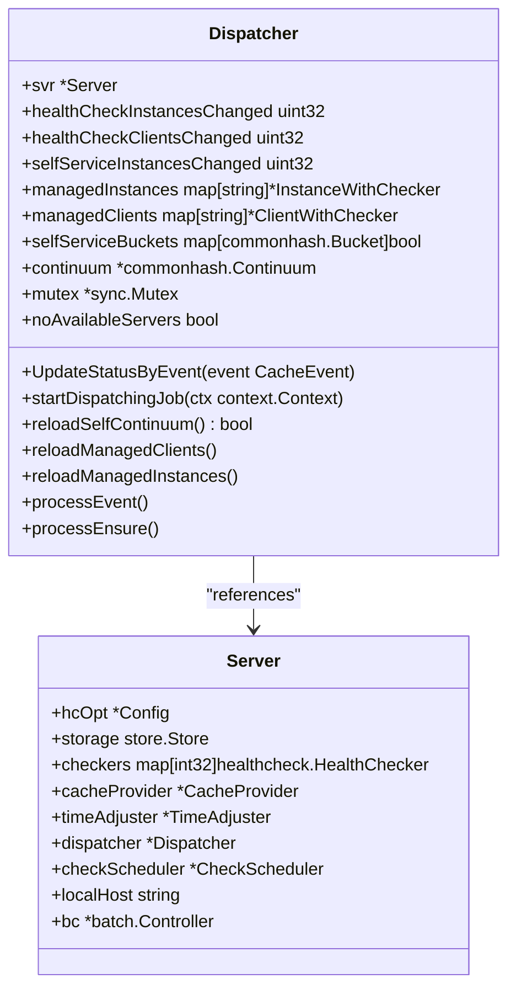
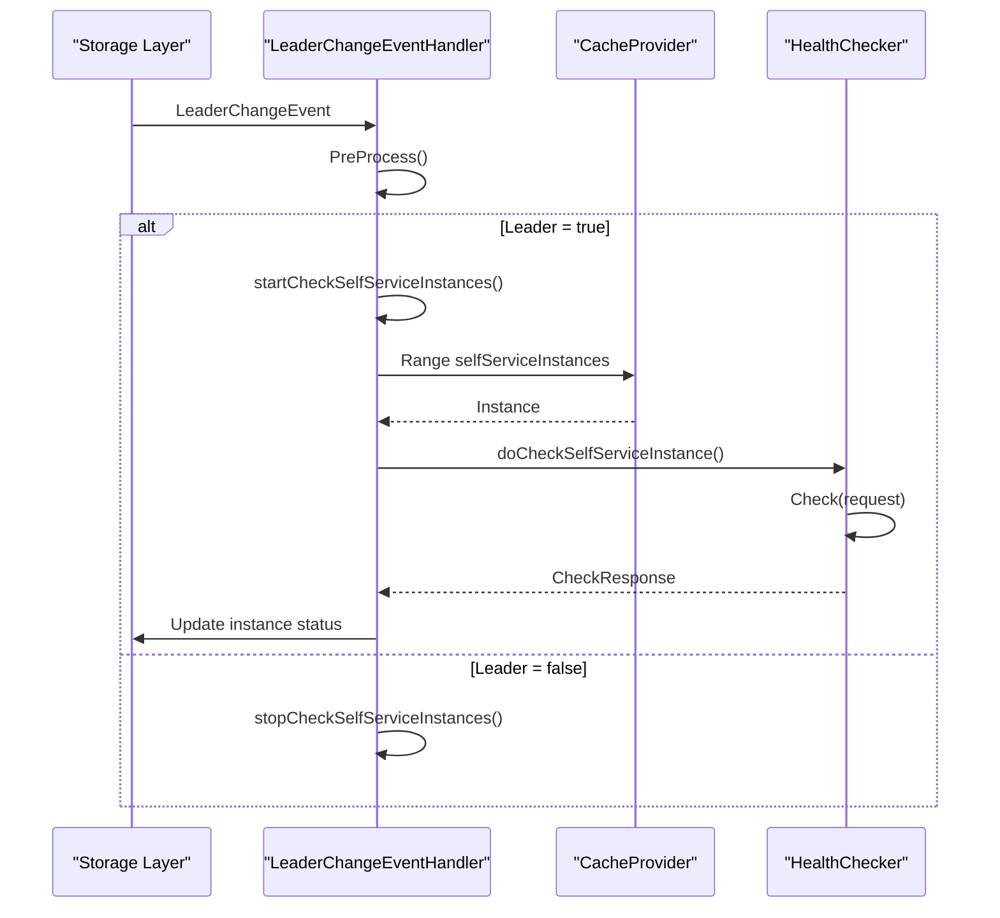
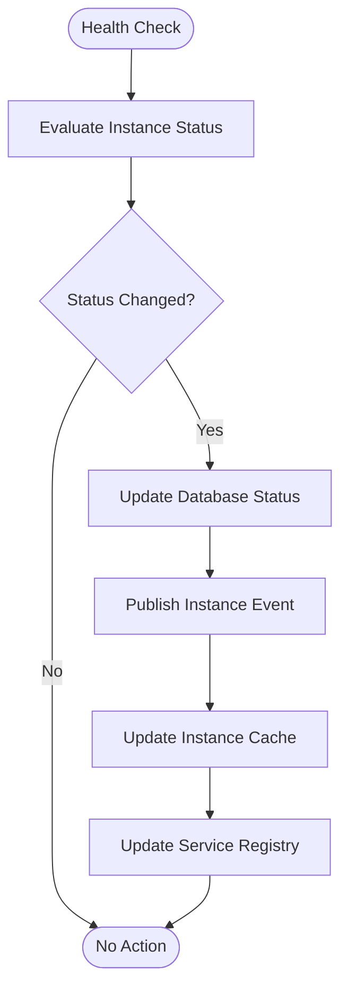
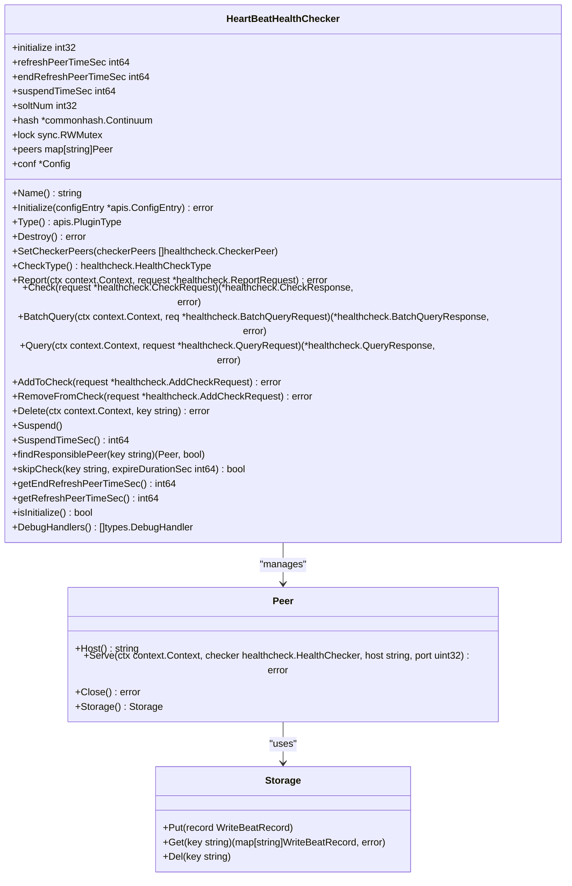

# Health Checking

<cite>
**Referenced Files in This Document**   
- [dispatch.go](file://pkg/service/healthcheck/dispatch.go)
- [leader.go](file://pkg/service/healthcheck/leader.go)
- [beat_checker.go](file://plugin/service/healthchecker/heartbeat/beat_checker.go)
- [check.go](file://pkg/service/healthcheck/check.go)
- [cache.go](file://pkg/service/healthcheck/cache.go)
- [server.go](file://pkg/service/healthcheck/server.go)
- [config.go](file://pkg/service/healthcheck/config.go)
- [option.go](file://pkg/service/healthcheck/option.go)
- [time_adjust.go](file://pkg/service/healthcheck/time_adjust.go)
- [report.go](file://pkg/service/healthcheck/report.go)
</cite>

## Table of Contents
1. [Introduction](#introduction)
2. [Health Check Modes](#health-check-modes)
3. [Configuration Options](#configuration-options)
4. [Health Check Dispatcher](#health-check-dispatcher)
5. [Leader Election Mechanism](#leader-election-mechanism)
6. [Status Propagation](#status-propagation)
7. [Failure Detection and Recovery](#failure-detection-and-recovery)
8. [External Health Checker Integration](#external-health-checker-integration)
9. [Troubleshooting Guide](#troubleshooting-guide)

## Introduction
The health checking system provides comprehensive monitoring capabilities for service instances and clients in distributed environments. It implements both active and passive health check modes to ensure service reliability and availability. The system uses a distributed architecture with consistent hashing for workload distribution and leader election for coordinated operations. Health status is propagated through instance caches and service registries, enabling real-time service discovery and failover mechanisms.

## Health Check Modes
The system supports two primary health check modes: active probing and heartbeat-based monitoring. Active probing involves periodic checks initiated by the health checker to verify service availability, while heartbeat-based monitoring relies on regular signals from service instances to indicate their operational status.

Heartbeat-based monitoring is implemented through the heartbeat health checker plugin, which processes heartbeat reports from service instances. The system validates heartbeat requests, updates last heartbeat timestamps, and triggers health status evaluations based on configured thresholds. Active probing complements heartbeat monitoring by providing additional verification for critical services.

**Section sources**
- [beat_checker.go](file://plugin/service/healthchecker/heartbeat/beat_checker.go#L1-L420)
- [check.go](file://pkg/service/healthcheck/check.go#L1-L631)

## Configuration Options
The health checking system provides extensive configuration options for tuning check intervals, failure thresholds, and timeout settings. These configurations are defined in the health check configuration structure and can be customized based on service requirements.

Key configuration parameters include:
- **Check intervals**: Minimum and maximum intervals between health checks
- **Failure thresholds**: Number of consecutive failures before marking an instance as unhealthy
- **Timeout settings**: Duration after which a missing heartbeat is considered a failure
- **Client check intervals**: Frequency of client health verification
- **Slot numbers**: Number of hash slots for consistent hashing distribution

The system applies default values when specific configurations are not provided, ensuring operational continuity while allowing for fine-grained control over health check behavior.

**Section sources**
- [config.go](file://pkg/service/healthcheck/config.go#L1-L84)
- [check.go](file://pkg/service/healthcheck/check.go#L1-L631)

## Health Check Dispatcher
The health check dispatcher manages the distribution of health check responsibilities across cluster nodes using consistent hashing. It ensures balanced workload distribution and efficient resource utilization by assigning instances to specific checker nodes based on hash values.

**Diagram sources**
- [dispatch.go](file://pkg/service/healthcheck/dispatch.go#L1-L240)
- [server.go](file://pkg/service/healthcheck/server.go#L1-L269)

**Section sources**
- [dispatch.go](file://pkg/service/healthcheck/dispatch.go#L1-L240)
- [option.go](file://pkg/service/healthcheck/option.go#L1-L172)

## Leader Election Mechanism
In clustered environments, the leader election mechanism ensures coordinated health check operations for self-service instances. The system uses distributed locking to elect a leader node responsible for monitoring critical service components, preventing duplicate checks and ensuring consistent state management.

The leader change event handler processes leadership transitions, starting or stopping self-service instance checks based on the node's leadership status. When a node becomes the leader, it initiates periodic health checks for self-service instances. When leadership is lost, these checks are suspended to prevent conflicts with the new leader.

**Diagram sources**
- [leader.go](file://pkg/service/healthcheck/leader.go#L1-L153)
- [option.go](file://pkg/service/healthcheck/option.go#L1-L172)

**Section sources**
- [leader.go](file://pkg/service/healthcheck/leader.go#L1-L153)
- [option.go](file://pkg/service/healthcheck/option.go#L1-L172)

## Status Propagation
Health status propagation ensures that instance health information is consistently updated across the system. When health status changes are detected, the system updates both the instance cache and service registry to reflect the current state, enabling accurate service discovery and routing decisions.

The propagation mechanism uses event-driven architecture to notify relevant components of status changes. When an instance's health status changes, an event is published to the event hub, which triggers updates to the instance cache and service registry. This ensures that all system components have access to up-to-date health information.

**Diagram sources**
- [check.go](file://pkg/service/healthcheck/check.go#L1-L631)
- [cache.go](file://pkg/service/healthcheck/cache.go#L1-L449)
- [server.go](file://pkg/service/healthcheck/server.go#L1-L269)

**Section sources**
- [check.go](file://pkg/service/healthcheck/check.go#L1-L631)
- [cache.go](file://pkg/service/healthcheck/cache.go#L1-L449)
- [server.go](file://pkg/service/healthcheck/server.go#L1-L269)

## Failure Detection and Recovery
The failure detection and recovery mechanism identifies unhealthy instances and manages their isolation and potential recovery. The system uses configurable thresholds to determine when an instance should be marked as unhealthy, considering factors such as missed heartbeats and failed active probes.

When an instance is detected as unhealthy, it is isolated from the service registry to prevent traffic routing. The system continues monitoring the instance, and if subsequent checks indicate recovery, the instance is reintegrated into the service pool. This automatic recovery process minimizes downtime while ensuring service quality.

Instance isolation involves updating the instance's health status in the database and propagating this change through the system. The recovery process follows a similar path, restoring the instance's healthy status when appropriate conditions are met.

**Section sources**
- [check.go](file://pkg/service/healthcheck/check.go#L1-L631)
- [report.go](file://pkg/service/healthcheck/report.go#L1-L156)
- [cache.go](file://pkg/service/healthcheck/cache.go#L1-L449)

## External Health Checker Integration
The system integrates with external health checkers through the heartbeat plugin interface, enabling extensible health monitoring capabilities. The heartbeat health checker plugin implements the health checker interface, allowing it to process heartbeat reports, perform health checks, and manage instance status.

External checkers are registered with the system and assigned specific health check types. The dispatcher routes health check requests to the appropriate checker based on the instance's configuration. This plugin architecture allows for the addition of new health check methods without modifying the core system.

The heartbeat checker uses peer-to-peer communication to distribute health check responsibilities across cluster nodes. Each node maintains connections to other checker nodes, enabling efficient routing of heartbeat requests to the responsible node based on consistent hashing.

**Diagram sources**
- [beat_checker.go](file://plugin/service/healthchecker/heartbeat/beat_checker.go#L1-L420)
- [check.go](file://pkg/service/healthcheck/check.go#L1-L631)

**Section sources**
- [beat_checker.go](file://plugin/service/healthchecker/heartbeat/beat_checker.go#L1-L420)
- [option.go](file://pkg/service/healthcheck/option.go#L1-L172)

## Troubleshooting Guide
This section provides guidance for diagnosing and resolving common issues related to the health checking system.

### Missed Heartbeats
When instances experience missed heartbeats, verify the following:
- Network connectivity between the instance and health checker nodes
- Clock synchronization across cluster nodes
- Proper configuration of heartbeat intervals and TTL values
- Sufficient system resources on both client and server sides

Use the GetLastHeartbeat API to retrieve the last recorded heartbeat timestamp and compare it with the expected interval. Check system logs for any errors related to heartbeat processing or storage operations.

### Network Partitions
During network partitions, the system may report false positives for instance health status. To mitigate this:
- Ensure proper configuration of failure detection thresholds
- Verify leader election stability during network disruptions
- Monitor peer communication between checker nodes
- Check the status of distributed locks and election keys

The system's consistent hashing mechanism helps maintain stability during network partitions by redistributing workloads appropriately when nodes become unreachable.

### False Positives
To address false positive health status reports:
- Review and adjust check interval configurations
- Verify time synchronization across all nodes
- Check for clock drift between system and database time
- Validate the accuracy of health check probes

The time adjuster component helps mitigate clock drift issues by periodically synchronizing system time with database time, ensuring accurate health status evaluations.

**Section sources**
- [time_adjust.go](file://pkg/service/healthcheck/time_adjust.go#L1-L82)
- [report.go](file://pkg/service/healthcheck/report.go#L1-L156)
- [check.go](file://pkg/service/healthcheck/check.go#L1-L631)
- [beat_checker.go](file://plugin/service/healthchecker/heartbeat/beat_checker.go#L1-L420)