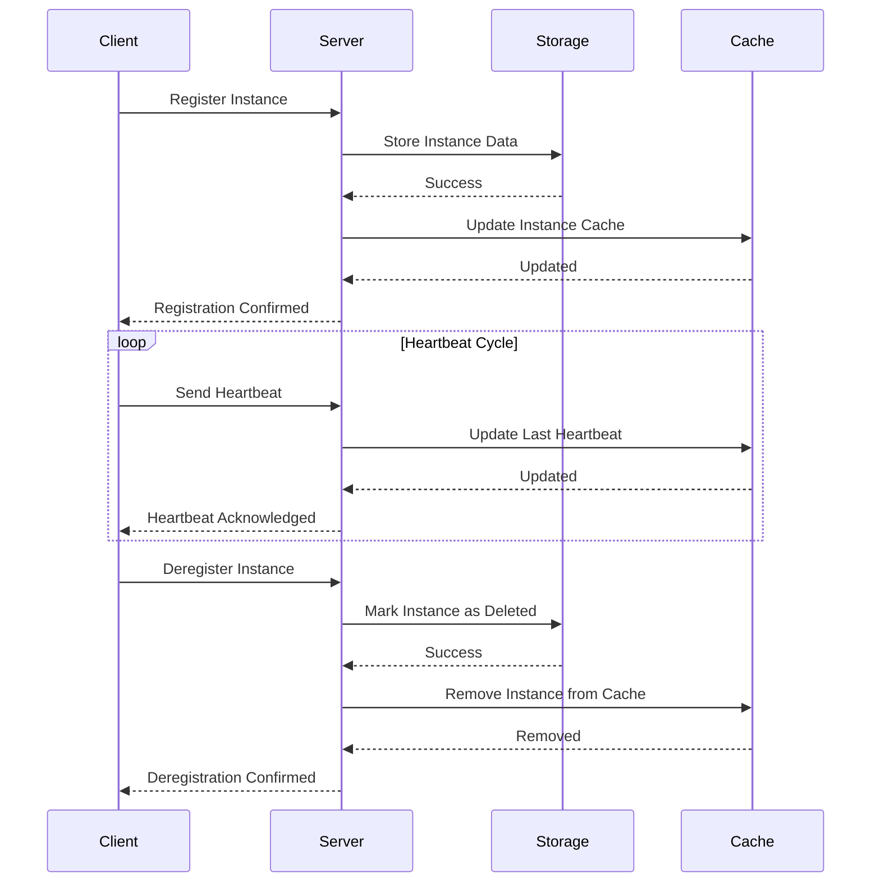
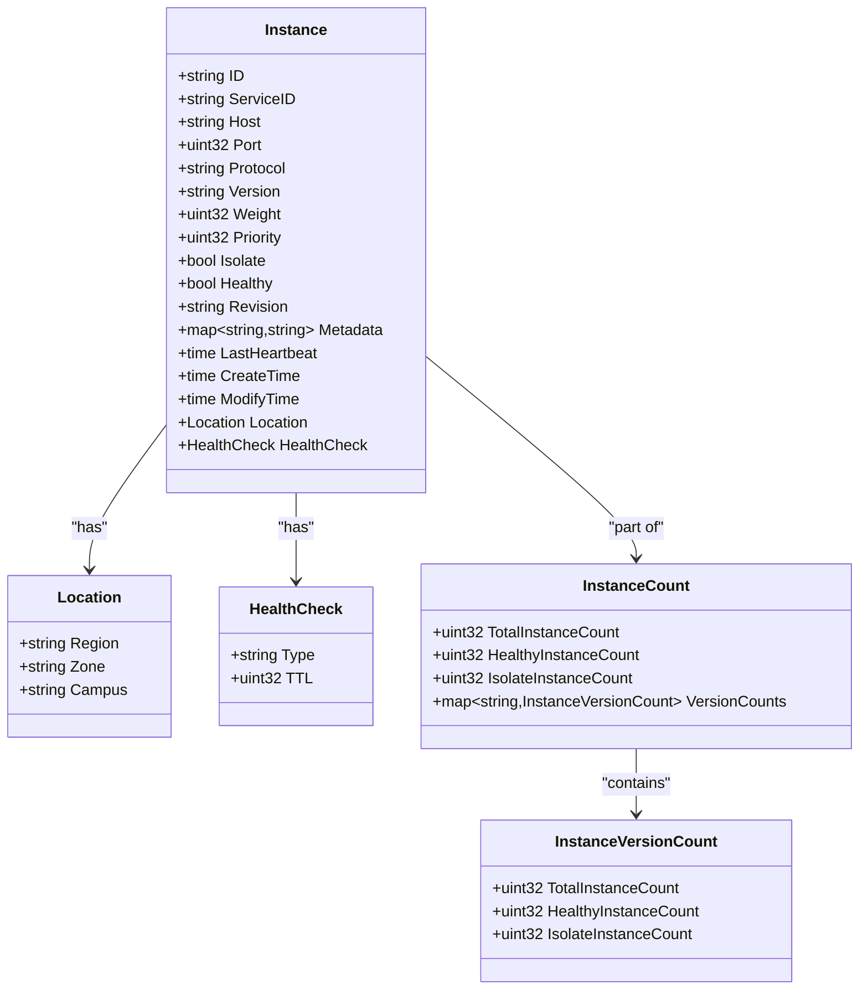
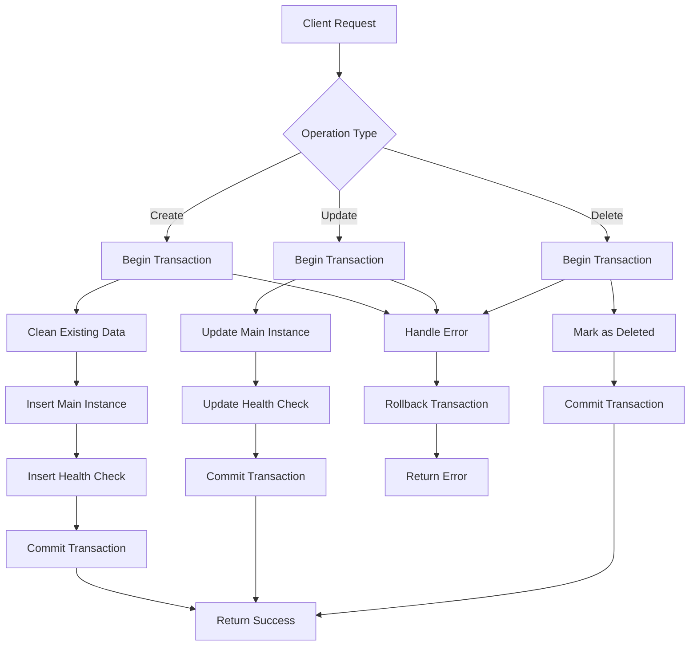
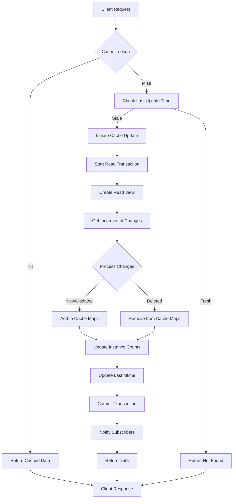
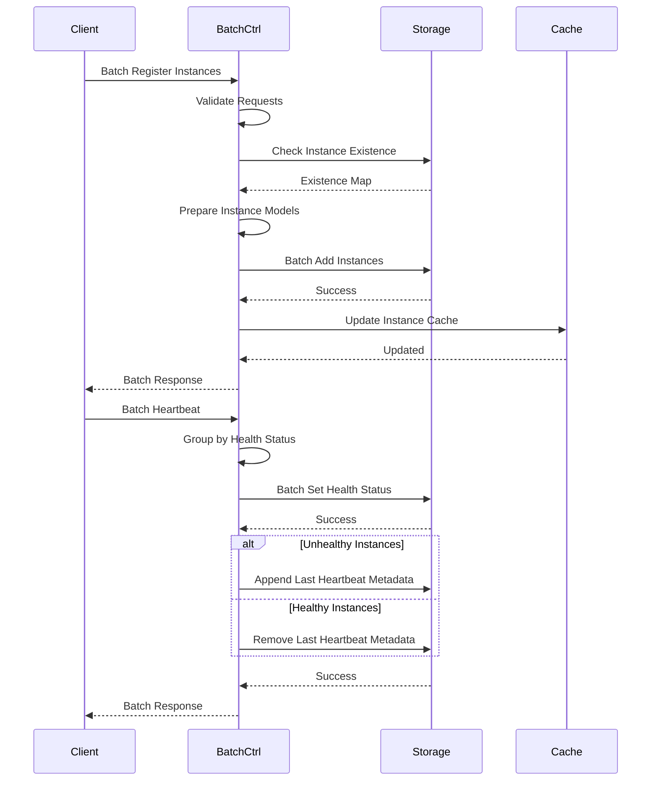
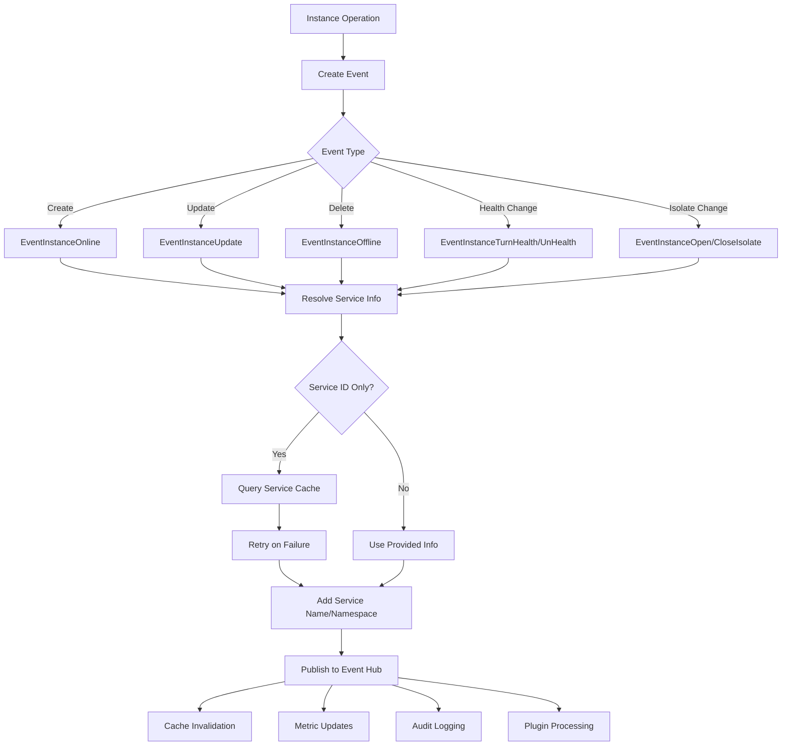
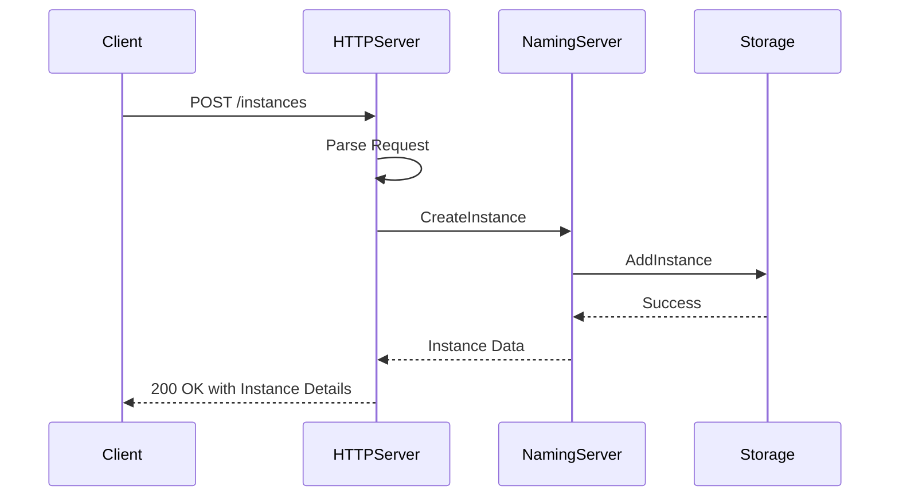
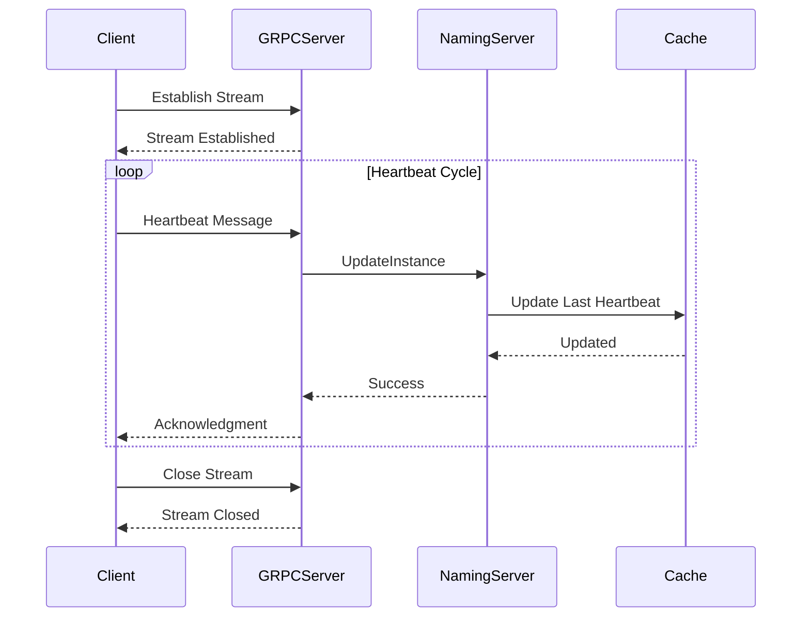
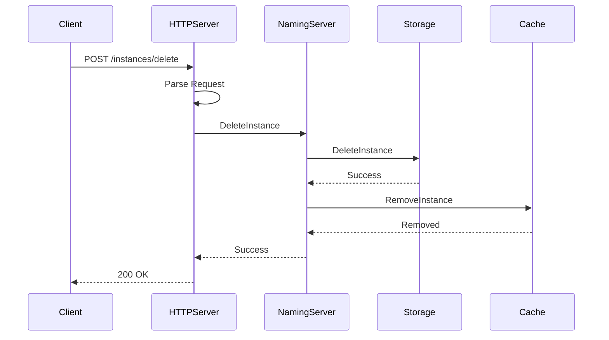

# Instance Management

<cite>
**Referenced Files in This Document**   
- [plugin/store/mysql/instance.go](file://plugin/store/mysql/instance.go)
- [pkg/cache/service/instance.go](file://pkg/cache/service/instance.go)
- [pkg/service/batch/instance.go](file://pkg/service/batch/instance.go)
- [pkg/service/event.go](file://pkg/service/event.go)
- [pkg/service/instance.go](file://pkg/service/instance.go)
- [plugin/apiserver/httpserver/discover/instance_access.go](file://plugin/apiserver/httpserver/discover/instance_access.go)
- [plugin/apiserver/grpcserver/discover/server.go](file://plugin/apiserver/grpcserver/discover/server.go)
</cite>

## Table of Contents
1. [Introduction](#introduction)
2. [Instance Lifecycle](#instance-lifecycle)
3. [Data Model](#data-model)
4. [Storage Implementation](#storage-implementation)
5. [Caching Mechanism](#caching-mechanism)
6. [Batch Operations](#batch-operations)
7. [Event Propagation](#event-propagation)
8. [API Examples](#api-examples)
9. [Common Issues](#common-issues)
10. [Conclusion](#conclusion)

## Introduction
This document provides comprehensive documentation on instance management within the service discovery system. It covers the complete lifecycle of service instances from registration through heartbeat updates to deregistration. The document details the data model for instances, including metadata fields, TTL mechanisms, and status transitions. It also explains the implementation of instance persistence in the storage layer and caching mechanisms, along with batch operations and event propagation. Examples of instance registration and heartbeat requests across HTTP and gRPC APIs are provided, along with solutions to common issues such as duplicate registrations, stale instance cleanup, and race conditions during concurrent updates.

## Instance Lifecycle
The lifecycle of service instances in the discovery system consists of three main phases: registration, heartbeat updates, and deregistration. Each phase is designed to ensure service availability and accurate service discovery.

During registration, a service instance is created and stored in the system. The process begins with the client sending a registration request containing instance details such as host, port, service name, and namespace. The system validates the request, checks for existing instances with the same ID, and either creates a new instance or updates an existing one. The registration process also handles TTL (Time To Live) configuration for heartbeat monitoring.

Heartbeat updates are critical for maintaining instance liveness. Registered instances must periodically send heartbeat signals to the discovery server to indicate they are still active. The system tracks the last heartbeat timestamp and uses it to determine instance health. If an instance fails to send heartbeats within the configured TTL period, it is marked as unhealthy or automatically deregistered based on system configuration.

Deregistration occurs when a service instance is intentionally removed from the system, typically when a service is shutting down. The deregistration process marks the instance as logically deleted in the storage layer, making it unavailable for service discovery while preserving historical data. The system also supports automatic deregistration of stale instances that have not sent heartbeats beyond their TTL period.

**Diagram sources**
- [pkg/service/instance.go](file://pkg/service/instance.go#L150-L300)
- [plugin/store/mysql/instance.go](file://plugin/store/mysql/instance.go#L100-L200)
- [pkg/cache/service/instance.go](file://pkg/cache/service/instance.go#L200-L300)

**Section sources**
- [pkg/service/instance.go](file://pkg/service/instance.go#L150-L500)
- [plugin/store/mysql/instance.go](file://plugin/store/mysql/instance.go#L100-L300)

## Data Model
The instance data model is designed to store comprehensive information about service instances, enabling efficient service discovery and management. The model includes core attributes, metadata fields, and status tracking mechanisms.

The core attributes of an instance include its unique ID, service identifier, host address, port number, protocol type, and version information. These attributes form the primary identification of the instance and are used for routing and service discovery. Additional attributes include weight for load balancing, priority for routing decisions, and isolation status for maintenance operations.

Metadata fields provide extensible information about instances, allowing services to store custom key-value pairs. The system supports a maximum number of metadata entries and character limits per entry to ensure performance and storage efficiency. Special metadata fields are automatically populated, including version, protocol, region, zone, and campus information, which are derived from instance attributes.

TTL (Time To Live) mechanisms are implemented to manage instance liveness. Each instance has a configurable TTL value that determines the maximum interval between heartbeats. The system tracks the last heartbeat timestamp and uses it to determine instance health. When an instance fails to send a heartbeat within its TTL period, it is automatically marked as unhealthy.

Status transitions are managed through a state machine that tracks instance health and availability. Instances can be in various states including healthy, unhealthy, isolated, and deleted. The system provides APIs to query instance status and supports event-driven notifications for status changes. The revision field is updated on every modification, enabling clients to detect changes and implement efficient caching strategies.

**Diagram sources**
- [pkg/service/instance.go](file://pkg/service/instance.go#L50-L100)
- [apis/pkg/types/service.go](file://apis/pkg/types/service.go#L100-L200)

**Section sources**
- [pkg/service/instance.go](file://pkg/service/instance.go#L50-L200)
- [apis/pkg/types/service.go](file://apis/pkg/types/service.go#L100-L250)

## Storage Implementation
The storage implementation for service instances is located in `plugin/store/mysql/instance.go` and provides a robust persistence layer using MySQL as the backend database. The implementation follows a transactional approach to ensure data consistency and integrity during instance operations.

The storage layer defines an `instanceStore` struct that encapsulates all database operations for instances. It maintains connections to both master and slave databases, directing write operations to the master and read operations to the slave for improved performance. All write operations are wrapped in transactions to ensure atomicity, with retry logic implemented for handling transient database errors.

Instance creation is implemented through the `AddInstance` method, which performs the operation in a transaction. The process first cleans any existing instance data with the same ID, then inserts the main instance record into the instance table and associated health check information into the health_check table. The use of REPLACE INTO statements ensures that duplicate instances are handled gracefully by updating existing records.

Batch operations are optimized for performance through the `BatchAddInstances` method, which processes multiple instances in a single transaction. This reduces database round trips and improves throughput for bulk operations. The implementation constructs a single SQL statement with multiple value sets, minimizing the overhead of individual INSERT statements.

Instance updates are handled by the `UpdateInstance` method, which modifies existing instance records while preserving critical state information. The update process includes validation to prevent data conflicts and implements proper error handling to distinguish between different types of failures. The storage layer also provides methods for soft deletion (`DeleteInstance`) and hard cleanup (`CleanInstance`), supporting both logical and physical removal of instance data.

**Diagram sources**
- [plugin/store/mysql/instance.go](file://plugin/store/mysql/instance.go#L100-L400)

**Section sources**
- [plugin/store/mysql/instance.go](file://plugin/store/mysql/instance.go#L50-L500)

## Caching Mechanism
The caching mechanism for service instances is implemented in `pkg/cache/service/instance.go` and provides a high-performance in-memory cache layer that reduces database load and improves response times for service discovery operations.

The cache is implemented as an `instanceCache` struct that maintains multiple data structures for efficient instance retrieval. The primary structure is an atomic map (`ids`) that stores instances by their unique ID, providing O(1) lookup performance. Additionally, a service-based map (`services`) organizes instances by service ID, enabling efficient retrieval of all instances for a specific service.

Cache updates are performed through a background refresh process that periodically synchronizes with the storage layer. The `realUpdate` method initiates a transaction with the storage layer and retrieves incremental changes since the last update. This delta-based approach minimizes network traffic and database load. The cache implements a single-flight mechanism to prevent multiple concurrent updates for the same resource, reducing system overhead.

The cache maintains additional metadata to support advanced features. The `instanceCounts` map tracks instance statistics by service, including total count, healthy count, and isolated count. This enables efficient querying of instance metrics without scanning all instances. The `instancePorts` structure maintains a registry of service ports by protocol, supporting port-based service discovery.

Cache invalidation is handled through event-driven notifications. When instances are modified in the storage layer, the cache receives change events and updates its internal state accordingly. The cache also implements a consistency check (`checkAll`) that verifies the cached instance count matches the database count, triggering a full reload if discrepancies are detected.

**Diagram sources**
- [pkg/cache/service/instance.go](file://pkg/cache/service/instance.go#L100-L400)

**Section sources**
- [pkg/cache/service/instance.go](file://pkg/cache/service/instance.go#L50-L500)

## Batch Operations
Batch operations for instance management are implemented in `pkg/service/batch/instance.go` and provide optimized processing for bulk instance operations, improving system throughput and reducing latency for clients performing multiple operations.

The batch system is built around the `BatchController` from the `batchctrl` package, which aggregates individual operations into batches for efficient processing. Three primary batch controllers are implemented: `NewBatchRegisterCtrl` for instance registration, `NewBatchDeregisterCtrl` for instance deregistration, and `NewBatchHeartbeatCtrl` for heartbeat updates.

The registration batch handler (`registerInstanceHandler`) processes multiple instance creation requests in a single operation. It first validates all requests, checking for duplicates and missing required fields. Then it performs a bulk existence check to identify instances that already exist, allowing for efficient upsert operations. The handler constructs model instances and delegates to the storage layer's `BatchAddInstances` method for persistence.

The heartbeat batch handler (`heartbeatInstanceHandler`) optimizes the processing of multiple heartbeat signals. It groups instances by their health status and processes healthy and unhealthy instances separately. For unhealthy instances, it appends the last heartbeat timestamp to instance metadata, while for healthy instances, it removes this metadata. The handler uses the storage layer's `BatchSetInstanceHealthStatus` and metadata manipulation methods for efficient updates.

The deregistration batch handler (`deregisterInstanceHandler`) implements a two-phase process for bulk instance removal. First, it retrieves instance brief information (including service token) for all instances in the batch, enabling efficient authentication and existence validation. Then it performs a bulk delete operation using the storage layer's `BatchDeleteInstances` method, minimizing database round trips.

**Diagram sources**
- [pkg/service/batch/instance.go](file://pkg/service/batch/instance.go#L50-L300)

**Section sources**
- [pkg/service/batch/instance.go](file://pkg/service/batch/instance.go#L50-L300)

## Event Propagation
Event propagation in the instance management system is implemented through the event handling mechanism in `pkg/service/event.go`, which ensures that instance state changes are properly communicated to interested parties and related components.

The event system is centered around the `BaseInstanceEventHandler` struct, which serves as the foundation for processing instance-related events. This handler implements the `PreProcess` method that resolves service names for events that only contain service IDs, ensuring complete event data for downstream consumers.

Event propagation occurs at multiple levels of the system. When an instance is registered, updated, or deregistered, the system generates corresponding events (`EventInstanceOnline`, `EventInstanceUpdate`, `EventInstanceOffline`, etc.) that are published to an event hub. These events contain comprehensive instance information, including metadata and current state.

The event handler resolves service information by querying the service cache when events contain only service IDs. This resolution process includes retry logic to handle temporary cache unavailability, ensuring reliable event processing. The resolved service name and namespace are added to the event before it is forwarded to the next processing stage.

Events trigger various downstream actions, including cache invalidation, metric updates, and audit logging. The system also supports plugin-based event handling, allowing custom logic to be executed in response to instance events. This extensibility enables integration with monitoring systems, alerting mechanisms, and other operational tools.

**Diagram sources**
- [pkg/service/event.go](file://pkg/service/event.go#L20-L70)

**Section sources**
- [pkg/service/event.go](file://pkg/service/event.go#L20-L70)

## API Examples
The instance management system provides both HTTP and gRPC APIs for client interaction. These APIs support all instance operations including registration, heartbeat updates, and deregistration.

For HTTP API instance registration, clients send a POST request to the `/instances` endpoint with a JSON payload containing instance details. The request must include authentication credentials, typically in the form of a service token. The server validates the request, creates the instance, and returns a response with the assigned instance ID and other details.

For gRPC API heartbeat updates, clients establish a streaming connection to the heartbeat service. The client sends heartbeat messages at regular intervals, and the server responds with acknowledgment messages. This streaming approach reduces connection overhead and enables efficient bidirectional communication.

The HTTP API for instance deregistration uses a POST request to the `/instances/delete` endpoint with the instance ID in the request body. The server authenticates the request, verifies the instance exists, marks it as deleted in storage, and removes it from the cache.

**Diagram sources**
- [plugin/apiserver/httpserver/discover/instance_access.go](file://plugin/apiserver/httpserver/discover/instance_access.go#L50-L100)
- [plugin/apiserver/grpcserver/discover/server.go](file://plugin/apiserver/grpcserver/discover/server.go#L100-L150)

**Section sources**
- [plugin/apiserver/httpserver/discover/instance_access.go](file://plugin/apiserver/httpserver/discover/instance_access.go#L50-L200)
- [plugin/apiserver/grpcserver/discover/server.go](file://plugin/apiserver/grpcserver/discover/server.go#L50-L200)

## Common Issues
The instance management system addresses several common issues that arise in service discovery scenarios, including duplicate registrations, stale instance cleanup, and race conditions during concurrent updates.

Duplicate registrations are handled through the use of unique instance IDs and the REPLACE INTO SQL statement in the storage layer. When a client attempts to register an instance with an ID that already exists, the system updates the existing record rather than creating a duplicate. This upsert behavior ensures that instance data remains consistent even when clients retry registration requests.

Stale instance cleanup is managed through the TTL-based heartbeat mechanism and background cleanup jobs. Instances that fail to send heartbeats within their TTL period are automatically marked as unhealthy. The system includes a periodic job (`delete_unhealthy_instance.go`) that identifies and removes instances that have been unhealthy for an extended period, preventing the accumulation of stale data.

Race conditions during concurrent updates are mitigated through transactional operations and atomic updates. The storage layer wraps all instance modifications in database transactions, ensuring that concurrent updates are serialized and consistent. For high-frequency operations like heartbeats, the system uses batch processing to reduce contention and improve throughput.

The system also addresses the issue of inconsistent cache state through its cache update mechanism. The cache uses a read transaction with a consistent snapshot to ensure that all changes within a single update cycle are applied atomically. The consistency check (`checkAll`) detects and corrects discrepancies between the cache and storage layer, maintaining data integrity.

Metadata management issues are handled through specialized batch operations for metadata updates. The system provides `BatchAppendInstanceMetadata` and `BatchRemoveInstanceMetadata` methods that allow efficient modification of instance metadata without requiring full instance updates. This reduces database load and improves performance for metadata-intensive operations.

**Section sources**
- [plugin/store/mysql/instance.go](file://plugin/store/mysql/instance.go#L300-L400)
- [pkg/cache/service/instance.go](file://pkg/cache/service/instance.go#L300-L400)
- [pkg/service/batch/instance.go](file://pkg/service/batch/instance.go#L200-L300)

## Conclusion
The instance management system provides a comprehensive solution for service discovery, offering robust lifecycle management, efficient storage and caching, and reliable event propagation. The system's architecture balances performance, consistency, and scalability, making it suitable for large-scale distributed environments.

Key strengths of the implementation include its transactional storage layer, which ensures data integrity; its multi-level caching mechanism, which optimizes read performance; and its batch processing capabilities, which improve throughput for bulk operations. The system also demonstrates strong extensibility through its event-driven architecture and plugin support.

Future enhancements could include support for additional health check types beyond heartbeat monitoring, improved metrics and monitoring for instance operations, and enhanced security features for instance authentication and authorization. The system's modular design makes it well-positioned to incorporate these and other improvements while maintaining backward compatibility.

The comprehensive API support, including both HTTP and gRPC interfaces, ensures broad client compatibility and enables integration with diverse service architectures. The detailed documentation and well-defined interfaces make the system accessible to developers and operators alike, facilitating adoption and effective use in production environments.