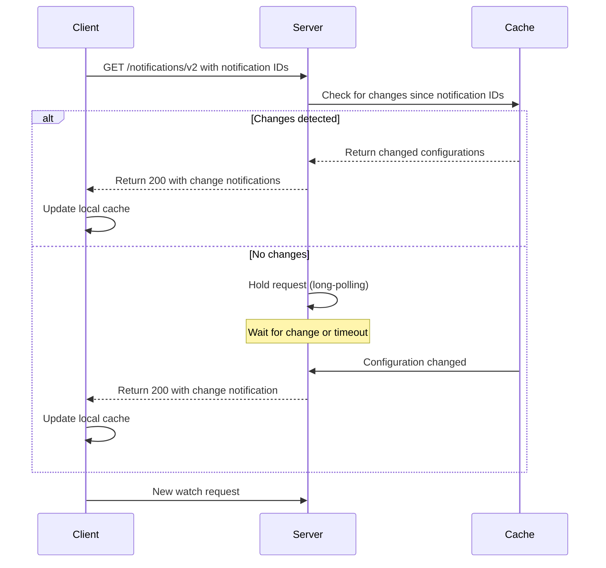
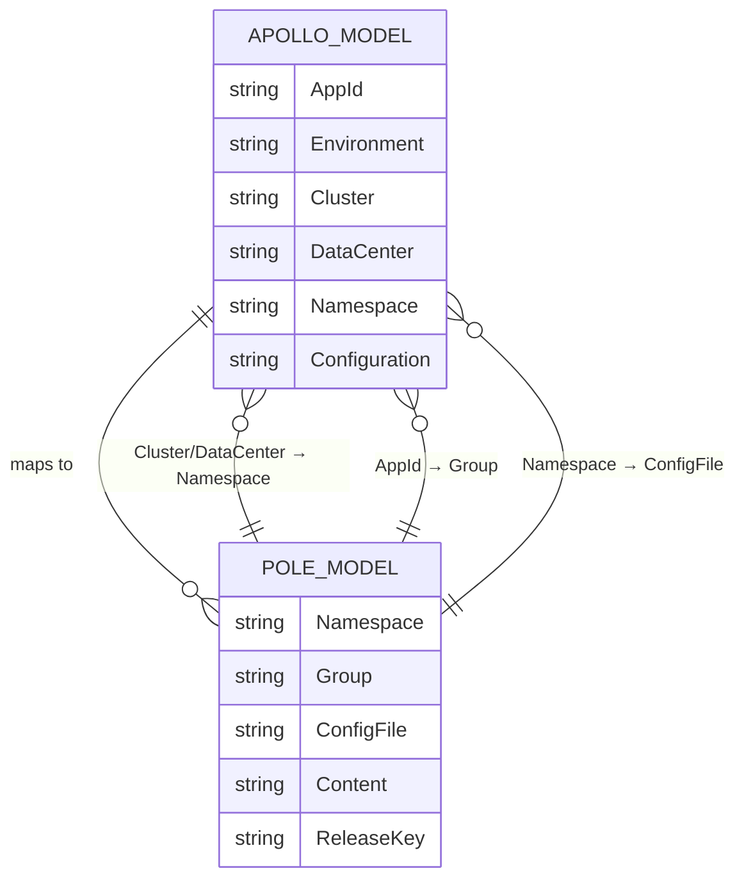
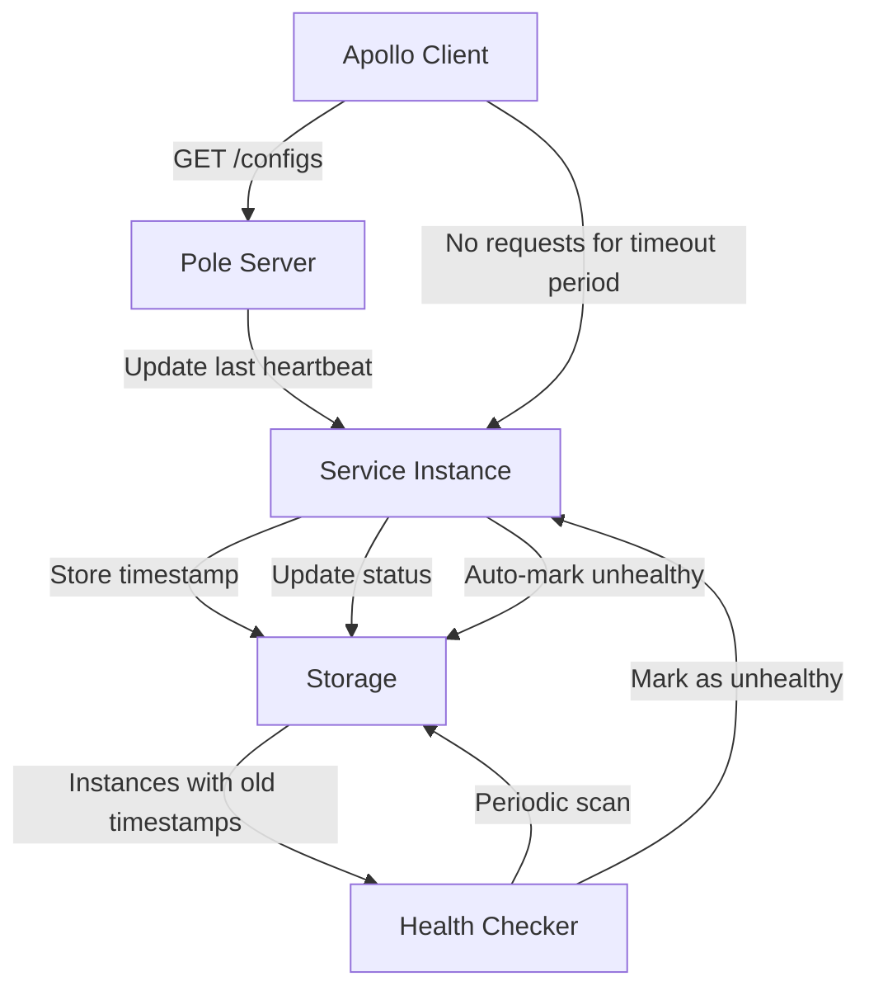
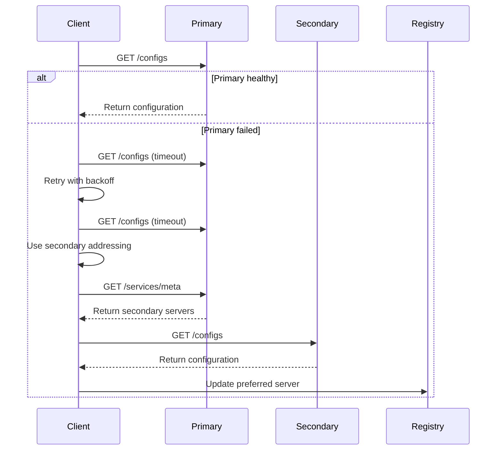
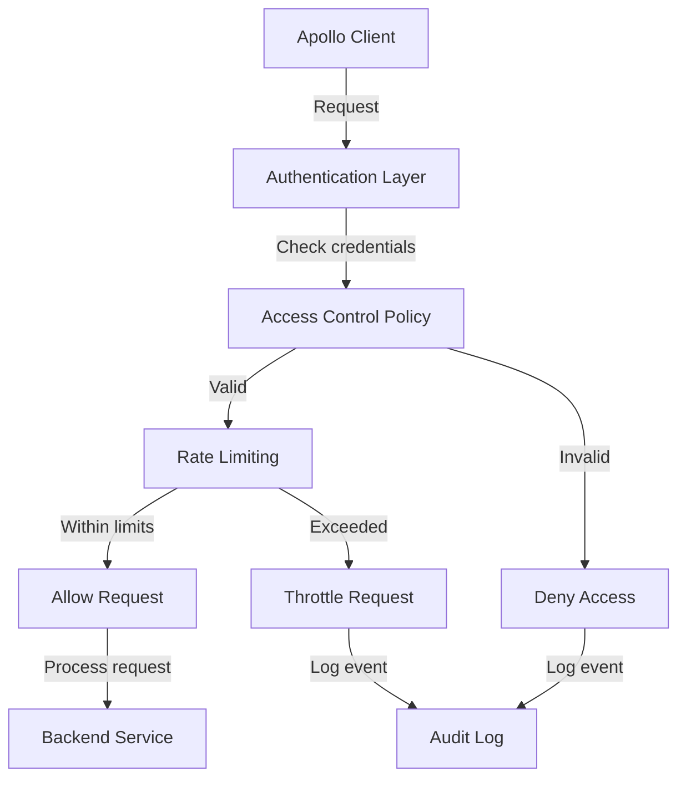
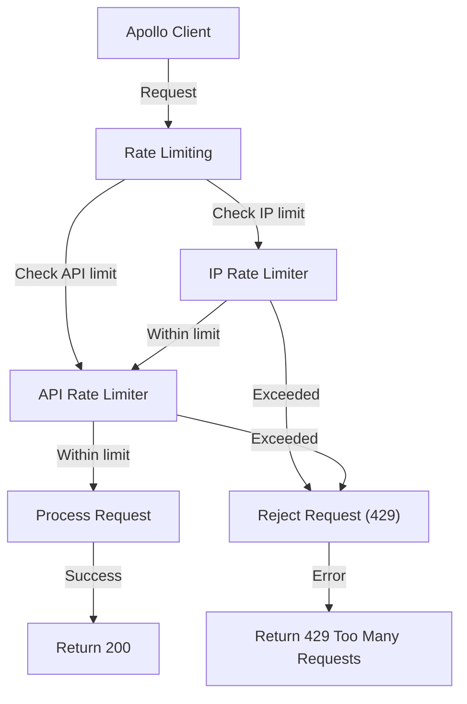

# Apollo Support

<cite>
**Referenced Files in This Document**   
- [plugin/apiserver/apolloserver/server.go](file://plugin/apiserver/apolloserver/server.go)
- [plugin/apiserver/apolloserver/handle.go](file://plugin/apiserver/apolloserver/handle.go)
- [plugin/apiserver/apolloserver/types.go](file://plugin/apiserver/apolloserver/types.go)
- [plugin/apiserver/apolloserver/config.go](file://plugin/apiserver/apolloserver/config.go)
- [plugin/apiserver/apolloserver/default.go](file://plugin/apiserver/apolloserver/default.go)
- [plugin/apiserver/apolloserver/docs.go](file://plugin/apiserver/apolloserver/docs.go)
- [plugin/apiserver/apolloserver/access.go](file://plugin/apiserver/apolloserver/access.go)
- [plugin/apiserver/apolloserver/watch.go](file://plugin/apiserver/apolloserver/watch.go)
- [plugin/access_control/ratelimit/token/api_limit.go](file://plugin/access_control/ratelimit/token/api_limit.go)
- [plugin/access_control/ratelimit/token/resource_limiter.go](file://plugin/access_control/ratelimit/token/resource_limiter.go)
- [pkg/namespace/namespace.go](file://pkg/namespace/namespace.go)
- [pkg/service/instance.go](file://pkg/service/instance.go)
- [pkg/service/healthcheck/check.go](file://pkg/service/healthcheck/check.go)
</cite>

## Table of Contents
1. [Introduction](#introduction)
2. [Service Registration Format](#service-registration-format)
3. [Service Querying Endpoints](#service-querying-endpoints)
4. [Configuration-Driven Discovery Mechanisms](#configuration-driven-discovery-mechanisms)
5. [Namespace Mapping](#namespace-mapping)
6. [Heartbeat Maintenance and Instance Status](#heartbeat-maintenance-and-instance-status)
7. [Fault Tolerance Behavior](#fault-tolerance-behavior)
8. [Client Registration and Lookup Examples](#client-registration-and-lookup-examples)
9. [Authentication Handling](#authentication-handling)
10. [Rate Limiting Policies](#rate-limiting-policies)
11. [Apollo SDK Compatibility](#apollo-sdk-compatibility)
12. [Migration Guidance](#migration-guidance)
13. [Service Model Semantics and Data Consistency](#service-model-semantics-and-data-consistency)

## Introduction
This document provides comprehensive documentation for the Apollo-compatible service discovery interface in Pole. It details the JSON-based service registration format, service querying endpoints, and configuration-driven discovery mechanisms. The document explains how Apollo's namespace concept maps to Pole's namespace system, describes heartbeat maintenance and instance status synchronization, and outlines fault tolerance behavior. It includes examples of client registration payloads and service lookup requests, describes authentication handling and rate limiting policies, addresses compatibility with Apollo SDKs, and provides migration guidance for teams transitioning from Apollo to Pole. Key differences in service model semantics and data consistency guarantees are also highlighted.

## Service Registration Format
The Apollo-compatible interface in Pole supports service registration through configuration files rather than direct service instance registration. Services are registered by creating configuration files that represent service definitions. The registration process leverages Pole's configuration management system to store service metadata in a format compatible with Apollo clients.

When a client requests configuration from a specific namespace, Pole interprets this as a service registration event. The system creates or updates service instances based on the configuration namespace and application ID. Service instances are derived from the configuration metadata, with the application ID mapping to the service name and the cluster or data center mapping to the namespace.

The service registration process is implicit rather than explicit, occurring as a side effect of configuration retrieval. This approach maintains compatibility with Apollo clients while leveraging Pole's unified configuration and service discovery model.

**Section sources**
- [plugin/apiserver/apolloserver/handle.go](file://plugin/apiserver/apolloserver/handle.go#L195-L227)
- [plugin/apiserver/apolloserver/types.go](file://plugin/apiserver/apolloserver/types.go#L49-L105)

## Service Querying Endpoints
Pole provides several endpoints for service querying that are compatible with Apollo clients. These endpoints allow clients to retrieve configuration data, which serves as the primary mechanism for service discovery in the Apollo model.

The main querying endpoints include:
- `/configs/{appId}/{cluster}/{namespace}`: Retrieves configuration for a specific application, cluster, and namespace
- `/configfiles/{appId}/{cluster}/{namespace}`: Retrieves configuration files in properties format
- `/configfiles/json/{appId}/{cluster}/{namespace}`: Retrieves configuration files in JSON format
- `/notifications/v2`: Long-polling endpoint for configuration change notifications

These endpoints support query parameters such as `clientIp` and `version` to enable client-specific configuration and change detection. The response format follows Apollo's JSON structure, ensuring compatibility with existing Apollo SDKs.

```mermaid
flowchart TD
Client["Apollo Client"] --> |GET /configs/{appId}/{cluster}/{namespace}| Server["Pole Server"]
Server --> |Check cache and version| Cache["Configuration Cache"]
Cache --> |Compare with current version| VersionCheck{"Version Changed?"}
VersionCheck --> |No| Return304["Return 304 Not Modified"]
VersionCheck --> |Yes| RetrieveConfig["Retrieve Latest Configuration"]
RetrieveConfig --> FormatResponse["Format as Apollo Response"]
FormatResponse --> Return200["Return 200 with Configuration"]
Client --> |GET /notifications/v2| Server
Server --> |Hold request until change| WatchContext["Watch Context"]
WatchContext --> |Change detected| NotifyClient["Return Change Notification"]
```

**Diagram sources**
- [plugin/apiserver/apolloserver/access.go](file://plugin/apiserver/apolloserver/access.go#L27-L47)
- [plugin/apiserver/apolloserver/handle.go](file://plugin/apiserver/apolloserver/handle.go#L195-L227)

**Section sources**
- [plugin/apiserver/apolloserver/access.go](file://plugin/apiserver/apolloserver/access.go#L27-L47)
- [plugin/apiserver/apolloserver/handle.go](file://plugin/apiserver/apolloserver/handle.go#L195-L227)

## Configuration-Driven Discovery Mechanisms
Pole implements configuration-driven service discovery by mapping Apollo's configuration model to its service discovery model. The discovery mechanism is centered around configuration file retrieval and change notification.

The primary discovery mechanism is long-polling through the `/notifications/v2` endpoint. Clients maintain a connection to this endpoint, which remains open until a configuration change is detected or a timeout occurs. This allows for near real-time propagation of service configuration changes.

The discovery process follows these steps:
1. Client sends a watch request with current notification IDs for each namespace
2. Server checks for configuration changes since the specified notification IDs
3. If changes are detected, server immediately returns the changes
4. If no changes are detected, server holds the request until a change occurs or timeout is reached
5. Client processes the response and updates its local configuration cache

This mechanism ensures efficient change propagation while minimizing network traffic and server load. The system uses a timeout-based approach to prevent connections from hanging indefinitely.



**Diagram sources**
- [plugin/apiserver/apolloserver/watch.go](file://plugin/apiserver/apolloserver/watch.go#L0-L202)
- [plugin/apiserver/apolloserver/handle.go](file://plugin/apiserver/apolloserver/handle.go#L195-L227)

**Section sources**
- [plugin/apiserver/apolloserver/watch.go](file://plugin/apiserver/apolloserver/watch.go#L0-L202)
- [plugin/apiserver/apolloserver/handle.go](file://plugin/apiserver/apolloserver/handle.go#L195-L227)

## Namespace Mapping
The namespace mapping between Apollo and Pole follows a specific transformation to align the different models of the two systems. Apollo's hierarchical configuration model is mapped to Pole's flat namespace model.

The mapping rules are:
1. Apollo's Cluster or DataCenter maps to Pole's Namespace
2. Apollo's AppId maps to Pole's Group
3. Apollo's Namespace maps to Pole's ConfigFile

This mapping allows Apollo clients to work with Pole's configuration system without modification. The hierarchical structure of Apollo (Application → Environment → Cluster → Namespace → Configuration) is flattened into Pole's structure (Namespace → Group → ConfigFile).

For example, an Apollo configuration with:
- AppId: "user-service"
- Cluster: "production"
- Namespace: "database.properties"

Would map to:
- Namespace: "production"
- Group: "user-service"
- ConfigFile: "database.properties"

This mapping preserves the logical organization of services while adapting to Pole's data model. The system supports multiple clusters and data centers by creating separate namespaces for each environment.



**Diagram sources**
- [plugin/apiserver/apolloserver/docs.go](file://plugin/apiserver/apolloserver/docs.go#L0-L27)
- [pkg/namespace/namespace.go](file://pkg/namespace/namespace.go#L0-L39)

**Section sources**
- [plugin/apiserver/apolloserver/docs.go](file://plugin/apiserver/apolloserver/docs.go#L0-L27)
- [pkg/namespace/namespace.go](file://pkg/namespace/namespace.go#L0-L39)

## Heartbeat Maintenance and Instance Status
Pole handles heartbeat maintenance and instance status synchronization through its health checking system. While Apollo clients typically send heartbeats to maintain instance registration, Pole uses a different approach that is compatible with Apollo semantics.

The system maintains instance status by:
1. Tracking the last time a client retrieved configuration
2. Using this timestamp as a proxy for client liveness
3. Marking instances as unhealthy if no configuration requests are received within a threshold period

When a client successfully retrieves configuration, the system updates the instance's last heartbeat time. This approach leverages existing Apollo client behavior (configuration polling) to maintain instance status without requiring additional heartbeat endpoints.

The health checking system periodically scans for instances that have not checked in within the configured timeout period and marks them as unhealthy. This ensures that stale instances are eventually removed from service discovery results.



**Diagram sources**
- [pkg/service/healthcheck/check.go](file://pkg/service/healthcheck/check.go)
- [plugin/apiserver/apolloserver/handle.go](file://plugin/apiserver/apolloserver/handle.go#L195-L227)

**Section sources**
- [pkg/service/healthcheck/check.go](file://pkg/service/healthcheck/check.go)
- [plugin/apiserver/apolloserver/handle.go](file://plugin/apiserver/apolloserver/handle.go#L195-L227)

## Fault Tolerance Behavior
Pole's Apollo-compatible interface implements several fault tolerance mechanisms to ensure high availability and resilience. These mechanisms include connection pooling, request retry logic, and failover capabilities.

The system supports secondary addressing through the `GetConfigServers` endpoint, which allows clients to discover alternative configuration servers. When a client cannot reach the primary server, it can use this endpoint to find backup servers.

Key fault tolerance features include:
- Connection keep-alive with configurable timeouts
- Request retry logic with exponential backoff
- Circuit breaking for downstream service calls
- Graceful degradation when configuration data is unavailable

The system also implements rate limiting and connection limiting to prevent cascading failures under high load. These protections help maintain system stability even when individual components experience issues.

In the event of a server failure, clients can use the secondary addressing mechanism to discover alternative servers. The system maintains a list of available servers and can redirect clients to healthy instances.



**Diagram sources**
- [plugin/apiserver/apolloserver/server.go](file://plugin/apiserver/apolloserver/server.go#L291-L316)
- [plugin/apiserver/apolloserver/handle.go](file://plugin/apiserver/apolloserver/handle.go#L195-L227)

**Section sources**
- [plugin/apiserver/apolloserver/server.go](file://plugin/apiserver/apolloserver/server.go#L291-L316)
- [plugin/apiserver/apolloserver/handle.go](file://plugin/apiserver/apolloserver/handle.go#L195-L227)

## Client Registration and Lookup Examples
This section provides examples of client registration payloads and service lookup requests for the Apollo-compatible interface.

### Configuration Retrieval Request
```http
GET /configs/user-service/production/database.properties?ip=192.168.1.100&releaseKey=12345 HTTP/1.1
Host: pole-server:8761
User-Agent: Apollo-Java/1.0
```

### Configuration Retrieval Response
```json
{
  "appId": "user-service",
  "cluster": "production",
  "namespaceName": "database.properties",
  "configurations": {
    "db.url": "jdbc:mysql://db-prod:3306/users",
    "db.username": "user_svc",
    "db.password": "secret"
  },
  "releaseKey": "67890"
}
```

### Configuration Watch Request
```http
GET /notifications/v2?appId=user-service&cluster=production&notifications=[{"namespaceName":"database.properties","notificationId":12345}] HTTP/1.1
Host: pole-server:8761
User-Agent: Apollo-Java/1.0
```

### Configuration Watch Response (no changes)
```json
{
  "notifications": []
}
```

### Configuration Watch Response (with changes)
```json
{
  "notifications": [
    {
      "namespaceName": "database.properties",
      "notificationId": 67890,
      "messages": {
        "details": {
          "database.properties": 67890
        }
      }
    }
  ]
}
```

**Section sources**
- [plugin/apiserver/apolloserver/types.go](file://plugin/apiserver/apolloserver/types.go#L49-L105)
- [plugin/apiserver/apolloserver/handle.go](file://plugin/apiserver/apolloserver/handle.go#L195-L227)

## Authentication Handling
The Apollo-compatible interface in Pole supports authentication through its access control system. Authentication is handled at the API gateway level, with support for various authentication mechanisms.

The system supports:
- IP-based authentication
- Token-based authentication
- Role-based access control
- Policy-based authorization

Authentication is configured through the access control plugins, which can be customized based on deployment requirements. The default configuration allows unauthenticated access for backward compatibility with Apollo clients, but production deployments should enable authentication.

Authentication policies can be defined at multiple levels:
- Global policies applying to all Apollo endpoints
- Per-namespace policies
- Per-application policies

The system logs all authentication attempts and can be configured to block suspicious activity. Failed authentication attempts are rate-limited to prevent brute force attacks.



**Diagram sources**
- [plugin/apiserver/apolloserver/server.go](file://plugin/apiserver/apolloserver/server.go#L291-L316)
- [plugin/apiserver/apolloserver/access.go](file://plugin/apiserver/apolloserver/access.go#L0-L25)

**Section sources**
- [plugin/apiserver/apolloserver/server.go](file://plugin/apiserver/apolloserver/server.go#L291-L316)
- [plugin/apiserver/apolloserver/access.go](file://plugin/apiserver/apolloserver/access.go#L0-L25)

## Rate Limiting Policies
Pole implements rate limiting policies for the Apollo-compatible interface to protect against abuse and ensure fair resource usage. The rate limiting system operates at two levels: IP-based rate limiting and API-based rate limiting.

### IP-Based Rate Limiting
IP-based rate limiting restricts the number of requests from a single IP address within a time window. This prevents individual clients from overwhelming the server with excessive requests.

The default configuration allows:
- Up to 100 requests per minute per IP address
- Burst capacity of 200 requests

### API-Based Rate Limiting
API-based rate limiting controls the number of requests to specific endpoints. This prevents specific API endpoints from being overloaded.

The default configuration includes:
- `/configs/*` endpoints: 50 requests per minute per IP
- `/notifications/v2` endpoints: 30 requests per minute per IP
- All other endpoints: 20 requests per minute per IP

Rate limiting is implemented using a token bucket algorithm, which allows for burst traffic while maintaining average rate limits. When a client exceeds the rate limit, the server returns a 429 Too Many Requests response.



**Diagram sources**
- [plugin/access_control/ratelimit/token/api_limit.go](file://plugin/access_control/ratelimit/token/api_limit.go)
- [plugin/apiserver/apolloserver/server.go](file://plugin/apiserver/apolloserver/server.go#L291-L316)

**Section sources**
- [plugin/access_control/ratelimit/token/api_limit.go](file://plugin/access_control/ratelimit/token/api_limit.go)
- [plugin/apiserver/apolloserver/server.go](file://plugin/apiserver/apolloserver/server.go#L291-L316)

## Apollo SDK Compatibility
Pole's Apollo-compatible interface is designed to work with existing Apollo SDKs without modification. The interface replicates the key endpoints and response formats used by Apollo clients.

Supported Apollo SDK features include:
- Configuration retrieval in properties and JSON formats
- Long-polling for configuration change notifications
- Secondary addressing for high availability
- Client-side configuration caching
- Failover to backup servers

The system maintains compatibility with Apollo SDKs by:
1. Implementing the same URL patterns and HTTP methods
2. Using identical response formats and status codes
3. Supporting the same query parameters and headers
4. Maintaining the same error response structure

This compatibility allows teams to migrate from Apollo to Pole with minimal code changes. Applications using Apollo SDKs can connect to Pole without recompilation or configuration changes.

However, some advanced Apollo features may not be fully supported, including:
- Public namespace inheritance
- Custom configuration formats
- Advanced authentication mechanisms

Teams should test their applications thoroughly to ensure all required features work as expected.

**Section sources**
- [plugin/apiserver/apolloserver/handle.go](file://plugin/apiserver/apolloserver/handle.go#L195-L227)
- [plugin/apiserver/apolloserver/types.go](file://plugin/apiserver/apolloserver/types.go#L49-L105)

## Migration Guidance
This section provides guidance for teams migrating from Apollo to Pole. The migration process should be planned carefully to minimize disruption to running applications.

### Migration Steps
1. **Assessment**: Evaluate current Apollo usage and identify dependencies
2. **Testing**: Set up a test environment with Pole and verify application compatibility
3. **Configuration**: Map existing Apollo namespaces and configurations to Pole
4. **Deployment**: Deploy Pole alongside existing Apollo infrastructure
5. **Cutover**: Gradually redirect clients from Apollo to Pole
6. **Validation**: Monitor applications and verify functionality
7. **Decommission**: Retire Apollo infrastructure after successful migration

### Configuration Migration
When migrating configurations from Apollo to Pole:
1. Create equivalent namespaces in Pole for each Apollo cluster or data center
2. Create groups in Pole for each Apollo application
3. Import configuration files from Apollo to Pole
4. Verify release keys and versioning

### Client Migration
For client migration:
1. Update client configuration to point to Pole servers
2. Test configuration retrieval and change notification
3. Monitor for errors and performance issues
4. Gradually roll out to production environments

### Best Practices
- Perform migration during low-traffic periods
- Maintain Apollo as a backup during migration
- Monitor application metrics closely
- Have a rollback plan in case of issues
- Communicate changes to all stakeholders

The migration process should be incremental, starting with non-critical applications and gradually moving to production systems.

**Section sources**
- [plugin/apiserver/apolloserver/docs.go](file://plugin/apiserver/apolloserver/docs.go#L0-L27)
- [plugin/apiserver/apolloserver/handle.go](file://plugin/apiserver/apolloserver/handle.go#L195-L227)

## Service Model Semantics and Data Consistency
Pole's service model semantics differ from Apollo's in several key aspects, particularly regarding data consistency and service registration.

### Data Consistency Guarantees
Pole provides stronger data consistency guarantees than Apollo:
- **Strong consistency for configuration writes**: Configuration updates are immediately visible to all readers after commit
- **Eventual consistency for service discovery**: Service instance status updates may have a small delay due to health checking intervals
- **Linearizable reads**: Configuration reads return the most recent committed value

This contrasts with Apollo's model, which uses eventual consistency for all operations. Pole's approach ensures that configuration changes are immediately available, reducing the risk of configuration drift.

### Service Model Differences
Key differences in service model semantics include:

| Aspect | Apollo | Pole |
|------|--------|------|
| **Configuration Storage** | Database with eventual consistency | Database with strong consistency |
| **Service Registration** | Explicit instance registration | Implicit via configuration access |
| **Heartbeat Mechanism** | Direct heartbeat requests | Implicit via configuration polling |
| **Data Format** | Properties, JSON, XML, YAML | Properties, JSON, XML, YAML, Text |
| **Namespace Model** | Hierarchical (App → Cluster → Namespace) | Flat (Namespace → Group → ConfigFile) |
| **Change Notification** | Long-polling with timeout | Long-polling with timeout and immediate push |
| **Fault Tolerance** | Client-side failover | Server-side failover and load balancing |

Pole's model provides better consistency and reliability at the cost of some flexibility in service registration. The implicit service registration model reduces client complexity but requires careful management of configuration access patterns.

Teams migrating from Apollo should be aware of these differences and adjust their applications accordingly. In particular, applications that rely on immediate service instance registration may need to be modified to work with Pole's configuration-driven model.

**Section sources**
- [plugin/apiserver/apolloserver/docs.go](file://plugin/apiserver/apolloserver/docs.go#L0-L27)
- [plugin/apiserver/apolloserver/types.go](file://plugin/apiserver/apolloserver/types.go#L49-L105)