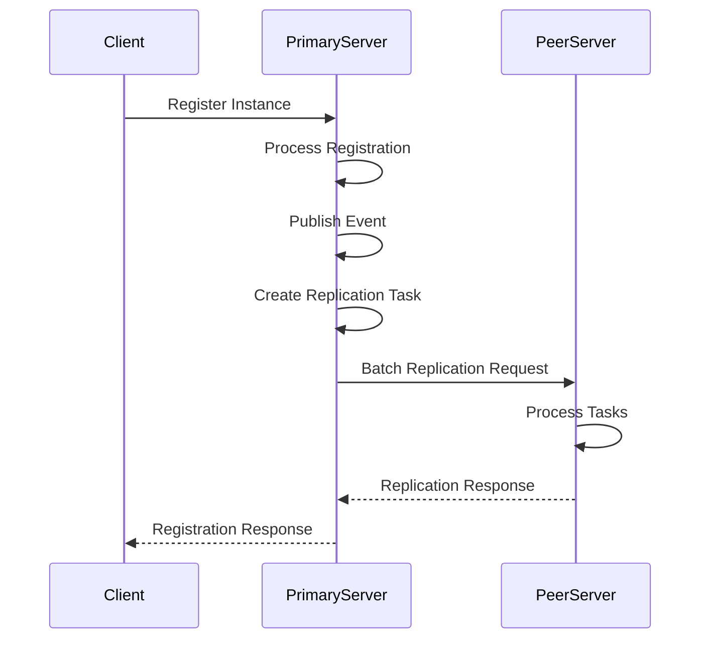
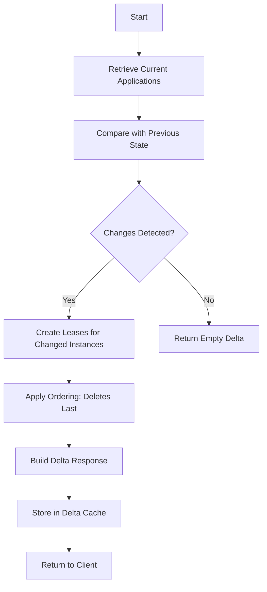

# Eureka Support

<cite>
**Referenced Files in This Document**   
- [server.go](file://plugin/apiserver/eurekaserver/server.go)
- [applications.go](file://plugin/apiserver/eurekaserver/applications.go)
- [model.go](file://plugin/apiserver/eurekaserver/model.go)
- [write.go](file://plugin/apiserver/eurekaserver/write.go)
- [replicate.go](file://plugin/apiserver/eurekaserver/replicate.go)
- [delta_worker.go](file://plugin/apiserver/eurekaserver/delta_worker.go)
- [replicate_worker.go](file://plugin/apiserver/eurekaserver/replicate_worker.go)
- [config.go](file://plugin/apiserver/eurekaserver/config.go)
- [access.go](file://plugin/apiserver/eurekaserver/access.go)
</cite>

## Table of Contents
1. [Introduction](#introduction)
2. [RESTful Endpoints](#restful-endpoints)
3. [JSON Request/Response Schemas](#json-requestresponse-schemas)
4. [Replication Mechanisms](#replication-mechanisms)
5. [Delta Propagation](#delta-propagation)
6. [Self-Preservation Mode](#self-preservation-mode)
7. [Authentication and Rate Limiting](#authentication-and-rate-limiting)
8. [Error Codes](#error-codes)
9. [Service Registration Payload Example](#service-registration-payload-example)
10. [Client-Side Integration Patterns](#client-side-integration-patterns)
11. [Compatibility and Migration](#compatibility-and-migration)

## Introduction
This document provides comprehensive API documentation for the Eureka-compatible service discovery interface implemented in the Polaris server. The implementation supports standard Eureka v1 and v2 APIs for service registration, instance status updates, heartbeat renewal, and service retrieval. The system is designed to be compatible with Netflix Eureka clients while providing enhanced features such as configurable replication, rate limiting, and self-preservation mechanisms.

**Section sources**
- [server.go](file://plugin/apiserver/eurekaserver/server.go#L1-L100)
- [config.go](file://plugin/apiserver/eurekaserver/config.go#L1-L50)

## RESTful Endpoints
The Eureka-compatible server exposes the following RESTful endpoints for service discovery operations:

### Service Registration
- **POST** `/eureka/apps/{application}`: Register a new application instance
- **DELETE** `/eureka/apps/{application}/{instanceId}`: Deregister an application instance
- **PUT** `/eureka/apps/{application}/{instanceId}`: Renew heartbeat for an instance

### Service Retrieval
- **GET** `/eureka/apps`: Retrieve all applications and their instances
- **GET** `/eureka/apps/delta`: Retrieve incremental changes to applications
- **GET** `/eureka/apps/{application}`: Retrieve all instances of a specific application
- **GET** `/eureka/apps/{application}/{instanceId}`: Retrieve a specific instance by ID
- **GET** `/eureka/instances/{instanceId}`: Retrieve an instance by ID across all applications

### Status Management
- **PUT** `/eureka/apps/{application}/{instanceId}/status`: Update the status of an instance
- **DELETE** `/eureka/apps/{application}/{instanceId}/status`: Remove status override (set to UP)

### VIP-Based Queries
- **GET** `/eureka/vips/{vipAddress}`: Query all instances under a specific VIP address
- **GET** `/eureka/svips/{svipAddress}`: Query all instances under a specific secure VIP address

### Replication
- **POST** `/eureka/peerreplication/batch/`: Handle batch replication requests between Eureka servers

**Section sources**
- [access.go](file://plugin/apiserver/eurekaserver/access.go#L100-L300)
- [server.go](file://plugin/apiserver/eurekaserver/server.go#L500-L600)

## JSON Request/Response Schemas
The Eureka-compatible server supports both JSON and XML formats for request and response payloads. The following sections describe the JSON schemas for key operations.

### Instance Registration Request
```json
{
  "instance": {
    "instanceId": "string",
    "app": "string",
    "ipAddr": "string",
    "port": {
      "$": "integer",
      "@enabled": "string"
    },
    "securePort": {
      "$": "integer",
      "@enabled": "string"
    },
    "homePageUrl": "string",
    "statusPageUrl": "string",
    "healthCheckUrl": "string",
    "vipAddress": "string",
    "secureVipAddress": "string",
    "countryId": "integer",
    "dataCenterInfo": {
      "@class": "string",
      "name": "string"
    },
    "hostName": "string",
    "status": "string",
    "overriddenStatus": "string",
    "leaseInfo": {
      "renewalIntervalInSecs": "integer",
      "durationInSecs": "integer"
    },
    "metadata": {
      "key": "value"
    },
    "actionType": "string"
  }
}
```

### Applications Response
```json
{
  "applications": {
    "versions__delta": "string",
    "apps__hashcode": "string",
    "application": [
      {
        "name": "string",
        "instance": [
          {
            "instanceId": "string",
            "app": "string",
            "ipAddr": "string",
            "port": {
              "$": "integer",
              "@enabled": "string"
            },
            "securePort": {
              "$": "integer",
              "@enabled": "string"
            },
            "homePageUrl": "string",
            "statusPageUrl": "string",
            "healthCheckUrl": "string",
            "vipAddress": "string",
            "secureVipAddress": "string",
            "countryId": "integer",
            "dataCenterInfo": {
              "@class": "string",
              "name": "string"
            },
            "hostName": "string",
            "status": "string",
            "overriddenStatus": "string",
            "leaseInfo": {
              "renewalIntervalInSecs": "integer",
              "durationInSecs": "integer"
            },
            "metadata": {
              "key": "value"
            },
            "lastUpdatedTimestamp": "string",
            "actionType": "string"
          }
        ]
      }
    ]
  }
}
```

### Instance Response
```json
{
  "instance": {
    "instanceId": "string",
    "app": "string",
    "ipAddr": "string",
    "port": {
      "$": "integer",
      "@enabled": "string"
    },
    "securePort": {
      "$": "integer",
      "@enabled": "string"
    },
    "homePageUrl": "string",
    "statusPageUrl": "string",
    "healthCheckUrl": "string",
    "vipAddress": "string",
    "secureVipAddress": "string",
    "countryId": "integer",
    "dataCenterInfo": {
      "@class": "string",
      "name": "string"
    },
    "hostName": "string",
    "status": "string",
    "overriddenStatus": "string",
    "leaseInfo": {
      "renewalIntervalInSecs": "integer",
      "durationInSecs": "integer"
    },
    "metadata": {
      "key": "value"
    },
    "lastUpdatedTimestamp": "string",
    "actionType": "string"
  }
}
```

**Section sources**
- [model.go](file://plugin/apiserver/eurekaserver/model.go#L100-L400)
- [applications.go](file://plugin/apiserver/eurekaserver/applications.go#L100-L200)

## Replication Mechanisms
The Eureka-compatible server implements a replication mechanism to synchronize state between multiple server instances. This ensures high availability and data consistency across a distributed deployment.

### Replication Configuration
Replication is configured through the server options with the `peersToReplicate` parameter, which specifies the list of peer nodes to replicate with. The configuration supports namespace-specific replication targets.

```go
const optionPeerNodesToReplicate = "peersToReplicate"
```

### Replication Workflow
1. When an instance event occurs (registration, heartbeat, deregistration, or status change), the event is published to the event hub.
2. The `EurekaInstanceEventHandler` listens for instance events and determines whether replication is needed based on the event metadata and namespace.
3. If replication is required, a `ReplicationInstance` task is created and added to the replication worker's task channel.
4. Replication workers batch multiple tasks together and send them to peer nodes in a single HTTP request.

### Batch Replication
The replication system uses batching to optimize network utilization and reduce the number of HTTP requests. Key parameters:
- **batchMaxInterval**: Maximum time to wait before sending a batch (default: 5 seconds)
- **batchReplicateSize**: Maximum number of tasks per batch (default: 10)

When a peer node receives a batch replication request, it processes each task in parallel and returns a response for each operation.

### Conflict Resolution
The system handles conflicts during replication through the following mechanisms:
- **Heartbeat to Register Fallback**: If a heartbeat request fails with a "not found" error, the system automatically retries as a registration request.
- **Metadata Tracking**: The `MetadataReplicate` field is used to prevent infinite replication loops by marking requests that originated from replication.
- **Idempotent Operations**: Registration and status update operations are designed to be idempotent, allowing safe retry of failed operations.



**Diagram sources**
- [replicate.go](file://plugin/apiserver/eurekaserver/replicate.go#L100-L300)
- [replicate_worker.go](file://plugin/apiserver/eurekaserver/replicate_worker.go#L50-L200)

## Delta Propagation
The Eureka-compatible server implements delta propagation to efficiently deliver incremental changes to clients, reducing network bandwidth and improving client startup time.

### Delta Cache Architecture
The system maintains two caches for each namespace:
- **Full Applications Cache**: Contains the complete snapshot of all applications and instances
- **Delta Applications Cache**: Contains only the changes (additions, modifications, deletions) since the last full refresh

The delta cache is built by comparing the current state with the previous state and identifying changes at both the application and instance levels.

### Lease-Based Tracking
The system uses a lease mechanism to track changes in the delta cache:
- Each changed instance is associated with a `Lease` object that records the instance and the timestamp of the last update
- Leases expire after a configurable interval (`deltaExpireInterval`), at which point they are removed from the delta cache
- Expired leases are cleaned up periodically by the `cleanupExpiredLeases` method

### Delta Calculation
The delta calculation process follows these steps:
1. Compare the revision of each application between the old and new states
2. For applications with changed revisions, compare individual instances to identify additions, modifications, and deletions
3. For each changed instance, create a lease with the appropriate action type (ADDED, MODIFIED, DELETED)
4. Combine leases from all applications into a single delta response
5. Apply ordering to ensure delete operations are sent after other operations to maintain consistency

### Client Behavior
Clients can retrieve the delta feed by calling the `/eureka/apps/delta` endpoint. The response includes:
- A version delta that clients can use to detect when a full refresh is needed
- A hash code that clients can use to verify data consistency
- A list of applications containing only instances that have changed



**Diagram sources**
- [delta_worker.go](file://plugin/apiserver/eurekaserver/delta_worker.go#L100-L400)
- [applications.go](file://plugin/apiserver/eurekaserver/applications.go#L300-L400)

## Self-Preservation Mode
The Eureka-compatible server implements a self-preservation mode to protect the registry during network partitions or server failures.

### Activation Criteria
Self-preservation mode is activated when the percentage of unhealthy instances exceeds a configurable threshold. The system monitors instance health through heartbeat renewals and considers an instance unhealthy if it fails to renew its lease within the specified duration.

### Configuration Parameters
- **enableSelfPreservation**: Flag to enable or disable self-preservation mode (default: true)
- **DefaultSelfPreservationPercent**: Threshold percentage of unhealthy instances (default: 85%)
- **DefaultSelfPreservationDuration**: Duration after which instances are considered for preservation (default: 15 minutes)

### Behavior in Self-Preservation Mode
When self-preservation mode is active, the server modifies its behavior to protect existing registration information:
- **Registration**: New instance registrations are still accepted
- **Heartbeats**: Heartbeat renewals are processed normally
- **Deregistration**: Instance deregistrations are rejected to prevent loss of service information
- **Service Discovery**: Clients receive the full registry, including instances that have not renewed recently

### Implementation
The self-preservation logic is integrated into the applications builder, which is responsible for constructing the response for service discovery requests. When enabled, the builder includes instances that would otherwise be considered expired, ensuring clients maintain connectivity to services during network disruptions.

```go
const DefaultEnableSelfPreservation = true
```

The feature helps prevent cascading failures in distributed systems by ensuring that clients continue to have access to service information even when network conditions are poor.

**Section sources**
- [config.go](file://plugin/apiserver/eurekaserver/config.go#L40-L50)
- [delta_worker.go](file://plugin/apiserver/eurekaserver/delta_worker.go#L50-L100)

## Authentication and Rate Limiting
The Eureka-compatible server provides authentication and rate limiting features to secure the service discovery interface.

### Authentication
The server supports basic authentication for Eureka operations. Authentication information is extracted from the request headers and validated before processing the request.

Key authentication methods:
- `getAuthFromEurekaRequestHeader`: Extracts authentication token from the request
- Context injection: Authentication token is added to the request context for downstream processing

Authentication is required for critical operations such as instance registration, deregistration, and status updates.

### Rate Limiting
The server implements rate limiting at two levels:
- **IP-level rate limiting**: Limits the number of requests from a single IP address
- **API-level rate limiting**: Limits the number of requests to specific endpoints

Rate limiting is controlled by the `rateLimit` plugin, which is configured through the server options. The system checks rate limits during the request preprocessing phase.

```go
func (h *EurekaServer) enterRateLimit(req *restful.Request, rsp *restful.Response) error {
    // IP-level rate limiting
    if ok := h.rateLimit.Allow(ratelimit.IPRatelimit, clientIP); !ok {
        return errors.New("ip ratelimit is not allow")
    }
    
    // API-level rate limiting
    apiName := fmt.Sprintf("%s:%s", req.Request.Method, req.Request.URL.Path)
    if ok := h.rateLimit.Allow(ratelimit.APIRatelimit, apiName); !ok {
        return errors.New("api ratelimit is not allow")
    }
    
    return nil
}
```

When a rate limit is exceeded, the server returns HTTP status code 429 (Too Many Requests) with a JSON response.

### Configuration
Rate limiting configuration is passed through the server options with the `connLimit` parameter, which specifies connection limits per IP and globally.

**Section sources**
- [server.go](file://plugin/apiserver/eurekaserver/server.go#L300-L400)
- [access.go](file://plugin/apiserver/eurekaserver/access.go#L700-L750)

## Error Codes
The Eureka-compatible server returns standardized error codes for various failure scenarios. These codes are returned in the response headers and can be used by clients to handle errors appropriately.

### HTTP Status Codes
- **200 OK**: Successful GET operations
- **204 No Content**: Successful PUT/POST operations with no response body
- **400 Bad Request**: Invalid request parameters or payload
- **401 Unauthorized**: Authentication required or failed
- **403 Forbidden**: Access denied
- **404 Not Found**: Resource not found
- **429 Too Many Requests**: Rate limit exceeded
- **500 Internal Server Error**: Internal server error

### Polaris-Specific Error Codes
The server also returns Polaris-specific error codes in the `X-Polaris-Code` header:

| Code | Constant | Description |
|------|---------|-------------|
| 1 | ExecuteSuccess | Operation completed successfully |
| 2 | ExecuteException | General execution exception |
| 3 | ParseException | Request parsing failed |
| 4 | InvalidServiceName | Invalid service name |
| 5 | InvalidInstanceID | Invalid instance ID |
| 6 | InvalidInstancePort | Invalid instance port |
| 7 | NotFoundService | Service not found |
| 8 | NotFoundInstance | Instance not found |
| 9 | ExistedResource | Resource already exists |
| 10 | NoNeedUpdate | No update needed |
| 11 | HeartbeatExceedLimit | Heartbeat rate exceeds limit |
| 12 | HeartbeatOnDisabledIns | Heartbeat on disabled instance |
| 13 | EmptyRequest | Empty request body |

These error codes provide more granular information about the nature of failures, allowing clients to implement more sophisticated error handling strategies.

**Section sources**
- [access.go](file://plugin/apiserver/eurekaserver/access.go#L50-L100)
- [server.go](file://plugin/apiserver/eurekaserver/server.go#L400-L500)

## Service Registration Payload Example
The following example demonstrates a complete service registration payload in JSON format:

```json
{
  "instance": {
    "instanceId": "my-service-1",
    "app": "MY-SERVICE",
    "ipAddr": "192.168.1.100",
    "port": {
      "$": 8080,
      "@enabled": "true"
    },
    "securePort": {
      "$": 8443,
      "@enabled": "true"
    },
    "homePageUrl": "http://192.168.1.100:8080/",
    "statusPageUrl": "http://192.168.1.100:8080/actuator/info",
    "healthCheckUrl": "http://192.168.1.100:8080/actuator/health",
    "vipAddress": "my-service",
    "secureVipAddress": "my-service",
    "countryId": 1,
    "dataCenterInfo": {
      "@class": "com.netflix.appinfo.InstanceInfo$DefaultDataCenterInfo",
      "name": "MyOwn"
    },
    "hostName": "my-service-1.example.com",
    "status": "UP",
    "overriddenStatus": "UNKNOWN",
    "leaseInfo": {
      "renewalIntervalInSecs": 30,
      "durationInSecs": 90
    },
    "metadata": {
      "region": "us-east-1",
      "zone": "us-east-1a",
      "version": "1.0.0"
    }
  }
}
```

Key considerations for registration:
- The `instanceId` should be unique across all instances of the application
- The `app` field is case-insensitive and will be converted to uppercase
- Port information should reflect the actual service ports
- Metadata can include custom key-value pairs for service discovery filtering
- Lease information controls the heartbeat and expiration behavior

The server will respond with HTTP status 204 (No Content) on successful registration.

**Section sources**
- [write.go](file://plugin/apiserver/eurekaserver/write.go#L50-L200)
- [model.go](file://plugin/apiserver/eurekaserver/model.go#L300-L400)

## Client-Side Integration Patterns
This section describes recommended patterns for integrating with the Eureka-compatible service discovery interface.

### Initialization
Clients should initialize their connection to the Eureka server by:
1. Configuring the server URL (e.g., `http://localhost:8761/eureka`)
2. Setting up authentication credentials if required
3. Configuring retry policies for transient failures

### Service Registration
When registering a service, clients should:
- Use a consistent instance ID format across restarts
- Set appropriate lease durations based on application requirements
- Include relevant metadata for service discovery and routing
- Handle registration failures by retrying with exponential backoff

### Heartbeat Management
Clients should implement heartbeat renewal with the following considerations:
- Schedule heartbeats at intervals less than the `renewalIntervalInSecs` value
- Implement retry logic for failed heartbeat requests
- Gracefully handle server unavailability by continuing to send heartbeats
- Update instance status as needed using the status update endpoint

### Service Discovery
For service discovery, clients should:
- Cache the full applications response to reduce server load
- Use delta propagation to efficiently receive updates
- Implement fallback to full refresh when the delta version does not match
- Handle service instance changes gracefully in the application logic

### Error Handling
Clients should implement comprehensive error handling for:
- Network connectivity issues
- Authentication failures
- Rate limiting responses
- Server errors and timeouts
- Data consistency issues

### Configuration Best Practices
- Set appropriate values for `renewalIntervalInSecs` and `durationInSecs` based on application requirements
- Use metadata to include version information, region, and other discovery criteria
- Implement health checks that accurately reflect service availability
- Monitor registration and heartbeat success rates for operational visibility

**Section sources**
- [access.go](file://plugin/apiserver/eurekaserver/access.go#L300-L700)
- [write.go](file://plugin/apiserver/eurekaserver/write.go#L200-L300)

## Compatibility and Migration
This section addresses compatibility with Netflix Eureka clients and migration considerations from native Eureka setups.

### Netflix Eureka Client Compatibility
The implementation is designed to be compatible with standard Netflix Eureka clients with minimal configuration changes:

#### Configuration Changes
For Spring Cloud applications, update the `application.yml`:
```yaml
eureka:
  client:
    serviceUrl:
      defaultZone: http://polaris-server:8761/eureka/
```

#### Supported Features
- All standard Eureka v1 and v2 REST APIs
- JSON and XML payload formats
- Delta propagation
- VIP-based service discovery
- Instance status overrides
- Self-preservation mode

#### Differences to Note
- Authentication mechanism may require additional configuration
- Rate limiting policies may affect client behavior
- Custom metadata handling may differ slightly
- Server-side defaults for lease durations

### Migration Considerations
When migrating from a native Eureka setup to this implementation:

#### Planning
- Assess the current Eureka deployment size and traffic patterns
- Plan for downtime or implement a blue-green deployment strategy
- Backup existing service registry data if possible

#### Data Migration
- Export service definitions and instance registrations from the existing Eureka server
- Transform data to match the expected format
- Import data into the new system before switching clients

#### Testing
- Set up a parallel environment with the new server
- Redirect a subset of clients to test compatibility
- Monitor for any differences in behavior or performance
- Validate service discovery accuracy and consistency

#### Cutover
- Update client configurations to point to the new server
- Monitor system health and error rates
- Provide fallback to the old system if critical issues arise
- Decommission the old Eureka server after successful migration

#### Post-Migration
- Optimize configuration parameters for the new environment
- Implement monitoring for the new server
- Document any customizations or deviations from standard Eureka behavior
- Train operations staff on the new system

The implementation provides a seamless migration path for organizations looking to enhance their service discovery infrastructure while maintaining compatibility with existing Eureka clients.

**Section sources**
- [server.go](file://plugin/apiserver/eurekaserver/server.go#L100-L300)
- [config.go](file://plugin/apiserver/eurekaserver/config.go#L1-L40)