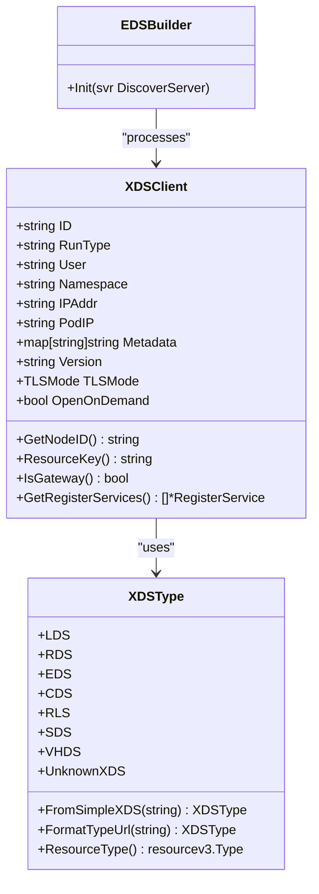
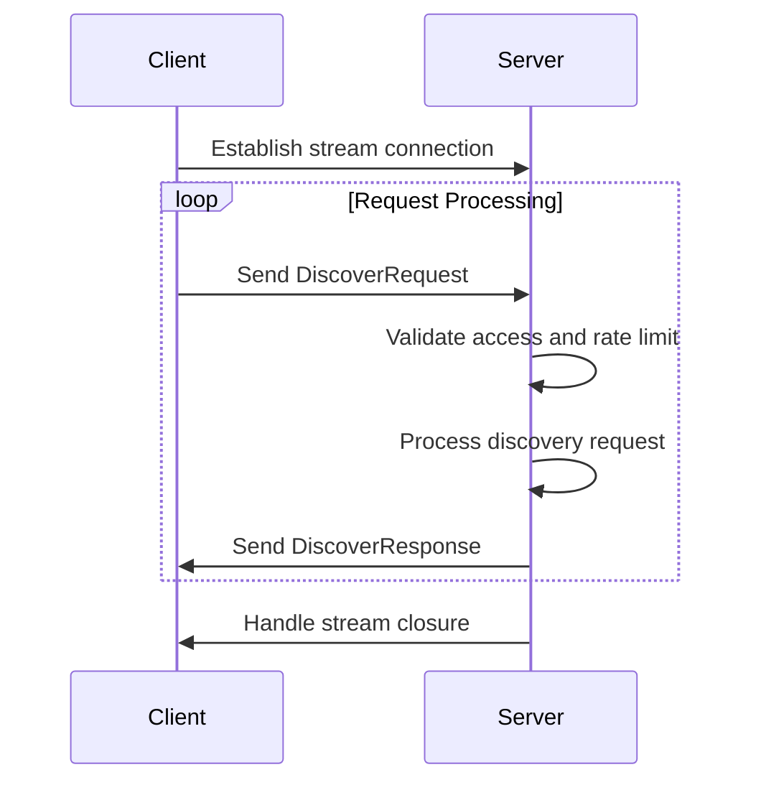

# Multi-Protocol Support

<cite>
**Referenced Files in This Document**   
- [access.go](file://plugin/apiserver/eurekaserver/access.go)
- [server.go](file://plugin/apiserver/eurekaserver/server.go)
- [model.go](file://plugin/apiserver/eurekaserver/model.go)
- [server.go](file://plugin/apiserver/nacosserver/v2/server.go)
- [discover/server.go](file://plugin/apiserver/nacosserver/v2/discover/server.go)
- [access.go](file://plugin/apiserver/nacosserver/v1/discover/access.go)
- [instance.go](file://plugin/apiserver/nacosserver/model/instance.go)
- [apolloserver.go](file://plugin/apiserver/apolloserver/server.go)
- [access.go](file://plugin/apiserver/apolloserver/access.go)
- [types.go](file://plugin/apiserver/apolloserver/types.go)
- [eds.go](file://plugin/apiserver/xdsserverv3/eds.go)
- [resource/model.go](file://plugin/apiserver/xdsserverv3/resource/model.go)
- [resource/node.go](file://plugin/apiserver/xdsserverv3/resource/node.go)
- [client_access.go](file://plugin/apiserver/grpcserver/discover/v1/client_access.go)
- [server.go](file://plugin/apiserver/grpcserver/discover/v1/server.go)
</cite>

## Table of Contents
1. [Introduction](#introduction)
2. [Eureka Service Discovery](#eureka-service-discovery)
3. [Nacos Service Discovery](#nacos-service-discovery)
4. [Apollo Service Discovery](#apollo-service-discovery)
5. [XDS v3 Service Discovery](#xds-v3-service-discovery)
6. [gRPC Native API Discovery](#grpc-native-api-discovery)
7. [Protocol Migration Guidance](#protocol-migration-guidance)
8. [Compatibility Matrix](#compatibility-matrix)

## Introduction
This document provides comprehensive API documentation for multi-protocol service discovery interfaces implemented in the pole-server system. The platform supports Eureka, Nacos, Apollo, XDS v3, and native gRPC protocols, enabling interoperability across diverse service mesh and microservices architectures. Each protocol implementation maintains compatibility with its respective ecosystem while integrating with the core service discovery engine.

## Eureka Service Discovery

The Eureka implementation provides RESTful endpoints compatible with Netflix Eureka clients, supporting service registration, heartbeat, and querying operations. The server exposes three API versions under `/eureka`, `/eureka/v1`, and `/eureka/v2` paths, with identical functionality.

### RESTful Endpoints
The following endpoints are available for service discovery operations:

- **POST /apps/{appId}**: Register a new application instance
- **PUT /apps/{appId}/{instId}**: Send heartbeat for an instance
- **DELETE /apps/{appId}/{instId}**: Deregister an application instance
- **GET /apps**: Query all instances across all applications
- **GET /apps/delta**: Query all instances with delta changes
- **GET /apps/{appId}**: Query all instances for a specific application
- **GET /apps/{appId}/{instId}**: Query a specific instance by application and instance ID

### JSON Request/Response Formats
The Eureka server accepts and produces both JSON and XML formats. For JSON service registration, the request body follows the `RegistrationRequest` structure containing an `InstanceInfo` object with fields such as `instanceId`, `app`, `ipAddr`, `port`, `status`, and `metadata`. The metadata is represented as a key-value map that can include custom service properties.

The response format for application queries follows the `ApplicationsResponse` structure containing an `Applications` object with a list of `Application` entries, each containing multiple `InstanceInfo` objects. Individual instance queries return an `InstanceResponse` with a single `InstanceInfo`.

### Application-Level Registration Semantics
Service registration requires authentication via basic auth headers, with token validation performed before processing. Each instance registration includes lease information with renewal interval and duration settings that determine heartbeat requirements. The server maintains instance state and updates timestamps for last update and dirty state tracking. Instances are automatically expired if heartbeats are not received within the specified duration window.

**Section sources**
- [access.go](file://plugin/apiserver/eurekaserver/access.go#L41-L92)
- [model.go](file://plugin/apiserver/eurekaserver/model.go#L200-L400)

## Nacos Service Discovery

The Nacos implementation supports both HTTP and gRPC protocols across v1 and v2 APIs, providing comprehensive service discovery capabilities with push-based updates.

### HTTP Protocol (v1)
The v1 HTTP API provides RESTful endpoints for service discovery operations:

- **POST /nacos/v1/ns/instance**: Register a service instance
- **DELETE /nacos/v1/ns/instance**: Deregister a service instance
- **PUT /nacos/v1/ns/instance/beat**: Send instance heartbeat
- **GET /nacos/v1/ns/instance/list**: Query instances for a service
- **GET /nacos/v1/ns/health/server**: Check server health status

The HTTP server processes requests through context parsing and namespace conversion, with responses formatted according to Nacos specifications. Instance operations convert between Nacos and internal Polaris formats, preserving metadata and service information.

### gRPC Protocol (v2)
The v2 gRPC API provides enhanced service discovery capabilities with streaming support:

**Diagram sources**
- [server.go](file://plugin/apiserver/nacosserver/v2/server.go#L53-L108)
- [discover/server.go](file://plugin/apiserver/nacosserver/v2/discover/server.go#L83-L125)

The gRPC server handles the following request types:
- `InstanceRequest`: Service instance operations (register/deregister)
- `BatchInstanceRequest`: Batch instance operations
- `SubscribeServiceRequest`: Service subscription with push updates
- `ServiceListRequest`: List available services
- `ServiceQueryRequest`: Query service details
- `ConnectionSetupRequest`: Bidirectional streaming setup

### Push-Based Updates in v2/discover
The v2 discover API implements push-based updates through service subscriptions. Clients can subscribe to service changes and receive real-time notifications via the streaming connection. The server maintains connection state through a `ConnectionManager` and handles subscriber notifications through the `push` package. When service instances change, the server pushes updates to all subscribed clients, reducing polling overhead and improving update latency.

**Section sources**
- [server.go](file://plugin/apiserver/nacosserver/v2/server.go#L53-L365)
- [discover/server.go](file://plugin/apiserver/nacosserver/v2/discover/server.go#L83-L144)
- [access.go](file://plugin/apiserver/nacosserver/v1/discover/access.go#L126-L185)

## Apollo Service Discovery

The Apollo implementation provides JSON-based service configuration and discovery through RESTful endpoints.

### JSON-Based Service Registration Format
The Apollo server uses a JSON format for configuration retrieval and service discovery. The `GetConfigFileResponse` structure includes:
- `appId`: Application identifier
- `cluster`: Cluster name
- `namespaceName`: Configuration namespace
- `configurations`: Key-value map of configuration properties
- `releaseKey`: Version identifier for the configuration

Configuration requests are represented by `GetConfigFileRequest` containing appId, cluster, dataCenter, filename, clientIP, and version parameters. The server processes these requests and returns configuration data or appropriate error responses.

### Configuration-Driven Discovery
Service discovery in Apollo is configuration-driven, where clients retrieve configuration files that may contain service endpoint information. The server supports long-polling for configuration changes through the `WatchConfigFileRequest` and `WatchConfigFileResponse` structures, allowing clients to receive updates when configurations change.

Error responses follow the `ErrorResponse` format with timestamp, status code, error type, message, and request path. The server handles various error conditions including configuration not found (404) and internal server errors (500).

**Section sources**
- [server.go](file://plugin/apiserver/apolloserver/server.go#L0-L44)
- [access.go](file://plugin/apiserver/apolloserver/access.go#L0-L25)
- [types.go](file://plugin/apiserver/apolloserver/types.go#L0-L106)

## XDS v3 Service Discovery

The XDS v3 implementation provides gRPC-based discovery service (EDS) for Envoy proxies and compatible service mesh data planes.

### EDS Implementation
The EDS (Endpoint Discovery Service) implementation follows the Envoy xDS API v3 specification. The `EDSBuilder` struct implements the endpoint discovery functionality, converting internal service instances to Envoy endpoint format. The builder processes service instances and generates `endpoint.ClusterLoadAssignment` resources containing endpoint groups with socket addresses and metadata.

The EDS service integrates with the core discovery server through the `Init` method, which establishes the connection to the service discovery backend. The implementation supports dynamic endpoint updates and maintains consistency between the control plane and data plane.

### Node Identification
Node identification follows the Envoy xDS node schema with comprehensive metadata. The `XDSClient` struct represents connected clients with the following identification attributes:
- `ID`: Unique node identifier
- `RunType`: Node type (service, gateway, etc.)
- `User`: Associated user
- `Namespace`: Service namespace
- `IPAddr`: Node IP address
- `PodIP`: Pod IP address (for Kubernetes)
- `Metadata`: Key-value metadata map
- `Version`: Client version
- `TLSMode`: TLS security mode

The node metadata includes special keys for gateway detection and service registration information. The `GetRegisterServices` method extracts registered service information from metadata for sidecar proxies.

### Resource Naming Conventions
Resource naming follows standardized conventions for different xDS types:
- **LDS (Listener Discovery Service)**: Uses `resourcev3.ListenerType`
- **RDS (Route Discovery Service)**: Uses `resourcev3.RouteType`
- **EDS (Endpoint Discovery Service)**: Uses `resourcev3.EndpointType`
- **CDS (Cluster Discovery Service)**: Uses `resourcev3.ClusterType`
- **RLS (RateLimit Discovery Service)**: Uses `resourcev3.RateLimitConfigType`
- **VHDS (Virtual Host Discovery Service)**: Uses `resourcev3.VirtualHostType`

The `XDSType` enum provides bidirectional conversion between string representations and type identifiers. The `ResourceKey` method generates unique keys for client resources based on namespace and TLS mode.

**Diagram sources**
- [eds.go](file://plugin/apiserver/xdsserverv3/eds.go#L0-L40)
- [resource/model.go](file://plugin/apiserver/xdsserverv3/resource/model.go#L77-L150)
- [resource/node.go](file://plugin/apiserver/xdsserverv3/resource/node.go#L277-L326)

**Section sources**
- [eds.go](file://plugin/apiserver/xdsserverv3/eds.go#L0-L40)
- [resource/model.go](file://plugin/apiserver/xdsserverv3/resource/model.go#L77-L150)
- [resource/node.go](file://plugin/apiserver/xdsserverv3/resource/node.go#L277-L326)

## gRPC Native API Discovery

The native gRPC API provides a high-performance discovery service with streaming capabilities and bidirectional communication.

### Discover Service Methods
The Discover service exposes the following methods:
- `DiscoverRequest`: Unary RPC for service discovery queries
- `Discover`: Server-streaming RPC for continuous discovery updates
- `BatchDelHeartbeat`: Batch deletion of heartbeat records

The service handles different discovery request types including `INSTANCE`, `SERVICES`, and `ROUTING` through a unified interface. Each request is processed with access control, rate limiting, and request logging.

### Streaming Heartbeats
The server implements streaming heartbeat processing through the `Discover` method, which accepts a stream of discovery requests and returns responses asynchronously. The server processes each incoming request, validates access permissions, applies rate limiting, and dispatches to the appropriate handler. The streaming model allows clients to maintain a persistent connection for efficient communication.

### Bidirectional Communication Patterns
The bidirectional communication pattern enables efficient client-server interaction:

**Diagram sources**
- [client_access.go](file://plugin/apiserver/grpcserver/discover/v1/client_access.go#L97-L136)
- [server.go](file://plugin/apiserver/grpcserver/discover/v1/server.go#L0-L68)

The server implements comprehensive request processing with:
- Access control through the `allowAccess` function
- Rate limiting via `enterRateLimit` callback
- Request logging with client information
- Error handling for stream termination conditions
- Continuous processing until stream closure

**Section sources**
- [client_access.go](file://plugin/apiserver/grpcserver/discover/v1/client_access.go#L97-L136)
- [server.go](file://plugin/apiserver/grpcserver/discover/v1/server.go#L0-L68)

## Protocol Migration Guidance

When migrating between service discovery protocols, consider the following guidance:

1. **Eureka to Nacos**: Map Eureka's application-centric model to Nacos's service-instance model. Convert metadata format and adjust heartbeat intervals to match Nacos's default 5-second TTL.

2. **Nacos to XDS**: Transform Nacos service instances to Envoy endpoints, preserving metadata in the `envoy.lb` filter metadata. Map Nacos clusters to Envoy locality settings.

3. **Apollo to gRPC**: Convert Apollo's configuration-driven discovery to active service querying. Implement client-side caching to compensate for the lack of long-polling.

4. **XDS to Eureka**: Adapt XDS's incremental update model to Eureka's full-state polling. Implement client-side state reconciliation to handle the different update semantics.

5. **gRPC to REST**: For protocols without streaming support, implement polling with appropriate intervals and consider implementing webhook notifications for critical updates.

## Compatibility Matrix

| Protocol | Transport | Service Registration | Instance Querying | Push Updates | Authentication | Rate Limiting |
|---------|---------|---------------------|------------------|-------------|----------------|---------------|
| Eureka | HTTP | RESTful POST | RESTful GET | Polling | Basic Auth | Server-side |
| Nacos v1 | HTTP | RESTful POST | RESTful GET | Long-polling | Custom headers | Server-side |
| Nacos v2 | gRPC | Unary RPC | Unary RPC | Bidirectional streaming | Custom metadata | Server-side |
| Apollo | HTTP | Configuration files | RESTful GET | Long-polling | Custom headers | Server-side |
| XDS v3 | gRPC | N/A (discovery only) | Streaming EDS | Bidirectional streaming | TLS/mTLS | Server-side |
| gRPC Native | gRPC | Unary RPC | Streaming | Bidirectional streaming | Token-based | Server-side |