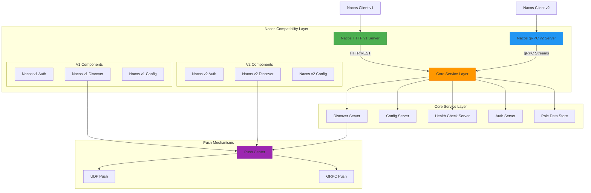
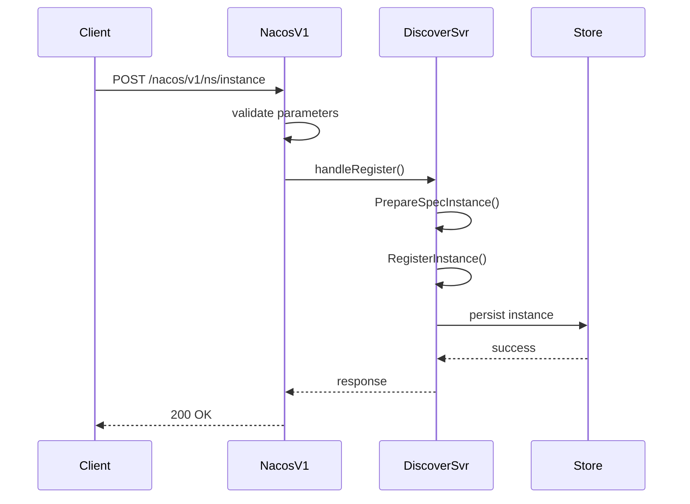
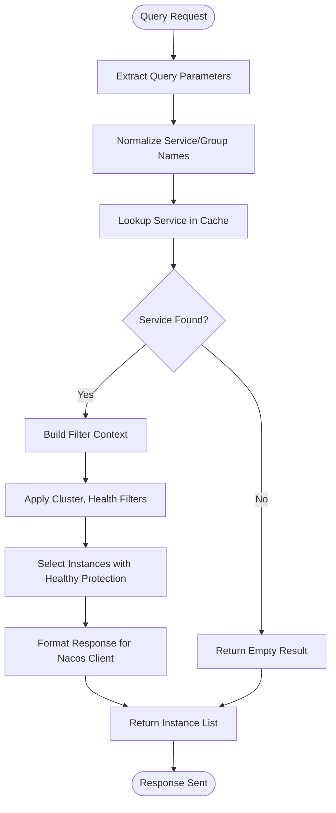
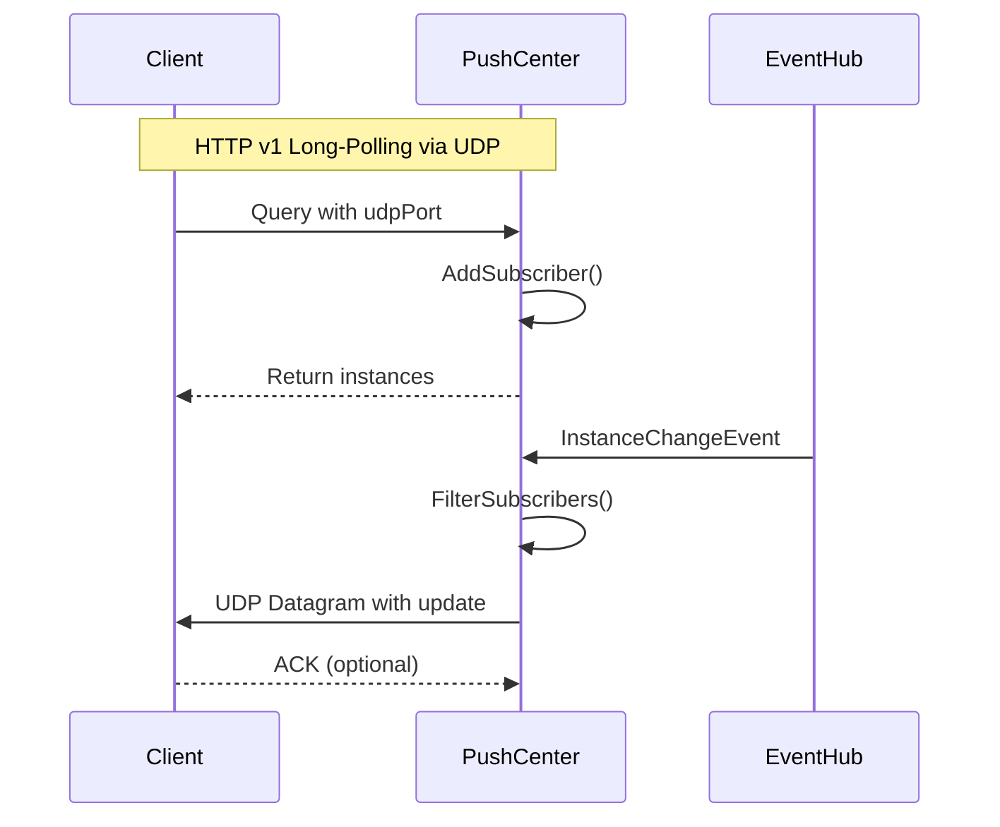
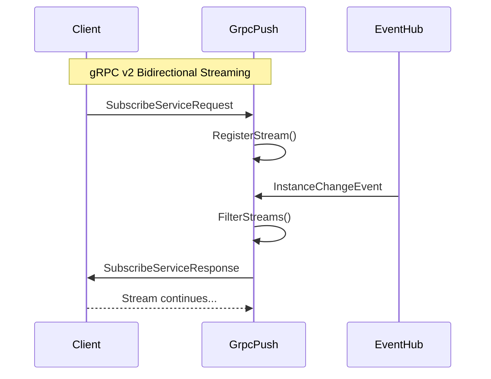
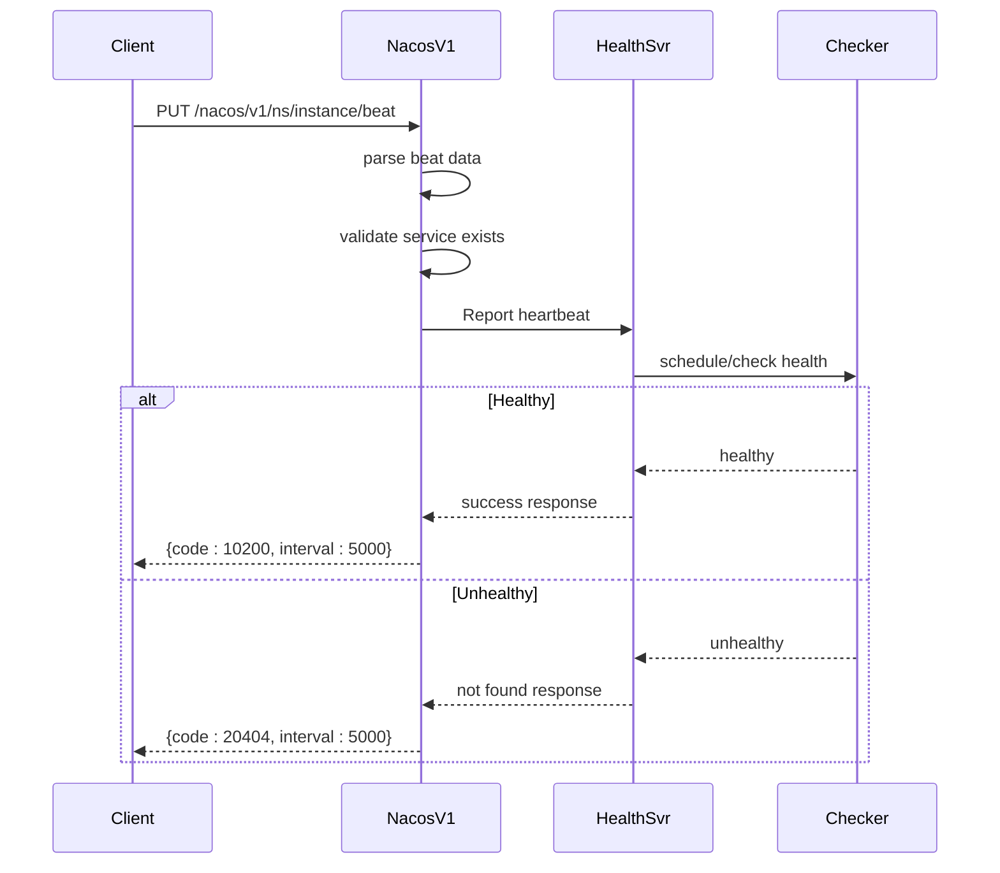
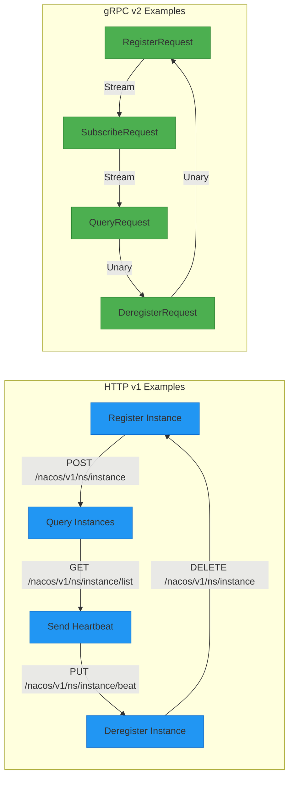
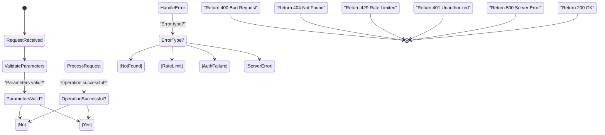

# Nacos Support

<cite>
**Referenced Files in This Document**   
- [server.go](file://plugin/apiserver/nacosserver/server.go)
- [v1/server.go](file://plugin/apiserver/nacosserver/v1/server.go)
- [v2/server.go](file://plugin/apiserver/nacosserver/v2/server.go)
- [v1/discover/server.go](file://plugin/apiserver/nacosserver/v1/discover/server.go)
- [v2/discover/server.go](file://plugin/apiserver/nacosserver/v2/discover/server.go)
- [v1/discover/instance.go](file://plugin/apiserver/nacosserver/v1/discover/instance.go)
- [v1/discover/access.go](file://plugin/apiserver/nacosserver/v1/discover/access.go)
- [v2/discover/instance.go](file://plugin/apiserver/nacosserver/v2/discover/instance.go)
- [v2/discover/grpc_push.go](file://plugin/apiserver/nacosserver/v2/discover/grpc_push.go)
- [core/push.go](file://plugin/apiserver/nacosserver/core/push.go)
- [model/instance.go](file://plugin/apiserver/nacosserver/model/instance.go)
- [model/service.go](file://plugin/apiserver/nacosserver/model/service.go)
- [model/constant.go](file://plugin/apiserver/nacosserver/model/constant.go)
- [v1/config/server.go](file://plugin/apiserver/nacosserver/v1/config/server.go)
- [v2/config/server.go](file://plugin/apiserver/nacosserver/v2/config/server.go)
- [pkg/service/service.go](file://pkg/service/service.go)
- [pkg/service/instance.go](file://pkg/service/instance.go)
- [apis/pkg/types/metrics/types.go](file://apis/pkg/types/metrics/types.go)
</cite>

## Table of Contents
1. [Introduction](#introduction)
2. [Architecture Overview](#architecture-overview)
3. [Service Registration and Deregistration](#service-registration-and-deregistration)
4. [Instance Querying and Filtering](#instance-querying-and-filtering)
5. [Push-Based Update Mechanisms](#push-based-update-mechanisms)
6. [Namespace and Service Naming Mapping](#namespace-and-service-naming-mapping)
7. [Health Check Integration](#health-check-integration)
8. [Client Request Examples](#client-request-examples)
9. [Protocol-Specific Error Handling](#protocol-specific-error-handling)
10. [Rate Limiting and Authentication](#rate-limiting-and-authentication)
11. [Migration Guidance](#migration-guidance)
12. [Performance Considerations](#performance-considerations)

## Introduction
This document provides comprehensive documentation for the Nacos-compatible service discovery implementation in Pole. The system supports both HTTP (v1) and gRPC (v2) protocols, enabling seamless integration with existing Nacos clients while providing enhanced capabilities through Pole's underlying architecture. The implementation focuses on maintaining client compatibility while extending functionality through improved push mechanisms, health checking, and namespace management.

The service discovery system enables dynamic service registration, instance querying, and real-time updates through both long-polling (HTTP v1) and bidirectional streaming (gRPC v2) mechanisms. This documentation covers the complete implementation details, including protocol specifics, data model mappings, and operational considerations for maintaining a robust service discovery infrastructure.

## Architecture Overview



**Diagram sources**
- [server.go](file://plugin/apiserver/nacosserver/server.go#L1-L239)
- [v1/server.go](file://plugin/apiserver/nacosserver/v1/server.go#L1-L357)
- [v2/server.go](file://plugin/apiserver/nacosserver/v2/server.go#L1-L443)

**Section sources**
- [server.go](file://plugin/apiserver/nacosserver/server.go#L1-L239)
- [v1/server.go](file://plugin/apiserver/nacosserver/v1/server.go#L1-L357)
- [v2/server.go](file://plugin/apiserver/nacosserver/v2/server.go#L1-L443)

## Service Registration and Deregistration

The Nacos-compatible service discovery implementation supports service registration and deregistration through both HTTP v1 and gRPC v2 protocols. The system translates Nacos-specific requests into Pole's internal service model, maintaining compatibility while leveraging Pole's enhanced service management capabilities.

Service registration is handled through the `handleRegister` method in the discover server, which converts Nacos instance data into Pole's specification format before delegating to the core discovery server. The registration process includes namespace mapping, service name normalization, and metadata translation to ensure compatibility between Nacos and Pole data models.

Deregistration follows a similar pattern, with the system validating the instance tetrad (namespace, service name, IP, port) before removing the instance from the registry. The implementation ensures atomic operations and proper error handling to maintain registry consistency.



**Diagram sources**
- [v1/discover/instance.go](file://plugin/apiserver/nacosserver/v1/discover/instance.go#L15-L50)
- [v1/discover/server.go](file://plugin/apiserver/nacosserver/v1/discover/server.go#L1-L68)

**Section sources**
- [v1/discover/instance.go](file://plugin/apiserver/nacosserver/v1/discover/instance.go#L15-L179)
- [v2/discover/instance.go](file://plugin/apiserver/nacosserver/v2/discover/instance.go#L1-L200)

## Instance Querying and Filtering

Instance querying in the Nacos-compatible implementation supports both simple and complex filtering operations through both HTTP v1 and gRPC v2 interfaces. The system provides comprehensive filtering capabilities based on namespace, service name, group, cluster, and health status.

The query process begins with parameter extraction and normalization, followed by service lookup in the cache layer. The implementation supports healthy-only queries, cluster filtering, and client-based subscription management. For HTTP v1 requests, the system also handles UDP port registration for push notifications.

Filtering is implemented through the `FilterContext` structure, which encapsulates all query parameters and enables efficient instance selection. The system applies healthy protection logic to prevent unhealthy instances from being returned when appropriate, ensuring client applications receive reliable service endpoints.



**Diagram sources**
- [v1/discover/instance.go](file://plugin/apiserver/nacosserver/v1/discover/instance.go#L100-L179)
- [core/push.go](file://plugin/apiserver/nacosserver/core/push.go#L1-L50)

**Section sources**
- [v1/discover/instance.go](file://plugin/apiserver/nacosserver/v1/discover/instance.go#L100-L179)
- [v2/discover/instance.go](file://plugin/apiserver/nacosserver/v2/discover/instance.go#L150-L300)

## Push-Based Update Mechanisms

The Nacos-compatible implementation provides two distinct push mechanisms for real-time service updates: long-polling for HTTP v1 clients and bidirectional streaming for gRPC v2 clients. These mechanisms ensure clients receive immediate notifications of service topology changes without requiring frequent polling.

For HTTP v1 clients, the system implements a UDP-based push mechanism where clients register their UDP port during instance queries. The push center maintains a subscription registry and sends updates via UDP datagrams when service instances change. This approach minimizes HTTP connection overhead while providing near real-time updates.

For gRPC v2 clients, the system leverages bidirectional streaming to establish persistent connections. Clients subscribe to service updates through the `SubscribeServiceRequest` message, and the server pushes changes through the established stream. This approach provides lower latency and more reliable delivery compared to the UDP-based mechanism.





**Diagram sources**
- [v1/discover/instance.go](file://plugin/apiserver/nacosserver/v1/discover/instance.go#L130-L179)
- [v2/discover/grpc_push.go](file://plugin/apiserver/nacosserver/v2/discover/grpc_push.go#L1-L100)
- [core/push.go](file://plugin/apiserver/nacosserver/core/push.go#L1-L80)

**Section sources**
- [v1/discover/instance.go](file://plugin/apiserver/nacosserver/v1/discover/instance.go#L130-L179)
- [v2/discover/grpc_push.go](file://plugin/apiserver/nacosserver/v2/discover/grpc_push.go#L1-L150)
- [core/push.go](file://plugin/apiserver/nacosserver/core/push.go#L1-L100)

## Namespace and Service Naming Mapping

The Nacos-compatible implementation includes comprehensive namespace and service naming mapping to ensure seamless interoperability between Nacos and Pole systems. The mapping layer translates between Nacos-specific conventions and Pole's internal data model, enabling clients to use familiar Nacos patterns while leveraging Pole's enhanced namespace management.

Namespace mapping is configured through the `DefaultNamespace` setting in the Nacos server configuration. When no namespace is specified in a request, the system uses the default namespace value. The implementation supports both explicit namespace identifiers and the special "public" namespace that maps to Pole's default namespace.

Service naming follows a group-service pattern where the group and service name are separated by a delimiter. The system parses Nacos service names of the format `groupName@@serviceName` and maps them to Pole's service and namespace model. This allows Nacos clients to maintain their existing naming conventions while the system internally organizes services according to Pole's architecture.

```mermaid
classDiagram
class NacosService {
+string namespaceId
+string groupName
+string serviceName
+map[string]string metadata
+int port
+string ip
}
class PoleService {
+string service
+string namespace
+string version
+map[string]string metadata
+uint32 revision
}
class NamingConverter {
+ToPoleService(nacosService) PoleService
+ToNacosService(poleService) NacosService
+ParseServiceName(name) (group, service)
+BuildServiceName(group, service) string
+MapNamespace(nacosNamespace) string
}
NacosService --> NamingConverter : "converts to/from"
PoleService --> NamingConverter : "converts to/from"
note right of NamingConverter
Handles translation between
Nacos and Pole naming conventions
including group parsing,
namespace mapping, and
metadata transformation
end
```

**Diagram sources**
- [model/constant.go](file://plugin/apiserver/nacosserver/model/constant.go#L1-L20)
- [model/service.go](file://plugin/apiserver/nacosserver/model/service.go#L1-L50)
- [model/instance.go](file://plugin/apiserver/nacosserver/model/instance.go#L1-L40)

**Section sources**
- [model/constant.go](file://plugin/apiserver/nacosserver/model/constant.go#L1-L30)
- [model/service.go](file://plugin/apiserver/nacosserver/model/service.go#L1-L60)
- [v1/discover/instance.go](file://plugin/apiserver/nacosserver/v1/discover/instance.go#L15-L50)

## Health Check Integration

Health check integration in the Nacos-compatible implementation bridges Nacos's heartbeat mechanism with Pole's comprehensive health checking system. The system translates Nacos client heartbeats into Pole's health reporting protocol, enabling unified health management across different client types.

The implementation supports both lightweight heartbeats and full health checks. When a client sends a heartbeat through the `/nacos/v1/ns/instance/beat` endpoint, the system validates the service instance and reports the heartbeat to Pole's health check server. The response includes the recommended heartbeat interval and indicates whether lightweight heartbeats are enabled.

For services requiring more sophisticated health checking, the system integrates with Pole's active health checking mechanisms, including HTTP, TCP, and script-based checks. The health status from these checks is propagated to Nacos clients through the same push mechanisms used for service topology changes.



**Diagram sources**
- [v1/discover/instance.go](file://plugin/apiserver/nacosserver/v1/discover/instance.go#L70-L99)
- [pkg/service/healthcheck/check.go](file://pkg/service/healthcheck/check.go#L1-L50)
- [service/healthcheck/beat_checker.go](file://plugin/service/healthchecker/heartbeat/beat_checker.go#L1-L40)

**Section sources**
- [v1/discover/instance.go](file://plugin/apiserver/nacosserver/v1/discover/instance.go#L70-L99)
- [pkg/service/healthcheck/check.go](file://pkg/service/healthcheck/check.go#L1-L100)

## Client Request Examples

The following examples demonstrate common client requests for service discovery and instance registration using both HTTP v1 and gRPC v2 protocols. These examples illustrate the request structure, required parameters, and expected responses for typical operations.

For service registration via HTTP v1, clients send a POST request with instance details as query parameters or request body. The system responds with a 200 status code on success or appropriate error codes for validation failures or server errors.

For instance querying, clients use GET requests with filtering parameters. The response includes the service metadata and a list of healthy instances, formatted according to Nacos v1 conventions for client compatibility.



**Diagram sources**
- [v1/discover/access.go](file://plugin/apiserver/nacosserver/v1/discover/access.go#L1-L100)
- [v2/discover/server.go](file://plugin/apiserver/nacosserver/v2/discover/server.go#L1-L146)

**Section sources**
- [v1/discover/access.go](file://plugin/apiserver/nacosserver/v1/discover/access.go#L1-L150)
- [v2/discover/server.go](file://plugin/apiserver/nacosserver/v2/discover/server.go#L1-L146)

## Protocol-Specific Error Handling

Error handling in the Nacos-compatible implementation is designed to provide meaningful feedback to clients while maintaining protocol compatibility. The system maps Pole's internal error codes to Nacos-specific error responses, ensuring clients receive familiar error indicators.

For HTTP v1 requests, the system returns JSON responses with error codes and messages that match Nacos conventions. Common errors include service not found (404), invalid parameters (400), and server errors (500). The implementation also supports Nacos-specific error codes for rate limiting and authentication failures.

For gRPC v2 requests, the system uses gRPC status codes with additional details in the error message. The interceptor chain handles error conversion, ensuring that Pole's internal errors are properly translated to gRPC status codes that Nacos clients can interpret.



**Diagram sources**
- [v1/server.go](file://plugin/apiserver/nacosserver/v1/server.go#L200-L300)
- [v2/server.go](file://plugin/apiserver/nacosserver/v2/server.go#L300-L400)
- [model/error.go](file://plugin/apiserver/nacosserver/model/error.go#L1-L20)

**Section sources**
- [v1/server.go](file://plugin/apiserver/nacosserver/v1/server.go#L200-L357)
- [v2/server.go](file://plugin/apiserver/nacosserver/v2/server.go#L300-L443)

## Rate Limiting and Authentication

Rate limiting and authentication in the Nacos-compatible implementation provide security and stability for the service discovery system. The system integrates with Pole's access control mechanisms to support both IP-based and API-based rate limiting, as well as token-based authentication.

Rate limiting is implemented at the protocol level, with separate configurations for HTTP v1 and gRPC v2 interfaces. The system tracks request rates by client IP and specific API endpoints, rejecting requests that exceed configured thresholds. This prevents abuse and ensures fair resource usage across clients.

Authentication mapping translates Nacos's accessToken mechanism to Pole's JWT-based authentication system. When clients include an accessToken parameter, the system converts it to a standard Authorization header, enabling seamless integration with Pole's existing authentication infrastructure.

```mermaid
flowchart TD
Start([Request Received]) --> ExtractIP["Extract Client IP"]
ExtractIP --> CheckRateLimit["Check Rate Limit"]
CheckRateLimit --> RateLimited?: "Rate limit exceeded?"
RateLimited? --> |Yes| Return429["Return 429 Too Many Requests"]
RateLimited? --> |No| CheckAuth["Check Authentication"]
CheckAuth --> HasToken?: "accessToken in query?"
HasToken? --> |Yes| ConvertToken["Convert to Authorization Header"]
HasToken? --> |No| Continue["Continue processing"]
ConvertToken --> Continue
Continue --> ValidateAuth["Validate JWT Token"]
ValidateAuth --> AuthValid?: "Authentication valid?"
AuthValid? --> |No| Return401["Return 401 Unauthorized"]
AuthValid? --> |Yes| ProcessRequest["Process Request"]
Return429 --> End([Response Sent])
Return401 --> End
ProcessRequest --> End
```

**Diagram sources**
- [v1/server.go](file://plugin/apiserver/nacosserver/v1/server.go#L250-L300)
- [v2/server.go](file://plugin/apiserver/nacosserver/v2/server.go#L200-L250)
- [apis/access_control/ratelimit/ratelimit.go](file://apis/access_control/ratelimit/ratelimit.go#L1-L30)

**Section sources**
- [v1/server.go](file://plugin/apiserver/nacosserver/v1/server.go#L250-L357)
- [v2/server.go](file://plugin/apiserver/nacosserver/v2/server.go#L200-L443)

## Migration Guidance

Migrating from Nacos to Pole while maintaining client compatibility requires careful planning and execution. The Nacos-compatible implementation is designed to facilitate this transition by providing a seamless replacement for Nacos servers with minimal client-side changes.

The migration process should follow a phased approach, beginning with deploying Pole servers alongside existing Nacos infrastructure. Clients can be gradually redirected to the Pole servers using DNS or service mesh routing rules. During this transition period, both systems can operate in parallel, ensuring service continuity.

Key considerations for migration include:
- Configuring namespace mapping to align with existing Nacos namespaces
- Setting appropriate default values for unspecified parameters
- Validating client compatibility with the implemented Nacos API subset
- Monitoring performance and error rates during the transition
- Planning for data migration if required

The implementation supports all essential Nacos service discovery features, but organizations should verify that their specific usage patterns are supported before completing the migration.

**Section sources**
- [server.go](file://plugin/apiserver/nacosserver/server.go#L1-L239)
- [config.go](file://plugin/apiserver/nacosserver/config.go#L1-L50)
- [default.go](file://plugin/apiserver/nacosserver/default.go#L1-L30)

## Performance Considerations

The Nacos-compatible implementation includes several performance optimizations to handle high-volume service discovery traffic. The system leverages caching, connection pooling, and efficient data structures to minimize latency and resource consumption.

For HTTP v1 requests, the system uses Go's restful framework with connection keep-alive and TCP keep-alive to reduce connection overhead. The implementation also supports connection limiting to prevent resource exhaustion from excessive client connections.

For gRPC v2 requests, the system uses bidirectional streaming with efficient message framing and compression. The connection manager tracks active streams and associated metadata, enabling efficient routing of push notifications to subscribed clients.

Monitoring and statistics collection are integrated throughout the system, with metrics collected for request rates, latencies, and error rates. These metrics can be used to identify performance bottlenecks and optimize system configuration.

**Section sources**
- [v1/server.go](file://plugin/apiserver/nacosserver/v1/server.go#L150-L200)
- [v2/server.go](file://plugin/apiserver/nacosserver/v2/server.go#L150-L200)
- [apis/pkg/types/metrics/types.go](file://apis/pkg/types/metrics/types.go#L1-L40)