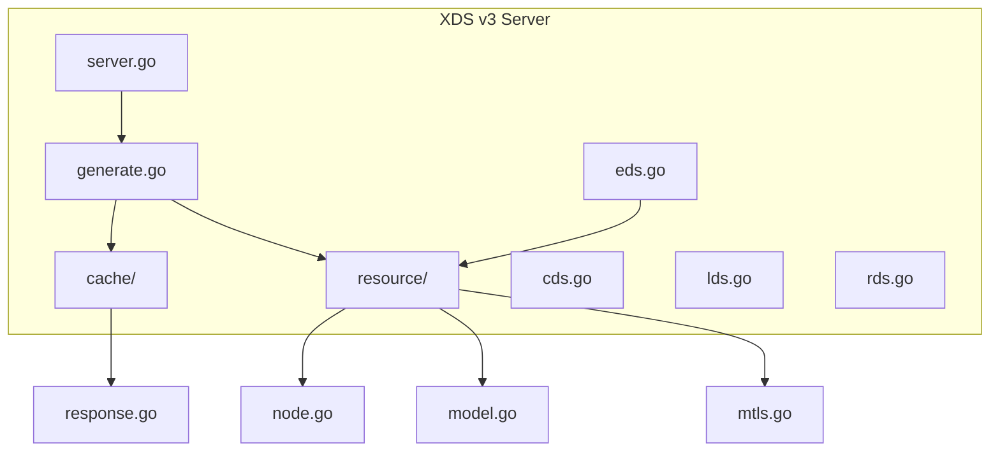
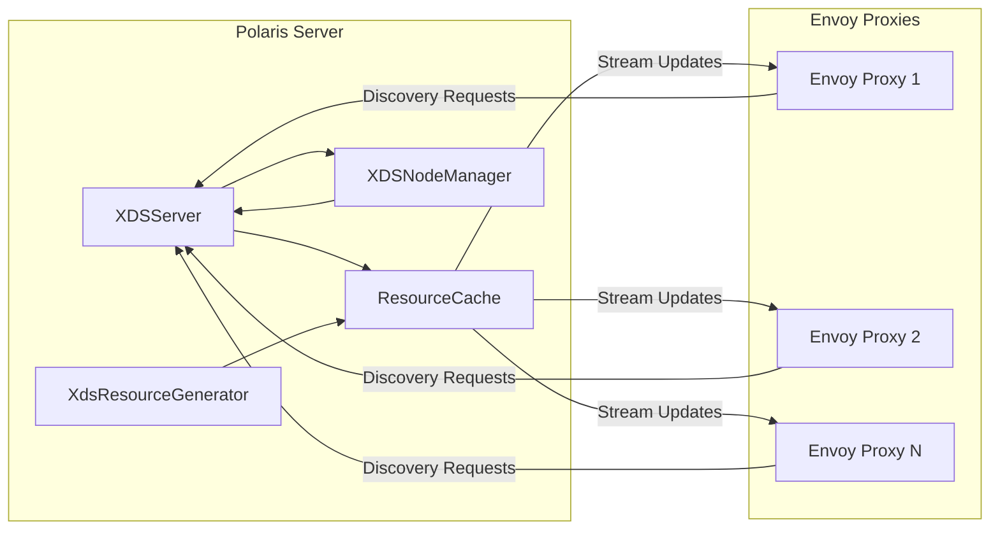
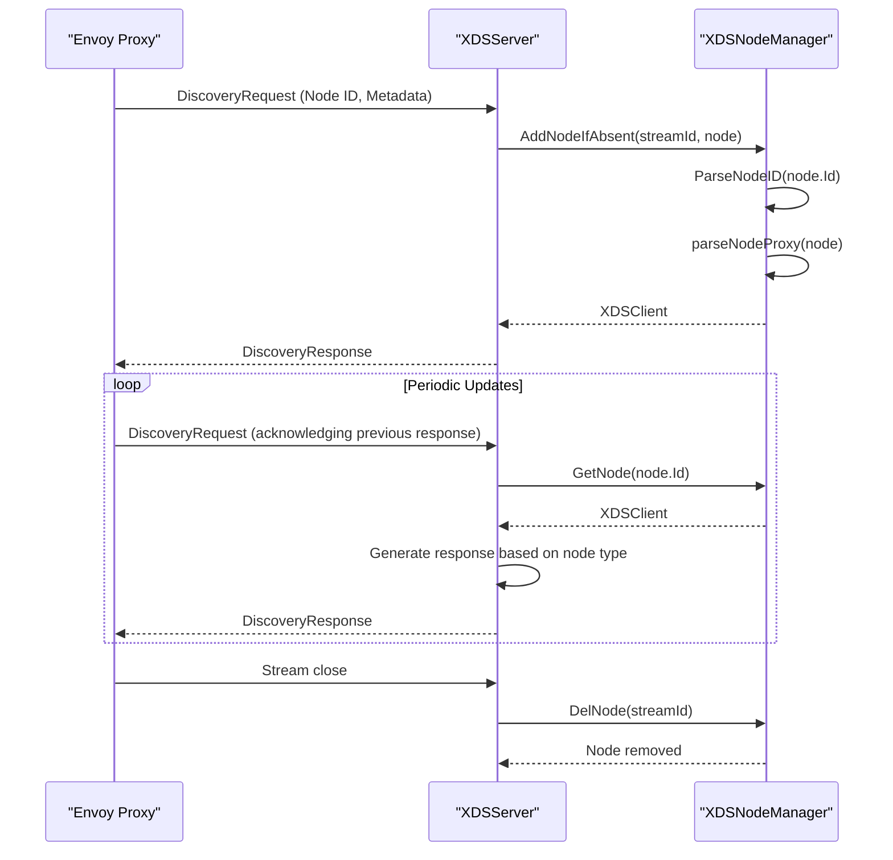
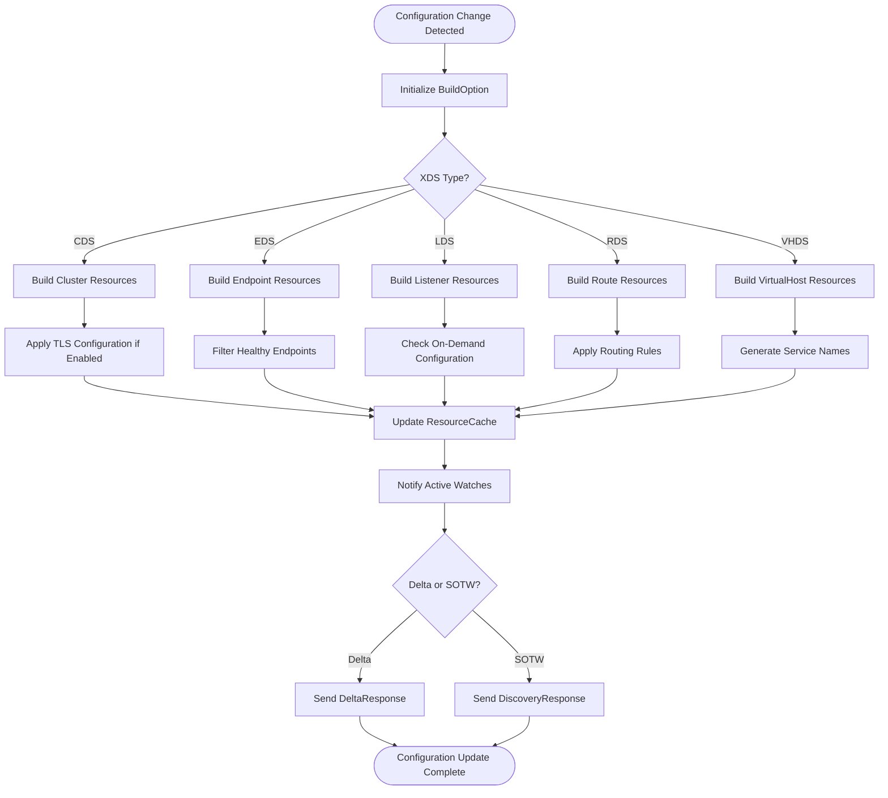
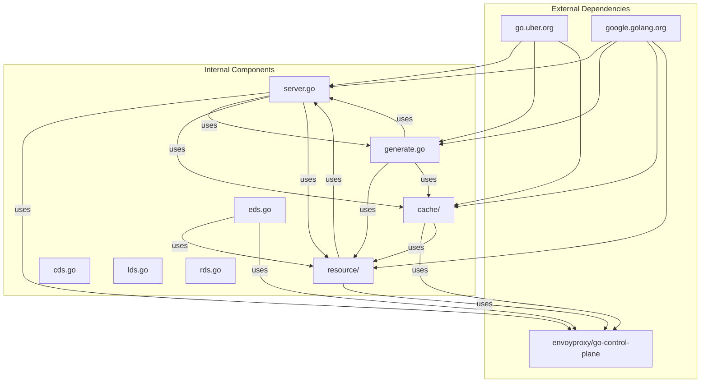

# XDS v3 Support

<cite>
**Referenced Files in This Document**   
- [server.go](file://plugin/apiserver/xdsserverv3/server.go)
- [eds.go](file://plugin/apiserver/xdsserverv3/eds.go)
- [node.go](file://plugin/apiserver/xdsserverv3/resource/node.go)
- [model.go](file://plugin/apiserver/xdsserverv3/resource/model.go)
- [mtls.go](file://plugin/apiserver/xdsserverv3/resource/mtls.go)
- [generate.go](file://plugin/apiserver/xdsserverv3/generate.go)
- [cache.go](file://plugin/apiserver/xdsserverv3/cache/cache.go)
- [response.go](file://plugin/apiserver/xdsserverv3/cache/response.go)
- [help.go](file://plugin/apiserver/xdsserverv3/resource/help.go)
</cite>

## Table of Contents
1. [Introduction](#introduction)
2. [Project Structure](#project-structure)
3. [Core Components](#core-components)
4. [Architecture Overview](#architecture-overview)
5. [Detailed Component Analysis](#detailed-component-analysis)
6. [Dependency Analysis](#dependency-analysis)
7. [Performance Considerations](#performance-considerations)
8. [Troubleshooting Guide](#troubleshooting-guide)
9. [Conclusion](#conclusion)

## Introduction
This document provides comprehensive documentation for the XDS v3 (Envoy Discovery Service) implementation within the Polaris service mesh. It details the gRPC-based EDS (Endpoint Discovery Service) interface, stream management, request/response cycles, and resource versioning. The documentation covers node identification, cluster load assignment, locality-based routing configurations, and how service instances are mapped to Envoy endpoints with health status propagation. It includes information on authentication via mTLS, rate limiting on XDS streams, error handling for malformed requests, integration with Envoy proxies and Istio service mesh, resource naming conventions, and incremental xDS support.

## Project Structure
The XDS v3 implementation is organized within the `plugin/apiserver/xdsserverv3` directory, containing core server logic, resource builders, and cache management components. The structure follows a modular approach with clear separation between server management, resource generation, and caching mechanisms.



**Diagram sources**
- [server.go](file://plugin/apiserver/xdsserverv3/server.go)
- [generate.go](file://plugin/apiserver/xdsserverv3/generate.go)
- [cache/cache.go](file://plugin/apiserver/xdsserverv3/cache/cache.go)
- [resource/node.go](file://plugin/apiserver/xdsserverv3/resource/node.go)

**Section sources**
- [server.go](file://plugin/apiserver/xdsserverv3/server.go)
- [generate.go](file://plugin/apiserver/xdsserverv3/generate.go)

## Core Components
The XDS v3 implementation consists of several core components that work together to provide service discovery and configuration to Envoy proxies. The XDSServer manages the gRPC server lifecycle and handles incoming discovery requests. The ResourceCache maintains the current state of all xDS resources and handles watch operations. The XDSNodeManager tracks connected Envoy nodes and their metadata. The XdsResourceGenerator creates and updates xDS resources based on service changes in the system.

**Section sources**
- [server.go](file://plugin/apiserver/xdsserverv3/server.go#L1-L50)
- [generate.go](file://plugin/apiserver/xdsserverv3/generate.go#L1-L50)
- [cache/cache.go](file://plugin/apiserver/xdsserverv3/cache/cache.go#L1-L50)

## Architecture Overview
The XDS v3 architecture follows the standard Envoy xDS protocol pattern with a centralized server that pushes configuration updates to connected Envoy proxies. The system uses a push-based model where configuration changes trigger updates to all relevant Envoy instances.



**Diagram sources**
- [server.go](file://plugin/apiserver/xdsserverv3/server.go#L1-L50)
- [cache/cache.go](file://plugin/apiserver/xdsserverv3/cache/cache.go#L1-L50)

## Detailed Component Analysis

### EDS Implementation Analysis
The EDS (Endpoint Discovery Service) implementation handles the discovery and distribution of service endpoints to Envoy proxies. It supports both inbound and outbound traffic directions, with different handling for sidecar and gateway modes.

```mermaid
classDiagram
class EDSBuilder {
+Generate(option *BuildOption) (interface{}, error)
+makeBoundEndpoints(option *BuildOption, direction TrafficDirection) []Resource
+buildServiceEndpoint(serviceInfo *ServiceInfo) []*LocalityLbEndpoints
+makeSelfEndpoint(option *BuildOption) []Resource
}
class BuildOption {
+RunType RunType
+Namespace string
+Services map[ServiceKey]*ServiceInfo
+TrafficDirection TrafficDirection
+SelfService ServiceKey
+TLSMode TLSMode
+ForceDelete bool
}
class ServiceInfo {
+ID string
+Name string
+Namespace string
+ServiceKey ServiceKey
+Instances []*Instance
+SvcInsRevision string
+Routing *Routing
+Ports []*ServicePort
+RateLimit *RateLimit
+CircuitBreaker *CircuitBreaker
+FaultDetect *FaultDetector
}
EDSBuilder --> BuildOption : "uses"
EDSBuilder --> ServiceInfo : "references"
BuildOption --> ServiceInfo : "contains"
```

**Diagram sources**
- [eds.go](file://plugin/apiserver/xdsserverv3/eds.go#L1-L20)
- [resource/model.go](file://plugin/apiserver/xdsserverv3/resource/model.go#L1-L20)

**Section sources**
- [eds.go](file://plugin/apiserver/xdsserverv3/eds.go#L1-L204)
- [resource/model.go](file://plugin/apiserver/xdsserverv3/resource/model.go#L1-L251)

### Node Management Analysis
The node management system handles the identification and tracking of Envoy proxy instances connecting to the XDS server. It parses node metadata to determine run type (sidecar or gateway), security mode, and other configuration parameters.



**Diagram sources**
- [server.go](file://plugin/apiserver/xdsserverv3/server.go#L1-L50)
- [resource/node.go](file://plugin/apiserver/xdsserverv3/resource/node.go#L1-L50)

**Section sources**
- [server.go](file://plugin/apiserver/xdsserverv3/server.go#L1-L50)
- [resource/node.go](file://plugin/apiserver/xdsserverv3/resource/node.go#L1-L455)

### Resource Generation and Caching Analysis
The resource generation and caching system is responsible for creating xDS configuration resources and managing their distribution to connected Envoy proxies. It uses a sophisticated caching mechanism to efficiently handle updates and minimize redundant processing.



**Diagram sources**
- [generate.go](file://plugin/apiserver/xdsserverv3/generate.go#L1-L50)
- [cache/cache.go](file://plugin/apiserver/xdsserverv3/cache/cache.go#L1-L50)

**Section sources**
- [generate.go](file://plugin/apiserver/xdsserverv3/generate.go#L1-L246)
- [cache/cache.go](file://plugin/apiserver/xdsserverv3/cache/cache.go#L1-L890)

## Dependency Analysis
The XDS v3 implementation has a well-defined dependency structure that ensures modularity and separation of concerns. The core components depend on the Envoy control plane libraries for protocol implementation, while maintaining independence from the underlying service registry.



**Diagram sources**
- [server.go](file://plugin/apiserver/xdsserverv3/server.go#L1-L50)
- [generate.go](file://plugin/apiserver/xdsserverv3/generate.go#L1-L50)
- [cache/cache.go](file://plugin/apiserver/xdsserverv3/cache/cache.go#L1-L50)
- [resource/model.go](file://plugin/apiserver/xdsserverv3/resource/model.go#L1-L50)

**Section sources**
- [server.go](file://plugin/apiserver/xdsserverv3/server.go#L1-L50)
- [generate.go](file://plugin/apiserver/xdsserverv3/generate.go#L1-L50)

## Performance Considerations
The XDS v3 implementation includes several performance optimizations to handle large-scale deployments efficiently. The system uses concurrent processing for resource generation, with separate goroutines handling sidecar and gateway configurations simultaneously. The caching mechanism minimizes redundant processing by tracking resource versions and only pushing updates when content changes. The implementation also includes rate limiting on incoming connections to prevent resource exhaustion.

The resource generation process is optimized to minimize unnecessary work by comparing service revisions before generating new configurations. The system uses atomic operations and efficient data structures to reduce lock contention in high-concurrency scenarios. For large deployments, the incremental xDS support reduces bandwidth usage by only sending changed resources rather than full configuration dumps.

**Section sources**
- [generate.go](file://plugin/apiserver/xdsserverv3/generate.go#L1-L246)
- [cache/cache.go](file://plugin/apiserver/xdsserverv3/cache/cache.go#L1-L890)

## Troubleshooting Guide
When troubleshooting issues with the XDS v3 implementation, start by checking the connection status of Envoy proxies using the debug endpoints. The `/debug/apiserver/xds/envoy_nodes` endpoint shows all connected nodes, while `/debug/apiserver/xds/resources` displays the current resource state.

Common issues include:
- Node identification problems due to incorrect metadata formatting
- Missing resources due to version mismatches between request and response
- Authentication failures when mTLS is enabled
- Rate limiting on streams affecting configuration delivery

For debugging, enable verbose logging to track request/response cycles and watch operations. Monitor the resource version numbers to ensure updates are being propagated correctly. Check the health status of service instances, as unhealthy instances are filtered out from EDS responses.

**Section sources**
- [server.go](file://plugin/apiserver/xdsserverv3/server.go#L1-L50)
- [cache/response.go](file://plugin/apiserver/xdsserverv3/cache/response.go#L1-L50)

## Conclusion
The XDS v3 implementation provides a robust and scalable solution for service discovery and configuration management in Envoy-based service meshes. Its modular architecture separates concerns between server management, resource generation, and caching, making it maintainable and extensible. The implementation fully supports the Envoy xDS protocol with additional features like mTLS authentication, rate limiting, and incremental updates.

The system efficiently handles both sidecar and gateway deployment patterns, with appropriate configuration for each use case. The resource generation process is optimized for performance, minimizing unnecessary work while ensuring timely delivery of configuration updates. With its comprehensive debugging and monitoring capabilities, the implementation provides the visibility needed to operate at scale.