# gRPC Native Support

<cite>
**Referenced Files in This Document**   
- [plugin/apiserver/grpcserver/discover/v1/client_access.go](file://plugin/apiserver/grpcserver/discover/v1/client_access.go)
- [plugin/apiserver/grpcserver/discover/v1/heartbeat_access.go](file://plugin/apiserver/grpcserver/discover/v1/heartbeat_access.go)
- [plugin/apiserver/grpcserver/discover/v1/server.go](file://plugin/apiserver/grpcserver/discover/v1/server.go)
- [pkg/service/client_v1.go](file://pkg/service/client_v1.go)
- [pkg/service/interceptor/auth/client_v1.go](file://pkg/service/interceptor/auth/client_v1.go)
- [pkg/service/interceptor/paramcheck/client.go](file://pkg/service/interceptor/paramcheck/client.go)
- [test/integrate/grpc/register.go](file://test/integrate/grpc/register.go)
- [test/integrate/grpc/heartbeat.go](file://test/integrate/grpc/heartbeat.go)
- [test/integrate/grpc/discover.go](file://test/integrate/grpc/discover.go)
- [apis/pkg/types/service/instance.go](file://apis/pkg/types/service/instance.go)
- [pkg/service/healthcheck/server.go](file://pkg/service/healthcheck/server.go)
</cite>

## Table of Contents
1. [Introduction](#introduction)
2. [Core Service Methods](#core-service-methods)
3. [Bidirectional Streaming for Service Discovery](#bidirectional-streaming-for-service-discovery)
4. [Request and Response Message Schemas](#request-and-response-message-schemas)
5. [Error Handling and Status Propagation](#error-handling-and-status-propagation)
6. [Authentication Integration](#authentication-integration)
7. [Rate Limiting and Connection Management](#rate-limiting-and-connection-management)
8. [Stream Lifecycle Management](#stream-lifecycle-management)
9. [Performance Considerations](#performance-considerations)
10. [Client Implementation Examples](#client-implementation-examples)
11. [Integration with Microservices Architectures](#integration-with-microservices-architectures)

## Introduction
This document provides comprehensive documentation for the native gRPC service discovery interface in the Polaris service mesh platform. The interface enables service registration, deregistration, health monitoring, and discovery through a robust gRPC API. It supports both unary and streaming RPCs for efficient communication between services and the discovery server. The system is designed for high availability, scalability, and real-time service state propagation in distributed environments.

The service discovery mechanism is central to microservices architectures, enabling dynamic service location, load balancing, and fault tolerance. This implementation provides a unified discovery interface that supports multiple discovery types including service instances, routing rules, rate limiting configurations, and circuit breaker policies.

**Section sources**
- [plugin/apiserver/grpcserver/discover/v1/server.go](file://plugin/apiserver/grpcserver/discover/v1/server.go#L1-L68)

## Core Service Methods

### RegisterInstance
The `RegisterInstance` method allows services to register themselves with the discovery server. This unary RPC call creates a new service instance record in the registry, making the service discoverable by consumers. The registration includes metadata such as host, port, protocol, version, and health check configuration.

When a service instance registers, it can specify a health check strategy, with heartbeat-based health checking being the most common approach. If health checking is enabled, the instance will initially be marked as unhealthy until it sends its first heartbeat, implementing a safe default for service availability.

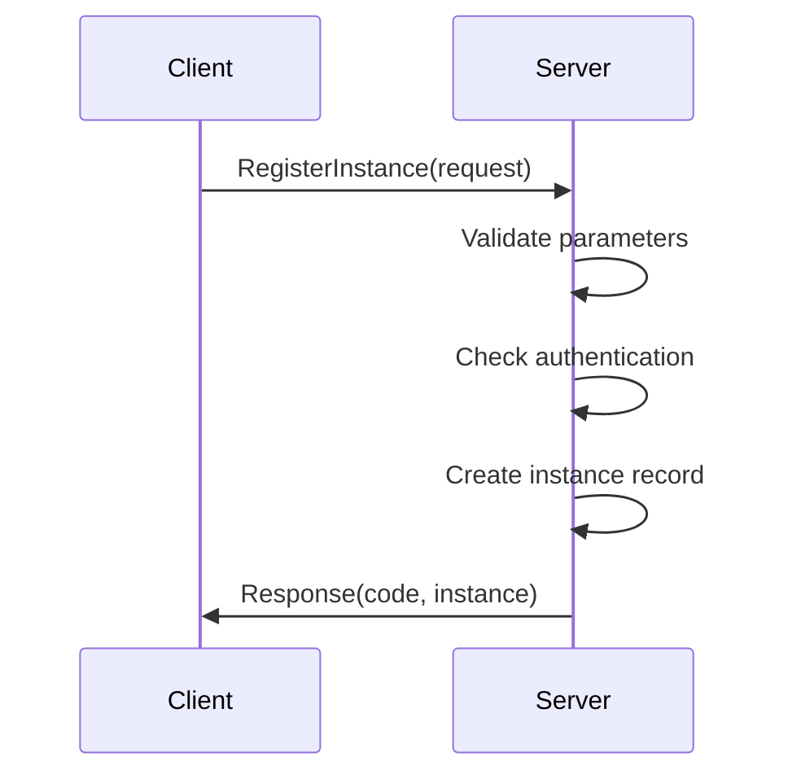

**Diagram sources**
- [plugin/apiserver/grpcserver/discover/v1/client_access.go](file://plugin/apiserver/grpcserver/discover/v1/client_access.go#L68-L88)
- [pkg/service/client_v1.go](file://pkg/service/client_v1.go#L41-L43)

### DeregisterInstance
The `DeregisterInstance` method removes a service instance from the registry. This unary RPC call marks the instance as inactive, preventing it from being returned in discovery queries. This method is typically called when a service is shutting down gracefully, allowing for clean service removal from the mesh.

The deregistration process respects the service's health check configuration and can be used in conjunction with automated cleanup jobs that remove stale instances that have stopped sending heartbeats.

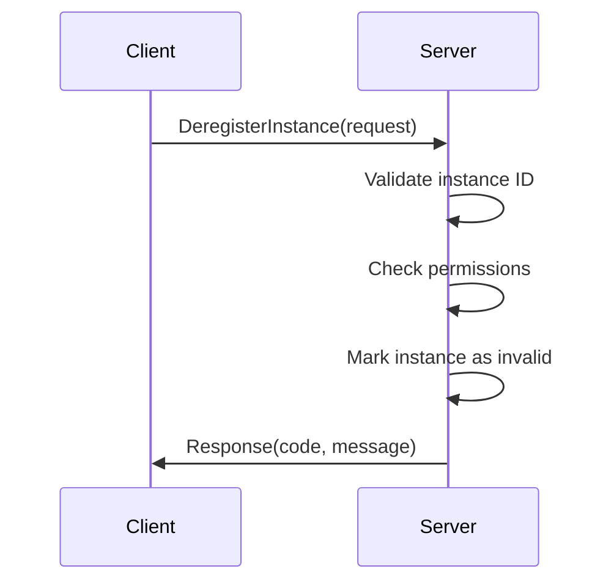

**Diagram sources**
- [plugin/apiserver/grpcserver/discover/v1/client_access.go](file://plugin/apiserver/grpcserver/discover/v1/client_access.go#L89-L104)
- [pkg/service/client_v1.go](file://pkg/service/client_v1.go#L46-L48)

### Heartbeat
The `Heartbeat` method enables service instances to report their health status to the discovery server. This unary RPC call updates the last heartbeat timestamp for the instance, indicating that the service is still operational. Regular heartbeat reporting is essential for maintaining accurate service health information in the registry.

The heartbeat mechanism works in conjunction with the configured TTL (Time To Live) value. If the server does not receive a heartbeat from an instance within the TTL period, the instance is automatically marked as unhealthy.

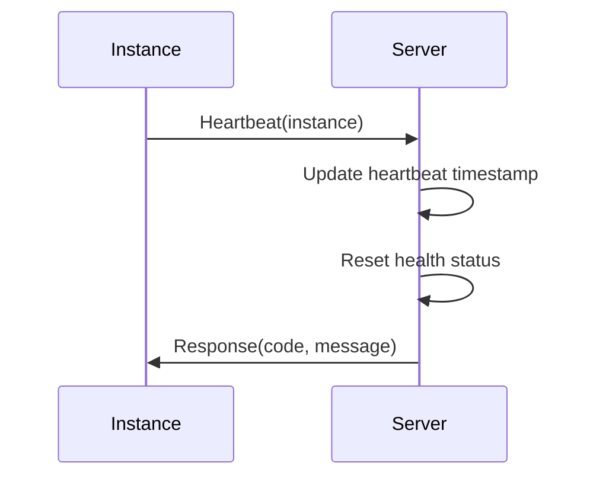

**Diagram sources**
- [plugin/apiserver/grpcserver/discover/v1/heartbeat_access.go](file://plugin/apiserver/grpcserver/discover/v1/heartbeat_access.go#L30-L32)
- [pkg/service/healthcheck/server.go](file://pkg/service/healthcheck/server.go)

**Section sources**
- [plugin/apiserver/grpcserver/discover/v1/client_access.go](file://plugin/apiserver/grpcserver/discover/v1/client_access.go#L68-L104)
- [plugin/apiserver/grpcserver/discover/v1/heartbeat_access.go](file://plugin/apiserver/grpcserver/discover/v1/heartbeat_access.go#L30-L32)

## Bidirectional Streaming for Service Discovery

### Discover Method
The `Discover` method implements bidirectional streaming to provide real-time service updates to clients. Clients establish a persistent connection and send discovery requests, while the server streams back updates whenever service instances change (new instances registered, instances deregistered, or health status changes).

This streaming approach reduces latency compared to polling mechanisms and ensures clients have up-to-date service information with minimal network overhead. The stream remains open for the duration of the client's session, providing continuous updates.

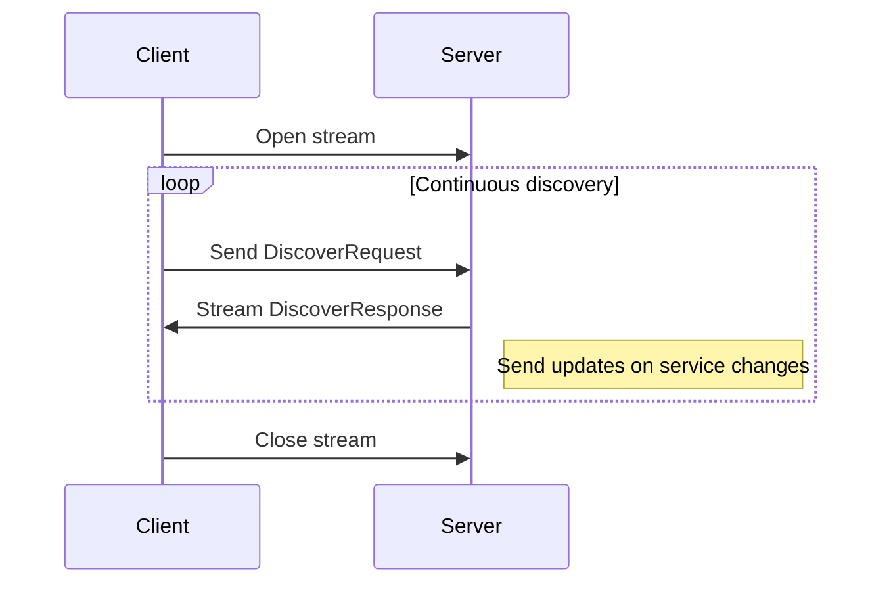

**Diagram sources**
- [plugin/apiserver/grpcserver/discover/v1/client_access.go](file://plugin/apiserver/grpcserver/discover/v1/client_access.go#L106-L136)
- [test/integrate/grpc/discover.go](file://test/integrate/grpc/discover.go)

### Stream Management
The bidirectional stream is designed to handle various discovery request types through a single interface. Clients can request different types of discovery information (instances, routing rules, rate limiting configurations) by setting the appropriate type in the `DiscoverRequest`. The server processes each request and streams back the corresponding response.

The streaming connection includes built-in error handling and reconnection logic. If the connection is interrupted, clients can establish a new stream and resume discovery operations. The server also implements keep-alive mechanisms to detect and clean up stale connections.

**Section sources**
- [plugin/apiserver/grpcserver/discover/v1/client_access.go](file://plugin/apiserver/grpcserver/discover/v1/client_access.go#L106-L136)
- [test/integrate/grpc/discover.go](file://test/integrate/grpc/discover.go)

## Request and Response Message Schemas

### Instance Registration Schema
The `Instance` message schema defines the structure for service instance registration. It includes essential fields such as service name, namespace, host, port, protocol, version, and metadata. The schema also supports health check configuration and instance weighting for load balancing purposes.

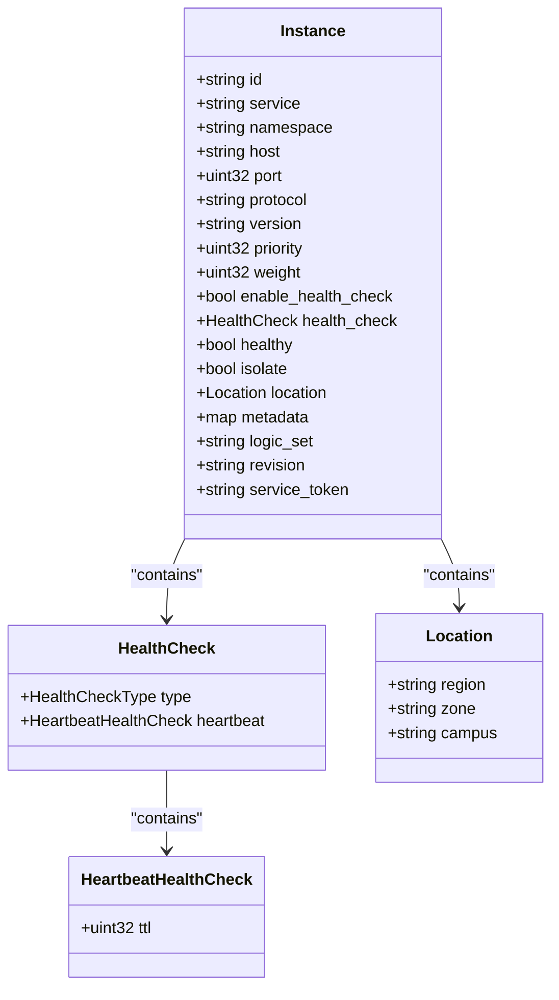

**Diagram sources**
- [apis/pkg/types/service/instance.go](file://apis/pkg/types/service/instance.go)
- [plugin/apiserver/grpcserver/discover/v1/client_access.go](file://plugin/apiserver/grpcserver/discover/v1/client_access.go)

### Discovery Request and Response
The discovery interface uses a unified request-response model that supports multiple discovery types through a polymorphic design. The `DiscoverRequest` contains a type discriminator that specifies the kind of information being requested, along with service identification and filtering criteria.

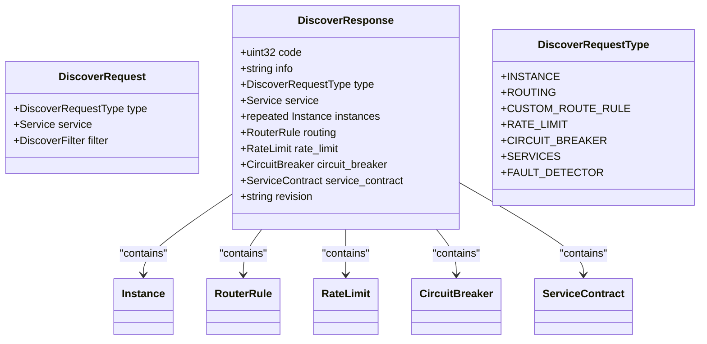

**Diagram sources**
- [plugin/apiserver/grpcserver/discover/v1/client_access.go](file://plugin/apiserver/grpcserver/discover/v1/client_access.go#L106-L136)
- [test/integrate/grpc/discover.go](file://test/integrate/grpc/discover.go)

**Section sources**
- [plugin/apiserver/grpcserver/discover/v1/client_access.go](file://plugin/apiserver/grpcserver/discover/v1/client_access.go#L106-L136)
- [test/integrate/grpc/discover.go](file://test/integrate/grpc/discover.go)

## Error Handling and Status Propagation

### Error Codes
The gRPC service discovery interface defines a comprehensive set of error codes to communicate the outcome of operations. These codes follow a consistent pattern across all methods, enabling clients to handle errors uniformly. Common error codes include:

- `ExecuteSuccess`: Operation completed successfully
- `InvalidDiscoverResource`: Invalid discovery request type
- `ClientAPINotOpen`: API access not permitted
- `InvalidMetadata`: Invalid metadata in request
- `ParseException`: Error parsing request data
- `DiscoverRatelimit`: Rate limit exceeded for discovery operations

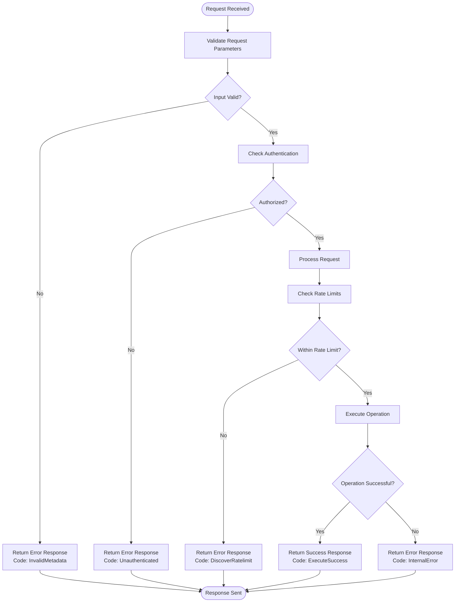

**Diagram sources**
- [plugin/apiserver/grpcserver/discover/v1/client_access.go](file://plugin/apiserver/grpcserver/discover/v1/client_access.go)
- [pkg/service/interceptor/paramcheck/client.go](file://pkg/service/interceptor/paramcheck/client.go#L43-L54)

### Status Propagation
Status information is propagated through the response message structure, with each response containing a code field that indicates the outcome of the operation. Successful operations return `ExecuteSuccess`, while various error conditions return appropriate error codes.

The system also supports detailed error messages in the response's info field, providing additional context for troubleshooting. This information is particularly useful during development and debugging phases.

**Section sources**
- [plugin/apiserver/grpcserver/discover/v1/client_access.go](file://plugin/apiserver/grpcserver/discover/v1/client_access.go)
- [pkg/service/interceptor/paramcheck/client.go](file://pkg/service/interceptor/paramcheck/client.go)

## Authentication Integration

### Token-Based Authentication
The service discovery interface supports token-based authentication for securing access to registration and discovery operations. Clients can include a service token in their requests, which is validated by the server before processing the operation.

Tokens can be specified in multiple ways:
- In the `service_token` field of the `Instance` message
- In the `token` field of the `Service` message in discovery requests
- As a gRPC metadata header

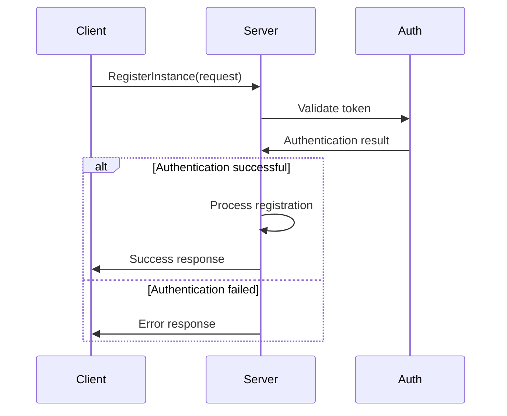

**Diagram sources**
- [plugin/apiserver/grpcserver/discover/v1/client_access.go](file://plugin/apiserver/grpcserver/discover/v1/client_access.go#L72-L88)
- [pkg/service/interceptor/auth/client_v1.go](file://pkg/service/interceptor/auth/client_v1.go#L35-L49)

### Permission Model
The authentication system implements a fine-grained permission model that controls access to different operations. The `RegisterInstance` and `DeregisterInstance` operations require specific permissions that are checked during the authentication process.

The permission system is extensible through plugins, allowing organizations to integrate with existing identity and access management systems.

**Section sources**
- [plugin/apiserver/grpcserver/discover/v1/client_access.go](file://plugin/apiserver/grpcserver/discover/v1/client_access.go#L72-L88)
- [pkg/service/interceptor/auth/client_v1.go](file://pkg/service/interceptor/auth/client_v1.go#L35-L64)
- [apis/pkg/types/auth/const.go](file://apis/pkg/types/auth/const.go#L32-L33)

## Rate Limiting and Connection Management

### Per-Connection Rate Limiting
The discovery server implements rate limiting at the connection level to prevent abuse and ensure fair resource usage. Each client connection is subject to rate limits that control the frequency of operations such as registration, deregistration, and heartbeat reporting.

Rate limiting is configured through the server's options and can be customized based on client IP address and operation type.

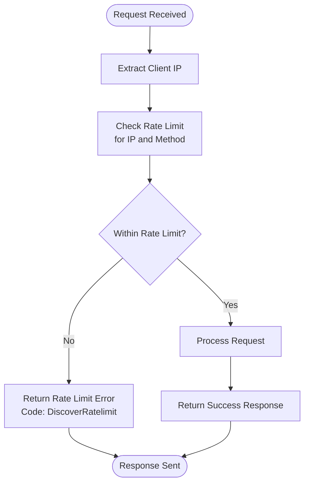

**Diagram sources**
- [plugin/apiserver/grpcserver/discover/v1/client_access.go](file://plugin/apiserver/grpcserver/discover/v1/client_access.go#L120-L136)
- [plugin/apiserver/grpcserver/discover/v1/server.go](file://plugin/apiserver/grpcserver/discover/v1/server.go#L15-L18)

### Connection Pooling
The server manages client connections efficiently through connection pooling and reuse. The bidirectional streaming interface is designed to maintain long-lived connections, reducing the overhead of connection establishment and teardown.

Clients are encouraged to maintain persistent connections for discovery operations, while registration and heartbeat operations can use shorter-lived connections as needed.

**Section sources**
- [plugin/apiserver/grpcserver/discover/v1/client_access.go](file://plugin/apiserver/grpcserver/discover/v1/client_access.go#L120-L136)
- [plugin/apiserver/grpcserver/discover/v1/server.go](file://plugin/apiserver/grpcserver/discover/v1/server.go)

## Stream Lifecycle Management

### Connection Establishment
Clients establish a bidirectional streaming connection by calling the `Discover` method. The server validates the connection and sets up the necessary context for streaming discovery updates.

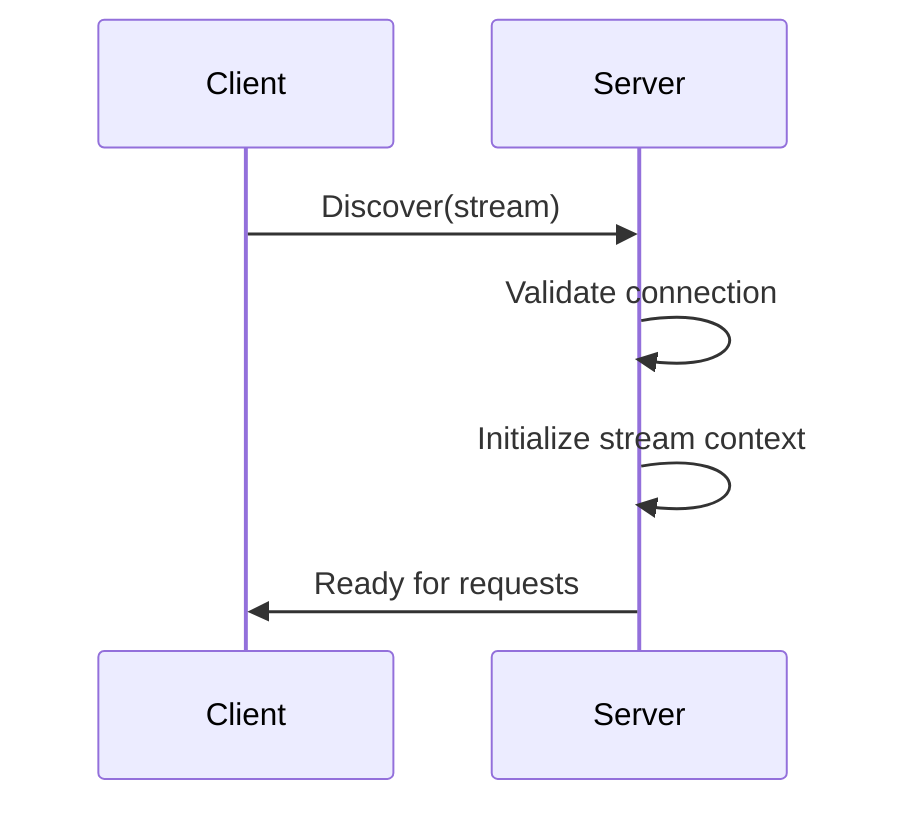

### Request Processing
Once the stream is established, clients can send discovery requests by writing to the stream. The server processes each request and sends responses back through the same stream.

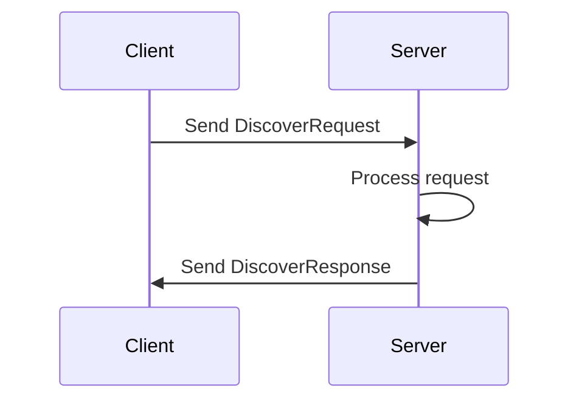

### Connection Termination
Streams can be terminated by either the client or server. Clients close the send direction of the stream when they have no more requests to send. The server detects this and closes the connection.

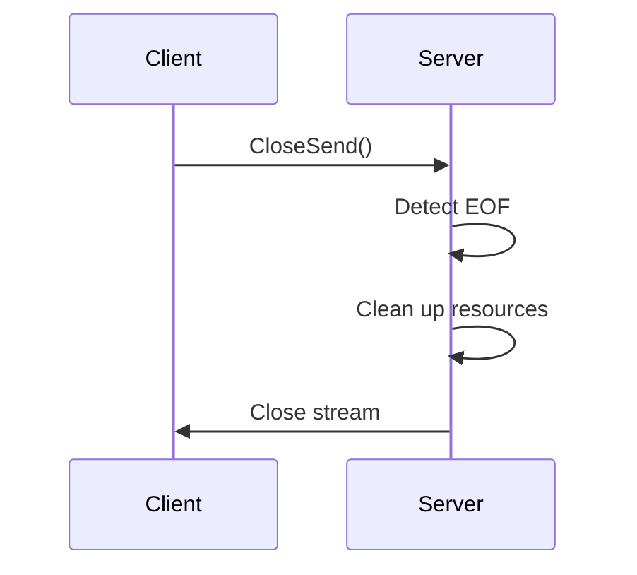

**Section sources**
- [plugin/apiserver/grpcserver/discover/v1/client_access.go](file://plugin/apiserver/grpcserver/discover/v1/client_access.go#L106-L136)
- [test/integrate/grpc/discover.go](file://test/integrate/grpc/discover.go)

## Performance Considerations

### High-Frequency Heartbeat Scenarios
For services that require high-frequency heartbeats, the system provides a `BatchHeartbeat` method that allows multiple heartbeat reports to be sent in a single request. This reduces network overhead and improves efficiency.

The heartbeat processing is optimized to handle high volumes of requests with minimal latency. The server uses efficient data structures and algorithms to update heartbeat timestamps and manage instance health status.

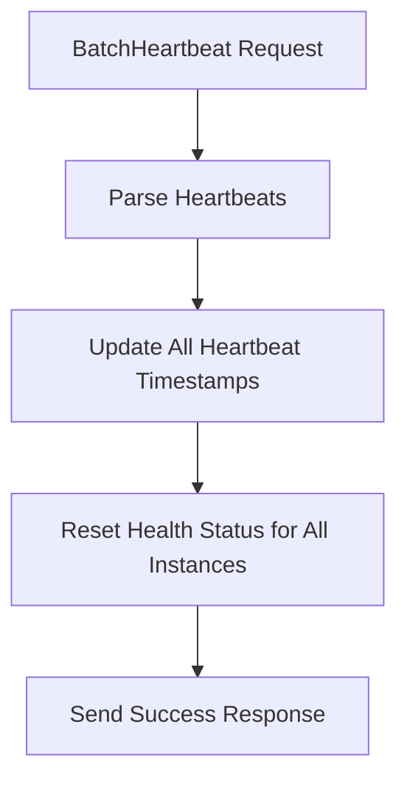

**Diagram sources**
- [plugin/apiserver/grpcserver/discover/v1/heartbeat_access.go](file://plugin/apiserver/grpcserver/discover/v1/heartbeat_access.go#L34-L47)
- [pkg/service/healthcheck/server.go](file://pkg/service/healthcheck/server.go)

### Caching Strategy
The discovery server implements a multi-level caching strategy to improve performance and reduce database load. Frequently accessed service information is cached in memory, with cache invalidation triggered by changes to service instances.

The cache is designed to handle high read-to-write ratios typical in service discovery scenarios, where discovery queries far outnumber registration and deregistration operations.

**Section sources**
- [plugin/apiserver/grpcserver/discover/v1/client_access.go](file://plugin/apiserver/grpcserver/discover/v1/client_access.go#L138-L188)
- [pkg/service/interceptor/paramcheck/client.go](file://pkg/service/interceptor/paramcheck/client.go)

## Client Implementation Examples

### Go Client Implementation
The following example demonstrates how to implement a client for the gRPC service discovery interface in Go:

```go
// Register a service instance
func registerInstance(client *grpc.ClientConn, instance *apiservice.Instance) error {
    ctx, cancel := context.WithTimeout(context.Background(), time.Second)
    defer cancel()
    
    resp, err := client.RegisterInstance(ctx, instance)
    if err != nil {
        return err
    }
    
    if resp.GetCode() != apimodel.Code_ExecuteSuccess {
        return fmt.Errorf("registration failed: %s", resp.GetInfo())
    }
    
    return nil
}

// Send periodic heartbeats
func sendHeartbeat(client *grpc.ClientConn, instance *apiservice.Instance) {
    ticker := time.NewTicker(30 * time.Second)
    defer ticker.Stop()
    
    for range ticker.C {
        ctx, cancel := context.WithTimeout(context.Background(), time.Second)
        _, err := client.Heartbeat(ctx, instance)
        cancel()
        
        if err != nil {
            log.Printf("heartbeat failed: %v", err)
        }
    }
}

// Establish discovery stream
func discoverServices(client *grpc.ClientConn, service *apiservice.Service) (<-chan *apiservice.DiscoverResponse, error) {
    stream, err := client.Discover(context.Background())
    if err != nil {
        return nil, err
    }
    
    go func() {
        defer stream.CloseSend()
        request := &apiservice.DiscoverRequest{
            Type:    apiservice.DiscoverRequest_INSTANCE,
            Service: service,
        }
        stream.Send(request)
    }()
    
    responses := make(chan *apiservice.DiscoverResponse)
    go func() {
        defer close(responses)
        for {
            resp, err := stream.Recv()
            if err != nil {
                if err != io.EOF {
                    log.Printf("discovery stream error: %v", err)
                }
                return
            }
            select {
            case responses <- resp:
            default:
            }
        }
    }()
    
    return responses, nil
}
```

**Section sources**
- [test/integrate/grpc/register.go](file://test/integrate/grpc/register.go)
- [test/integrate/grpc/heartbeat.go](file://test/integrate/grpc/heartbeat.go)
- [test/integrate/grpc/discover.go](file://test/integrate/grpc/discover.go)

## Integration with Microservices Architectures

### Service Registration Pattern
In a microservices architecture, services typically register themselves during startup and deregister during shutdown. The registration process should be idempotent, allowing services to register multiple times without creating duplicate entries.

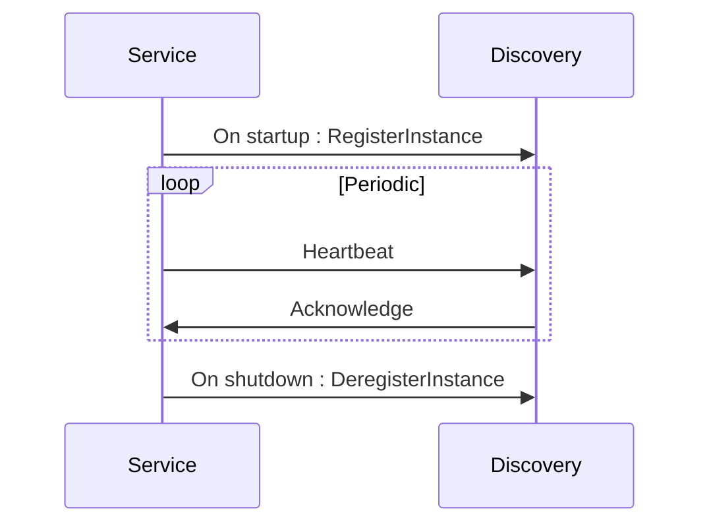

### Discovery and Load Balancing
Service consumers use the discovery interface to locate available instances of a service. The returned instance list can be used by load balancing algorithms to distribute traffic across healthy instances.

The bidirectional streaming interface ensures that consumers have up-to-date information about service instances, enabling dynamic load balancing decisions based on current service health and availability.

**Section sources**
- [plugin/apiserver/grpcserver/discover/v1/client_access.go](file://plugin/apiserver/grpcserver/discover/v1/client_access.go)
- [test/integrate/grpc/discover.go](file://test/integrate/grpc/discover.go)