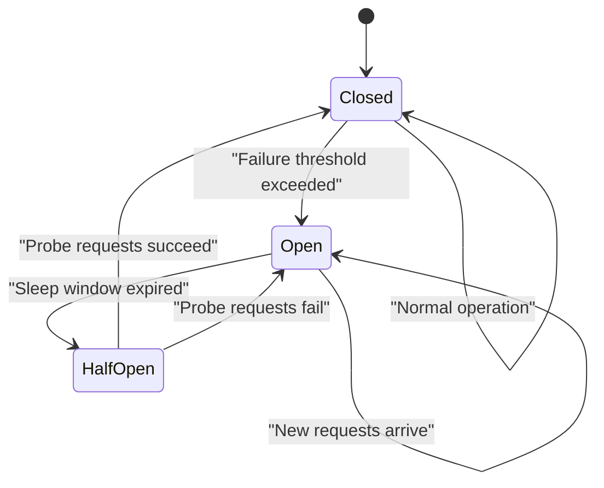
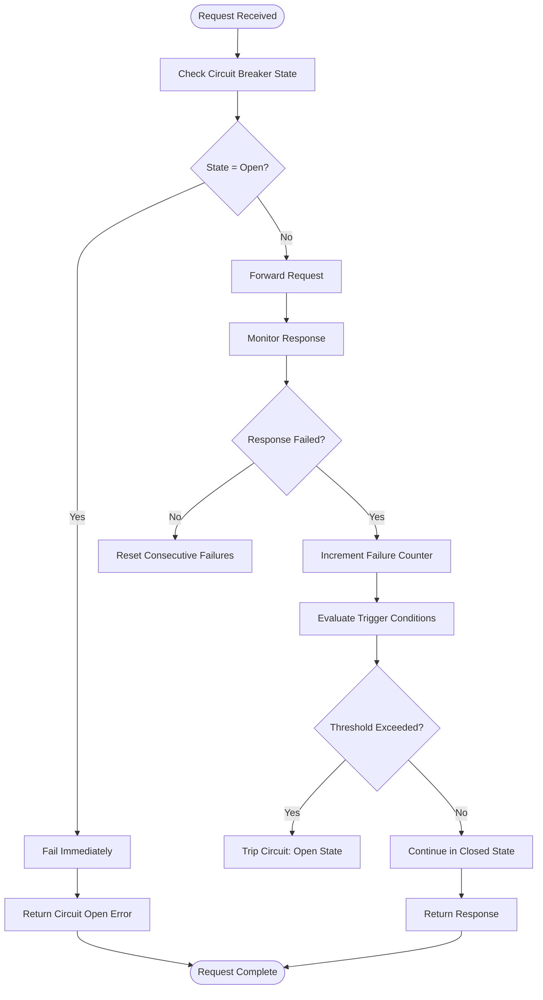
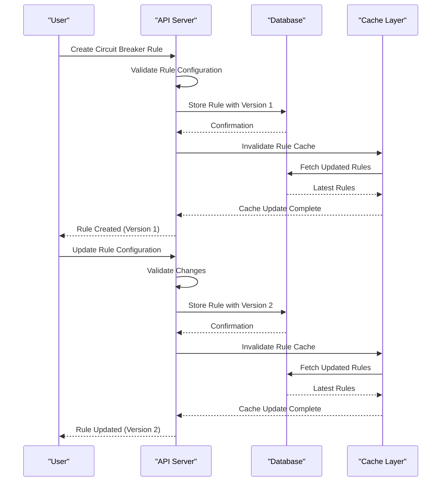
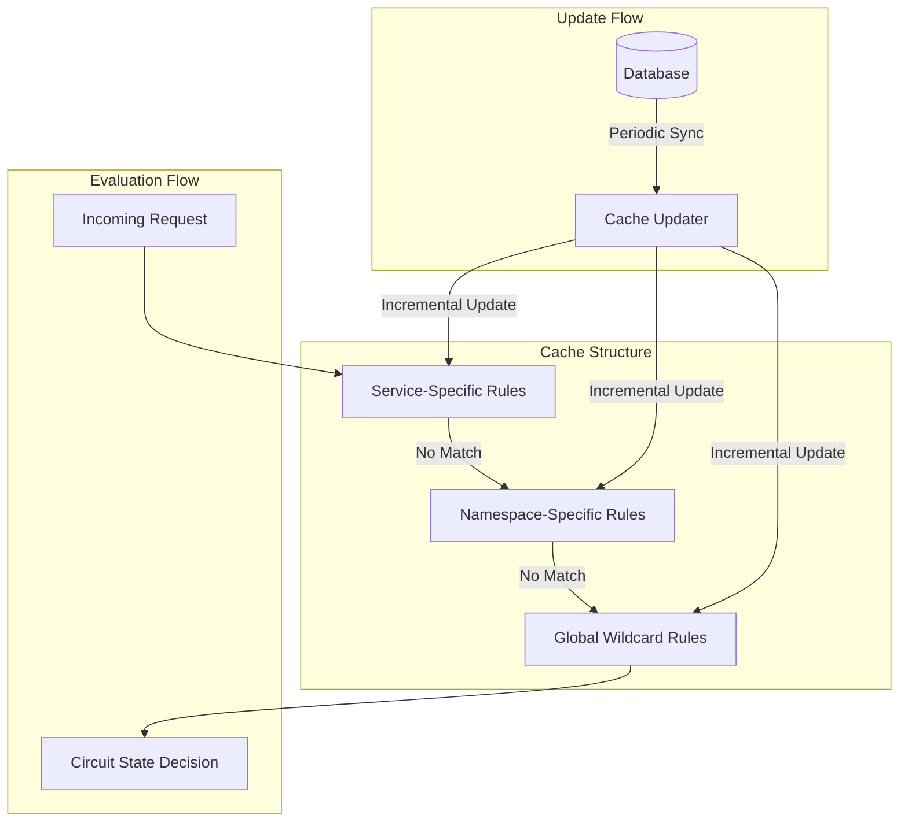

# Circuit Breaking

<cite>
**Referenced Files in This Document**   
- [circuitbreaker_rule.go](file://pkg/goverrule/circuitbreaker_rule.go)
- [circuitbreaker.go](file://pkg/cache/rules/circuitbreaker.go)
- [circuit_breaker.go](file://apis/pkg/types/rules/circuit_breaker.go)
- [circuitbreaker.go](file://plugin/store/mysql/circuitbreaker.go)
- [circuitbreaker_rule_test.go](file://pkg/goverrule/circuitbreaker_rule_test.go)
- [circuitbreaker_test.go](file://pkg/cache/rules/circuitbreaker_test.go)
</cite>

## Table of Contents
1. [Introduction](#introduction)
2. [Circuit Breaker State Management](#circuit-breaker-state-management)
3. [Failure Rate and Error Threshold Tripping Mechanisms](#failure-rate-and-error-threshold-tripping-mechanisms)
4. [Rule Configuration and Lifecycle](#rule-configuration-and-lifecycle)
5. [Integration with Health Checking and Service Discovery](#integration-with-health-checking-and-service-discovery)
6. [Cache Layer for State Propagation](#cache-layer-for-state-propagation)
7. [API Usage Examples and Failure Cascade Behavior](#api-usage-examples-and-failure-cascade-behavior)
8. [Common Pitfalls and Best Practices](#common-pitfalls-and-best-practices)
9. [Monitoring and Metrics](#monitoring-and-metrics)

## Introduction
The circuit breaking sub-feature provides resilience against cascading failures in distributed systems by automatically isolating failing services. This mechanism prevents prolonged waits and resource exhaustion during service degradation. The implementation supports multiple tripping strategies based on error thresholds and failure rates, with configurable recovery patterns. Circuit breaker rules are managed through a comprehensive API interface and stored in a persistent database layer, while runtime state evaluation occurs through an optimized in-memory cache system. The design integrates with health checking and service discovery systems to provide comprehensive failure management across service instances.

**Section sources**
- [circuitbreaker_rule.go](file://pkg/goverrule/circuitbreaker_rule.go#L1-L50)
- [circuit_breaker.go](file://apis/pkg/types/rules/circuit_breaker.go#L1-L30)

## Circuit Breaker State Management
The system implements the standard three-state circuit breaker pattern: closed, open, and half-open. In the closed state, requests flow normally while failure metrics are collected. When tripping conditions are met, the circuit transitions to the open state, immediately failing requests without forwarding them to the downstream service. After a configured sleep window, the circuit enters the half-open state, allowing a limited number of probe requests to test service recovery. Successful probes transition the circuit back to closed, while failures reset the sleep window.

State transitions are managed across service instances through distributed coordination. Each service instance maintains its own circuit breaker state based on local traffic patterns, but states are synchronized through the central configuration store. The cache layer ensures low-latency state evaluation by maintaining pre-computed circuit breaker rules and their current states in memory, with periodic updates from the persistent store.

**Diagram sources**
- [circuitbreaker.go](file://pkg/cache/rules/circuitbreaker.go#L1-L50)
- [circuit_breaker.go](file://apis/pkg/types/rules/circuit_breaker.go#L1-L20)

**Section sources**
- [circuitbreaker.go](file://pkg/cache/rules/circuitbreaker.go#L1-L100)
- [circuit_breaker.go](file://apis/pkg/types/rules/circuit_breaker.go#L1-L50)

## Failure Rate and Error Threshold Tripping Mechanisms
The system implements dual tripping mechanisms based on both error counts and error rates. The consecutive error threshold triggers when a specified number of consecutive errors occur, suitable for detecting sudden service outages. The error rate threshold activates when the percentage of failed requests exceeds a configured level over a time window, effective for identifying gradual degradation.

These mechanisms are defined in the `TriggerCondition` field of the circuit breaker rule, supporting both `CONSECUTIVE_ERROR` and `ERROR_RATE` types. For error rate calculations, the system tracks request outcomes within a sliding time window, computing the failure percentage against the total request volume. The implementation ensures accurate rate calculation even under low traffic conditions by maintaining minimum sample size requirements.

**Diagram sources**
- [circuitbreaker_rule.go](file://pkg/goverrule/circuitbreaker_rule.go#L150-L200)
- [circuit_breaker.go](file://apis/pkg/types/rules/circuit_breaker.go#L100-L150)

**Section sources**
- [circuitbreaker_rule.go](file://pkg/goverrule/circuitbreaker_rule.go#L100-L250)
- [circuit_breaker.go](file://apis/pkg/types/rules/circuit_breaker.go#L50-L100)

## Rule Configuration and Lifecycle
Circuit breaker rules are configured with multiple parameters including error thresholds, sleep windows, and recovery strategies. The rule configuration includes `ErrorConditions` that define what constitutes a failure (e.g., specific HTTP status codes or response delays), `TriggerCondition` that specifies the tripping criteria, and `RecoverCondition` that determines successful recovery (e.g., consecutive successful requests).

The lifecycle management system supports rule creation, update, deletion, and versioning. Rules are stored in the database with version tracking, allowing rollback to previous configurations. The active rule version is determined by the highest version number among enabled releases. The system prevents duplicate rule creation and enforces namespace isolation for rule names.

**Diagram sources**
- [circuitbreaker_rule.go](file://pkg/goverrule/circuitbreaker_rule.go#L50-L150)
- [circuitbreaker.go](file://plugin/store/mysql/circuitbreaker.go#L500-L600)

**Section sources**
- [circuitbreaker_rule.go](file://pkg/goverrule/circuitbreaker_rule.go#L50-L200)
- [circuitbreaker.go](file://plugin/store/mysql/circuitbreaker.go#L500-L700)

## Integration with Health Checking and Service Discovery
The circuit breaking system integrates tightly with health checking and service discovery components to provide comprehensive failure management. Health check results influence circuit breaker decisions, with failing health checks potentially triggering circuit opening even before request failures accumulate. The service discovery system receives circuit breaker state updates, allowing clients to avoid routing requests to services with open circuits.

When a circuit transitions to the open state, this information is propagated to the service discovery system, which can then exclude the affected service instances from load balancing calculations. Health check probes continue to monitor the service during the open state, providing early detection of recovery that can influence the timing of the transition to half-open state. This integration creates a feedback loop between proactive health monitoring and reactive circuit breaking.

**Section sources**
- [circuitbreaker_rule.go](file://pkg/goverrule/circuitbreaker_rule.go#L200-L250)
- [circuitbreaker.go](file://pkg/cache/rules/circuitbreaker.go#L300-L400)

## Cache Layer for State Propagation
The cache layer plays a critical role in circuit breaker state management by providing low-latency evaluation of circuit states. The system maintains an in-memory representation of all active circuit breaker rules, organized by service and namespace for efficient lookup. The cache is updated incrementally from the persistent store, minimizing latency while ensuring consistency.

The cache implementation uses a hierarchical structure with service-specific, namespace-specific, and global wildcard rules. When a request arrives, the system checks the service-specific rules first, then namespace-specific rules, falling back to global rules if no matches are found. This design enables efficient rule evaluation with O(1) complexity for most lookups. Cache invalidation occurs automatically when rules are modified, ensuring clients receive updated configurations promptly.

**Diagram sources**
- [circuitbreaker.go](file://pkg/cache/rules/circuitbreaker.go#L100-L200)
- [circuit_breaker.go](file://apis/pkg/types/rules/circuit_breaker.go#L150-L200)

**Section sources**
- [circuitbreaker.go](file://pkg/cache/rules/circuitbreaker.go#L50-L200)
- [circuit_breaker.go](file://apis/pkg/types/rules/circuit_breaker.go#L150-L200)

## API Usage Examples and Failure Cascade Behavior
The circuit breaker API allows programmatic management of rules through standard CRUD operations. Rules are defined using protocol buffer messages that specify source and destination services, error conditions, trigger conditions, and recovery parameters. When a failure cascade occurs, the system prevents overwhelming downstream services by opening circuits based on the configured thresholds.

During failure cascades, the circuit breaker system exhibits fail-fast behavior, immediately returning errors to clients rather than propagating requests to failing services. This behavior protects upstream services from resource exhaustion due to timeouts and connection pooling issues. The recovery strategy, including sleep windows and probe requests, ensures that services are only reintegrated after demonstrating stability.

**Section sources**
- [circuitbreaker_rule.go](file://pkg/goverrule/circuitbreaker_rule.go#L250-L300)
- [circuitbreaker_rule_test.go](file://pkg/goverrule/circuitbreaker_rule_test.go#L50-L100)

## Common Pitfalls and Best Practices
Common pitfalls in circuit breaker configuration include setting inappropriate thresholds that either trip too easily or fail to protect against real failures. Overly aggressive retry mechanisms can interact poorly with circuit breakers, creating thundering herd problems when circuits recover. Slow recovery patterns with excessively long sleep windows can prolong service unavailability even after issues are resolved.

Best practices include setting error thresholds based on historical failure rates and service SLAs, configuring appropriate sleep windows that balance recovery speed with protection, and coordinating circuit breaker settings with retry policies. Monitoring circuit breaker state transitions helps identify optimal configuration values. The system should be tested under simulated failure conditions to validate that circuit breakers behave as expected during actual outages.

**Section sources**
- [circuitbreaker_rule_test.go](file://pkg/goverrule/circuitbreaker_rule_test.go#L100-L200)
- [circuitbreaker_test.go](file://pkg/cache/rules/circuitbreaker_test.go#L50-L100)

## Monitoring and Metrics
The system provides comprehensive monitoring capabilities for circuit breaker events and metrics. Key metrics include circuit state transitions, failure rates, request volumes, and latency distributions. These metrics are exposed through the observability system and can be integrated with external monitoring tools.

Event logging captures significant circuit breaker events such as state transitions, rule updates, and configuration changes. These events include timestamps, affected services, and contextual information for troubleshooting. The metrics enable operators to assess the effectiveness of circuit breaker configurations and identify services that frequently experience failures, guiding optimization efforts.

**Section sources**
- [circuitbreaker_rule.go](file://pkg/goverrule/circuitbreaker_rule.go#L300-L314)
- [circuitbreaker.go](file://pkg/cache/rules/circuitbreaker.go#L500-L574)