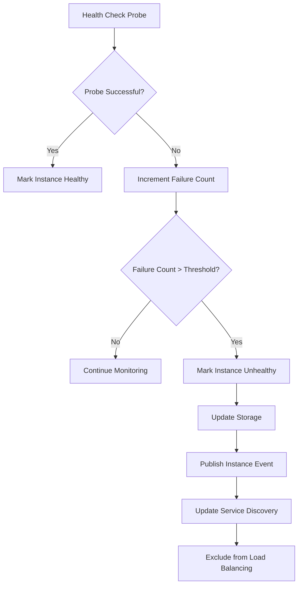
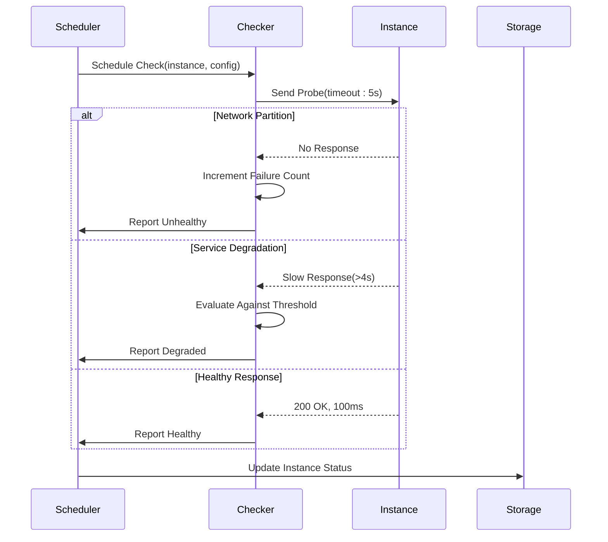
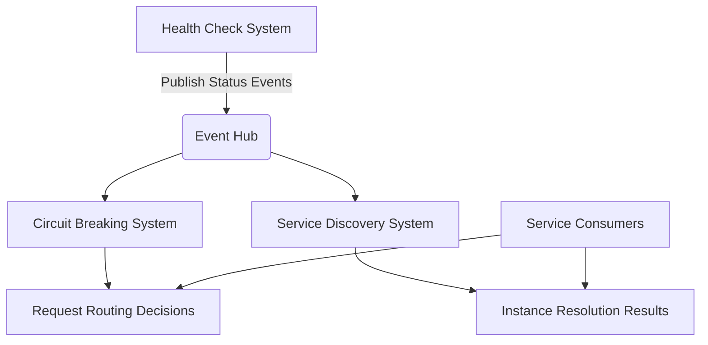

# Fault Detection

<cite>
**Referenced Files in This Document**   
- [config.go](file://pkg/service/healthcheck/config.go)
- [check.go](file://pkg/service/healthcheck/check.go)
- [server.go](file://pkg/service/healthcheck/server.go)
- [faultdetect_rule.go](file://pkg/goverrule/faultdetect_rule.go)
- [faultdetect.go](file://pkg/cache/rules/faultdetect.go)
- [healthchecker.go](file://apis/service/healthcheck/healthchecker.go)
- [beat_checker.go](file://plugin/service/healthchecker/heartbeat/beat_checker.go)
- [fault_detect_config.go](file://plugin/store/mysql/fault_detect_config.go)
</cite>

## Table of Contents
1. [Introduction](#introduction)
2. [Active and Passive Health Checking Mechanisms](#active-and-passive-health-checking-mechanisms)
3. [Configuration Options](#configuration-options)
4. [Fault Detection Rules and Instance Isolation](#fault-detection-rules-and-instance-isolation)
5. [Health Check Probes and Response Evaluation](#health-check-probes-and-response-evaluation)
6. [HTTP/TCP Health Check Configuration Examples](#httptcp-health-check-configuration-examples)
7. [Integration with Circuit Breaking and Service Discovery](#integration-with-circuit-breaking-and-service-discovery)
8. [Common Issues and Mitigation Strategies](#common-issues-and-mitigation-strategies)
9. [Performance Overhead and Tuning Recommendations](#performance-overhead-and-tuning-recommendations)
10. [Monitoring Indicators for Health Check Effectiveness](#monitoring-indicators-for-health-check-effectiveness)

## Introduction
The fault detection system in the Polaris service mesh provides robust mechanisms to identify unhealthy service instances and maintain system reliability. This document details the implementation of active and passive health checking, configuration parameters, integration with circuit breaking and service discovery, and operational best practices. The system ensures service instances are continuously monitored through configurable probes, enabling timely isolation of failing components and maintaining high availability across distributed environments.

## Active and Passive Health Checking Mechanisms
The system implements both active and passive health checking to comprehensively monitor service instance health. Active health checks are performed through periodic probes initiated by the health check scheduler, while passive health checks rely on client heartbeat reporting mechanisms.

Active checks use a time-wheel based scheduling system that efficiently manages check intervals across thousands of instances. The scheduler employs exponential backoff logic and random jitter to prevent thundering herd problems during check execution. Passive health monitoring tracks client-reported heartbeats, where instances must periodically report their status to remain marked as healthy.

The health check system distinguishes between instance-level and client-level health monitoring. Instance health is determined by active probes against service endpoints, while client health is assessed based on heartbeat submission patterns. Both mechanisms use configurable TTL (time-to-live) values to determine when an instance should be considered unhealthy after missed checks.

**Section sources**
- [check.go](file://pkg/service/healthcheck/check.go#L1-L631)
- [server.go](file://pkg/service/healthcheck/server.go#L1-L269)

## Configuration Options
The fault detection system provides extensive configuration options to tailor health checking behavior to specific service requirements. Key configuration parameters include timeout thresholds, consecutive failure limits, and check intervals that can be customized at both global and service-specific levels.

The `Config` structure defines several critical parameters:
- `MinCheckInterval` and `MaxCheckInterval`: Define the minimum and maximum intervals between health checks
- `ClientCheckInterval`: Specifies how frequently clients must report heartbeats
- `ClientCheckTtl`: Determines the time-to-live for client heartbeat records
- `SlotNum`: Configures the time wheel slot count for efficient scheduling

Default values are applied when configurations are not explicitly set: minimum check interval is 1 second, maximum is 30 seconds, and client check TTL is 120 seconds. These defaults provide a balance between responsiveness and system overhead while allowing operators to adjust based on service criticality and performance requirements.

**Section sources**
- [config.go](file://pkg/service/healthcheck/config.go#L1-L84)

## Fault Detection Rules and Instance Isolation
Fault detection rules trigger instance isolation based on configurable health criteria, directly influencing load balancing decisions. When an instance is marked as unhealthy, it is automatically excluded from service discovery results, preventing new traffic from being routed to the failing instance.

The system uses a two-phase approach to instance status management. First, health checks evaluate instance responsiveness and report findings to the health check scheduler. Second, the scheduler updates the instance status in the storage layer and publishes events to notify service discovery components of the state change.

Instance isolation occurs when consecutive health check failures exceed configured thresholds or when heartbeat reports are not received within the TTL window. The isolation process is atomic and consistent across the cluster, ensuring all service consumers receive updated instance status information simultaneously. This immediate feedback loop prevents cascading failures by quickly removing unhealthy instances from the traffic pool.

**Diagram sources**
- [check.go](file://pkg/service/healthcheck/check.go#L150-L200)
- [server.go](file://pkg/service/healthcheck/server.go#L200-L250)

**Section sources**
- [check.go](file://pkg/service/healthcheck/check.go#L1-L631)
- [server.go](file://pkg/service/healthcheck/server.go#L1-L269)

## Health Check Probes and Response Evaluation Logic
The implementation of health check probes follows a structured evaluation logic that determines instance health status based on probe outcomes. Probes are dispatched through a configurable checker interface that supports multiple health check types, including HTTP, TCP, and custom protocols.

Each probe execution follows a consistent evaluation pattern:
1. The scheduler retrieves the instance configuration and associated health checker
2. A check request is constructed with instance metadata and current timestamp
3. The appropriate health checker executes the probe against the target endpoint
4. The response is evaluated for success criteria (status codes, response time, content)
5. Results are processed to determine if the instance state should change

Response evaluation considers multiple factors including timeout thresholds, expected response patterns, and historical performance. For HTTP probes, the system can validate specific status codes or response content. For TCP probes, successful connection establishment is the primary success criterion. The evaluation logic also accounts for transient failures by implementing hysteresis to prevent rapid state oscillation.

**Section sources**
- [check.go](file://pkg/service/healthcheck/check.go#L300-L500)
- [healthchecker.go](file://apis/service/healthcheck/healthchecker.go#L1-L50)

## HTTP/TCP Health Check Configuration Examples
The system supports configurable HTTP and TCP health checks that can be tailored to specific service requirements. Configuration examples demonstrate how to set up different health check types for various service patterns.

For HTTP health checks, operators can specify:
- Target HTTP endpoint (path)
- Expected status codes
- Request timeout duration
- HTTP method (GET, POST, etc.)
- Required response headers or content

TCP health checks require simpler configuration:
- Target port number
- Connection timeout
- Optional payload for protocol-specific handshakes

During network partitions or service degradation, the health check system continues to probe endpoints according to the configured intervals. When network connectivity is intermittent, the system uses exponential backoff to avoid overwhelming recovering services. For degraded services experiencing high latency, the timeout threshold prevents premature marking as unhealthy while still detecting complete failures.

**Diagram sources**
- [check.go](file://pkg/service/healthcheck/check.go#L100-L200)
- [beat_checker.go](file://plugin/service/healthchecker/heartbeat/beat_checker.go#L1-L30)

**Section sources**
- [config.go](file://pkg/service/healthcheck/config.go#L1-L84)
- [faultdetect_rule.go](file://pkg/goverrule/faultdetect_rule.go#L1-L291)

## Integration with Circuit Breaking and Service Discovery Systems
The fault detection system integrates tightly with circuit breaking and service discovery components to create a comprehensive resilience framework. When instances are marked as unhealthy through health checks, this information is immediately propagated to both circuit breakers and service discovery endpoints.

Circuit breakers use health check results as one of several inputs for their decision-making process. While circuit breakers primarily respond to request failure rates and latency patterns, they also respect instance health status from the fault detection system. This dual-input approach prevents traffic from being routed to instances that are both unhealthy and causing circuit breaker trips.

Service discovery integration ensures that unhealthy instances are excluded from resolution results. When a consumer queries for service instances, the discovery system filters out any instances marked as unhealthy, providing an up-to-date view of available endpoints. This integration is event-driven, with health status changes published as events that trigger immediate updates across the system.

The integration architecture uses a publish-subscribe model where health status changes are published to an event hub, and both circuit breaking and service discovery components subscribe to these events for real-time updates.

**Diagram sources**
- [server.go](file://pkg/service/healthcheck/server.go#L200-L250)
- [faultdetect.go](file://pkg/cache/rules/faultdetect.go#L1-L20)

**Section sources**
- [server.go](file://pkg/service/healthcheck/server.go#L1-L269)
- [faultdetect_rule.go](file://pkg/goverrule/faultdetect_rule.go#L1-L291)

## Common Issues and Mitigation Strategies
Several common issues can arise in fault detection systems, including false positives due to transient network issues, configuration mismatches, and performance overhead from frequent checks.

False positives occur when transient network glitches cause temporary probe failures that don't reflect actual service health. The system mitigates this through hysteresis mechanisms that require multiple consecutive failures before marking an instance as unhealthy. Additionally, random jitter is added to check schedules to prevent synchronized probes across large instance groups.

Configuration mismatches between service requirements and health check parameters can lead to inappropriate instance isolation. To prevent this, the system supports service-specific health check configurations that can be tuned to match individual service characteristics, such as startup time or dependency requirements.

Network partitions present a particular challenge, as they can cause widespread false positives. The system addresses this by maintaining separate health states for different failure modes and using contextual information to distinguish between instance failures and network issues.

**Section sources**
- [check.go](file://pkg/service/healthcheck/check.go#L1-L631)
- [config.go](file://pkg/service/healthcheck/config.go#L1-L84)

## Performance Overhead and Tuning Recommendations
The fault detection system is designed to minimize performance overhead while maintaining effective monitoring. The time-wheel scheduler efficiently manages thousands of concurrent health checks with minimal CPU and memory usage. However, tuning is recommended to balance monitoring granularity with system resource consumption.

Recommended tuning parameters include:
- Increasing check intervals for non-critical services to reduce probe frequency
- Adjusting timeout values based on service response characteristics
- Configuring appropriate TTL values that account for service startup time
- Using service-specific configurations rather than global defaults when appropriate

For high-density environments, the system supports batch processing of health check results and asynchronous status updates to minimize database load. The batch controller processes status changes in bulk, reducing the number of individual storage operations.

Monitoring the health check scheduler's performance metrics, such as check execution time and queue depth, provides insights into potential bottlenecks. Operators should ensure that the maximum check interval is not so short that it overwhelms target services with probe traffic.

**Section sources**
- [check.go](file://pkg/service/healthcheck/check.go#L400-L500)
- [server.go](file://pkg/service/healthcheck/server.go#L1-L269)

## Monitoring Indicators for Health Check Effectiveness
Effective monitoring of the fault detection system requires tracking several key indicators that reflect health check performance and accuracy. These metrics provide visibility into system health and help identify potential issues with the fault detection process.

Critical monitoring indicators include:
- Health check success rate across all services
- Average probe response time
- Number of instances marked as unhealthy
- Frequency of state transitions (healthy ↔ unhealthy)
- Scheduler processing latency
- Storage update success rate

The system exposes these metrics through its observability interface, allowing operators to create dashboards and alerts for proactive issue detection. High rates of state oscillation may indicate configuration issues, while consistently high failure rates could signal underlying service problems.

Event logs capture detailed information about health check executions, including probe outcomes and state transitions. These logs are invaluable for troubleshooting specific instance issues and analyzing patterns across service groups.

**Section sources**
- [log.go](file://pkg/service/healthcheck/log.go#L1-L20)
- [metrics.go](file://plugin/service/healthchecker/heartbeat/metrics.go#L1-L15)