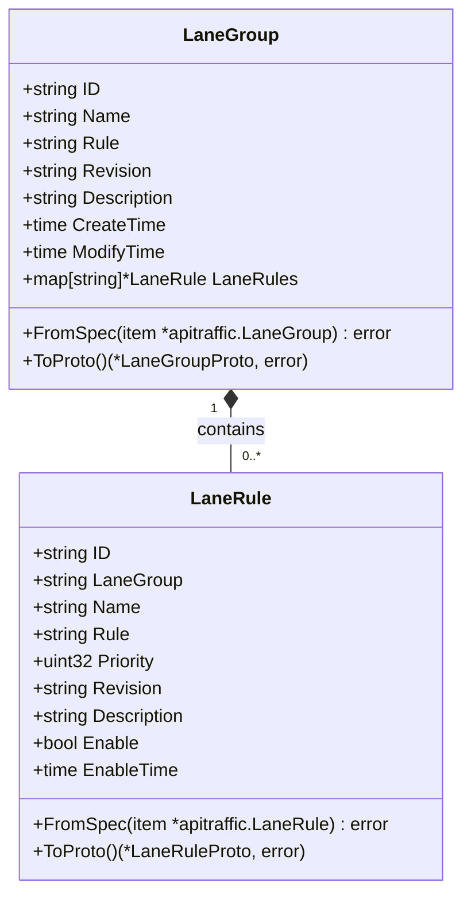

# Lane Management

<cite>
**Referenced Files in This Document**   
- [lane.go](file://pkg/cache/rules/lane.go)
- [lane.go](file://apis/pkg/types/rules/lane.go)
- [lane_rule.go](file://pkg/goverrule/lane_rule.go)
- [lane.go](file://plugin/store/mysql/lane.go)
- [lane_access.go](file://plugin/apiserver/httpserver/discover/lane_access.go)
</cite>

## Table of Contents
1. [Introduction](#introduction)
2. [Core Concepts](#core-concepts)
3. [Lane Rule Definition and Structure](#lane-rule-definition-and-structure)
4. [Lane Evaluation and Request Assignment](#lane-evaluation-and-request-assignment)
5. [Integration with Service Instances and Consumers](#integration-with-service-instances-and-consumers)
6. [Caching Mechanism for Efficient Rule Lookup](#caching-mechanism-for-efficient-rule-lookup)
7. [Common Challenges and Debugging](#common-challenges-and-debugging)
8. [Monitoring and Validation Techniques](#monitoring-and-validation-techniques)

## Introduction
Lane Management is a critical feature for isolating different user groups, environments, or deployment tracks within a service mesh. This document provides a comprehensive overview of the lane management sub-feature, detailing how lane rules are defined, evaluated, and integrated with service instances and consumers. The system enables traffic isolation based on metadata matchers, allowing for sophisticated routing and governance policies. This documentation covers the implementation of lanes for various use cases such as staging environments, feature flags, and tenant isolation, while also addressing common challenges and providing monitoring and validation techniques.

## Core Concepts
Lane Management in the system is designed to provide traffic isolation for different user groups, environments, or deployment tracks. The core concept revolves around defining lane rules using metadata matchers that determine how requests are assigned to specific lanes based on headers, tokens, or other contextual data. These lanes serve as isolated pathways for traffic, enabling scenarios such as canary deployments, A/B testing, and tenant-specific routing. The system integrates lane rules with service instances and consumers, ensuring that traffic is routed according to the defined policies. The evaluation process for lane assignment is based on matching request metadata against the defined rules, with a caching mechanism in place for efficient rule lookup.

**Section sources**
- [lane.go](file://pkg/cache/rules/lane.go#L1-L50)
- [lane.go](file://apis/pkg/types/rules/lane.go#L1-L50)

## Lane Rule Definition and Structure
Lane rules are defined using a structured format that includes metadata matchers to determine lane assignment. The `LaneGroup` struct represents a collection of lane rules, containing fields such as ID, name, rule definition, revision, description, and creation/modification timestamps. Each lane group contains multiple `LaneRule` entities, which define the specific conditions for lane assignment. The rules are stored as JSON strings and can be converted to protobuf format for efficient processing. Lane rules can be created, updated, and deleted through the governance rule server, with operations logged for audit purposes. The system supports batch operations for creating and updating multiple lane rules simultaneously.



**Diagram sources**
- [lane.go](file://apis/pkg/types/rules/lane.go#L147-L202)
- [lane_rule.go](file://pkg/goverrule/lane_rule.go#L1-L50)

## Lane Evaluation and Request Assignment
The lane evaluation process determines how requests are assigned to specific lanes based on headers, tokens, or other contextual data. When a request is received, the system evaluates the request metadata against the defined lane rules to determine the appropriate lane assignment. The evaluation process involves matching request attributes such as headers, query parameters, or authentication tokens against the metadata matchers defined in the lane rules. The system supports various traffic entry types, including microservices and Spring Cloud Gateway, allowing for flexible integration with different service architectures. The evaluation process is optimized through a caching mechanism that stores frequently accessed lane rules, reducing the overhead of rule lookup during request processing.

**Section sources**
- [lane.go](file://pkg/cache/rules/lane.go#L424-L487)
- [lane_rule.go](file://pkg/goverrule/lane_rule.go#L200-L250)

## Integration with Service Instances and Consumers
Lane rules are integrated with service instances and consumers through a comprehensive system that ensures proper traffic routing and isolation. The integration process involves associating lane rules with specific services and namespaces, allowing for fine-grained control over traffic flow. When a service instance is registered or updated, the system checks for applicable lane rules and applies them to the service's routing configuration. Consumers are also integrated with the lane management system, ensuring that requests from different consumer types are routed according to the defined lane policies. The system supports various integration points, including HTTP servers, gRPC servers, and service discovery mechanisms, providing a unified approach to lane management across different communication protocols.

**Section sources**
- [lane.go](file://pkg/cache/rules/lane.go#L424-L487)
- [lane_access.go](file://plugin/apiserver/httpserver/discover/lane_access.go#L225-L264)

## Caching Mechanism for Efficient Rule Lookup
The system implements a sophisticated caching mechanism in `pkg/cache/lane` to ensure efficient rule lookup and reduce the overhead of frequent database queries. The `LaneCache` struct maintains multiple synchronized maps to store lane rules, rule releases, and service-specific rule mappings. The cache is updated periodically through a background process that synchronizes with the underlying storage system. The caching mechanism includes several key components: a rules map that stores lane groups by ID, an IDs map that stores active lane group releases by rule name and release type, and a service rules map that associates lane rules with specific services and namespaces. The cache also maintains revision information for efficient change detection and propagation.

```mermaid
classDiagram
class LaneCache {
+*BaseCache BaseCache
+*SyncMap[string, *LaneGroup] rules
+*SyncMap[string, *LaneGroupRelease] ids
+*SyncMap[string, *SyncMap[string, *SyncMap[string, *LaneGroupRelease]]] serviceRules
+*SyncMap[string, *SyncMap[string, string]] revisions
+Initialize(c map[string]interface{}) error
+Update() error
+GetLaneRules(serviceKey *Service) ([]*LaneGroupProto, string)
+GetRule(id string) *LaneGroup
+Query(ctx context.Context, args *LaneGroupArgs) (uint32, []*LaneGroupProto, error)
}
class BaseCache {
+Store Store
+CacheMgr CacheManager
+LastMtime() time.Time
+Clear() error
}
LaneCache --|> BaseCache : inherits
```

**Diagram sources**
- [lane.go](file://pkg/cache/rules/lane.go#L1-L50)
- [lane.go](file://pkg/cache/rules/lane.go#L424-L487)

## Common Challenges and Debugging
Implementing lane management introduces several common challenges that require careful consideration and debugging strategies. One of the primary challenges is lane leakage, where traffic intended for one lane inadvertently flows to another due to misconfigured rules or precedence issues. Rule precedence is another critical aspect, as multiple lane rules may match a single request, requiring a clear priority system to determine the correct lane assignment. Debugging traffic flow across lanes can be complex, requiring comprehensive logging and tracing capabilities to track request routing decisions. The system addresses these challenges through a combination of validation mechanisms, audit logging, and monitoring tools that provide visibility into lane rule evaluation and traffic routing.

**Section sources**
- [lane.go](file://pkg/cache/rules/lane.go#L424-L487)
- [lane_rule.go](file://pkg/goverrule/lane_rule.go#L1-L50)

## Monitoring and Validation Techniques
Effective monitoring and validation are essential for ensuring the reliability and correctness of lane-based routing. The system provides several techniques for monitoring lane rule application and traffic flow. These include real-time metrics on lane rule evaluations, request counts per lane, and error rates for lane-specific traffic. Validation techniques include automated testing of lane rules against sample requests, verification of rule precedence, and consistency checks between the cache and persistent storage. The system also supports audit logging of lane rule changes, providing a historical record of modifications for compliance and troubleshooting purposes. Additionally, the system includes health checks for the lane management components, ensuring that the caching and rule evaluation mechanisms are functioning correctly.

**Section sources**
- [lane.go](file://pkg/cache/rules/lane.go#L424-L487)
- [lane_rule.go](file://pkg/goverrule/lane_rule.go#L1-L50)