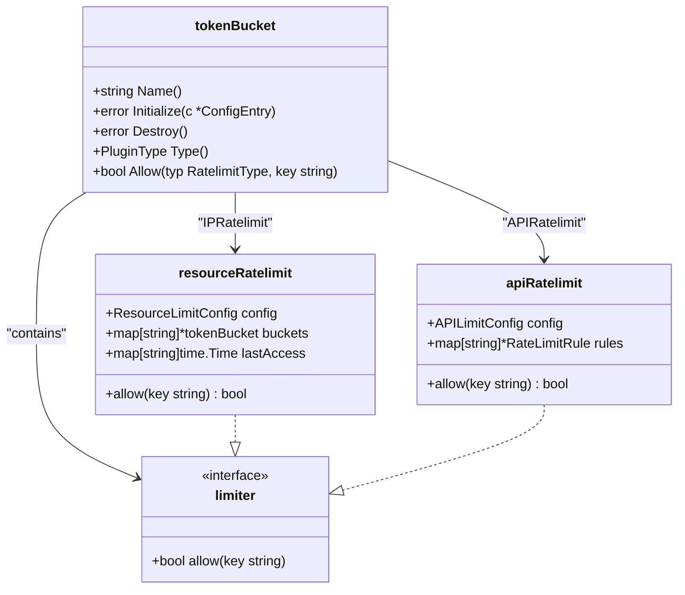
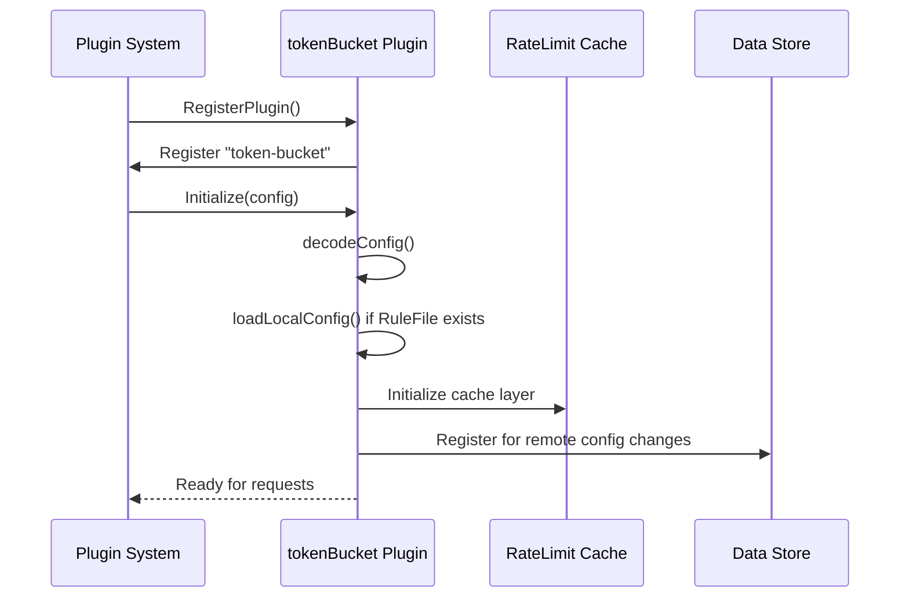
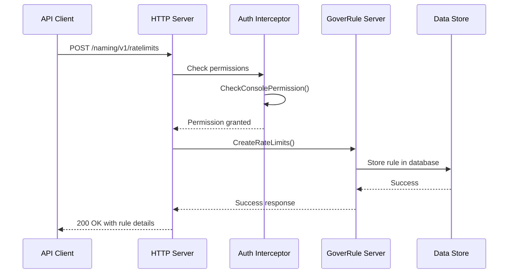
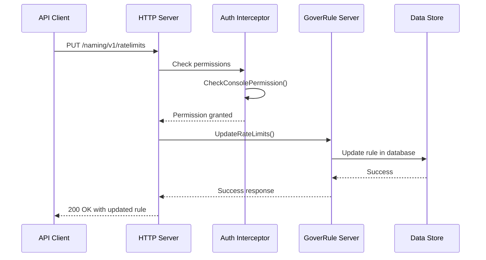
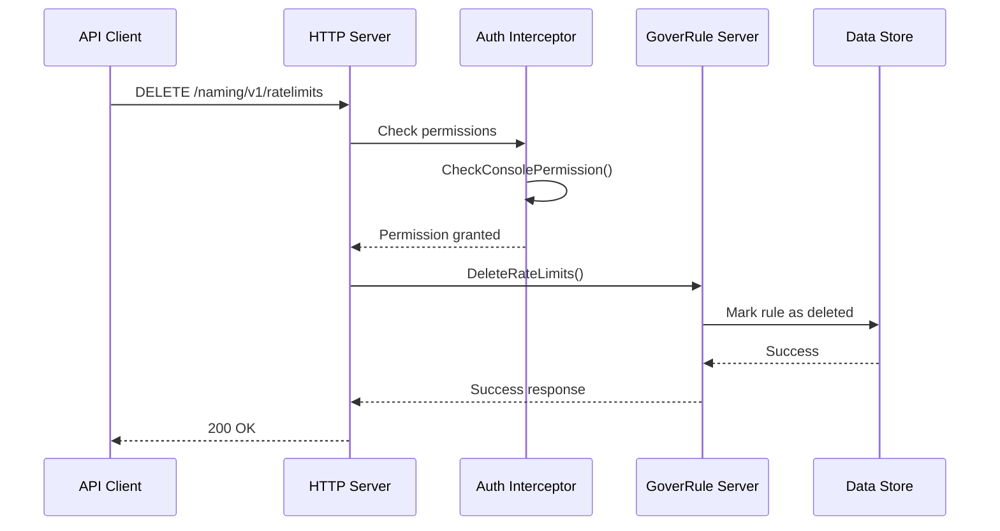
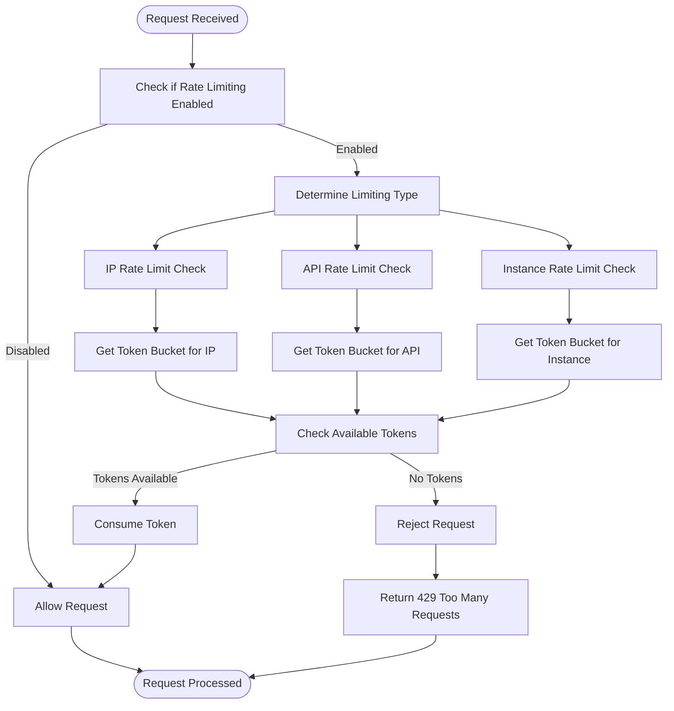

# Rate Limiting

<cite>
**Referenced Files in This Document**   
- [token/invoke.go](file://plugin/access_control/ratelimit/token/invoke.go)
- [token/implement.go](file://plugin/access_control/ratelimit/token/implement.go)
- [token/register.go](file://plugin/access_control/ratelimit/token/register.go)
- [token/resource_limiter_test.go](file://plugin/access_control/ratelimit/token/resource_limiter_test.go)
- [token/invoke_test.go](file://plugin/access_control/ratelimit/token/invoke_test.go)
- [ratelimit_config.go](file://pkg/cache/rules/ratelimit_config.go)
- [ratelimit_rule.go](file://pkg/goverrule/ratelimit_rule.go)
- [ratelimit_rule.go](file://pkg/goverrule/interceptor/auth/ratelimit_rule.go)
- [ratelimit.go](file://apis/pkg/types/rules/ratelimit.go)
- [pole_server.sql](file://plugin/store/mysql/scripts/pole_server.sql)
</cite>

## Table of Contents
1. [Introduction](#introduction)
2. [Rate Limiting Algorithms](#rate-limiting-algorithms)
3. [Rule Structure and Configuration](#rule-structure-and-configuration)
4. [Plugin System Integration](#plugin-system-integration)
5. [API Operations for Rule Management](#api-operations-for-rule-management)
6. [Rule Evaluation Process](#rule-evaluation-process)
7. [Common Issues and Edge Cases](#common-issues-and-edge-cases)
8. [Performance Optimization and Monitoring](#performance-optimization-and-monitoring)

## Introduction
The rate limiting sub-feature in the pole-server system provides comprehensive traffic control capabilities through token bucket and leaky bucket algorithms. This documentation details the implementation, configuration, and operational aspects of the rate limiting system, focusing on its integration with the plugin architecture and caching layer for optimal performance. The system supports service-level and instance-level rate limiting with configurable rules for QPS, burst capacity, and scope definitions.

## Rate Limiting Algorithms
The system implements the token bucket algorithm as the primary rate limiting mechanism, with potential support for leaky bucket patterns through configuration. The token bucket algorithm is implemented in the `tokenBucket` struct within the rate limiting plugin.



**Diagram sources**
- [token/invoke.go](file://plugin/access_control/ratelimit/token/invoke.go#L15-L55)
- [token/implement.go](file://plugin/access_control/ratelimit/token/implement.go#L48-L87)

**Section sources**
- [token/invoke.go](file://plugin/access_control/ratelimit/token/invoke.go#L15-L55)
- [token/implement.go](file://plugin/access_control/ratelimit/token/implement.go#L48-L87)

## Rule Structure and Configuration
Rate limiting rules are structured around QPS (Queries Per Second), burst capacity, and scope definitions. The rule configuration supports multiple limiting types including IP, API, and instance-level restrictions.

The rule structure includes:
- **QPS**: The maximum number of requests allowed per second
- **Burst**: The maximum number of requests allowed in a burst
- **Scope**: The context in which the rule applies (service, instance, or global)

Configuration is managed through the `Config` struct which contains settings for different limiting types:

```go
// Example configuration structure
type Config struct {
    Enable       bool
    IPLimitConf  *ResourceLimitConfig
    APILimitConf *APILimitConfig
    InstanceLimitConf *ResourceLimitConfig
    RuleFile     string
    RemoteConf   bool
}
```

Rules are stored in the database with the following schema:
```sql
CREATE TABLE `ratelimit_rule` (
    `id` VARCHAR(32) NOT NULL,
    `name` VARCHAR(64) NOT NULL,
    `disable` TINYINT(4) NOT NULL DEFAULT '0',
    `service_id` VARCHAR(32) NOT NULL,
    `method` VARCHAR(512) NOT NULL,
    `labels` TEXT NOT NULL,
    `priority` SMALLINT(6) NOT NULL DEFAULT '0',
    `rule` TEXT NOT NULL,
    `revision` VARCHAR(32) NOT NULL,
    `flag` TINYINT(4) NOT NULL DEFAULT '0',
    `ctime` TIMESTAMP NOT NULL DEFAULT CURRENT_TIMESTAMP,
    `mtime` TIMESTAMP NOT NULL DEFAULT CURRENT_TIMESTAMP ON UPDATE CURRENT_TIMESTAMP,
    `etime` TIMESTAMP NOT NULL DEFAULT CURRENT_TIMESTAMP,
    `metadata` TEXT,
    PRIMARY KEY (`id`)
);
```

**Section sources**
- [token/implement.go](file://plugin/access_control/ratelimit/token/implement.go#L0-L87)
- [pole_server.sql](file://plugin/store/mysql/scripts/pole_server.sql#L603-L623)
- [ratelimit.go](file://apis/pkg/types/rules/ratelimit.go#L39-L87)

## Plugin System Integration
The rate limiting system is integrated into the server's plugin architecture through the token limiter plugin. The plugin registers itself with the system and implements the required interfaces for initialization, execution, and cleanup.



**Diagram sources**
- [token/register.go](file://plugin/access_control/ratelimit/token/register.go#L0-L28)
- [token/implement.go](file://plugin/access_control/ratelimit/token/implement.go#L0-L87)

**Section sources**
- [token/register.go](file://plugin/access_control/ratelimit/token/register.go#L0-L28)
- [token/implement.go](file://plugin/access_control/ratelimit/token/implement.go#L0-L87)

## API Operations for Rule Management
Rate limiting rules can be managed through HTTP/gRPC APIs for creation, updating, and deletion operations. The system provides a comprehensive set of endpoints for rule management with proper authentication and authorization checks.

### Creating Rate Limiting Rules
Rules are created through the `CreateRateLimits` API endpoint, which validates the rule configuration and stores it in the database:



### Updating Rate Limiting Rules
Existing rules can be updated through the `UpdateRateLimits` API endpoint:



### Deleting Rate Limiting Rules
Rules can be removed through the `DeleteRateLimits` API endpoint:



**Diagram sources**
- [ratelimit_rule.go](file://pkg/goverrule/interceptor/auth/ratelimit_rule.go#L30-L97)
- [naming_console_access_apidoc.go](file://plugin/apiserver/httpserver/docs/naming_console_access_apidoc.go#L421-L431)

**Section sources**
- [ratelimit_rule.go](file://pkg/goverrule/interceptor/auth/ratelimit_rule.go#L30-L97)
- [naming_console_access_apidoc.go](file://plugin/apiserver/httpserver/docs/naming_console_access_apidoc.go#L421-L431)

## Rule Evaluation Process
During request processing, rate limiting rules are evaluated through a multi-step process that checks the appropriate limiting type and key against the configured rules.



The evaluation process is implemented in the `Allow` method of the `tokenBucket` struct, which delegates to the appropriate limiter based on the rate limiting type:

```go
func (tb *tokenBucket) Allow(typ ratelimit.RatelimitType, key string) bool {
    if !tb.config.Enable {
        return true
    }
    return tb.allow(typ, key)
}
```

**Diagram sources**
- [token/invoke.go](file://plugin/access_control/ratelimit/token/invoke.go#L50-L55)
- [token/implement.go](file://plugin/access_control/ratelimit/token/implement.go#L70-L87)

**Section sources**
- [token/invoke.go](file://plugin/access_control/ratelimit/token/invoke.go#L50-L55)
- [token/implement.go](file://plugin/access_control/ratelimit/token/implement.go#L70-L87)

## Common Issues and Edge Cases
The rate limiting system addresses several common distributed system challenges and edge cases:

### Clock Drift in Distributed Environments
Clock drift can affect rate limiting accuracy across distributed nodes. The system mitigates this through:

- Using monotonic clocks for token bucket calculations
- Synchronizing time across nodes through health check mechanisms
- Implementing time adjustment logic in the health checker component

### Rule Propagation Delays
Rule updates may experience propagation delays due to caching and network latency. The system handles this through:

- Cache invalidation mechanisms
- Configurable cache refresh intervals
- Event-driven updates for critical rule changes

### Burst Handling Edge Cases
The token bucket implementation handles burst scenarios through:

- Configurable burst capacity settings
- Proper token refilling logic
- Edge case handling for empty keys and invalid limit types

```go
// Test cases for edge cases
func TestTokenBucket_Allow(t *testing.T) {
    // Test empty key
    So(tb.Allow(ratelimit.APIRatelimit, ""), ShouldEqual, true)
    
    // Test invalid limit type
    So(tb.Allow(ratelimit.RatelimitType(100), "123"), ShouldEqual, true)
}
```

**Section sources**
- [token/invoke_test.go](file://plugin/access_control/ratelimit/token/invoke_test.go#L93-L131)
- [resource_limiter_test.go](file://plugin/access_control/ratelimit/token/resource_limiter_test.go#L24-L66)

## Performance Optimization and Monitoring
The rate limiting system includes several performance optimization features and monitoring capabilities:

### Caching Layer for Performance
The system implements a caching layer to reduce database access and improve performance:

- Local caching of frequently accessed rules
- Configurable cache size limits
- Cache eviction policies based on LRU or TTL

### Monitoring Metrics
The system provides monitoring metrics through the observability component:

- Rate limiting decision counters
- Token consumption rates
- Cache hit/miss ratios
- Rule evaluation latency

### Performance Tuning Tips
For optimal performance:

- Configure appropriate cache sizes based on rule count
- Use efficient key patterns for rate limiting
- Monitor token bucket refill rates
- Adjust burst capacity based on traffic patterns

**Section sources**
- [token/invoke.go](file://plugin/access_control/ratelimit/token/invoke.go#L50-L55)
- [token/implement.go](file://plugin/access_control/ratelimit/token/implement.go#L48-L87)
- [common.go](file://plugin/observability/statis/base/common.go#L43-L65)