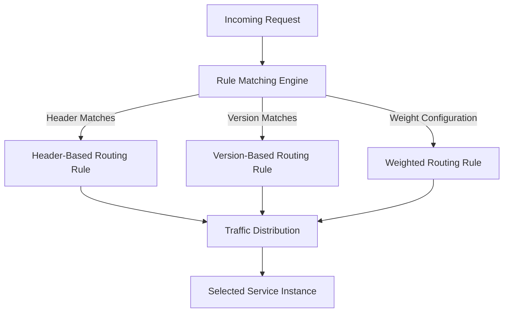
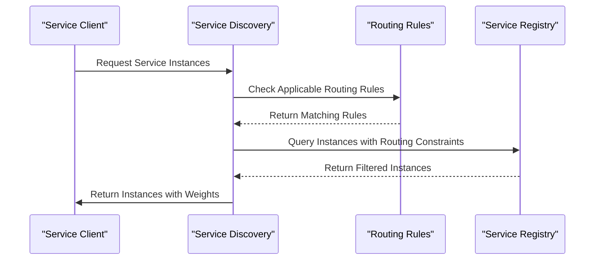
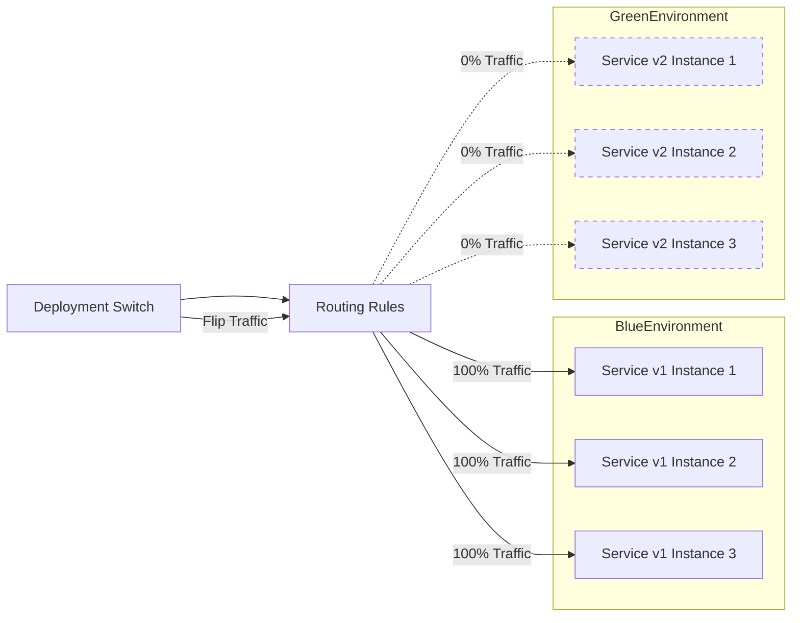
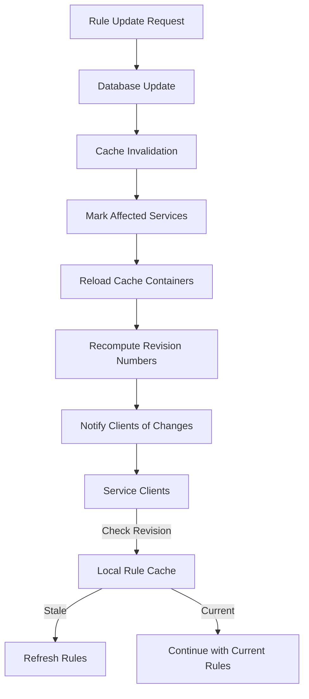

# Routing Rules

<cite>
**Referenced Files in This Document**   
- [router_rule.go](file://apis/pkg/types/rules/router_rule.go)
- [match.go](file://pkg/common/utils/match/match.go)
- [router_rule.go](file://pkg/goverrule/router_rule.go)
- [router_rule.go](file://pkg/cache/rules/router_rule.go)
- [router_rule.go](file://plugin/store/mysql/router_rule.go)
</cite>

## Table of Contents
1. [Introduction](#introduction)
2. [Rule Structure and Configuration](#rule-structure-and-configuration)
3. [Traffic Routing Capabilities](#traffic-routing-capabilities)
4. [Rule Evaluation and Matching](#rule-evaluation-and-matching)
5. [Service Discovery and Instance Selection](#service-discovery-and-instance-selection)
6. [Implementation of Rule Processing](#implementation-of-rule-processing)
7. [Deployment Strategies](#deployment-strategies)
8. [Rule Caching and Invalidation](#rule-caching-and-invalidation)
9. [Common Issues and Troubleshooting](#common-issues-and-troubleshooting)
10. [Best Practices](#best-practices)

## Introduction
The routing rules sub-feature provides a comprehensive traffic management system that enables sophisticated control over service-to-service communication. This document details the implementation of routing rules that support weighted routing, header-based routing, and version-based traffic splitting. The system allows for precise control of traffic distribution through configurable match conditions, weight distribution, and priority levels. Routing rules are applied during service discovery to influence instance selection, with rule evaluation powered by matchers and expression parsers from the pkg/common/utils/match package. The implementation supports advanced deployment strategies including canary deployments, A/B testing, and blue-green deployments, with mechanisms for rule caching and invalidation to ensure consistency across the system.

## Rule Structure and Configuration

Routing rules are structured as configurable policies that define how traffic should be distributed between service instances. Each rule contains match conditions, weight distribution parameters, and priority levels that determine its application during traffic routing.

**Section sources**
- [router_rule.go](file://apis/pkg/types/rules/router_rule.go#L1-L609)
- [router_rule.go](file://pkg/goverrule/router_rule.go#L1-L328)

## Traffic Routing Capabilities

### Weighted Routing
Weighted routing allows for the distribution of traffic across multiple service instances based on assigned weights. This capability enables gradual traffic shifting between different service versions, making it ideal for canary deployments and gradual rollouts. The weight parameter in destination configurations determines the proportion of traffic directed to specific instances.

### Header-Based Routing
Header-based routing enables traffic distribution based on HTTP header values in incoming requests. Rules can be configured to match specific header patterns, allowing for sophisticated routing decisions based on client characteristics, user segments, or application-specific metadata. This capability supports A/B testing by routing traffic based on user attributes or experimental flags.

### Version-Based Traffic Splitting
Version-based traffic splitting allows for the distribution of traffic across different service versions based on configurable percentages. This feature supports blue-green deployments by enabling complete traffic switches between versions, as well as gradual migrations by incrementally shifting traffic from old to new versions.

**Diagram sources**
- [router_rule.go](file://apis/pkg/types/rules/router_rule.go#L1-L609)
- [match.go](file://pkg/common/utils/match/match.go#L1-L175)

## Rule Evaluation and Matching

### Match Conditions
Routing rules support a comprehensive set of match conditions that can be applied to various request attributes including path, method, headers, query parameters, caller IP, and cookies. The matching system supports multiple comparison operators such as exact match, regex, range, and set membership (IN/NOT_IN), providing flexibility in defining routing criteria.

### Expression Parser Implementation
The rule evaluation system utilizes the expression parser from pkg/common/utils/match to process complex matching logic. The MatchString function evaluates whether source metadata values match specified conditions using various matching types including regex, exact, not equals, in, not in, and range comparisons. The implementation supports wildcard matching for service and namespace names, enabling flexible rule definitions.

### Priority Levels
Rules are evaluated based on priority levels, with lower numerical values indicating higher priority. When multiple rules match a request, they are processed in priority order, allowing for fine-grained control over traffic routing. Rules with identical priorities are further sorted by rule ID to ensure deterministic behavior.

**Section sources**
- [match.go](file://pkg/common/utils/match/match.go#L1-L175)
- [router_rule.go](file://apis/pkg/types/rules/router_rule.go#L445-L488)

## Service Discovery and Instance Selection

Routing rules are integrated into the service discovery process, influencing instance selection based on defined criteria. When a service requests instance information, applicable routing rules are evaluated to determine which instances should receive traffic and in what proportions.

The system supports both inbound and outbound routing configurations, allowing services to control both incoming and outgoing traffic patterns. For inbound routing, rules are applied when other services discover instances, while outbound rules affect how a service selects instances of other services it depends on.

**Diagram sources**
- [router_rule.go](file://pkg/cache/rules/router_rule.go#L1-L742)
- [router_rule.go](file://pkg/goverrule/router_rule.go#L1-L328)

## Implementation of Rule Processing

### Rule Evaluation Using Matchers
The rule evaluation process leverages the matcher implementation from pkg/common/utils/match to determine whether a request matches specific routing criteria. The MatchString function processes various match types, including:

- **EXACT**: Direct string comparison
- **REGEX**: Regular expression pattern matching
- **IN/NOT_IN**: Set membership testing
- **RANGE**: Numerical range comparisons
- **NOT_EQUALS**: Negative matching

The system also supports wildcard matching for service and namespace names through IsPrefixWildName and IsSuffixWildName functions, enabling flexible rule definitions that can match multiple services or namespaces.

### Rule Processing Pipeline
The rule processing pipeline consists of several stages:
1. Rule retrieval from storage
2. Rule validation and parsing
3. Priority-based sorting
4. Match condition evaluation
5. Traffic weight calculation
6. Instance selection

The pipeline ensures that rules are processed efficiently and consistently across the system.

**Section sources**
- [match.go](file://pkg/common/utils/match/match.go#L1-L175)
- [router_rule.go](file://pkg/cache/rules/router_rule.go#L1-L742)

## Deployment Strategies

### Canary Deployments
Canary deployments are supported through weighted routing rules that gradually shift traffic from a stable version to a new version. Administrators can configure rules to direct a small percentage of traffic to the new version, monitoring performance and error rates before increasing the traffic percentage.

### A/B Testing
A/B testing is enabled through header-based or cookie-based routing rules that direct different user segments to different service versions. This allows for controlled experiments to compare the performance and user experience of different implementations.

### Blue-Green Deployments
Blue-green deployments are facilitated by version-based traffic splitting rules that enable instant switching between two identical production environments. The routing system allows for immediate traffic redirection from the "blue" environment to the "green" environment, minimizing downtime and risk.

**Diagram sources**
- [router_rule.go](file://apis/pkg/types/rules/router_rule.go#L1-L609)
- [router_rule.go](file://pkg/cache/rules/router_rule.go#L1-L742)

## Rule Caching and Invalidation

### Caching Mechanism
Routing rules are cached to improve performance and reduce database load. The RouteRuleCache implementation maintains an in-memory store of routing configurations, organized by service and namespace. The cache uses a hierarchical structure with three levels of specificity:

1. **Exact matches**: Rules for specific service-namespace pairs
2. **Namespace wildcard**: Rules for all services in a specific namespace
3. **Global wildcard**: Rules applicable to all services and namespaces

### Invalidation Strategy
The caching system implements a sophisticated invalidation strategy to ensure consistency across the system. When rules are updated, the cache is invalidated through the following process:

1. Database transaction updates the rule
2. Cache update process detects changes
3. Affected service entries are marked for reload
4. Cache containers are reloaded with updated rules
5. Revision numbers are recomputed for affected services

The system uses revision numbers to track changes, allowing clients to determine when their cached rules are stale and need to be refreshed.

**Diagram sources**
- [router_rule.go](file://pkg/cache/rules/router_rule.go#L1-L742)
- [router_rule.go](file://plugin/store/mysql/router_rule.go#L1-L400)

## Common Issues and Troubleshooting

### Rule Conflicts
Rule conflicts can occur when multiple rules with overlapping match conditions apply to the same traffic. The system resolves conflicts through priority-based evaluation, with higher priority rules (lower numerical values) taking precedence. To avoid unintended behavior, administrators should carefully plan rule priorities and test configurations thoroughly.

### Unintended Traffic Distribution
Unintended traffic distribution may result from incorrectly configured weights or match conditions. This can be mitigated by:
- Validating rule configurations before deployment
- Monitoring traffic patterns after rule activation
- Using gradual traffic shifts for new rules
- Implementing comprehensive logging and metrics

### Performance Impact
Complex matching logic, particularly with regex patterns or multiple nested conditions, can impact performance. The system mitigates this through:
- Rule caching to avoid repeated database queries
- Efficient matching algorithms
- Prioritization of simpler match types
- Monitoring of rule evaluation times

Troubleshooting these issues involves reviewing rule complexity, monitoring system performance metrics, and optimizing rule configurations for efficiency.

**Section sources**
- [router_rule.go](file://pkg/cache/rules/router_rule.go#L1-L742)
- [match.go](file://pkg/common/utils/match/match.go#L1-L175)

## Best Practices

### Rule Design
- Use clear and descriptive names for rules
- Organize rules with a consistent priority scheme
- Minimize overlap between rule match conditions
- Use comments to document the purpose of complex rules
- Implement rules in stages, starting with non-production environments

### Testing Strategies
- Test rules in staging environments before production deployment
- Use canary deployments to validate new rules with limited traffic
- Monitor error rates and performance metrics during rule testing
- Implement rollback procedures for problematic rules
- Conduct regular reviews of active rules to remove obsolete configurations

These practices ensure reliable and predictable traffic routing behavior while minimizing the risk of service disruptions.

**Section sources**
- [router_rule.go](file://apis/pkg/types/rules/router_rule.go#L1-L609)
- [router_rule.go](file://pkg/goverrule/router_rule.go#L1-L328)