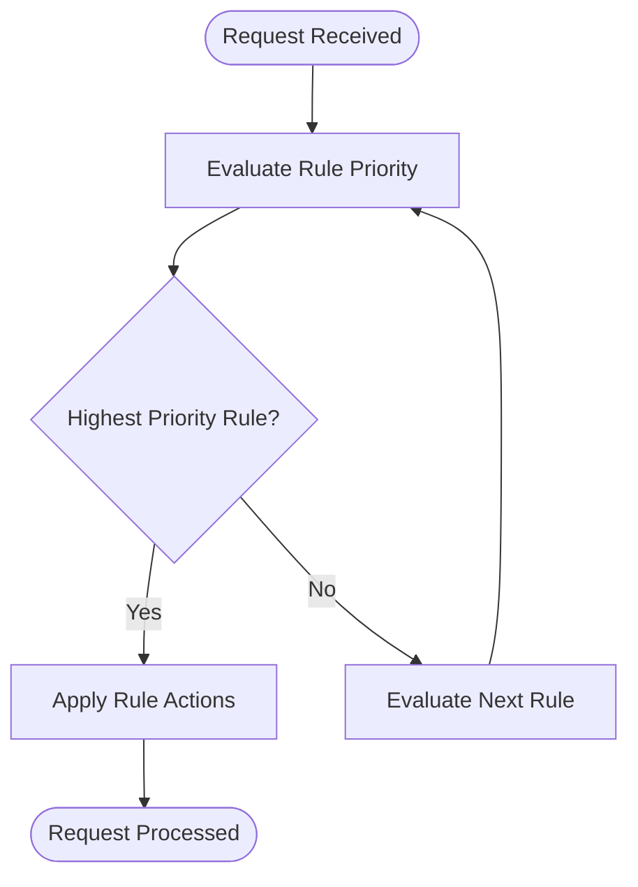
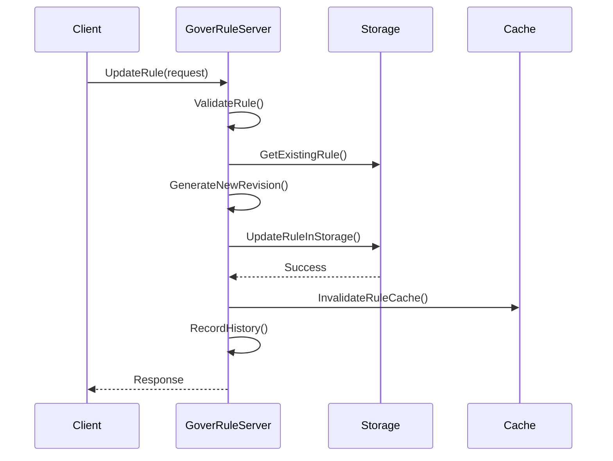
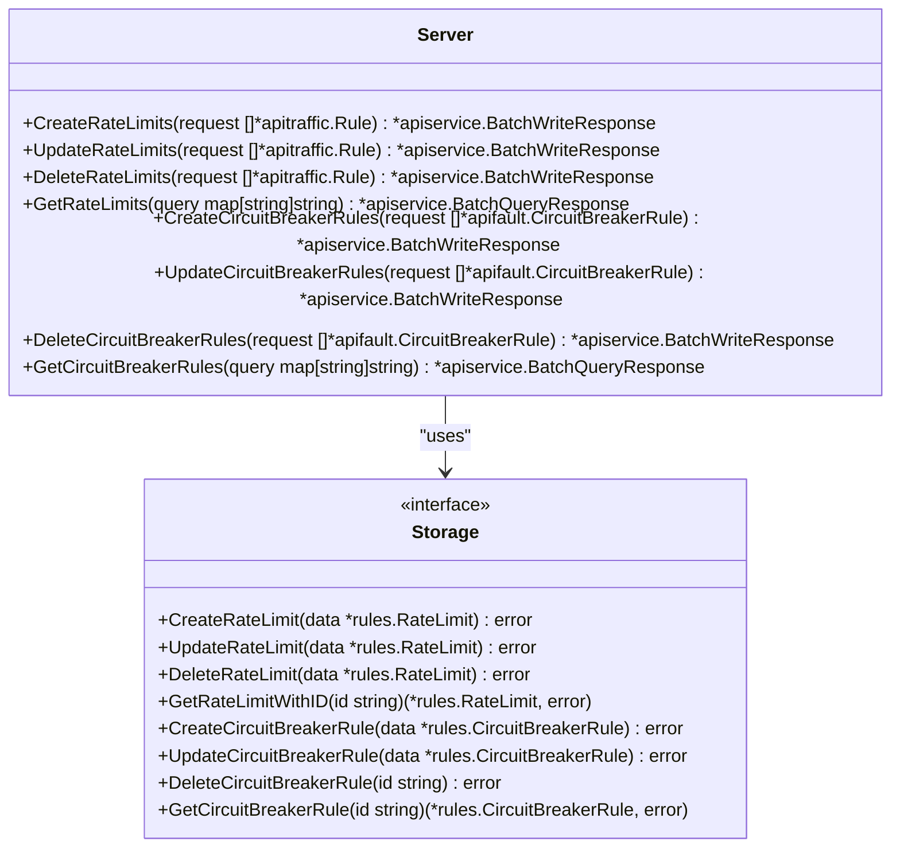
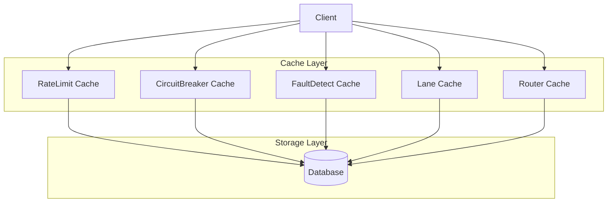

# Service Governance

<cite>
**Referenced Files in This Document**   
- [ratelimit_rule.go](file://pkg/goverrule/ratelimit_rule.go)
- [circuitbreaker_rule.go](file://pkg/goverrule/circuitbreaker_rule.go)
- [faultdetect_rule.go](file://pkg/goverrule/faultdetect_rule.go)
- [lane_rule.go](file://pkg/goverrule/lane_rule.go)
- [router_rule.go](file://pkg/goverrule/router_rule.go)
- [ratelimit_config.go](file://pkg/cache/rules/ratelimit_config.go)
- [circuitbreaker.go](file://pkg/cache/rules/circuitbreaker.go)
- [faultdetect.go](file://pkg/cache/rules/faultdetect.go)
- [lane.go](file://pkg/cache/rules/lane.go)
- [router_rule.go](file://pkg/cache/rules/router_rule.go)
- [rules/circuit_breaker.go](file://apis/pkg/types/rules/circuit_breaker.go)
- [rules/ratelimit.go](file://apis/pkg/types/rules/ratelimit.go)
- [rules/faultdetect.go](file://apis/pkg/types/rules/faultdetect.go)
- [rules/lane.go](file://apis/pkg/types/rules/lane.go)
- [rules/router_rule.go](file://apis/pkg/types/rules/router_rule.go)
</cite>

## Table of Contents
1. [Introduction](#introduction)
2. [Governance Rule Types](#governance-rule-types)
3. [Rule Definition and Application Scope](#rule-definition-and-application-scope)
4. [Priority Handling and Rule Conflicts](#priority-handling-and-rule-conflicts)
5. [Dynamic Rule Updates and Hot Reloading](#dynamic-rule-updates-and-hot-reloading)
6. [Implementation in pkg/goverrule](#implementation-in-pkggoverrule)
7. [Caching Mechanism in pkg/cache/rules](#caching-mechanism-in-pkgcacherules)
8. [Rule Configuration via API](#rule-configuration-via-api)
9. [Performance Impact and Optimization](#performance-impact-and-optimization)
10. [Troubleshooting Guide](#troubleshooting-guide)

## Introduction
Service governance provides critical mechanisms for maintaining system stability, reliability, and performance in distributed environments. This document details the service governance framework implemented in the pole-server repository, focusing on rate limiting, circuit breaking, fault detection, routing rules, and lane isolation. The system enables fine-grained control over service interactions through configurable rules that can be dynamically updated and efficiently evaluated.

## Governance Rule Types

### Rate Limiting
The system implements rate limiting through token bucket and leaky bucket algorithms to control traffic flow and prevent service overload. Rate limiting rules are defined in the `rules.RateLimit` structure and managed through the `goverrule.Server` interface. The implementation supports multiple rate limiting strategies based on service, namespace, or specific endpoints.

**Section sources**
- [ratelimit_rule.go](file://pkg/goverrule/ratelimit_rule.go#L1-L471)
- [rules/ratelimit.go](file://apis/pkg/types/rules/ratelimit.go#L1-L50)

### Circuit Breaking
Circuit breaking functionality protects services from cascading failures by automatically opening the circuit when failure rates or error thresholds are exceeded. The implementation supports both failure rate-based and error threshold-based circuit breaking, with configurable recovery conditions and ejection percentages.

**Section sources**
- [circuitbreaker_rule.go](file://pkg/goverrule/circuitbreaker_rule.go#L1-L313)
- [rules/circuit_breaker.go](file://apis/pkg/types/rules/circuit_breaker.go#L1-L40)

### Fault Detection
Fault detection rules enable proactive identification of unhealthy service instances through periodic health checks. The system supports various protocols (HTTP, TCP, UDP) and allows configuration of check intervals, timeouts, and port specifications to detect and isolate faulty instances.

**Section sources**
- [faultdetect_rule.go](file://pkg/goverrule/faultdetect_rule.go#L1-L290)
- [rules/faultdetect.go](file://apis/pkg/types/rules/faultdetect.go#L1-L35)

### Routing Rules
Routing rules provide sophisticated traffic management capabilities, including weighted distribution and header-based routing. These rules enable canary deployments, A/B testing, and blue-green deployments by directing traffic according to specified criteria.

**Section sources**
- [router_rule.go](file://pkg/goverrule/router_rule.go#L1-L327)
- [rules/router_rule.go](file://apis/pkg/types/rules/router_rule.go#L1-L60)

### Lane Isolation
Lane isolation creates logical partitions within the service mesh to separate traffic flows, typically used for environment separation (e.g., development, staging, production) or tenant isolation. Lane rules define the conditions under which requests are assigned to specific lanes.

**Section sources**
- [lane_rule.go](file://pkg/goverrule/lane_rule.go#L1-L443)
- [rules/lane.go](file://apis/pkg/types/rules/lane.go#L1-L45)

## Rule Definition and Application Scope

### Rule Definition
Governance rules are defined using protocol buffer messages that specify the rule parameters, conditions, and actions. Each rule type has a specific structure:
- Rate limiting rules define quotas, time windows, and action policies
- Circuit breaking rules specify error conditions, trigger thresholds, and recovery parameters
- Fault detection rules configure check intervals, timeouts, and protocol-specific settings
- Routing rules define match conditions, weight distributions, and forwarding targets
- Lane rules establish lane membership criteria and traffic isolation boundaries

The rule definitions are validated through parameter checking interceptors before being persisted to storage.

**Section sources**
- [ratelimit_rule.go](file://pkg/goverrule/ratelimit_rule.go#L150-L200)
- [circuitbreaker_rule.go](file://pkg/goverrule/circuitbreaker_rule.go#L150-L200)
- [faultdetect_rule.go](file://pkg/goverrule/faultdetect_rule.go#L150-L200)

### Application Scope
Governance rules can be applied at different scopes:
- **Service-level**: Rules that apply to all instances of a specific service
- **Instance-level**: Rules that target specific service instances based on metadata or attributes
- **Namespace-level**: Rules that affect all services within a namespace
- **Global-level**: System-wide rules that apply across all namespaces and services

The scope is determined by the rule configuration and is enforced during rule evaluation. Service-level rules are the most common, while instance-level rules provide fine-grained control for specific deployment scenarios.

**Section sources**
- [ratelimit_rule.go](file://pkg/goverrule/ratelimit_rule.go#L250-L300)
- [router_rule.go](file://pkg/goverrule/router_rule.go#L250-L300)

## Priority Handling and Rule Conflicts

### Priority Mechanism
Rules are evaluated based on their priority value, with lower numerical values indicating higher priority. When multiple rules match a request, the highest priority rule takes precedence. The priority system ensures predictable behavior in complex governance scenarios where multiple rules might apply.

**Diagram sources**
- [ratelimit_rule.go](file://pkg/goverrule/ratelimit_rule.go#L100-L120)
- [router_rule.go](file://pkg/goverrule/router_rule.go#L100-L120)

### Conflict Resolution
When rule conflicts occur, the system applies the following resolution strategy:
1. Rules with explicit service and namespace specifications take precedence over wildcard rules
2. Instance-level rules override service-level rules
3. Higher priority rules (lower priority values) override lower priority rules
4. More specific match conditions override broader conditions

The conflict resolution process ensures consistent and predictable governance behavior across the service mesh.

**Section sources**
- [router_rule.go](file://pkg/goverrule/router_rule.go#L200-L250)
- [lane_rule.go](file://pkg/goverrule/lane_rule.go#L200-L250)

## Dynamic Rule Updates and Hot Reloading

### Dynamic Updates
The governance system supports dynamic rule updates without requiring service restarts. Rules can be created, updated, or deleted through API calls that are immediately propagated to the configuration store. The update process includes:
- Validation of rule parameters
- Generation of new revision identifiers
- Atomic updates to ensure consistency
- History recording for audit and rollback purposes

**Diagram sources**
- [ratelimit_rule.go](file://pkg/goverrule/ratelimit_rule.go#L200-L250)
- [circuitbreaker_rule.go](file://pkg/goverrule/circuitbreaker_rule.go#L200-L250)

### Hot Reloading
Changes to governance rules are automatically reloaded by service instances through a push-based notification system. The cache layer detects rule modifications and propagates updates to connected clients, ensuring that all services operate with the latest governance policies. The hot reloading mechanism minimizes latency between rule updates and their application.

**Section sources**
- [ratelimit_config.go](file://pkg/cache/rules/ratelimit_config.go#L100-L150)
- [circuitbreaker.go](file://pkg/cache/rules/circuitbreaker.go#L100-L150)

## Implementation in pkg/goverrule

### Server Structure
The `goverrule.Server` struct serves as the central controller for governance rule management, providing methods for creating, updating, deleting, and querying rules of various types. The server interacts with the storage layer for persistence and the cache layer for efficient rule retrieval.

**Diagram sources**
- [ratelimit_rule.go](file://pkg/goverrule/ratelimit_rule.go#L1-L50)
- [circuitbreaker_rule.go](file://pkg/goverrule/circuitbreaker_rule.go#L1-L50)

### Rule Conversion
The implementation includes conversion functions that transform API-level rule representations to internal data structures and vice versa. These conversions handle serialization, deserialization, and data adaptation between the external API and internal storage formats.

**Section sources**
- [ratelimit_rule.go](file://pkg/goverrule/ratelimit_rule.go#L350-L400)
- [circuitbreaker_rule.go](file://pkg/goverrule/circuitbreaker_rule.go#L250-L300)

## Caching Mechanism in pkg/cache/rules

### Cache Architecture
The caching system in `pkg/cache/rules` optimizes rule retrieval performance by maintaining in-memory copies of governance rules. The cache is organized into separate components for different rule types, each implementing the appropriate caching strategy for its use case.

**Diagram sources**
- [ratelimit_config.go](file://pkg/cache/rules/ratelimit_config.go#L1-L50)
- [circuitbreaker.go](file://pkg/cache/rules/circuitbreaker.go#L1-L50)

### Cache Update Strategy
The cache employs a periodic update strategy that synchronizes with the underlying storage at regular intervals. The `Update()` method triggers a refresh process that:
1. Retrieves modified rules since the last update time
2. Updates the in-memory cache structures
3. Maintains last modification timestamps for incremental updates
4. Handles rule deletions and invalidations

The cache also implements a fix-up mechanism to resolve service information for rules when service metadata is missing or incomplete.

**Section sources**
- [ratelimit_config.go](file://pkg/cache/rules/ratelimit_config.go#L50-L100)
- [faultdetect.go](file://pkg/cache/rules/faultdetect.go#L50-L100)

## Rule Configuration via API

### API Endpoints
Governance rules are configured through a comprehensive API that supports CRUD operations for each rule type. The API endpoints follow a consistent pattern:
- `Create*Rules`: Batch creation of rules
- `Update*Rules`: Batch updates to existing rules
- `Delete*Rules`: Batch deletion of rules
- `Get*Rules`: Query rules with filtering options
- `GetOne*Rule`: Retrieve a specific rule by ID

Each operation returns appropriate response codes and error messages to facilitate client integration.

**Section sources**
- [ratelimit_rule.go](file://pkg/goverrule/ratelimit_rule.go#L10-L50)
- [circuitbreaker_rule.go](file://pkg/goverrule/circuitbreaker_rule.go#L10-L50)

### Example Configuration
A typical rule configuration flow involves:
1. Defining the rule parameters in the appropriate protocol buffer message
2. Calling the create or update API endpoint
3. Verifying the response for success or error conditions
4. Monitoring the rule's application through system metrics

The API supports both JSON and protocol buffer serialization formats for maximum flexibility.

**Section sources**
- [ratelimit_rule.go](file://pkg/goverrule/ratelimit_rule.go#L150-L200)
- [router_rule.go](file://pkg/goverrule/router_rule.go#L150-L200)

## Performance Impact and Optimization

### Evaluation Overhead
Rule evaluation introduces computational overhead that must be minimized to maintain system performance. The implementation optimizes evaluation through:
- Efficient data structures for rule storage and retrieval
- Caching of frequently accessed rules
- Lazy loading of rule configurations
- Batch processing of rule operations

### Optimization Techniques
The system employs several optimization techniques to reduce the performance impact of governance rules:
- **Indexing**: Rules are indexed by service, namespace, and other common query parameters
- **Caching**: Frequently accessed rules are cached in memory to reduce database queries
- **Batching**: Multiple rule operations are batched to reduce network and storage overhead
- **Incremental Updates**: Only modified rules are synchronized between components
- **Connection Pooling**: Database connections are pooled to reduce connection overhead

These optimizations ensure that governance rules can be applied efficiently even in high-traffic scenarios.

**Section sources**
- [ratelimit_config.go](file://pkg/cache/rules/ratelimit_config.go#L150-L200)
- [router_rule.go](file://pkg/goverrule/router_rule.go#L250-L300)

## Troubleshooting Guide

### Rule Conflicts
When rule conflicts occur, follow these steps to diagnose and resolve the issue:
1. Check the priority values of conflicting rules
2. Verify the application scope (service-level vs. instance-level)
3. Examine the rule match conditions for specificity
4. Review the rule evaluation order in the system logs

Use the `Get*Rules` API endpoints to retrieve the current rule configurations and analyze their parameters.

**Section sources**
- [router_rule.go](file://pkg/goverrule/router_rule.go#L200-L250)
- [lane_rule.go](file://pkg/goverrule/lane_rule.go#L200-L250)

### Unexpected Traffic Patterns
When traffic patterns deviate from expectations:
1. Verify that rules are properly enabled
2. Check the rule revision history for recent changes
3. Confirm that the cache has been updated with the latest rules
4. Examine the rule evaluation logs for errors or warnings

Use the history recording functionality to identify when rule changes were made and by whom.

**Section sources**
- [ratelimit_rule.go](file://pkg/goverrule/ratelimit_rule.go#L400-L450)
- [circuitbreaker_rule.go](file://pkg/goverrule/circuitbreaker_rule.go#L300-L350)

### Performance Issues
If governance rules are causing performance degradation:
1. Monitor rule evaluation latency metrics
2. Check cache hit rates for rule lookups
3. Review the number of active rules and their complexity
4. Consider optimizing rule conditions or reducing rule count

The system provides metrics and logging to help identify performance bottlenecks in the governance subsystem.

**Section sources**
- [ratelimit_config.go](file://pkg/cache/rules/ratelimit_config.go#L200-L250)
- [circuitbreaker.go](file://pkg/cache/rules/circuitbreaker.go#L200-L250)