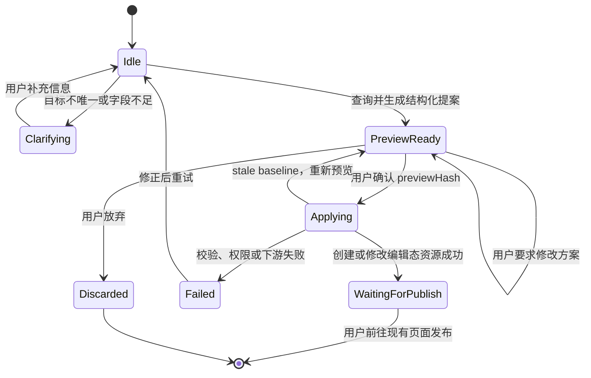
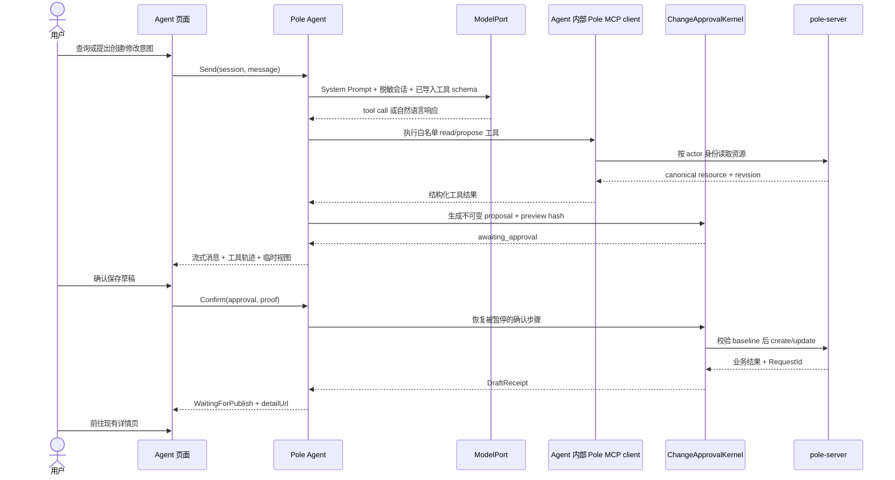

# ADR：Console Agent 资源变更工作台

## 状态

Accepted。Phase 1 最小真实运行时已完成：Console 内部 `PoleAgent` 通过 OpenAI-compatible `ModelPort` 调用 LLM Gateway，通过带当前用户身份的 MCP client 导入白名单只读工具，并把配置文件 update 收敛到确定性临时视图与确认内核。流式输出、服务端会话持久化、create、治理规则 adapter 与 Pole 托管 Secret 页面仍按后续分期推进。

## 背景

Console 需要新增一个 Agent 页面，让用户用自然语言查询 Pole 资源、提出创建或修改意图、在临时视图中检查变更，确认无误后保存资源，并等待用户后续发布。

这个需求中的“确认”和“发布”不是同一个动作：

1. Agent 先生成只读提案和临时视图。
2. 用户第一次确认后，只创建或修改编辑态资源。
3. 资源保持待发布，不影响当前已发布快照。
4. 用户进入现有资源详情和发布流程，再进行第二次人工决策。

现有 Pole 资源没有统一生命周期。配置文件和治理规则支持“编辑态资源 + 独立发布快照”，而命名空间、服务、实例、鉴权资源、MCP Server 和 A2A Agent 都是直接 CRUD，写入成功后立即生效。Agent 页面不能把这些差异隐藏成虚假的统一“待发布”状态。

本工作台与 [[adr-a2a-agent-registry]] 中的 A2A Agent Registry 不同。A2A 页面管理 Agent Card；本工作台是 Console 内的人机协作入口，不代理 A2A task、SSE、artifact 或 push notification 数据面。

## 决策摘要

- 页面产品名为“Pole Agent”，路由为独立一级 `/agent`；它不属于“AI 工具”资源管理分组，A2A Agent Registry 与 MCP Registry 仍保留在 `/ai/*`。
- 页面主交互是用户与 Agent 的消息时间线；最左侧产品导航在 Agent 模式下直接变为本地会话管理，不得在内容区再嵌套第二条会话栏。MCP 工具调用、临时视图、确认门禁和待发布回执都嵌入一次连续会话，而不是资源表单。
- 编排模块放在 Console 后端，不进入 pole-server 核心。
- pole-server 继续作为资源、鉴权、参数校验、发布和审计的事实来源。
- Agent 模型只能查询和生成结构化提案，不能直接调用写接口，也不能获得发布能力。
- 首期查询可覆盖多个资源域；创建和修改只开放配置文件及治理规则。
- 首期每个提案只包含一个聚合根，只支持 create/update，不支持 delete、跨资源批量和自动发布。
- 用户确认后只调用现有 create/update 接口，成功状态固定为 `waiting_for_publish`。
- 发布仍由用户从现有配置或治理详情页显式完成；Agent 页面只返回深链。

## 代码事实与能力矩阵

| 资源族 | 查询 | 创建/修改 | 独立发布 | Agent 首期能力 |
|---|---|---|---|---|
| 配置文件 | 有 | 有 | 有，保存后为 `to-be-released` | 查询、创建、修改、保存待发布 |
| 路由/限流/熔断/主动探测 | 有 | 有 | 有，CRUD 与 releases 分离 | 查询、创建、修改、保存待发布 |
| 泳道/无损 | 有 | 有 | 有，CRUD 与 releases 分离 | 查询、创建、修改、保存待发布 |
| 调用鉴权/流量镜像/流量 Mock | 有 | 有 | 有，CRUD 与 releases 分离 | 查询、创建、修改、保存待发布 |
| 命名空间/配置分组 | 有 | 有 | 无 | 首期只查询 |
| 服务/实例 | 有 | 有 | 无 | 首期只查询 |
| User/UserGroup/Role/Policy | 有 | 有 | 无 | 首期只查询 |
| MCP Server/A2A Agent | 有 | 有 | 无 | 首期只查询 |

如果未来要求所有资源都“创建后待发布”，需要单独设计全局变更集、影子资源、冲突处理和统一发布模型；这不是 Agent 页的隐含实现细节。

## 方案比较

### 方案 A：两入口极小模块

外部只暴露 `Turn` 和 `Stage`。接口很深，页面最简单，但如果把模块放进 pole-server，会把模型供应商、会话和临时交互状态带入领域核心。

### 方案 B：通用资源适配器

外部暴露 `Query/Prepare/Confirm/Publish`，内部使用 descriptor 和 adapter registry。扩展资源类型容易，但把 `Publish` 暴露给 Agent 会扩大权限面，descriptor 也容易退化成万能 JSON CRUD DSL。

### 方案 C：会话优先

外部暴露 `Open/Continue/Confirm`，最符合页面调用者；内部按资源族使用强类型 adapter。它能隐藏模型循环、资源定位、差异计算和错误映射，同时保持发布能力完全在现有页面。

### 采用方案

采用方案 C，并把 `PoleAgent` 建模为页面唯一对话对象。页面不感知 ModelPort、MCP client、系统 Prompt 或资源 adapter：

```go
type PoleAgent interface {
    Open(ctx context.Context, actor Actor, req OpenRequest) (*Session, error)
    Send(ctx context.Context, actor Actor, sessionID string, message UserMessage) (EventStream, error)
    Confirm(ctx context.Context, actor Actor, sessionID, approvalID string, proof ApprovalProof) (EventStream, error)
    Cancel(ctx context.Context, actor Actor, sessionID string) error
}
```

`PoleAgent` 是深模块：内部拥有版本化 System Prompt、模型、MCP 工具导入、多轮 tool loop、会话记忆、工具策略和 approval resume。页面只创建会话、发送消息、消费事件、确认或取消，不能自己解析意图、拼 Prompt、选择工具或调用资源接口。Agent interface 不提供 `Publish`。

内部 seam：

```go
type DraftResourceAdapter interface {
    Descriptor() ResourceDescriptor
    Resolve(ctx context.Context, query ResourceQuery) ([]ResourceSnapshot, error)
    Prepare(ctx context.Context, req PrepareRequest) (*PreparedChange, error)
    ApplyDraft(ctx context.Context, req ApplyDraftRequest) (*DraftReceipt, error)
}

type ResourceDescriptor struct {
    Kind       ResourceKind
    Lifecycle ResourceLifecycle
    Operations []Operation
}
```

首批至少有 `ConfigFileAdapter` 和参数化的 `GovernanceRuleAdapter(kind)`，测试使用 in-memory adapter，因此这是实际存在的 seam，不是假想抽象。

## 模块放置

Pole Agent 主体实现位于 Console 后端，现有 `agentworkbench` 保留为它内部的确定性变更确认内核：

```text
console/pkg/poleagent/
├── agent.go                # PoleAgent interface 与 model-tool loop
├── definition.go           # System Prompt、模型、MCP 与工具策略
├── prompt.go               # 版本化系统 Prompt
├── model.go                # LLM Gateway ModelPort
├── mcp.go                  # MCP client、工具发现与白名单导入
├── session.go              # 会话、序号、记忆和事件流
├── approval.go             # awaiting_approval 与恢复执行
└── repository.go           # 会话持久化 seam

console/pkg/agentworkbench/
├── workbench.go            # ChangeApprovalKernel 现有实现
├── proposal.go             # 不可变提案、hash 和确认策略
├── resource.go             # DraftResourceAdapter seam
└── adapter_*.go            # 强类型资源执行 adapter
```

原因：

- 模型供应商、会话、临时提案和页面交互属于 Console 扩展能力。
- `start --mode console` 允许 Console 与 server 分离，不能直接依赖 `pkg/*` 单例。
- Console 已负责验证当前登录态并向 pole-server 透传 Pole token。
- 资源 adapter 通过自有远端 HTTP port 调 pole-server，继续经过现有 paramcheck、auth、业务和审计链。
- 测试使用 in-memory pole-server adapter，不需要启动真实模型或真实 server。

## 状态机



重要不变量：

- 查询永远只读，不需要确认。
- 创建/修改意图必须先生成不可变提案；模型输出本身不是可执行载荷。
- proposal 绑定 actor、namespace、资源自然键或 ID、baseline revision/hash、canonical desired spec、schema version、TTL 和 preview hash。
- `Confirm` 必须携带 proposal ID、proposal version、preview hash 和 idempotency key。
- 确认时重新读取资源、重新鉴权、重新校验；发生并发变化时返回 `STALE_PREVIEW`，不自动套用旧 diff。
- `Confirm` 只调用 create/update，永不调用 release/publish/rollback/stopbeta。
- 同一 proposal 重复确认返回第一次 receipt，不重复写资源。
- 首期 proposal 只允许一个聚合根，避免跨资源接口没有分布式事务而产生部分成功。

## 请求链路



## 临时视图与页面交互

页面采用参考工作台的固定框架：280px 本地会话侧栏、52px 全局栏、62px 对话标题栏、对话主画布、底部浮动输入器，以及 294px 可收起上下文面板。右侧面板只承载资源范围、连接状态、会话记忆与权限边界；临时 diff 是当前对话中的工具结果，随消息流展示，不再用突然展开的大检查器挤压对话画布。它不能恢复传统治理编辑器中已经移除的实时 Spec/YAML/JSON 预览列，也不能把参数表单重新放回主画布。

### 普通控制台与 Agent 双工作模式

Console 是一个产品、两种操作模式，不是两套资源实现：

- **普通控制台**：保留资源侧栏、列表、详情、精确编辑和正式发布，适合确定性管理。
- **Agent**：隐藏普通资源导航内容，但保留工作区侧栏骨架，以对话、工具轨迹和临时视图为主，适合按意图操作。
- Agent 模式复用这条产品侧栏承载会话创建、搜索、按日期分组、切换、重命名和删除；会话列表与普通资源菜单互斥。新建会话只在侧栏提供一次，并支持 `Command/Ctrl + N`。内容区不再重复侧栏或新会话入口。
- 空会话可展示三类紧凑任务起点，但点击只把真实请求写入输入器，不伪造模型或工具结果；确定性运行时不支持的意图仍明确返回能力边界。
- 会话上下文面板常驻桌面宽视口，可由标题栏或面板关闭按钮收起；窄于 1180px 时改为右侧覆盖层，避免压缩主消息流。
- 默认侧边布局把模式切换固定在侧栏底部、版本信息上方：普通模式显示“进入 Agent 工作台”，Agent 模式在同一位置显示“返回普通控制台”；Agent 不再作为普通资源菜单项或默认页头入口重复出现。无侧栏的顶部布局保留页头模式开关作为兜底。
- 从普通模式进入 Agent 时记录 `returnTo` 和最近普通页面；切回时只接受同源本地路径，拒绝 `//`、`/agent` 等不安全或循环目标，缺省返回 `/namespace`。
- 资源详情可提供“交给 Agent”，URL 只携带 `kind`、资源自然键和 `returnTo`，不携带配置正文、token、secret 或其它敏感内容。
- Agent 接到资源上下文后先展示定位结果和待补充意图；真正内容仍由工具按当前用户身份读取，不能信任 URL 中的资源快照。
- Agent 保存草稿后的“前往普通视图发布”是跨模式交接，不是 Agent 获得发布能力。
- 模式切换只改变工作区呈现，不改变登录态、权限、namespace scope、审计身份或后端 API。

临时视图必须展示：

- 操作类型、资源类型、namespace/name 或稳定 ID。
- “确认后保存为待发布，不会立即生效”的明确生命周期提示。
- 创建时的目标摘要；修改时的 before/after semantic diff。
- 配置正文可使用现有 `CodeDiffEditor` 心智；治理规则使用领域字段差异，不默认展示整段原始 JSON。
- 影响服务、依赖资源、字段校验结果和风险提示。
- proposal 过期时间、baseline 版本和最近刷新时间。
- `修改方案`、`放弃`、`确认并保存草稿` 三个动作。

确认成功后展示真实资源引用、操作 Request ID、待发布状态和“前往详情并发布”深链。Agent 页面本身不出现发布按钮。

## HTTP 接口建议

```text
POST   /ai/agent/v1/sessions
GET    /ai/agent/v1/sessions/{session_id}
POST   /ai/agent/v1/sessions/{session_id}/turns
POST   /ai/agent/v1/sessions/{session_id}/proposals/{proposal_id}:confirm
DELETE /ai/agent/v1/sessions/{session_id}/proposals/{proposal_id}
```

`SessionSnapshot` 统一返回会话序号、消息、查询结果、当前 proposal、receipt 和稳定错误。前端不拼接各资源域 URL，也不直接调用已有 Redux thunk 完成写入。

## 数据模型与持久化

会话持久化分成两个明确边界，不能混为一种“会话”：

- **浏览器本地对话会话**：用于 ChatGPT 式交互连续性，保存在 IndexedDB。每条记录包含会话标题、消息摘要、未发送草稿、资源引用和记忆设置；支持创建、切换、自动标题、重命名、删除和刷新恢复。它不跨浏览器同步，不是审计或资源状态的事实来源，也不保存 token、Secret、完整服务端 proposal 或确认凭证。
- **服务端执行会话**：用于未来 ModelPort/tool loop、不可变 proposal、approval resume、确认幂等和审计关联。该层仍由 Console 后端 repository 托管；浏览器删除历史不能撤销已发生的资源操作，也不能改变 proposal 的授权、TTL、baseline 和状态。

本地会话的记忆设置按会话保存，包含启用开关和受控历史窗口。当前确定性 planner 优先解析当前消息，只在当前消息缺少资源路径或配置上下文时使用所选历史补全；接入真实模型后沿用相同窗口语义。关闭记忆后不得把历史消息发送给 planner 或模型。

建议新增 Console 自有表或 repository：

- `agent_session`：actor、namespace scope、state、sequence、model profile、expires_at。
- `agent_message`：role、脱敏正文、tool 摘要、ctime；默认不保存完整资源正文。
- `agent_proposal`：target、operation、baseline hash、desired canonical payload、preview hash、status、expires_at。
- `agent_operation_receipt`：idempotency key、真实资源引用、下游 Request ID、结果和时间。

生产执行会话使用 MySQL adapter，测试使用 in-memory repository。执行状态不能只放浏览器或单进程内存，否则多 Console 实例、确认幂等和审计关联都不可靠。浏览器 IndexedDB 只承担本地 UX 历史；服务端 proposal TTL 应可配置，建议默认 24 小时，过期 proposal 必须重新生成。

## 模型能力与确定性执行

模型或确定性 planner 只获得以下逻辑能力：

- `resource.search/read`：在当前用户权限内查询资源。
- `proposal.propose`：返回结构化 ChangeIntent；该工具只生成临时视图，不写资源。
- `clarify`：要求用户选择目标或补充字段。
- `draft.create/update`：只能生成一项等待用户确认的受控调用，不能自行执行；确认后由确定性执行器重放校验过的载荷。

模型不得获得：

- 绕过 proposal/previewHash/用户确认门禁的 create/update HTTP 或 MCP 写工具。
- delete/publish/rollback/stopbeta 等高风险 HTTP 或 MCP 工具。
- Pole token、Console JWT、下游凭据或数据库连接。
- 绕过 adapter schema 的自由 JSON 写入口。

`ModelPort` 属于真正外部依赖，生产 adapter 可先支持一个 OpenAI-compatible provider，测试必须使用 deterministic fake。模型不可用不能影响已经生成且仍有效的 proposal 被用户确认；确认链路只依赖确定性代码和 pole-server。

### Pole Agent 定义与 LLM Gateway 配置

真正的 `PoleAgent` 归属 Console 后端，而不是浏览器或 pole-server 核心。浏览器只调用它的会话 interface、消费流式事件并提交用户确认；它不得直接访问 LLM Gateway，也不得持有模型密钥或 Pole 管理凭证。LLM Gateway 只是 Pole Agent 的模型依赖，配置 Gateway 并不等于已经提供 Agent。

Console 启动配置只保留 Agent 自举信息，不把日常可调参数和模型密钥长期写死在 YAML：

```yaml
bootstrap:
  console:
    agent:
      enabled: true
      configSource:
        type: pole-config-center
        namespace: pole-system
        group: console-agent
        file: agent-runtime.yaml
        credentialRef: env:POLE_AGENT_CONFIG_TOKEN
      secretStore:
        provider: pole
        masterKeyRef: env:POLE_SYSTEM_SECRET_MASTER_KEY
```

配置中心中只消费已发布版本，动态配置示例：

```yaml
definition:
  id: pole-control-plane
  systemPrompt:
    builtinVersion: v1
    operatorInstructions: 管理 Pole 控制面资源，写操作必须等待人工确认
  mcpServers:
    - name: pole-control-plane
      endpoint: http://pole-server:8090/ai/mcp/v1/sse
      toolAllowlist: [resource.search, resource.read, proposal.propose]
model:
  provider: openai-compatible
  baseURL: https://llm-gateway.example.com
  model: auto
  apiKeyRef: pole-secret://console/agent/llm-gateway/v1
  timeout: 60s
runtime:
  maxToolIterations: 8
  sessionTTL: 24h
```

Pole Agent 启动时加载版本化 System Prompt、连接并导入 MCP 白名单工具，然后自行运行 `model → tool → model` 循环。System Prompt 约定 Agent 身份、资源生命周期、必须先预览再确认、禁止发布/删除、提示注入防护和敏感字段规则；但 Prompt 不是安全边界，工具策略与确认内核必须以代码强制执行。

`baseURL` 指向 LLM Gateway，而不是模型厂商地址；动态配置只保存 `apiKeyRef`。LLM API key 默认由 Pole 的版本化 `SystemSecretStore` 托管，Kubernetes Secret/环境变量只保存包装业务 Secret 的根密钥；企业部署也可显式切换 Vault 等外部 adapter。密钥不能进入配置中心正文或页面响应。模型名属于可审计的 Agent profile；超时、最大工具轮数和会话 TTL 必须有限制。生产日志只记录 profile、Prompt 版本、导入工具版本、耗时、token usage 和 request ID，不记录密钥或未脱敏资源正文。

Phase 1 已把这一边界落成 Console 类型化启动配置、只读目录和真实运行时：Agent ID、Prompt 版本与 operator instructions、LLM provider/baseURL/model/API key 引用、MCP endpoint/工具白名单、proposal TTL、模型/上游 timeout 和 runtime mode 能在“系统配置 / Console / Agent”查看；`/ai/agent/v1/runtime` 只有在模型配置有效且 MCP 握手成功后才返回 ready。当前 API key 的环境变量引用只是 `SystemSecretStore` 尚未落地前的临时自举兼容，不是目标托管方案；未配置 LLM 地址或 key 时页面 fail closed，禁止发送并显示诊断原因。现有 Workbench 已使用配置化 proposal TTL 与上游 timeout。

`PoleAgent` 对外只暴露 `Open/Send/Confirm/Cancel` 这一深 interface，内部拥有以下实现：

- `AgentDefinition`：聚合版本化 System Prompt、模型 profile、MCP servers 与工具白名单，是 Agent 的可审计定义。
- `ModelPort`：把脱敏消息、只读工具 schema 和工具结果发送给 LLM Gateway，支持流式增量与稳定错误映射。
- `MCPToolRegistry`：由 Agent 内部连接 MCP server、发现并导入白名单工具；Pole token 只进入该 adapter，不进入模型上下文。
- `ChangeApprovalKernel`：即现有 `agentworkbench.Workbench` 的职责，保留 preview hash、TTL、幂等、stale 检查和确定性写入，作为任何模型输出都不能绕过的确认内核。
- `SessionRepository`：保存脱敏会话、序号、工具轨迹和 proposal 引用，生产使用持久化 adapter，测试使用 in-memory adapter。

当前 Pole MCP 端点注册 namespace、MCP Server Registry、`get_config_file` 与 `search_config_files` 只读工具。配置 update 不向远端 MCP 暴露写工具，而由 Agent 内部 `prepare_config_file_update` 调用 `ChangeApprovalKernel` 生成不可变提案；模型工具面没有 confirm、publish、delete 或自由 REST 能力。治理规则、服务和 A2A 的通用查询及 proposal 工具仍未补齐。

### 配置来源与系统设置页面

采用“启动配置 + Pole 配置中心 + Pole SystemSecretStore”三层模型；统一的来源优先级、发布、实例回执与页面规则由 [[adr-system-configuration-control-plane]] 定义：

| 层次 | 保存内容 | 生效方式 |
|---|---|---|
| 启动配置 | pole-server 地址、配置源定位、后台凭证引用、Secret Store 类型、KEK 引用、紧急总开关 | 部署或重启 |
| Pole 配置中心 | AgentDefinition、LLM Gateway 地址/模型、MCP endpoint/工具白名单、运行限制、可编辑 Prompt 指令 | 草稿校验后发布，Agent Watch 热加载 |
| Pole SystemSecretStore | 版本化 LLM API key 等业务 Secret 密文、用途与轮换审计；默认 Pole 托管 | 页面 write-only 写入，运行时受控解析，配置中只保存 `pole-secret://` 引用 |
| 外部 Secret Provider（可选） | Vault/Kubernetes External Secrets 等企业适配 | 通过 adapter 解析外部引用，不改变上层 interface |

Console 新增“系统设置 / Agent”类型化页面，但它是 Pole 配置中心中保留配置文件的领域化 facade，不暴露原始 YAML 编辑器，也不让 Console 直写 pole-server 数据库。页面应提供连接测试、字段校验、草稿 diff、发布、历史版本和回滚，并显示当前 active revision、修改人和更新时间。

Agent Runtime 只读取已发布版本。新版本解析、Secret 引用解析、Gateway/MCP 探活和工具策略校验全部成功后，才原子替换内存中的不可变 `AgentDefinition`；失败时继续使用 last-known-good 并告警。新会话绑定 active revision，已有会话继续使用创建时的 revision，避免对话中途改变模型、Prompt 或工具集。

System Prompt 分成不可由页面覆盖的内置安全策略和可配置的 operator instructions。Agent 的 MCP 工具白名单禁止读取密钥或修改自己的系统配置，避免 Agent 自修改 Prompt、模型和工具权限。

不采用 Console 直连数据库作为首选方案：当前 Console MySQL 是 `pole_observability` 的 history/event reader，`ObserverStore` 没有系统配置写入能力；核心 `server_setting` 也只有 DDL，没有可复用的 Store、接口、权限和缓存链。新增数据库系统配置会重复配置中心已经具备的草稿、发布、回滚、Watch 和审计能力，并破坏 `start --mode console` 只通过网络依赖 pole-server 的模块边界。未来若 Console 必须脱离 Pole 独立运行，可在 Console 自有数据库增加 `SystemConfigRepository` adapter，但不得直连核心业务表。

## 权限、安全与审计

- 查询、预览和确认均使用当前 Console 用户身份；确认时必须再次检查写权限。
- 资源 adapter 必须调用 pole-server 的公开管理接口，不得直写 Store 或绕过 auth/paramcheck wrapper。
- 新资源 kind 默认 fail closed；没有注册 adapter 或没有 `draftable=true` 时只读。
- 密钥、token、自定义 Header 明文和加密配置内容不得进入消息、模型上下文、diff、日志或 proposal 持久化。
- 加密配置和 write-only 字段首期默认不支持 Agent 修改；后续需要独立安全输入通道。
- 外部模型前需做字段级脱敏、数据范围限制和可配置 provider policy。
- 检索到的配置内容、描述和标签都视为不可信数据，不能作为系统指令执行。
- 操作审计记录 actor、session ID、proposal ID、resource ref、operation、model profile、下游 Request ID 和结果，不记录敏感原文。
- 批量响应必须检查逐项结果，不能只判断顶层 code；首期单聚合根进一步减少部分成功面。

## 错误契约

稳定错误类别至少包括：

- `AMBIGUOUS_TARGET`
- `UNSUPPORTED_RESOURCE`
- `NOT_DRAFTABLE`
- `PERMISSION_DENIED`
- `VALIDATION_FAILED`
- `PROPOSAL_EXPIRED`
- `STALE_PREVIEW`
- `CONFIRMATION_MISMATCH`
- `ALREADY_APPLIED`
- `RESOURCE_CONFLICT`
- `MODEL_UNAVAILABLE`
- `DOWNSTREAM_FAILED`

错误结构保留 `category/code/info/requestId/proposalId/resourceRef/retryable`。模型生成的自然语言不能替代稳定错误码；下游 `code + info + RequestId` 必须原样关联到 receipt 或错误详情。

## 分期

### Phase 0：无模型的确定性原型

- 实现 Session/Proposal 状态机、repository、preview hash、幂等和 stale baseline 检查。
- 先用固定结构化输入验证 ConfigFileAdapter 与一类 GovernanceRuleAdapter。
- 证明确认只保存草稿，当前发布快照不变。

#### Phase 0 实际落地（2026-07-21）

- Console 新增独立一级 `/agent` 页面；`/ai` 菜单只保留 A2A Agent 与 MCP 服务资源管理。
- 页面主交互改为聊天时间线，用户用自然语言消息描述 `namespace/group/file` 与目标代码块；执行过程展示 `pole.config.get_file` 与 `pole.config.update_file_draft` 工具轨迹，临时 diff 仅在需要确认时作为右侧检查器出现。
- 当前对话 planner 是确定性解析器，只覆盖已有配置文件 update，避免在没有 ModelPort 时伪装成通用自然语言能力；真实模型与 MCP client transport 属于 Phase 1。Phase 0 后端仍通过强类型 HTTP port 调 Pole 管理接口，尚未越过网络 MCP transport，这一差距必须在声称“完整 MCP Agent runtime”前补齐。
- Console 后端新增 `/ai/agent/v1/proposals/config-file` 与 `/ai/agent/v1/proposals/{id}/confirm`；提案绑定 actor、proposal version、baseline hash、preview hash 和 30 分钟 TTL。
- 确认接口要求 proposal version、preview hash 与幂等键，确认前重新读取配置并检查 baseline；重复确认（包括成功后越过 proposal TTL）返回同一 receipt。
- 内存 repository 默认最多保留 1024 个提案；准备新提案时清理过期或最早到期的未应用项，但不淘汰已成功 receipt；容量全部被成功回执占用时返回明确的 503，限制配置正文驻留且不破坏幂等重放。
- ConfigFile HTTP adapter 只调用 `GET /config/v1/files/detail` 与 `PUT /config/v1/files`，不持有 release/publish 能力，并检查批量响应中的每一项结果。
- 确认成功状态为 `waiting_for_publish`，页面只深链到现有配置分组；发布仍由用户在配置中心完成。
- 加密配置、无变化请求、过期提案、跨用户确认、stale baseline 与下游错误均 fail closed。
- transport、响应读取或 JSON 解码失败统一映射为 `502/DOWNSTREAM_FAILED`；单资源批量 PUT 必须恰好返回一项结果。
- 当前仅支持已有配置文件的 update。通用查询、create、治理规则、会话恢复、持久化 repository、ModelPort 与真实 MCP client transport 不属于本轮可运行范围。
- pole-server 配置文件接口没有原子 compare-and-swap；Phase 0 的“确认前重读 + hash”能发现已发生的变化，但读写之间仍有 TOCTOU 窗口，后续应补 revision/CAS 契约。

### Phase 1：最小 Agent 闭环

- 已在 Console 后端增加请求级会话编排、OpenAI-compatible `ModelPort` adapter、版本化 System Prompt、有上限的 model-tool loop 和稳定错误映射；流式事件与服务端会话 repository 尚未实现。
- 已增加带当前 actor 的 Pole MCP client，并补齐配置文件只读工具；配置 update proposal 作为 Agent 内部工具落入确定性确认内核，模型无法确认或发布。
- 前端保留 IndexedDB 会话和 4/10/20 轮记忆窗口，但每轮都调用真实 `/ai/agent/v1/turns`，不再使用本地正则 planner。
- 运行时接口同时探测模型配置与 MCP 工具目录；未配置或握手失败时页面不显示虚假连接状态。
- 当前查询支持 namespace、config file 与 MCP Server/工具目录；service、治理规则与 A2A 摘要待增加只读 adapter。
- 当前写入只支持已有配置文件 update；create 与路由/限流规则待增加受控 proposal adapter。
- 配置 update 确认后返回现有详情/发布页深链。

### Phase 2：补齐治理类型

- 接入熔断、主动探测、泳道、无损、调用鉴权、流量镜像和流量 Mock。
- 为 adapter 建立 conformance tests，覆盖 schema、diff、权限、冲突和 receipt。
- RouteRule 等存在细粒度鉴权缺口的类型，必须先完成鉴权审计再开放写入。

### Phase 3：多资源与立即生效资源评估

- 评估同一聚合内批量变更和依赖 DAG。
- 只有产品明确接受“确认后立即生效”时，才开放命名空间、服务、鉴权、MCP/A2A 的写能力，并在预览中使用不同的高风险确认文案。
- 若仍要求所有资源等待发布，则另立全局变更集 ADR，不在本工作台 adapter 中伪造发布语义。

## 验收标准

- 查询不会产生任何业务写入或发布记录。
- 任意创建/修改都必须先看到不可变临时视图，绕过确认接口会失败。
- 预览后资源被他人修改时，确认返回 `STALE_PREVIEW`，不会覆盖新数据。
- 重复确认同一 proposal 只产生一次写入，并返回同一 receipt。
- 确认配置或治理提案后，编辑态资源发生变化，active release 保持不变。
- Agent 页面没有发布工具；只能跳转到现有详情页，由用户再次确认发布。
- Agent 在 Console 中是独立一级入口，主界面是聊天而不是资源表单；A2A/MCP Registry 继续留在 AI 工具菜单。
- 每次资源读取和草稿变更在消息流中都有可见的工具调用轨迹，临时视图只在写操作待确认时出现。
- 用户可通过侧栏底部固定入口双向切换普通控制台与 Agent；Agent 模式不显示普通资源导航，返回时恢复进入前的普通页面；收起侧栏时仍保留可访问的图标按钮。
- 用户可在最左侧产品侧栏创建、切换、重命名和删除浏览器本地会话；刷新后恢复当前会话、消息、未发送草稿和每会话记忆窗口，且不得依赖服务端保存这些 UX 状态。内容画布不得再复制一条会话侧栏。
- 当前消息必须优先于历史记忆解析；关闭会话记忆后不再消费历史，历史窗口只允许受控档位，不能无限扩张模型上下文。
- 资源详情交接只携带资源引用和安全返回地址，Agent 首屏明确显示当前上下文，不通过 URL 传递资源正文或敏感字段。
- 无权限用户不能通过模型查询、预览或确认越权资源。
- 任何模型输出都必须经过强类型 adapter 校验；未知字段和未知资源 fail closed。
- 日志、数据库、模型请求和 UI 中不出现 Pole token、JWT 或 write-only secret 明文。
- 错误 UI 同时展示业务 code、info 和 Request ID。
- in-memory adapters 能在不启动模型和 pole-server 的情况下覆盖整个 AgentWorkbench interface 状态机。

## 非目标

- 不实现 A2A task runtime、任务状态机、artifact、SSE 转发或 push broker。
- 不让 Agent 自动发布、回滚、停止灰度或删除资源。
- 不在首期提供跨资源事务或自动补偿。
- 不用 Agent proposal 取代配置中心和治理规则的正式 release/history 模型。
- 不把 LLM 判断当作授权、校验或并发控制结果。

## 证据

- `console/web/src/router/modules/agent.ts`、`console/web/src/router/modules/ai.ts`：Agent 是独立 `/agent` 一级入口，AI 工具菜单只包含 A2A 与 MCP 页面。
- `console/web/src/pages/AI/Agent/index.tsx`：本地会话导航、按会话记忆、对话时间线、工具调用轨迹、临时视图、确认与待发布回执。
- `console/web/src/pages/AI/Agent/sessionStore.ts`：IndexedDB 会话、消息、草稿、资源上下文、记忆窗口和当前会话元数据。
- `console/web/src/layouts/components/Menu.tsx`、`Header/WorkspaceModeSwitch.tsx`、`AppLayout.tsx`：Agent 会话侧栏宿主、全局双模式切换、最近普通页面恢复和 Agent 专属布局。
- `console/web/src/pages/Configuration/Group/Files/FileView.tsx`：配置资源到 Agent 的强类型上下文交接。
- `console/pkg/router/router.go`、`console/pkg/handlers/proxy.go`：Console 验证登录态并反向代理 pole-server。
- `console/web/src/services/config_files.ts`：配置文件有 `to-be-released` 状态，create/update 与 release 分离。
- `console/web/src/services/config_release.ts`：配置发布、版本、灰度与回滚接口。
- `console/web/src/pages/Configuration/Group/Files/FileView.tsx`：保存草稿与发布配置是两个动作。
- `console/web/src/pages/Configuration/Group/Releases/PublishForm.tsx`：发布需要独立信息和确认。
- `console/web/src/components/CodeDiffEditor/index.tsx`：已有配置差异展示能力。
- `plugin/apiserver/httpserver/discover/router_access.go`：治理 CRUD 与 release 路由分离。
- `plugin/apiserver/httpserver/discover/ratelimit_access.go`：限流 CRUD 与 release 路由分离。
- `plugin/apiserver/httpserver/discover/circuitbreaker_access.go`：熔断 CRUD 与 release 路由分离。
- `plugin/apiserver/httpserver/discover/faultdetect_access.go`：探测 CRUD 与 release 路由分离。
- `plugin/apiserver/httpserver/discover/lane_access.go`：泳道 CRUD 与 release 路由分离。
- `plugin/apiserver/httpserver/discover/lossless_access.go`：无损 CRUD 与 release 路由分离。
- `plugin/apiserver/httpserver/discover/traffic_governance_access.go`：三类流量治理 CRUD 与 release 路由分离。
- `pkg/goverrule/releases.go`：治理发布按资源类型分派。
- `plugin/apiserver/httpserver/discover/service_access.go`：服务为直接 CRUD，无 release。
- `plugin/apiserver/httpserver/aimcp/server.go`、`plugin/apiserver/httpserver/aia2a/server.go`：MCP/A2A 为直接 CRUD。
- `console/web/src/utils/request.ts`：现有错误模型保留 code、info 和 Request ID。

## 相关页面

- [[ai-features]]
- [[adr-a2a-agent-registry]]
- [[architecture]]
- [[auth-system]]
- [[api-servers]]
- [[config-center]]
- [[governance-rules]]
- [[patterns]]
- [[adr-system-configuration-control-plane]]
