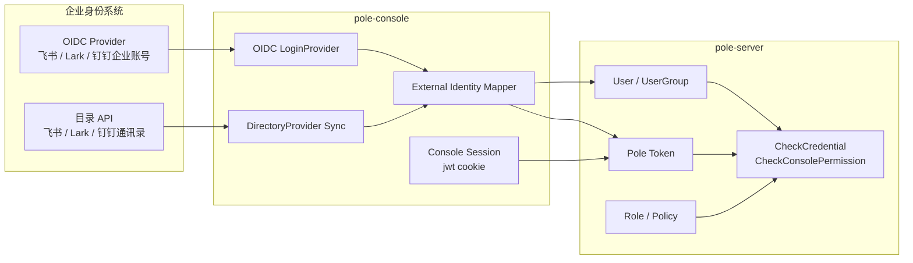
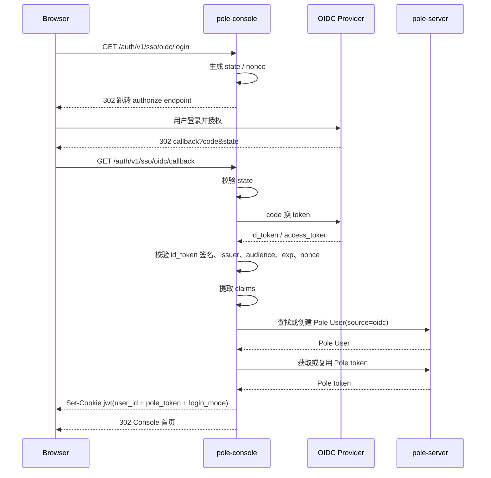
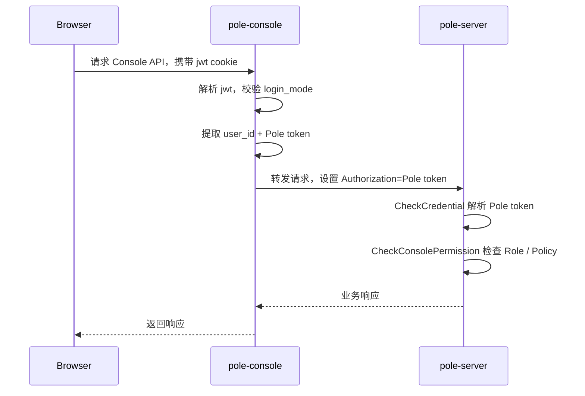
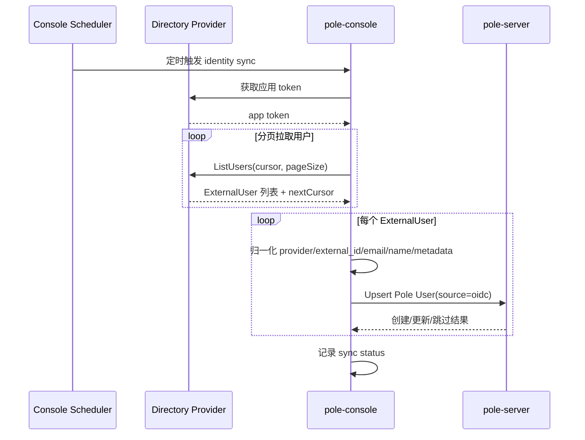
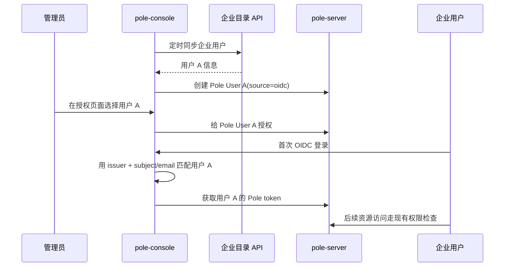

# ADR：Console OIDC 用户来源与企业目录同步

## 状态

Accepted，待实现。

## 背景

企业接入 pole-control-plane 时，常见诉求是复用企业已有账号体系，减少在 Pole Console 中单独维护登录账号的复杂度。同时，pole-server 已经有完整的本地认证与授权模型：Pole User、UserGroup、Role、Policy、Pole token、`CheckCredential` 和 `CheckConsolePermission`。

本决策只扩展 Console 用户来源，不替换 pole-server 的 token 与资源授权链路。OIDC 登录用于证明“外部用户是谁”；资源授权仍基于 Pole User / UserGroup / Role / Policy。

另一个约束是授权前置：如果企业用户还没有登录，单纯依赖 OIDC JIT 创建会导致授权页面选不到该用户。因此需要在 Console 侧增加企业目录同步能力，将外部账号提前同步为 `source=oidc` 的 Pole User。

## 决策

OIDC 登录与企业目录同步都放在 Console 扩展点中实现，不进入 pole-server 核心内部。

```text
Console 负责接企业身份源，pole-server 只负责管理和鉴权 Pole User。
```

具体决策：

- Console 登录模式为启动期单选：`native` 或 `oidc`。
- `native` 模式只开放 Pole 本地用户名密码登录。
- `oidc` 模式只开放企业 OIDC 登录，不开放本地密码登录入口。
- 运行期间不支持切换登录模式；切换必须修改配置并重启。
- OIDC token 只在 Console 登录回调中使用，不作为 Pole 业务接口 token。
- 登录成功后，外部身份必须映射为本地 Pole User。
- Console 继续写入现有 `jwt` cookie，其中保存 `user_id + pole_token + login_mode`。
- 后续 Console API 请求仍由 Console 提取 Pole token，并转发给 pole-server 走现有鉴权链。
- 企业目录同步先支持飞书、Lark、钉钉，将外部用户同步为 `source=oidc` 的 Pole User。
- 同步出的用户可被提前授权；真正访问资源时仍由 pole-server 现有策略判断。

## 非目标

- 不改 pole-server 的 `CheckCredential`、Pole token 编解码与校验逻辑。
- 不让 pole-server 接受 OIDC `id_token` 或 `access_token` 作为业务鉴权 token。
- 不把飞书、Lark、钉钉目录 API 接入 pole-server 核心。
- 不让企业目录部门或 OIDC claims 直接等价为 Pole 权限。
- 第一阶段不做 OAuth2 专用登录 provider；企业登录统一按 OIDC 接入。
- 第一阶段不自动同步外部组织权限到 Pole UserGroup。
- 第一阶段不自动删除外部目录中已缺失的 Pole User。

## 架构边界



Console 新增两个扩展点：

```go
type LoginProvider interface {
    Name() string
    LoginURL(ctx context.Context) (string, error)
    HandleCallback(ctx context.Context, req *http.Request) (*ExternalIdentity, error)
}

type DirectoryProvider interface {
    Name() string
    ListUsers(ctx context.Context, cursor string) ([]ExternalUser, string, error)
}
```

第一阶段实现：

- `OIDCLoginProvider`
- `FeishuDirectoryProvider`
- `LarkDirectoryProvider`
- `DingTalkDirectoryProvider`

目录同步和 OIDC 登录是两条链路：OIDC 负责登录身份认证，DirectoryProvider 负责把企业账号提前同步成 Pole User。

## 配置模型

建议配置放在 Console 配置域，因为它只控制 Console 登录入口和 Console 侧同步器。

```yaml
bootstrap:
  console:
    login:
      mode: oidc # native | oidc
      oidc:
        issuer: "https://..."
        clientId: "${OIDC_CLIENT_ID}"
        clientSecret: "${OIDC_CLIENT_SECRET}"
        redirectUri: "https://pole.example.com/auth/v1/sso/oidc/callback"
        scopes: ["openid", "profile", "email"]
        subjectClaim: "sub"
        usernameClaim: "email"
        displayNameClaim: "name"
        emailClaim: "email"
        jitCreateUser: true
        syncProfileOnLogin: true

    identitySync:
      enabled: true
      provider: feishu # feishu | lark | dingtalk
      interval: "10m"
      pageSize: 100
      matchBy: ["issuer_subject", "email"]
      createMissingUsers: true
      disableMissingUsers: false
      dryRun: false
```

启动校验：

- `mode` 必须是 `native` 或 `oidc`。
- `mode=oidc` 时，`issuer`、`clientId`、`clientSecret`、`redirectUri` 必填。
- `mode=oidc` 时，`scopes` 必须包含 `openid`。
- `subjectClaim` 默认为 `sub`，且登录结果中必须存在。
- `identitySync.enabled=true` 时，必须配置对应 provider 的应用凭据。

## OIDC 登录流程



资源访问流程：



pole-server 在该流程中只看到 Pole token，不感知 OIDC token。

## Pole User 映射规则

OIDC 身份必须落成本地 Pole User。

匹配优先级：

1. `metadata["oidc.issuer"] + metadata["oidc.subject"]`
2. 可选按 email 匹配 `source=oidc` 的预置用户
3. 找不到且 `jitCreateUser=true` 时，创建新 Pole User
4. 找不到且 `jitCreateUser=false` 时，拒绝登录

Pole User 属性建议：

```text
User.Source = "oidc"
User.Metadata["oidc.issuer"] = issuer
User.Metadata["oidc.subject"] = claims[subjectClaim]
```

metadata 示例：

```json
{
  "oidc.issuer": "https://...",
  "oidc.subject": "xxx",
  "oidc.email": "user@example.com",
  "oidc.name": "张三",
  "oidc.preferred_username": "zhangsan",
  "oidc.picture": "https://...",
  "identity.provider": "feishu",
  "identity.external_id": "xxx",
  "identity.sync.updated_at": "2026-06-22T10:00:00Z"
}
```

安全约束：

- 不写入 `id_token`、`access_token`、`refresh_token`、`client_secret`。
- metadata 只用于展示、审计和身份匹配。
- metadata 不直接参与资源授权决策。
- `syncProfileOnLogin=true` 时，只同步 profile 类字段，不覆盖 Pole 权限策略。

## 企业目录同步

目录同步解决“用户未登录前无法被授权选择”的问题。



先授权、后登录流程：



统一外部用户模型：

```text
ExternalUser
- provider        // feishu | lark | dingtalk
- external_id     // union_id / open_id / userid 等稳定标识
- username
- display_name
- email
- mobile
- avatar
- department_ids
- raw_profile
```

同步策略：

- 第一阶段只同步用户，不自动同步组织权限。
- 不把外部部门直接变成 Pole 权限。
- 不自动删除外部已缺失用户。
- 可选标记 `identity.sync.missing=true`。
- 同步失败不影响已有登录态和已有授权。
- 支持 dry-run preview，便于管理员审查新增、更新、冲突、跳过数量。

## Console API

新增 Console 侧 API：

```text
GET  /auth/v1/sso/mode
GET  /auth/v1/sso/oidc/login
GET  /auth/v1/sso/oidc/callback
POST /auth/v1/sso/logout

POST /auth/v1/identity-sync/run
GET  /auth/v1/identity-sync/status
GET  /auth/v1/identity-sync/preview
```

行为约束：

- `mode=native` 时，OIDC 路由返回未启用或不注册。
- `mode=oidc` 时，原 `/auth/v1/user/login` 返回未启用或不注册。
- `/auth/v1/sso/mode` 用于前端决定展示本地登录表单还是企业登录按钮。
- `preview` 只做 dry-run，不写入 pole-server。

## 异常处理

- `state` 不匹配：拒绝登录，清理临时 cookie。
- `nonce` 不匹配：拒绝登录。
- `id_token` 签名、issuer、audience、过期校验失败：拒绝登录。
- claims 缺少 subject：拒绝登录。
- email 冲突：不自动绑定，记录冲突并要求管理员处理。
- OIDC provider 不可用：登录失败，不降级到 native。
- 目录同步失败：记录失败，不影响已有用户登录。
- 外部目录缺失用户：第一阶段不删除 Pole User。
- 登录模式切换：旧 `jwt.login_mode` 不匹配时清理登录态。

## 安全要求

- OIDC 回调必须校验 `state` 和 `nonce`。
- `id_token` 必须校验签名、issuer、audience、expiration。
- Console 临时 state/nonce cookie 应短有效期、HttpOnly、SameSite=Lax。
- Console 登录态 cookie 应包含 `login_mode`，并建议设置 HttpOnly、SameSite=Lax，HTTPS 下设置 Secure。
- 企业目录应用凭据只存在 Console 配置或 secret 管理系统中，不写入 Pole User metadata。
- 目录同步 preview/status 不返回应用 secret 和 token。

## 测试策略

第一阶段验证：

- `mode=native` 时原本地登录流程不回归。
- `mode=oidc` 时本地密码登录不可用。
- OIDC 成功登录后创建或匹配 `source=oidc` Pole User。
- OIDC claims 正确写入 Pole User metadata。
- OIDC 登录后 Console 仍使用 Pole token 访问 pole-server。
- `state`、`nonce`、签名、issuer、audience、过期校验失败路径均拒绝登录。
- 目录同步 dry-run 不落库。
- 目录同步 run 能创建/更新飞书、Lark、钉钉用户镜像。
- 同步出的用户在授权页面可被选择。
- 先同步授权、后首次登录时能匹配到同一 Pole User。
- 无权限用户可登录，但资源访问被现有策略拒绝。
- 切换登录模式重启后旧 cookie 被清理。

测试边界：

- 仍保持接口维度验证，不引入浏览器页面自动化作为必需 E2E 边界。
- 对目录同步 provider 使用 mock HTTP server 覆盖分页、字段缺失、冲突、限流和失败重试。
- 对 pole-server 资源授权只验证现有接口行为，不新增 OIDC token 鉴权路径。

## 证据

当前代码边界依据：

- `pkg/console/internal/handlers/proxy.go`：Console 登录后通过 `jwt` cookie 保存 `user_id + token`，后续代理请求设置 `Authorization`。
- `pkg/console/internal/router/auth_router.go`：Console auth 路由集中注册，适合作为 SSO 路由扩展点。
- `apis/access_control/auth/api.go`：`UserServer` 和 `StrategyServer` 是 pole-server 内部认证授权核心接口。
- `plugin/access_control/auth/user/user.go`：`CheckCredential` 从上下文或请求头读取 Pole token 并解析为本地 operator。
- `plugin/access_control/auth/user/token.go`：Pole token 是内部 AES 加密格式，不是 OIDC token。
- `plugin/access_control/auth/policy/auth_checker.go`：资源权限由本地 principal、角色和策略判断。

## 相关页面

- [[auth-system]]
- [[architecture]]
- [[api-servers]]
- [[configuration]]
- [[patterns]]
